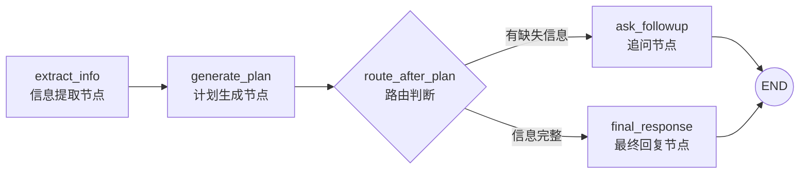

我们构建一个简化的“旅行助手”智能体，它能根据用户输入提取关键信息、生成计划，并在信息不足时主动询问。

### 📝 完整代码示例：旅行计划助手

```python
from typing import TypedDict, Literal
from langgraph.graph import StateGraph, END
from langchain_openai import ChatOpenAI

# ===================== 1. 集中式状态管理定义 =====================
class TravelState(TypedDict):
    """定义全局状态结构：所有节点共享和更新的数据容器"""
    user_input: str           # 用户原始输入
    extracted_info: dict      # 从输入中提取的结构化信息
    plan: str                # 生成的旅行计划
    response: str            # 给用户的最终回复
    missing_info: list       # 缺失的关键信息列表（用于条件判断）

# ===================== 2. 定义各个节点函数 =====================
def extract_info_node(state: TravelState) -> TravelState:
    """节点1：信息提取节点。从用户输入中提取结构化数据。"""
    print("[节点1] 正在提取关键信息...")
    
    # 模拟从用户输入中提取信息（实际应用中可用LLM或NLP工具）
    user_input = state["user_input"].lower()
    extracted = {"destination": None, "days": None, "budget": None}
    
    # 简单关键词匹配（仅为示例）
    if "东京" in user_input:
        extracted["destination"] = "东京"
    if "天" in user_input:
        # 提取数字（简化版）
        import re
        days_match = re.search(r'(\d+)\s*天', user_input)
        if days_match:
            extracted["days"] = days_match.group(1)
    
    # 更新全局状态（这是状态管理的核心体现）
    state["extracted_info"] = extracted
    
    # 检查缺失信息
    missing = []
    if not extracted["destination"]:
        missing.append("旅行目的地")
    if not extracted["days"]:
        missing.append("旅行天数")
    
    state["missing_info"] = missing
    print(f"  已提取信息: {extracted}")
    print(f"  缺失信息: {missing}")
    return state  # 返回更新后的状态

def generate_plan_node(state: TravelState) -> TravelState:
    """节点2：计划生成节点。基于提取的信息创建旅行计划。"""
    print("[节点2] 正在生成旅行计划...")
    
    info = state["extracted_info"]
    
    # 模拟计划生成（实际可使用LLM）
    destination = info["destination"]
    days = info["days"]
    
    if destination and days:
        plan = f"为您规划{destination}{days}日游：\n"
        plan += f"- 第1天：抵达{destination}，入住酒店，周边游览\n"
        plan += f"- 第2天：{destination}主要景点观光\n"
        if int(days) > 2:
            plan += f"- 第3天及以后：深度体验当地文化\n"
        plan += f"- 最后一天：购物纪念，返程"
    else:
        plan = "信息不足，无法生成完整计划"
    
    # 更新全局状态
    state["plan"] = plan
    print(f"  生成的计划: {plan[:50]}...")
    return state

def ask_followup_node(state: TravelState) -> TravelState:
    """节点3：追问节点。当信息缺失时，询问用户获取更多信息。"""
    print("[节点3] 正在请求补充信息...")
    
    missing = state["missing_info"]
    question = "为了为您提供更好的建议，请补充以下信息：\n"
    for i, item in enumerate(missing, 1):
        question += f"{i}. 您的{item}是什么？\n"
    
    # 更新状态中的回复
    state["response"] = question
    print(f"  追问内容: {question[:50]}...")
    return state

def final_response_node(state: TravelState) -> TravelState:
    """节点4：最终回复节点。将计划返回给用户。"""
    print("[节点4] 生成最终回复...")
    
    plan = state["plan"]
    response = f"旅行计划已生成！\n\n{plan}\n\n祝您旅途愉快！"
    
    # 更新状态中的回复
    state["response"] = response
    print(f"  最终回复: {response[:50]}...")
    return state

# ===================== 3. 图结构编排 =====================
def create_travel_agent():
    """创建并编译旅行助手图"""
    
    # 3.1 初始化图，并指定状态类型
    workflow = StateGraph(TravelState)
    
    # 3.2 添加节点到图中（每个节点对应一个函数）
    workflow.add_node("extract_info", extract_info_node)
    workflow.add_node("generate_plan", generate_plan_node)
    workflow.add_node("ask_followup", ask_followup_node)
    workflow.add_node("final_response", final_response_node)
    
    # 3.3 定义边（控制流）=====================
    # 设置入口点：从信息提取开始
    workflow.set_entry_point("extract_info")
    
    # 3.3.1 固定边：无论条件如何都会执行的连接
    workflow.add_edge("extract_info", "generate_plan")
    
    # 3.3.2 条件边：基于状态内容动态路由（这是图编排最强大的功能）
    def route_after_plan(state: TravelState) -> Literal["ask_followup", "final_response", END]:
        """路由函数：根据是否有缺失信息决定下一步"""
        if state["missing_info"]:
            # 有缺失信息 -> 去追问节点
            return "ask_followup"
        else:
            # 信息完整 -> 去最终回复节点
            return "final_response"
    
    # 添加条件边：从generate_plan节点出来后，根据route_after_plan函数决定去向
    workflow.add_conditional_edges(
        "generate_plan",
        route_after_plan,
        {
            "ask_followup": "ask_followup",
            "final_response": "final_response"
        }
    )
    
    # 3.3.3 其他固定边
    workflow.add_edge("ask_followup", END)  # 追问后结束本次对话
    workflow.add_edge("final_response", END)  # 最终回复后结束
    
    # 3.4 编译图
    print("=== 旅行助手图结构构建完成 ===")
    return workflow.compile()

# ===================== 4. 使用示例 =====================
if __name__ == "__main__":
    # 4.1 创建智能体
    travel_agent = create_travel_agent()
    
    # 4.2 可视化图结构（需要安装graphviz）
    try:
        from IPython.display import Image, display
        display(Image(travel_agent.get_graph().draw_mermaid_png()))
    except:
        print("提示：可安装graphviz进行可视化")
    
    # 4.3 测试场景1：信息完整的情况
    print("\n=== 测试1：完整信息 ===")
    initial_state = {
        "user_input": "我想去东京玩5天，请帮我规划一下",
        "extracted_info": {},
        "plan": "",
        "response": "",
        "missing_info": []
    }
    
    # 运行图工作流
    result = travel_agent.invoke(initial_state)
    print(f"\n最终回复: {result['response']}")
    
    # 4.4 测试场景2：信息缺失的情况
    print("\n\n=== 测试2：缺失信息 ===")
    initial_state2 = {
        "user_input": "我想去旅行，需要计划",
        "extracted_info": {},
        "plan": "",
        "response": "",
        "missing_info": []
    }
    
    result2 = travel_agent.invoke(initial_state2)
    print(f"\n最终回复: {result2['response']}")
```

### 🎯 关键功能解释说明

#### 1. **集中式状态管理**的核心体现
```python
class TravelState(TypedDict):
    user_input: str           # 所有节点都可读取
    extracted_info: dict      # 节点1写入，节点2读取
    plan: str                # 节点2写入，节点4读取
    response: str            # 多个节点可能写入
    missing_info: list       # 节点1写入，路由函数读取
```
- **共享数据容器**：所有节点接收同一个`state`对象，通过修改并返回它来传递数据。
- **类型安全**：使用`TypedDict`明确状态结构，便于开发和调试。
- **解耦节点**：节点间不直接调用，只通过状态对象通信，这是实现模块化的关键。

#### 2. **图结构编排**的核心体现

```python
# 构建有向图
workflow = StateGraph(TravelState)
workflow.add_node("extract_info", extract_info_node)  # 添加节点
workflow.set_entry_point("extract_info")             # 设置起点
workflow.add_edge("extract_info", "generate_plan")   # 添加固定边

# 添加条件边（动态路由）
workflow.add_conditional_edges(
    "generate_plan",
    route_after_plan,  # 路由决策函数
    {"ask_followup": "ask_followup", "final_response": "final_response"}
)
```

**工作流可视化**：


**条件边的威力**：`route_after_plan`函数检查`state["missing_info"]`，动态决定下一步：
- 如果缺失信息：前往`ask_followup`节点追问用户
- 如果信息完整：前往`final_response`节点给出计划

### 💡 从这个例子中看到的LangGraph优势

1. **可视化与可调试性**：图结构让复杂逻辑一目了然，可以清晰看到数据流动和决策点。
2. **模块化设计**：每个节点职责单一（提取、生成、询问、回复），易于单独测试和修改。
3. **灵活的控制流**：条件边允许基于实际数据内容（而不仅是固定顺序）决定执行路径。
4. **状态一致性**：集中式状态确保所有节点看到的数据视图是一致的，避免了分散传递数据的复杂性。

### 🔧 扩展思路

在实际应用中，你可以进一步扩展这个例子：
- **将节点替换为真正的LLM调用**：用ChatOpenAI增强信息提取和计划生成的智能性。
- **添加并行处理**：同时查询天气、航班、酒店多个信息源。
- **引入循环**：当用户回答追问后，重新运行提取和计划节点。
- **持久化状态**：将状态保存到数据库，支持长时间、多轮对话。

这个例子展示了LangGraph如何将复杂的工作流拆解为可管理的部分，并通过状态管理和图编排将它们有机组合。如果对特定部分（如如何集成真实LLM，或添加更复杂的条件逻辑）有进一步兴趣，我可以提供更详细的代码示例。