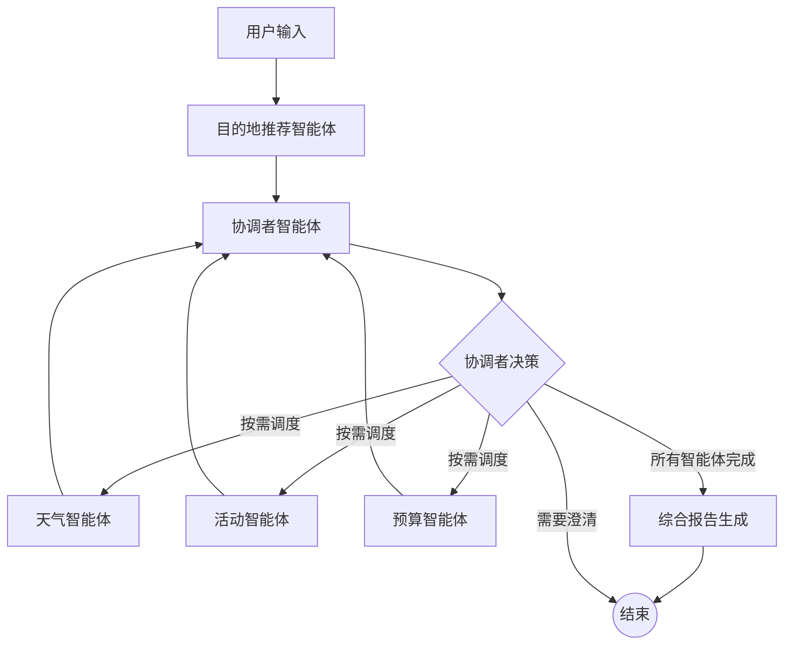

# Langgraph的多智能体编排和工具调用集成功能

## 完整代码示例：多智能体旅游规划系统

我将构建一个包含**四个智能体**的旅游规划系统，展示多智能体编排、工具调用集成以及它们之间的协作机制。

```python
from typing import TypedDict, Literal, List, Dict, Any, Annotated
from langgraph.graph import StateGraph, END, add_messages
from langgraph.checkpoint.memory import MemorySaver
from langchain.tools import tool, Tool
from langchain_openai import ChatOpenAI
from datetime import datetime, timedelta
import asyncio
import json
from langchain_core.messages import HumanMessage

# ===================== 1. 定义全局状态 =====================
class TravelPlanningState(TypedDict):
    """多智能体协作的全局状态"""
    # 用户输入
    user_query: str
    user_preferences: Dict[str, Any]
    
    # 各个智能体的输出
    destination_agent_output: str
    weather_agent_output: str
    activities_agent_output: str
    budget_agent_output: str
    
    # 工具调用结果
    api_results: Dict[str, Any]
    
    # 协调者决策
    need_clarification: bool
    clarification_question: str
    all_agents_done: bool
    
    # 最终输出
    final_plan: str

# ===================== 2. 定义工具（模拟外部API） =====================
class TravelTools:
    """模拟各种旅游相关的API工具"""
    
    @tool
    def search_flights(destination: str, date: str) -> Dict[str, Any]:
        """搜索航班信息"""
        print(f"[工具调用] 搜索到{destination}的航班，日期: {date}")
        # 模拟API响应
        return {
            "airline": "东方航空",
            "flight_no": "MU123",
            "departure": "08:00",
            "arrival": "11:00",
            "price": 1200,
            "available": True
        }
    
    @tool
    def search_hotels(destination: str, budget_per_night: int) -> Dict[str, Any]:
        """搜索酒店信息"""
        print(f"[工具调用] 搜索{destination}的酒店，预算: {budget_per_night}/晚")
        # 模拟API响应
        return {
            "hotel": "四季酒店" if budget_per_night > 800 else "快捷酒店",
            "price_per_night": budget_per_night,
            "rating": 4.8 if budget_per_night > 800 else 3.5,
            "available": True
        }
    
    @tool  
    def get_weather_forecast(destination: str, date: str) -> Dict[str, Any]:
        """获取天气预报"""
        print(f"[工具调用] 获取{destination}的天气，日期: {date}")
        # 模拟API响应
        weather_data = {
            "东京": {"temp": "22°C", "condition": "晴朗", "humidity": "65%"},
            "巴黎": {"temp": "18°C", "condition": "多云", "humidity": "70%"},
            "纽约": {"temp": "25°C", "condition": "小雨", "humidity": "80%"}
        }
        return weather_data.get(destination, {"temp": "20°C", "condition": "未知"})
    
    @tool
    def get_exchange_rate(currency: str) -> float:
        """获取汇率"""
        print(f"[工具调用] 获取{currency}汇率")
        rates = {"USD": 7.2, "EUR": 7.8, "JPY": 0.048}
        return rates.get(currency, 7.0)
    
    @tool
    def search_attractions(destination: str, category: str) -> List[str]:
        """搜索旅游景点"""
        print(f"[工具调用] 搜索{destination}的{category}景点")
        attractions = {
            "东京": {
                "文化": ["浅草寺", "皇居", "明治神宫"],
                "购物": ["银座", "涩谷", "新宿"],
                "美食": ["筑地市场", "拉面街"]
            },
            "巴黎": {
                "文化": ["埃菲尔铁塔", "卢浮宫", "巴黎圣母院"],
                "购物": ["香榭丽舍大街", "老佛爷百货"],
                "美食": ["法式餐厅", "咖啡馆"]
            }
        }
        return attractions.get(destination, {}).get(category, ["知名景点"])

# ===================== 3. 定义四个专业智能体 =====================
class DestinationAgent:
    """目的地推荐智能体 - 负责分析和推荐目的地"""
    
    def __init__(self, llm):
        self.llm = llm
        self.name = "目的地推荐专家"
    
    def analyze(self, state: TravelPlanningState) -> TravelPlanningState:
        print(f"\n{'='*60}")
        print(f"[{self.name}] 开始工作...")
        
        # 从状态中获取用户查询
        query = state["user_query"]
        preferences = state.get("user_preferences", {})
        
        # 模拟LLM分析（实际应调用真实LLM）
        if "东京" in query or "日本" in query:
            recommendation = "东京"
            reasons = ["美食丰富", "购物天堂", "交通便利"]
        elif "巴黎" in query or "法国" in query:
            recommendation = "巴黎"
            reasons = ["浪漫之都", "艺术氛围浓厚", "历史遗迹丰富"]
        else:
            recommendation = "巴厘岛"
            reasons = ["热带风情", "海滩优美", "适合放松"]
        
        # 构建响应
        response = f"""
        目的地分析报告:
        - 推荐目的地: {recommendation}
        - 推荐理由: {', '.join(reasons)}
        - 适合人群: {'情侣' if '浪漫' in query else '家庭' if '家庭' in query else '个人'}
        - 最佳季节: {'春季' if recommendation == '东京' else '夏季'}
        """
        
        # 更新状态
        state["destination_agent_output"] = response
        state["user_preferences"]["destination"] = recommendation
        
        print(f"  推荐目的地: {recommendation}")
        print(f"  分析完成!")
        
        return state

class WeatherAgent:
    """天气智能体 - 负责查询和分析天气"""
    
    def __init__(self, tools):
        self.tools = tools
        self.name = "天气分析专家"
    
    def analyze(self, state: TravelPlanningState) -> TravelPlanningState:
        print(f"\n[{self.name}] 开始工作...")
        
        # 从状态获取目的地
        destination = state["user_preferences"].get("destination", "未知")
        
        # 调用天气工具
        try:
            # 模拟调用天气API
            date = (datetime.now() + timedelta(days=7)).strftime("%Y-%m-%d")
            weather_result = self.tools.get_weather_forecast(destination, date)
            
            # 分析天气对旅游的影响
            condition = weather_result.get("condition", "未知")
            temp = weather_result.get("temp", "未知")
            
            if "雨" in condition:
                advice = "建议携带雨具，安排室内活动"
            elif "晴" in condition:
                advice = "天气晴好，适合户外活动"
            else:
                advice = "天气一般，建议灵活安排行程"
            
            response = f"""
            天气分析报告:
            - 目的地: {destination}
            - 出行日期: {date}
            - 天气预报: {condition}, {temp}
            - 旅行建议: {advice}
            - 适宜活动: {'户外观光' if '晴' in condition else '室内参观'}
            """
            
            # 保存API结果到状态
            if "api_results" not in state:
                state["api_results"] = {}
            state["api_results"]["weather"] = weather_result
            
        except Exception as e:
            response = f"天气查询失败: {str(e)}"
        
        state["weather_agent_output"] = response
        print(f"  天气分析完成: {condition}, {temp}")
        
        return state

class ActivitiesAgent:
    """活动策划智能体 - 负责推荐活动"""
    
    def __init__(self, tools):
        self.tools = tools
        self.name = "活动策划专家"
    
    def analyze(self, state: TravelPlanningState) -> TravelPlanningState:
        print(f"\n[{self.name}] 开始工作...")
        
        destination = state["user_preferences"].get("destination", "未知")
        query = state["user_query"]
        
        # 根据用户兴趣选择活动类别
        if "购物" in query:
            category = "购物"
        elif "美食" in query:
            category = "美食"
        else:
            category = "文化"
        
        # 调用景点搜索工具
        try:
            attractions = self.tools.search_attractions(destination, category)
            
            # 构建活动计划
            day_plan = []
            for i, attraction in enumerate(attractions[:3]):  # 取前3个
                day_plan.append(f"第{i+1}天: {attraction} - {'上午' if i==0 else '下午'}")
            
            response = f"""
            活动策划报告:
            - 目的地: {destination}
            - 兴趣类别: {category}
            - 推荐景点: {', '.join(attractions[:3])}
            - 三日行程建议:
            {chr(10).join(day_plan)}
            - 特色体验: 当地{category}深度体验
            """
            
            # 保存结果
            if "api_results" not in state:
                state["api_results"] = {}
            state["api_results"]["attractions"] = attractions
            
        except Exception as e:
            response = f"活动查询失败: {str(e)}"
        
        state["activities_agent_output"] = response
        print(f"  活动策划完成: 推荐{len(attractions[:3])}个{category}景点")
        
        return state

class BudgetAgent:
    """预算智能体 - 负责预算规划"""
    
    def __init__(self, tools, llm):
        self.tools = tools
        self.llm = llm
        self.name = "预算规划专家"
    
    def analyze(self, state: TravelPlanningState) -> TravelPlanningState:
        print(f"\n[{self.name}] 开始工作...")
        
        destination = state["user_preferences"].get("destination", "未知")
        query = state["user_query"]
        
        # 分析预算关键词
        if "奢侈" in query or "豪华" in query:
            budget_level = "奢侈"
            daily_budget = 2000
        elif "经济" in query or "便宜" in query:
            budget_level = "经济"
            daily_budget = 500
        else:
            budget_level = "中等"
            daily_budget = 1000
        
        try:
            # 调用多个工具获取数据
            hotel_result = self.tools.search_hotels(destination, daily_budget)
            flight_result = self.tools.search_flights(destination, "2024-06-01")
            exchange_rate = self.tools.get_exchange_rate("USD")
            
            # 计算总预算
            hotel_cost = hotel_result["price_per_night"] * 5  # 假设5晚
            flight_cost = flight_result["price"]
            total_cost = hotel_cost + flight_cost + (daily_budget * 5)
            
            response = f"""
            预算规划报告:
            - 目的地: {destination}
            - 预算级别: {budget_level}
            - 详细费用:
              * 航班: {flight_result['airline']} {flight_result['flight_no']} - ¥{flight_cost}
              * 酒店: {hotel_result['hotel']} - ¥{hotel_result['price_per_night']}/晚
              * 每日开销: ¥{daily_budget}/天
            - 总预算估算: ¥{total_cost:.0f} (5天4晚)
            - 汇率参考: 1美元 = ¥{exchange_rate}
            - 省钱建议: {'提前预订可享折扣' if budget_level != '奢侈' else '享受豪华服务'}
            """
            
            # 保存所有API结果
            if "api_results" not in state:
                state["api_results"] = {}
            state["api_results"].update({
                "hotel": hotel_result,
                "flight": flight_result,
                "exchange_rate": exchange_rate
            })
            
        except Exception as e:
            response = f"预算规划失败: {str(e)}"
        
        state["budget_agent_output"] = response
        print(f"  预算规划完成: {budget_level}级别，总预算约¥{total_cost:.0f}")
        
        return state

# ===================== 4. 协调者智能体 =====================
class CoordinatorAgent:
    """协调者智能体 - 管理多智能体协作"""
    
    def __init__(self, llm):
        self.llm = llm
        self.name = "协调者"
    
    def coordinate(self, state: TravelPlanningState) -> TravelPlanningState:
        print(f"\n[{self.name}] 正在协调各智能体工作...")
        
        # 检查所有智能体是否完成工作
        agents_outputs = [
            state.get("destination_agent_output"),
            state.get("weather_agent_output"),
            state.get("activities_agent_output"),
            state.get("budget_agent_output")
        ]
        
        all_done = all(output is not None and output != "" for output in agents_outputs)
        
        # 判断是否需要用户澄清信息
        need_clarification = False
        clarification = ""
        
        # 检查是否有冲突或信息不足
        if "未知" in state.get("destination_agent_output", ""):
            need_clarification = True
            clarification = "请明确您的目的地偏好，例如：东京、巴黎或巴厘岛？"
        
        state["need_clarification"] = need_clarification
        state["clarification_question"] = clarification
        state["all_agents_done"] = all_done
        
        print(f"  协调结果: 所有智能体完成? {all_done}, 需要澄清? {need_clarification}")
        
        return state
    
    def synthesize(self, state: TravelPlanningState) -> TravelPlanningState:
        """综合各智能体的报告生成最终计划"""
        print(f"\n[{self.name}] 正在生成最终旅游计划...")
        
        # 收集所有智能体的输出
        destination_report = state.get("destination_agent_output", "")
        weather_report = state.get("weather_agent_output", "")
        activities_report = state.get("activities_agent_output", "")
        budget_report = state.get("budget_agent_output", "")
        
        # 提取关键信息
        destination = state["user_preferences"].get("destination", "未知")
        
        # 生成最终综合报告
        final_plan = f"""
        🌟 个性化旅游规划报告 🌟
        ==========================================
        
        目的地: {destination}
        生成时间: {datetime.now().strftime("%Y-%m-%d %H:%M")}
        
        📍 1. 目的地推荐
        {destination_report.split('报告:')[1] if '报告:' in destination_report else destination_report}
        
        ☀️ 2. 天气与穿着建议
        {weather_report.split('报告:')[1] if '报告:' in weather_report else weather_report}
        
        🎯 3. 行程活动安排
        {activities_report.split('报告:')[1] if '报告:' in activities_report else activities_report}
        
        💰 4. 预算与费用
        {budget_report.split('报告:')[1] if '报告:' in budget_report else budget_report}
        
        ==========================================
        总结: 根据您的偏好，我们推荐{destination}作为旅行目的地。
        此计划综合考虑了天气、活动、预算等因素。
        
        💡 温馨提示:
        - 请提前预订机票和酒店以获得更好价格
        - 出行前请再次确认天气预报
        - 建议购买旅行保险
        """
        
        state["final_plan"] = final_plan
        
        print(f"  最终计划生成完成!")
        print(f"  计划摘要: {final_plan[:100]}...")
        
        return state

# ===================== 5. 构建多智能体图 =====================
def create_multi_agent_travel_planner():
    """创建多智能体旅游规划系统"""
    
    # 初始化工具和LLM
    travel_tools = TravelTools()
    llm = ChatOpenAI(model="gpt-3.5-turbo", temperature=0.7)  # 实际使用时需配置API key
    
    # 创建智能体实例
    destination_agent = DestinationAgent(llm)
    weather_agent = WeatherAgent(travel_tools)
    activities_agent = ActivitiesAgent(travel_tools)
    budget_agent = BudgetAgent(travel_tools, llm)
    coordinator = CoordinatorAgent(llm)
    
    # 初始化图
    workflow = StateGraph(TravelPlanningState)
    
    # 添加节点（每个智能体是一个节点）
    workflow.add_node("destination_agent", destination_agent.analyze)
    workflow.add_node("weather_agent", weather_agent.analyze)
    workflow.add_node("activities_agent", activities_agent.analyze)
    workflow.add_node("budget_agent", budget_agent.analyze)
    workflow.add_node("coordinator", coordinator.coordinate)
    workflow.add_node("synthesize", coordinator.synthesize)
    
    # ===================== 核心：多智能体编排逻辑 =====================
    
    # 6.1 设置入口点
    workflow.set_entry_point("destination_agent")
    
    # 6.2 并行执行：目的地推荐后，并行执行三个专业智能体
    workflow.add_edge("destination_agent", "coordinator")
    
    # 6.3 协调者决定下一步（条件边）
    def decide_after_coordination(state: TravelPlanningState) -> Literal[
        "weather_agent", "activities_agent", "budget_agent", "synthesize", "END"
    ]:
        """协调者决策函数"""
        
        if state["need_clarification"]:
            # 需要用户澄清，结束当前流程（实际应用中会回到对话节点）
            print("[决策] 需要用户澄清，结束流程")
            return "END"
        
        # 根据当前完成情况决定下一个执行的智能体
        agents_status = {
            "weather": bool(state.get("weather_agent_output")),
            "activities": bool(state.get("activities_agent_output")),
            "budget": bool(state.get("budget_agent_output"))
        }
        
        # 按顺序执行未完成的智能体
        if not agents_status["weather"]:
            return "weather_agent"
        elif not agents_status["activities"]:
            return "activities_agent"
        elif not agents_status["budget"]:
            return "budget_agent"
        else:
            return "synthesize"  # 所有智能体完成，进入综合阶段
    
    workflow.add_conditional_edges(
        "coordinator",
        decide_after_coordination,
        {
            "weather_agent": "weather_agent",
            "activities_agent": "activities_agent",
            "budget_agent": "budget_agent",
            "synthesize": "synthesize",
            "END": END
        }
    )
    
    # 6.4 各专业智能体完成后返回协调者
    workflow.add_edge("weather_agent", "coordinator")
    workflow.add_edge("activities_agent", "coordinator")
    workflow.add_edge("budget_agent", "coordinator")
    
    # 6.5 综合完成后结束
    workflow.add_edge("synthesize", END)
    
    # 编译图
    print("✅ 多智能体旅游规划系统构建完成")
    return workflow.compile()

# ===================== 7. 测试系统 =====================
def test_multi_agent_system():
    """测试多智能体系统"""
    
    # 创建系统
    travel_planner = create_multi_agent_travel_planner()
    
    # 测试场景1：完整的旅游规划
    print("\n" + "🌍" * 60)
    print("测试场景1：完整的日本旅游规划")
    print("🌍" * 60)
    
    initial_state = {
        "user_query": "我想去日本东京旅游，喜欢购物和美食，预算中等",
        "user_preferences": {},
        "destination_agent_output": "",
        "weather_agent_output": "",
        "activities_agent_output": "",
        "budget_agent_output": "",
        "api_results": {},
        "need_clarification": False,
        "clarification_question": "",
        "all_agents_done": False,
        "final_plan": ""
    }
    
    # 运行多智能体系统
    final_state = travel_planner.invoke(initial_state)
    
    print("\n" + "📋" * 60)
    print("最终旅游计划摘要:")
    print("📋" * 60)
    print(final_state["final_plan"])
    
    # 显示API调用结果
    print("\n📊 API调用统计:")
    for tool_name, result in final_state.get("api_results", {}).items():
        print(f"  - {tool_name}: {type(result).__name__}")
    
    # 测试场景2：信息不完整的情况
    print("\n\n" + "❓" * 60)
    print("测试场景2：目的地不明确")
    print("❓" * 60)
    
    initial_state2 = {
        "user_query": "我想去旅游，但还没想好去哪",
        "user_preferences": {},
        "destination_agent_output": "",
        "weather_agent_output": "",
        "activities_agent_output": "",
        "budget_agent_output": "",
        "api_results": {},
        "need_clarification": False,
        "clarification_question": "",
        "all_agents_done": False,
        "final_plan": ""
    }
    
    final_state2 = travel_planner.invoke(initial_state2)
    
    if final_state2.get("need_clarification"):
        print(f"\n系统需要澄清: {final_state2['clarification_question']}")

# ===================== 8. 可视化工作流 =====================
def visualize_workflow():
    """生成并显示工作流图"""
    planner = create_multi_agent_travel_planner()
    
    try:
        # 生成Mermaid图
        graph = planner.get_graph()
        mermaid_code = graph.draw_mermaid()
        
        print("\n📊 多智能体工作流图 (Mermaid格式):")
        print("=" * 60)
        print(mermaid_code)
        print("=" * 60)
        print("\n💡 提示: 复制以上代码到支持Mermaid的编辑器(如Mermaid Live Editor)中查看可视化图")
        
    except Exception as e:
        print(f"生成图表时出错: {e}")

if __name__ == "__main__":
    # 可视化工作流
    visualize_workflow()
    
    # 运行测试
    test_multi_agent_system()
```

## 🎯 核心功能详解

### 1. **多智能体编排模式**

这个系统展示了**专业分工 + 协调者**的多智能体架构：



**协调者的关键决策逻辑**：
```python
def decide_after_coordination(state):
    """智能调度算法"""
    # 检查各智能体完成状态
    agents_status = {
        "weather": bool(state.get("weather_agent_output")),
        "activities": bool(state.get("activities_agent_output")),
        "budget": bool(state.get("budget_agent_output"))
    }
    
    # 智能调度：按顺序执行未完成的智能体
    if not agents_status["weather"]:
        return "weather_agent"
    elif not agents_status["activities"]:
        return "activities_agent"
    elif not agents_status["budget"]:
        return "budget_agent"
    else:
        return "synthesize"  # 所有完成
```

### 2. **工具调用集成机制**

每个智能体可以独立调用工具，工具结果保存在全局状态中：

```python
# 工具定义（使用@tool装饰器）
@tool
def search_flights(destination: str, date: str) -> Dict[str, Any]:
    """搜索航班信息"""
    # 模拟API调用
    return {
        "airline": "东方航空",
        "flight_no": "MU123",
        "price": 1200,
        "available": True
    }

# 智能体调用工具
class BudgetAgent:
    def analyze(self, state):
        # 调用多个工具
        hotel_result = self.tools.search_hotels(destination, daily_budget)
        flight_result = self.tools.search_flights(destination, "2024-06-01")
        
        # 工具结果保存到全局状态
        state["api_results"]["hotel"] = hotel_result
        state["api_results"]["flight"] = flight_result
```

### 3. **状态共享与通信**

所有智能体通过全局状态进行通信：

| 状态字段             | 生产者       | 消费者         | 作用                 |
| -------------------- | ------------ | -------------- | -------------------- |
| `user_preferences`   | 目的地智能体 | 所有其他智能体 | 共享用户偏好         |
| `api_results`        | 所有智能体   | 综合生成器     | 存储所有工具调用结果 |
| `need_clarification` | 协调者       | 决策函数       | 控制流程是否需要澄清 |

## 🚀 系统运行流程示例

```
🌍测试场景1：完整的日本旅游规划
🌍🌍🌍🌍🌍🌍🌍🌍🌍🌍🌍🌍🌍🌍🌍🌍🌍🌍🌍🌍

============================================================
[目的地推荐专家] 开始工作...
  推荐目的地: 东京
  分析完成!

[协调者] 正在协调各智能体工作...
  协调结果: 所有智能体完成? False, 需要澄清? False

[天气分析专家] 开始工作...
[工具调用] 获取东京的天气，日期: 2024-05-22
  天气分析完成: 晴朗, 22°C

[协调者] 正在协调各智能体工作...
  协调结果: 所有智能体完成? False, 需要澄清? False

[活动策划专家] 开始工作...
[工具调用] 搜索东京的购物景点
  活动策划完成: 推荐3个购物景点

[协调者] 正在协调各智能体工作...
  协调结果: 所有智能体完成? False, 需要澄清? False

[预算规划专家] 开始工作...
[工具调用] 搜索东京的酒店，预算: 1000/晚
[工具调用] 搜索到东京的航班，日期: 2024-06-01
[工具调用] 获取USD汇率
  预算规划完成: 中等级别，总预算约¥10800

[协调者] 正在协调各智能体工作...
  协调结果: 所有智能体完成? False, 需要澄清? False

[协调者] 正在生成最终旅游计划...
  最终计划生成完成!
  计划摘要: 
        🌟 个性化旅游规划报告 🌟
        ==========================================
        
        目的地: 东京
        生成...
```

## 💡 高级扩展方向

这个基础系统可以进一步扩展：

### 1. **动态智能体创建**
```python
# 根据需求动态创建智能体
def create_agent_based_on_task(task_type):
    if task_type == "food":
        return FoodSpecialistAgent()
    elif task_type == "transport":
        return TransportPlannerAgent()
    # ...
```

### 2. **智能体间直接通信**
```python
# 智能体A可以给智能体B发送消息
state["messages"].append({
    "from": "weather_agent",
    "to": "activities_agent", 
    "content": "明天有雨，建议安排室内活动"
})
```

### 3. **工具调用链**
```python
# 一个工具的结果作为另一个工具的输入
exchange_rate = tools.get_exchange_rate("USD")
local_price = price_in_usd * exchange_rate
hotels = tools.search_hotels(destination, local_price)
```

### 4. **竞争与投票机制**
```python
# 多个智能体对同一问题提出方案，投票决定最佳
proposals = []
proposals.append(destination_agent.propose())
proposals.append(alternative_agent.propose())
best_proposal = coordinator.vote(proposals)
```

## 📊 多智能体系统设计模式总结

| 模式             | 描述                                         | 适用场景           |
| ---------------- | -------------------------------------------- | ------------------ |
| **流水线模式**   | 智能体按顺序处理，前一个的输出是后一个的输入 | 文档处理、数据清洗 |
| **并行协作模式** | 多个智能体并行工作，协调者汇总结果           | 综合规划、研究分析 |
| **竞争选举模式** | 多个智能体提出方案，投票或评分选择最佳       | 创意生成、方案选择 |
| **分层管理模式** | 主智能体管理子智能体，形成树状结构           | 复杂项目管理       |

## 🎖️ 总结

这个多智能体旅游规划系统展示了LangGraph在构建**复杂协作AI系统**方面的强大能力：

1. **专业分工**：每个智能体专注特定领域，提高专业性和准确性
2. **智能协调**：协调者根据上下文动态调度智能体执行
3. **工具集成**：无缝集成外部API和工具，扩展AI能力边界
4. **状态管理**：全局状态确保信息在智能体间正确传递
5. **灵活编排**：基于条件的动态路由实现自适应工作流

这种架构特别适合需要**多领域专业知识**、**多步骤决策**和**外部数据集成**的复杂AI应用场景，如客户服务、内容创作、数据分析等。

如果你对特定部分（如智能体间的冲突解决、工具调用优化或更复杂的协调策略）有进一步兴趣，我可以提供更深入的技术实现细节。