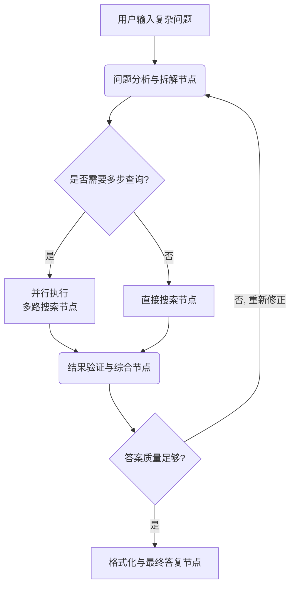

LangGraph的功能围绕其**图计算模型**和**状态管理**两大支柱展开，让开发者可以像设计流程图一样，编排复杂、有状态、多步骤的AI工作流。

### ⚙️ 核心功能详解

| 功能类别            | 核心功能           | 功能描述与价值                                               |
| :------------------ | :----------------- | :----------------------------------------------------------- |
| **1. 核心框架**     | **图结构编排**     | 将应用逻辑定义为**节点（函数）**和**边（路由规则）** 组成的有向图，天然支持并行、分支、循环等复杂逻辑。 |
|                     | **集中式状态管理** | 使用一个**全局状态对象**（State）在节点间传递和共享数据，是工作流拥有“记忆”和上下文能力的关键。 |
| **2. 流程控制**     | **条件边**         | 根据当前**状态内容**动态决定下一个执行节点，实现 `if-else`、`switch` 等逻辑，是构建智能决策流的基石。 |
|                     | **循环与中断**     | 支持让工作流在特定节点间循环（如：思考→行动→检查），并可设置条件（如：达到满意结果或超时）来中断循环。 |
| **3. 智能体与协作** | **多智能体编排**   | 可将不同节点或子图定义为具有特定角色（如“研究员”、“写手”、“评审员”）的智能体，轻松构建协作系统。 |
|                     | **工具调用集成**   | 与LangChain生态无缝集成，节点可直接调用数百种工具（搜索、计算、API等），并可轻松管理工具调用流程。 |
| **4. 生产级支持**   | **持久化与检查点** | 支持将运行中的**状态快照**保存到数据库，实现工作流的暂停、恢复和回溯，对长时运行任务至关重要。 |
|                     | **可观测性与调试** | 提供**可视化界面**展示图结构，并**完整追踪**每次运行的状态变化、路径选择，极大降低调试复杂度。 |
|                     | **人工干预节点**   | 可设置**“人工审批”** 节点，工作流在此暂停并将任务发送至人类，等待确认或输入后再继续，实现人机协同。 |
|                     | **流式输出**       | 支持以流的形式实时返回每个节点的处理结果，让用户能实时感知工作流进度，提升交互体验。 |

### 💡 核心功能应用示例：智能问答助理工作流
以一个能联网搜索、分解复杂问题并综合答案的高级RAG问答助理为例，其LangGraph工作流可设计如下：

**流程解析**：
1.  **动态决策**：`条件边`判断问题复杂度，决定单路或多路搜索。
2.  **并行处理**：对多个子问题**并行**执行搜索，提升效率。
3.  **循环迭代**：`循环边`允许对不满意的答案进行重新分析和修正。
4.  **状态共享**：所有中间结果（拆解的问题、搜索结果、草稿）都通过**全局状态**传递，供后续节点使用。

### 🛠️ 总结：何时选择LangGraph？
选择LangGraph，本质上是选择了一种基于**图论**和**状态机**的编程范式来构建AI应用。

*   **你应该使用LangGraph，如果你的应用需要**：
    *   超越简单的问答，涉及**多步骤决策和行动**。
    *   需要**循环**（如自我修正、迭代优化）。
    *   涉及**多个智能体或工具**的协调。
    *   要求**长时记忆**或上下文传递。
    *   工作流可能**需要暂停并等待人工输入**。

*   **可能不需要LangGraph，如果你的应用是**：
    *   单一的、无状态的LLM调用或检索。
    *   简单的线性链式调用（使用基础的LangChain或直接API调用即可）。

总而言之，LangGraph将构建复杂AI应用的范式，从编写“线性脚本”提升到了设计“**可执行的流程图**”，其功能集正是为这一目标服务的。它特别适合作为AI智能体（Agent）系统、复杂自动化流程和决策支持系统的核心编排引擎。

如果你对特定功能（如状态管理的具体代码写法或多智能体的通信模式）想了解更深入的实现细节，我可以进一步举例说明。