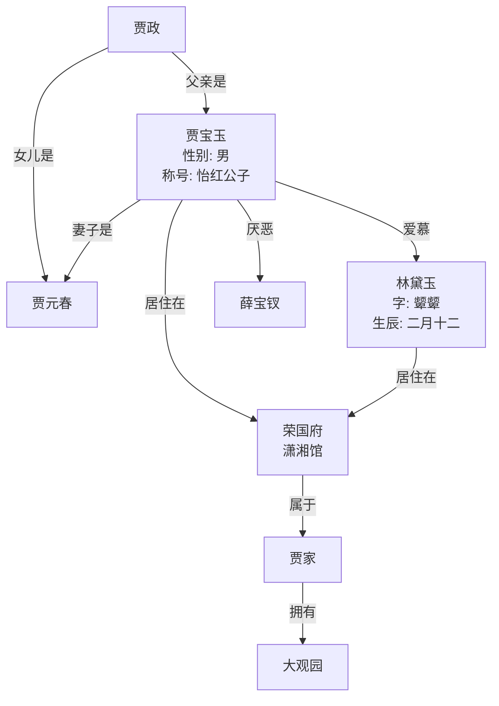

图数据库作为知识图谱的简要例子

### 知识图谱例子：**《红楼梦》人物关系知识图谱**

这是一个非常典型的例子，因为它清晰地展示了实体、属性和关系如何构成一个复杂的网络。

#### 1. 图谱结构分解

知识图谱通常由三个核心部分组成，也称为**RDF三元组**（主体，谓语，宾语）或（实体，关系，实体/属性值）。

| 组成部分              | 中文含义         | 在《红楼梦》例子中的实例                 |
| :-------------------- | :--------------- | :--------------------------------------- |
| **Entities (实体)**   | 图谱中的核心节点 | `贾宝玉`, `林黛玉`, `荣国府`, `大观园`   |
| **Relations (关系)**  | 连接实体的边     | `父亲是`, `妻子是`, `居住在`, `属于`     |
| **Attributes (属性)** | 实体的特征或属性 | `字：颦颦`, `生辰：二月十二`, `性别：男` |

#### 2. 可视化片段示例

由于我们无法直接展示图形，以下是一个用文本描述的小型网络结构：



**解读这个图谱**：
*   **实体**（圆形节点）：如贾宝玉、林黛玉、贾政等，每个实体都有自身的**属性**（如字、生辰）。
*   **关系**（箭头线）：如“父亲是”、“爱慕”、“厌恶”、“居住在”等，清晰地定义了实体间的语义联系。
*   **上下文**：通过“居住在”和“属于”等关系，我们将人物与地点、家族等实体连接起来，构成了一个丰富的上下文网络。

#### 3. 知识图谱的构建与应用（Python示例）

构建这样一个图谱通常涉及数据提取、清理和存储。以下是一个简化的代码示例，展示如何用Python和流行的图数据库Neo4j来定义和查询上述关系。

```python
# 示例：使用 Neo4j Python 驱动程序创建人物关系
# 首先需要安装 neo4j 驱动: pip install neo4j

from neo4j import GraphDatabase

# 连接图数据库
uri = "bolt://localhost:7687"  # Neo4j 默认端口
driver = GraphDatabase.driver(uri, auth=("neo4j", "password"))

def create_jia_bao_yu_relationship(tx):
    # Cypher 查询语句：创建节点和关系
    query = """
    // 创建人物节点并设置属性
    CREATE (jbb:Person {name: "贾宝玉", gender: "男", title: "怡红公子"})
    CREATE (ldy:Person {name: "林黛玉", style_name: "颦颦", birthday: "二月十二"})
    CREATE (jz:Person {name: "贾政"})
    CREATE (rng:Manor {name: "荣国府"})
    
    // 创建人物之间的关系
    CREATE (jz)-[:FATHER_OF]->(jbb)
    CREATE (jbb)-[:LOVES]->(ldy)
    CREATE (jbb)-[:MARRIED_TO]->(jyf)
    
    // 创建人物与地点之间的关系
    CREATE (jbb)-[:LIVES_IN {location: "怡红院"}]->(rng)
    CREATE (ldy)-[:LIVES_IN {location: "潇湘馆"}]->(rng)
    """
    tx.run(query)

# 执行函数
with driver.session() as session:
    session.execute_write(create_jia_bao_yu_relationship)

driver.close()
```

#### 4. 知识图谱的查询（价值体现）

知识图谱的强大之处在于其**可查询性**。我们可以提出非常复杂的问题，并通过图查询语言（如Cypher）轻松找到答案。

**示例查询1：** “找出所有与贾宝玉住在同一个地方的人？”

```cypher
// Cypher 查询语句
MATCH (jbb:Person {name: "贾宝玉"})-[:LIVES_IN]->(location:Manor)<-[:LIVES_IN]-(other:Person)
RETURN other.name
```
**结果**：`林黛玉`，`薛宝钗`（假设她也住在荣国府）等。

**示例查询2：** “林黛玉的恋人的父亲是谁？”

```cypher
// Cypher 查询语句
MATCH (ldy:Person {name: "林黛玉"})<-[:LOVES]-(lover:Person)-[:FATHER_OF]->(father:Person)
RETURN father.name
```
**结果**：`贾政`

### 总结：这个例子展示了什么？

这个简单的《红楼梦》知识图谱例子揭示了知识图谱的核心价值：

1.  **结构化知识**：将非结构化的文本内容（小说）转化为机器可理解和处理的结构化数据。
2.  **关系挖掘**：清晰地揭示实体之间复杂、隐含的关系（如通过“父亲是”和“女儿是”可以推断出“贾元春是贾宝玉的姐姐”）。
3.  **智能问答**：支持复杂的、多跳的查询，这是传统数据库难以实现的。
4.  **上下文关联**：将人、事、地、物全部关联在一起，形成一个完整的知识网络，而非孤立的数据点。

在实际应用中，知识图谱是**搜索引擎（如Google）、推荐系统、金融风控、医疗诊断和人工智能大脑**的核心技术基础。它让机器能够真正地“理解”和“推理”知识，而不仅仅是存储数据。