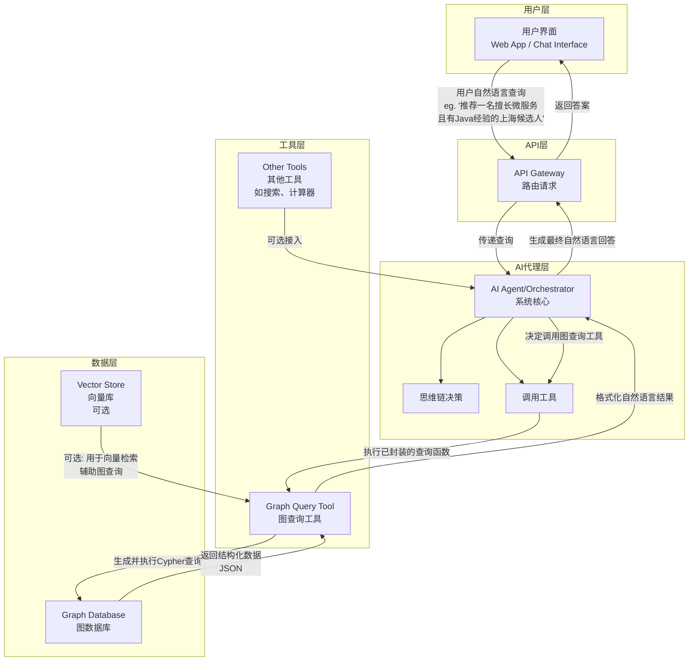

# 如何让AI使用图数据库

### 核心理念：让AI与图数据库“强强联合”

这种结合不是简单地将两个技术放在一起，而是让它们相互增强，形成 **“大脑” (AI)** 与 **“记忆与关联中枢” (图数据库)** 的关系。

*   **AI (LLM) 的优势与短板**：
    *   **优势**：强大的语义理解、逻辑推理和自然语言生成能力。
    *   **短板**：知识可能过时、缺乏事实依据容易产生“幻觉”、难以处理复杂关系推理。
*   **图数据库的优势与短板**：
    *   **优势**：高效存储和查询复杂关系数据、结构清晰、事实明确。
    *   **短板**：本身不具备自然语言理解能力，无法直接与用户对话。

**结合点**：**用图数据库的“事实”为AI的“推理”提供 grounding（基础），用AI的“能力”让图数据库的“数据”变得易于查询和理解。**

---

### 一、架构设计 (Architecture Design)

一个健壮的AI-图数据库系统通常采用分层架构，如下图所示，它清晰地展示了数据流与核心组件的交互：



**各层核心职责**：

1.  **应用层/用户接口层**：
    *   接收用户以**自然语言**输入的查询。
    *   返回AI生成的、易于理解的答案。
    *   形式可以是聊天界面、Web应用或API端点。

2.  **AI代理与编排层（系统大脑）**：
    *   这是系统的**核心**，通常由一个LLM驱动。
    *   **职责**：理解用户意图、决策是否需要查询图数据库、生成或选择正确的查询参数、将数据库返回的结构化数据整合成连贯的回答。
    *   关键概念：**推理（Reasoning）**、**工具调用（Tool Use）**。

3.  **工具层（系统手脚）**：
    *   将图数据库的查询能力**封装成AI可以调用的函数（Function/Tool）**。
    *   每个函数都有清晰的描述、参数定义和执行逻辑。
    *   AI代理根据需求决定调用哪个工具。

4.  **数据层**：
    *   **图数据库 (Neo4j, NebulaGraph, etc.)**：存储核心的关联数据。
    *   **（可选）向量数据库**：用于辅助，例如先将用户问题匹配到图中的某些实体，再进行查询。

---

### 二、代码设计与封装 (Code Design & Packaging)

我们将使用 **Python**、**LangChain**（一个流行的LLM应用框架）和 **Neo4j** 图数据库来演示。

#### 步骤 1: 封装图数据库查询工具

首先，不要直接让LLM生成Cypher查询语句。这很容易出错且不安全。我们应该将常见的查询模式封装成固定的函数。

```python
# graph_tool.py
from neo4j import GraphDatabase
from typing import List, Dict, Any
import json

class Neo4jGraphTool:
    def __init__(self, uri: str, user: str, password: str):
        self.driver = GraphDatabase.driver(uri, auth=(user, password))

    def close(self):
        self.driver.close()

    def _execute_query(self, query: str, parameters: dict = None) -> List[Dict[str, Any]]:
        """执行Cypher查询的通用方法"""
        with self.driver.session() as session:
            result = session.run(query, parameters)
            return [record.data() for record in result]

    # --- 封装具体的查询函数 ---
    def get_employee_skills(self, name: str) -> List[Dict]:
        """查询员工拥有的所有技能"""
        query = """
        MATCH (p:Person {name: $name})-[:HAS_SKILL]->(s:Skill)
        RETURN p.name as person, s.name as skill
        """
        return self._execute_query(query, {"name": name})

    def find_expert_in_skill(self, skill: str, location: str = None) -> List[Dict]:
        """查找精通某项技能的专家，可筛选地点"""
        if location:
            query = """
            MATCH (p:Person)-[:HAS_SKILL {proficiency: 'expert'}]->(s:Skill {name: $skill})
            MATCH (p)-[:LIVES_IN]->(c:City {name: $location})
            RETURN p.name as expert, s.name as skill, c.name as location
            """
            params = {"skill": skill, "location": location}
        else:
            query = """
            MATCH (p:Person)-[:HAS_SKILL {proficiency: 'expert'}]->(s:Skill {name: $skill})
            RETURN p.name as expert, s.name as skill
            """
            params = {"skill": skill}
        return self._execute_query(query, params)

    def recommend_connection(self, source_person: str, target_skill: str) -> List[Dict]:
        """推荐一个人认识谁可以帮他介绍精通某项技能的人"""
        query = """
        MATCH (source:Person {name: $source_person})-[:KNOWS*1..2]-(friend:Person)-
        [:HAS_SKILL {proficiency: 'expert'}]->(s:Skill {name: $target_skill})
        WHERE source <> friend
        RETURN friend.name as recommended_contact, 
               s.name as target_skill,
               [(path in relationships(path) | type(path))] as connection_path
        LIMIT 5
        """
        return self._execute_query(query, {"source_person": source_person, "target_skill": target_skill})
```

#### 步骤 2: 将工具描述给AI并让其调用

使用 LangChain 的 `Tool` 类和 `Agent` 来让AI学会调用我们的封装好的函数。

```python
# main_agent.py
from langchain.agents import AgentType, initialize_agent, Tool
from langchain_openai import ChatOpenAI
from graph_tool import Neo4jGraphTool  # 导入我们封装的工具类

# 1. 初始化LLM和大模型
llm = ChatOpenAI(model="gpt-4", temperature=0)

# 2. 初始化图数据库工具实例
graph_tool = Neo4jGraphTool("bolt://localhost:7687", "neo4j", "your_password")

# 3. 将图数据库方法封装成LangChain Tool
tools = [
    Tool(
        name="EmployeeSkillFinder",
        func=graph_tool.get_employee_skills,
        description="Useful for finding all skills that a person has. Input should be a person's name."
    ),
    Tool(
        name="ExpertLocator",
        func=graph_tool.find_expert_in_skill,
        description="Useful for finding experts in a specific skill. Input should be a single skill name. Optionally, you can also provide a location to narrow down the results."
    ),
    Tool(
        name="ConnectionRecommender",
        func=graph_tool.recommend_connection,
        description="Useful for recommending who a person should talk to in order to get an introduction to an expert in a specific skill. Input should be the source person's name and the target skill they are interested in, separated by a comma."
    )
]

# 4. 初始化AI代理
agent = initialize_agent(
    tools,
    llm,
    agent=AgentType.ZERO_SHOT_REACT_DESCRIPTION, # 使用ReAct代理类型，适合工具调用
    verbose=True,  # 打印出AI的思考过程，便于调试
    handle_parsing_errors=True # 优雅地处理解析错误
)

# 5. 运行查询
if __name__ == "__main__":
    # 示例查询
    query_1 = "张三有哪些技能？"
    query_2 = "在上海，谁是Python方面的专家？"
    query_3 = "我想认识一个Kafka专家，李四能帮我介绍吗？"

    result = agent.run(query_2)
    print(f"\nResult: {result}")
```

#### 步骤 3: AI的思考与执行过程 (示例)

当用户提问 **“在上海，谁是Python方面的专家？”** 时，LangChain Agent (AI) 的内部推理过程如下：

1.  **思考**：“用户需要找Python专家，并且地点在上海。我有一个叫 `ExpertLocator` 的工具可以做到这一点。”
2.  **行动**：`Agent` 调用 `ExpertLocator` 工具，输入参数 `skill="Python"` 和 `location="上海"`。
3.  **观察**：工具执行 Cypher 查询，返回结果 `[{"expert": "王五", "skill": "Python", "location": "上海"}]`。
4.  **思考**：“我得到了结果。现在我需要用自然语言总结这个答案。”
5.  **最终回答**：“根据查询，位于上海的王五是Python方面的专家。”

### 最佳实践与总结

1.  **不要直接让LLM生成Cypher**：封装！封装！封装！将查询逻辑控制在你的代码中，只让LLM选择调用哪个函数并提供参数。
2.  **设计清晰的工具描述**：工具的 `description` 至关重要，它是AI决定是否调用该工具的唯一依据。
3.  **分层架构**：采用清晰的分层架构（API/Agent/Tool/Data）使系统更健壮、易于维护和扩展。
4.  **治理与安全**：注意对用户输入进行清理，防止注入攻击。管理好图数据库的访问权限。
5.  **迭代开发**：从少量、核心的查询工具开始，逐步扩展AI的能力范围。

这种设计模式极大地降低了AI访问图数据的门槛和风险，同时充分发挥了二者的优势，是构建下一代智能推理应用的强大范式。