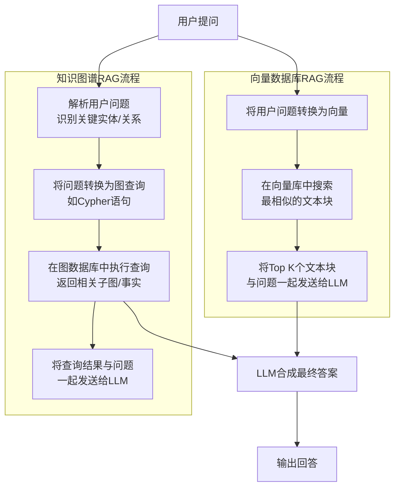

# 知识图谱RAG与向量数据库RAG

这两种方法代表了**不同的信息处理哲学**：一种是**隐式的、统计式的**相似性匹配，另一种是**显式的、结构化的**关系推理。

### 核心概念对比

| 特性         | 方法一：非结构化文本 → 向量数据库 (传统RAG)                  | 方法二：非结构化文本 → 知识图谱 → 搜索 (图增强RAG)           |
| :----------- | :----------------------------------------------------------- | :----------------------------------------------------------- |
| **核心思想** | **语义相似性**：将文本整体转换为向量，检索与问题最相似的文本片段。 | **关系推理**：从文本中提取结构化事实，检索与问题相关的实体和关系网络。 |
| **数据表示** | **密集向量**：文本的数学表示，捕获语义含义。                 | **图结构**：实体（节点）和关系（边）组成的网络。             |
| **检索方式** | **向量相似度计算**：在向量空间中进行最近邻搜索。             | **图查询/遍历**：使用图查询语言（如Cypher）查找相关子图。    |
| **优势**     | **实现简单**：技术栈成熟，LangChain等框架有大量集成。        | **精确性与可解释性**：返回的结果是基于明确的事实和关系，答案来源清晰。 |
|              | **保留上下文**：返回完整的原始文本片段，保留 nuance 和细节。 | **多跳推理**：可以轻松回答需要连接多个事实的复杂问题。       |
|              | **无需大量预处理**：只需切块和嵌入，无需复杂的模式设计。     | **高效关系查询**：查询实体之间的关系是其天然优势。           |
| **劣势**     | **“黑盒”检索**：可能检索到看似相关实则无关的文本，导致幻觉。 | **构建复杂**：需要设计图谱模式、提取实体关系，流程繁琐。     |
|              | **易丢失细节**：如果文本切块不当，关键信息可能被割裂。       | **信息损失**：提取过程可能会丢失原始文本的细节和上下文。     |
|              | **多跳推理能力弱**：难以回答需要串联多个文档片段的问题。     | **依赖提取质量**：提取的准确性严重依赖LLM或NLP模型的质量。   |
|              | **静态知识**：知识更新需要重新嵌入整个文本块。               | **冷启动问题**：需要先构建图谱，无法即拿即用。               |
| **典型问题** | “介绍一下XX公司的产品理念是什么？”                           | “XX公司的CEO创办过哪些公司？这些公司的主要产品是什么？”      |
|              | （答案直接存在于某个文本片段中）                             | （需要查找“XX公司的CEO”实体，再通过“创办”关系找到其他公司实体，再查找这些公司的“产品”属性） |

---

为了更直观地理解这两种架构在处理流程上的根本区别，我们可以通过以下流程图来展现：

如图所示，两种路径的关键差异在于**检索阶段**：
*   **向量数据库路径**依赖于“语义相似性”匹配，召回相关内容块。
*   **知识图谱路径**依赖于“解析-查询”过程，召回结构化事实。

---

### 如何选择？一种权衡策略

实际上，**这并不是一个二选一的问题，而是如何结合使用的问题**。最先进的RAG系统正在融合这两种方法。

#### 策略：混合检索系统 (Hybrid Retrieval)

这是一种“取长补短”的最佳实践，架构如下：

1.  **数据处理管道**：
    *   对同一份文档，**同时**生成向量嵌入**和**提取知识图谱三元组。
    *   文本块存入向量数据库（如Chroma, Weaviate）。
    *   实体和关系存入图数据库（如Neo4j）。

2.  **查询流程**：
    *   用户提出问题。
    *   **并行处理**：
        *   **路径A**：将问题转换为向量，在向量数据库中做相似性搜索，得到TOP K个文本块。
        *   **路径B**：使用LLM解析问题中的实体和关系，生成一个Cypher查询，在图数据库中获取相关的事实子图。
    *   **结果合并**：将两种方法得到的结果——文本块（来自向量库）和结构化事实（来自图谱）——一起作为上下文，发送给LLM。
    *   **LLM合成答案**：LLM同时拥有详细的原始文本和清晰的结构化事实，从而生成既准确又全面的答案。

**这种混合方法的优势**：
*   **精度与召回率的平衡**：向量检索保证召回率（不遗漏相关信息），图谱检索保证精确率（找到准确事实）。
*   **应对复杂问题**：简单问题可能向量检索就够了，复杂多跳问题则由图谱负责。
*   **答案质量极高**：LLM获得了最丰富的上下文信息，极大降低了幻觉的可能。

### 结论与建议

*   **从传统RAG（向量数据库）开始**：如果你的需求相对简单，主要是基于语义相似性的问答，且希望快速启动项目，这是最直接、成本最低的选择。
*   **投资图增强RAG**：如果你的领域**高度依赖关系**（如社交网络、风控、供应链、医药研发），或者你需要极高的答案准确性和可解释性，那么值得投入资源构建知识图谱。
*   **目标是混合模式**：对于企业级的关键应用，**混合检索系统是架构设计的终极目标**。它虽然复杂，但能提供最强大、最鲁棒的问答能力。

**最终，你的选择应该基于你的具体用例、对答案质量的要求以及你拥有的工程资源。** 不妨先用向量方案实现一个原型，再逐步评估是否需要引入知识图谱来解决它处理不了的复杂问题。