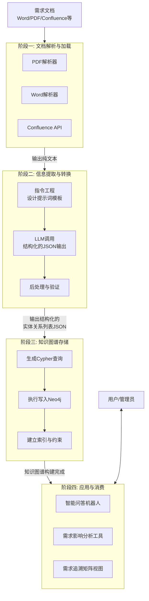

# 非结构化文本到结构化图谱的实现思路

### 核心思路：从“非结构化文本”到“结构化图谱”

这个过程的核心是一个 **ETL（Extract, Transform, Load）** 管道，但其中融入了AI驱动的理解和提取能力。

---

### 一、整体架构设计 (Overall Architecture)

整个系统是一个自动化 pipeline，其核心工作流如下，它展示了数据从原始文档到可查询知识图谱的完整旅程：



**各层核心组件职责**：

1.  **数据采集与解析层**：
    *   **输入**：各种格式的需求文档（PDF, Word, Excel, Confluence/Wiki页面，甚至飞书/钉钉文档）。
    *   **组件**：各种文档解析器（如 `PyMuPDF` for PDF, `python-docx` for Word, `Confluence API` Client）。
    *   **输出**：将文档转换为纯净的文本内容，为下一步的AI处理做好准备。

2.  **AI处理与信息抽取层（核心）**：
    *   **输入**：上一步得到的纯净文本。
    *   **组件**：**大语言模型 (LLM)**，如 GPT-4, Claude 3 或本地模型如 `DeepSeek-Coder`。这是系统的“大脑”，负责理解和抽取信息。
    *   **过程**：通过精心设计的 **提示词工程**，引导LLM从文本中识别出预定义的实体和关系，并以**结构化JSON格式**输出。
    *   **输出**：一个包含实体列表和关系列表的JSON对象。

3.  **知识图谱构建层**：
    *   **输入**：上一步得到的结构化JSON数据。
    *   **组件**：**图数据库客户端**（如 `neo4j` Python driver），负责连接图数据库并执行操作。
    *   **过程**：将JSON数据转换为一系列的 **Cypher** 语句，在图数据库中创建或更新节点和关系。
    *   **输出**：存储在图数据库中的、互联的知识图谱。

4.  **应用与消费层**：
    *   **组件**：基于图谱构建的各种应用，如：
        *   **智能需求问答机器人**：回答“哪些功能需求与‘性能’非功能需求相关？”
        *   **影响分析工具**：可视化修改一个需求会影响到哪些其他需求或代码模块。
        *   **需求追溯矩阵视图**：自动生成需求与设计、测试用例之间的覆盖关系图。

---

### 二、关键技术实现细节

#### 1. 图数据模型设计 (Schema Design)

这是最关键的基础。你需要先定义要从文档中提取哪些类型的实体和关系。

**示例：**

*   **实体类型 (Node Labels)**:
    *   `FunctionalRequirement` （功能需求）
    *   `NonFunctionalRequirement` （非功能需求，如性能、安全）
    *   `UserStory` （用户故事）
    *   `UseCase` （用例）
    *   `Actor` （参与者）
    *   `BusinessRule` （业务规则）
    *   `Term` （业务术语/领域词汇）
    *   `Document` （源文档）

*   **关系类型 (Relationship Types)**:
    *   `DEPENDS_ON` （依赖）
    *   `CONFLICTS_WITH` （冲突）
    *   `REALIZES` （实现）
    *   `REFINES` （细化）
    *   `RELATED_TO` （相关）
    *   `HAS_PART` （包含）
    *   `MENTIONED_IN` （提及于）

#### 2. AI信息抽取的提示词设计 (Prompt Engineering)

这是AI层的核心。你需要设计一个强大的提示词（Prompt）来引导LLM。

```python
# 一个高效的提示词示例
extraction_prompt_template = """
你是一个资深的需求分析师。你的任务是从以下“需求文档”内容中，提取出所有关键信息，并按照指定的JSON格式输出。

# 提取规则：
1. 识别以下实体类型：
   - `FunctionalRequirement`: 系统必须完成的功能点。属性：`id`（唯一标识）, `name`（名称）, `description`（描述）.
   - `NonFunctionalRequirement`: 系统的质量约束。属性：`id`, `type`（类型，如性能、安全、可用性）, `description`.
   - `Actor`: 与系统交互的人或系统。属性：`id`, `name`, `type`（主要/次要）.
   - `BusinessRule`: 必须遵守的业务规则。属性：`id`, `description`.
2. 识别以下关系类型：
   - `DEPENDS_ON`: 一个需求的实现依赖于另一个需求。
   - `REALIZES`: 一个用户故事或用例实现了一个高层级需求。
   - `RELATED_TO`: 两个实体之间存在逻辑关联。

# 输出格式要求：
{{
  "entities": [
    {{"type": "FunctionalRequirement", "id": "FR-001", "name": "用户登录", "description": "用户可以使用邮箱和密码登录系统。"}},
    {{"type": "NonFunctionalRequirement", "id": "NFR-002", "type": "性能", "description": "系统响应时间应在2秒以内。"}},
    {{"type": "Actor", "id": "ACT-003", "name": "系统管理员", "type": "主要"}}
  ],
  "relations": [
    {{"from_id": "FR-001", "to_id": "NFR-002", "type": "RELATED_TO"}},
    {{"from_id": "US-005", "to_id": "FR-001", "type": "REALIZES"}}
  ]
}}

# 需求文档内容：
{document_text}
"""
```

#### 3. 代码实现示例 (Code Implementation)

```python
# requirements_etl.py
import json
from langchain_openai import ChatOpenAI
from langchain.schema import HumanMessage
from neo4j import GraphDatabase
import fitz  # PyMuPDF

# 1. 文档解析 (Extract)
def parse_pdf(file_path):
    doc = fitz.open(file_path)
    text = ""
    for page in doc:
        text += page.get_text()
    return text

# 2. AI信息抽取 (Transform)
def extract_info_with_llm(text):
    llm = ChatOpenAI(model="gpt-4", temperature=0)
    prompt = extraction_prompt_template.format(document_text=text[:10000])  # 处理长文档可分段

    message = HumanMessage(content=prompt)
    response = llm.invoke([message])
    
    # 解析LLM的JSON输出
    try:
        data = json.loads(response.content)
        return data["entities"], data["relations"]
    except json.JSONDecodeError:
        print("LLM returned invalid JSON")
        return [], []

# 3. 图谱构建 (Load)
class Neo4jConnector:
    def __init__(self, uri, user, password):
        self.driver = GraphDatabase.driver(uri, auth=(user, password))

    def create_node(self, node_data):
        # 根据node_data中的`type`动态创建节点
        with self.driver.session() as session:
            query = f"""
            CREATE (n:{node_data['type']} $properties)
            RETURN n
            """
            result = session.run(query, properties={k: v for k, v in node_data.items() if k != 'type'})
            return result.single()

    def create_relationship(self, from_id, to_id, rel_type):
        # 根据ID查找节点并创建关系
        with self.driver.session() as session:
            query = """
            MATCH (a {id: $from_id}), (b {id: $to_id})
            MERGE (a)-[r:%s]->(b)
            RETURN type(r)
            """ % rel_type
            result = session.run(query, from_id=from_id, to_id=to_id)
            return result.single()

    def close(self):
        self.driver.close()

# 主ETL管道
def main_etl_pipeline(pdf_path):
    # 1. 提取文本
    print("Parsing PDF...")
    text = parse_pdf(pdf_path)

    # 2. AI抽取信息
    print("Extracting info with LLM...")
    entities, relations = extract_info_with_llm(text)

    # 3. 存入图数据库
    print("Loading into Neo4j...")
    connector = Neo4jConnector("bolt://localhost:7687", "neo4j", "password")
    
    for entity in entities:
        connector.create_node(entity)
    
    for rel in relations:
        connector.create_relationship(rel['from_id'], rel['to_id'], rel['type'])
    
    connector.close()
    print("ETL process completed successfully!")

if __name__ == "__main__":
    main_etl_pipeline("path/to/your/requirements.pdf")
```

### 三、方案优化与考量

1.  **迭代与人工审核**：初期，AI的提取结果可能需要人工审核和校正。可以开发一个简单的UI界面来展示提取结果，允许分析师确认或修改后再写入数据库。
2.  **处理长文档**：LLM有上下文长度限制。对于长文档，需要采用“Map-Reduce”策略：先分段总结，再全局整合。
3.  **增量更新**：设计机制处理文档的新版本，避免重复插入相同节点，而是更新已有节点或添加新版本关系。
4.  **实体消歧**：同一个实体在不同文档中可能有不同名字（如“用户”和“客户”）。需要设计规则或利用Embedding进行语义相似度匹配，将它们合并为同一个节点。
5.  **安全性**：确保你的LLM API密钥和图数据库凭证的安全管理。

这套架构将非结构化的文档内容转化为了一张充满洞察力的**需求关系网**，为后续的智能分析应用打下了坚实的基础，是迈向高端研发效能和组织知识管理的关键一步。