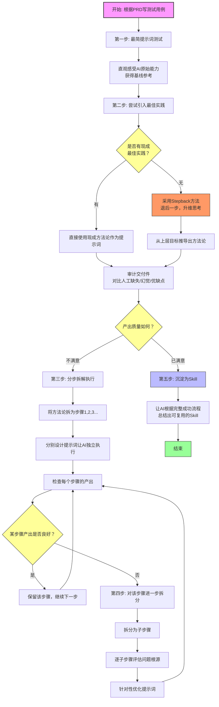

# AI对于工程问题解决的思路方法

---

## 一、背景与核心问题

**目标**：根据 PRD 编写测试用例，借助 AI 提升效率。  
**痛点**：自己写的 prompt 可能带有非最佳实践的约束，导致 AI 只能按固定思路工作，产出质量不稳定。

---

## 二、建议的方法论（共六步）

### 第一步：基线测试 —— 最简提示词
- 直接用最简、无约束的提示词让 AI 工作。
- **目的**：直观感受 AI 的原始能力，获得一个基准参考。

### 第二步：引入最佳实践 —— 完整方法论提示词
- 搜索该类任务的**工程最佳实践**（如测试用例设计的标准流程）。
- **两种情况**：
  - ✅ **能找到公开最佳实践** → 直接将其作为提示词喂给 AI。
  - ❌ **找不到现成最佳实践** → 使用 **Stepback 方法**：
    - **退后一步**：从当前工作的上一层级去思考（例如，不直接问“怎么写测试用例”，而是问“如何验证一个需求是否正确实现”）。
    - **升维思考**：用更抽象、更通用的视角定义问题本质，从而推导出适用于当前场景的工作流程。
    - 举例：  
      - 当前任务：根据 PRD 写测试用例  
      - 退后一步：如何系统性地验证软件功能符合需求？  
      - 升维后得到的方法：需求分析 → 场景拆分 → 等价类划分 → 边界值分析 → 用例编写 → 评审。
- 将找到或推导出的方法论作为提示词喂给 AI。
- **对比审计**：对比 AI 产出与人工处理的交付件，识别缺失、幻觉、优缺点。

### 第三步：分步拆解 —— 按步骤独立执行
- **问题**：第二步中 AI 一次性执行多个步骤，过程不透明，难以定位问题环节。
- **解决**：将方法论拆解为步骤 1、2、3……，分别设计提示词，让 AI 分步执行。
- **观察**：逐个检查每个步骤的产出，判断质量好坏。
  - ✅ 产出好 → 无需处理。
  - ❌ 产出不好 → 进入第四步。

### 第四步：精细改进 —— 对问题步骤再次拆分
- 对产出不佳的步骤进一步拆解为子步骤。
- 逐一评估问题根源，针对性优化提示词。
- 重复迭代，直到产出符合预期。

### 第五步：沉淀为 Skill
- 当上述工作流程稳定、步骤清晰且效果满意后，让 AI **根据刚刚执行成功的完整流程**，自动总结出一个可复用的 **Skill**。
- **Skill 内容应包括**：
  - 任务目标（根据 PRD 写测试用例）
  - 完整的分步工作流（第一步到第四步的每个环节）
  - 每一步的提示词模板或关键指令
  - 质量检查点（如何判断产出好坏）
  - 常见问题及改进策略（如发现幻觉的处理方式）
- **目的**：将一次性的探索过程固化，后续可直接调用该 Skill 快速完成同类任务，无需重复探索。

### 第六步（特殊情况通用策略）：找不到最佳实践时的 Stepback 方法
> 该步骤并非总是独立执行，而是在第二步“找不到最佳实践”时触发。为强调其重要性，单独列出。

- **核心原则**：当无法从外部获得成熟方法论时，**主动退后一步，升维思考**。
- **操作方法**：
  1. 识别当前任务的上层目标（例如：写测试用例 → 上层目标是“需求验证”或“质量保障”）。
  2. 询问更通用的问题：该上层目标在工程上通常如何达成？
  3. 将通用答案降维应用到当前具体任务，推导出可行的步骤。
- **价值**：避免陷入“只会模仿”的局限，培养从原理出发设计流程的能力。

---

## 三、该方法论的局限性

| 适用场景                    | 不适用场景                       |
| --------------------------- | -------------------------------- |
| 线性、顺序执行的工作流程    | 工作流程复杂、步骤间存在网状依赖 |
| 每个步骤的输入/输出清晰可辨 | 步骤互相交织、反馈循环多         |

**应对建议**：尽量将复杂流程**简化设计**为线性流程，避免不可控的复杂网络。

---

## 四、总结口诀（更新）

1. **裸测基线** → 最简单 prompt 看 AI 原力  
2. **套方法论** → 有最佳实践直接用，没有就 Stepback 升维找  
3. **分步拆解** → 独立步骤逐项验收  
4. **精细迭代** → 问题步骤继续拆分优化  
5. **沉淀技能** → 将稳定流程封装为 Skill  
6. **升维兜底** → 退后一层看问题，自己造出好流程

> 牢记：线性流程可控，复杂网络要简化；找不到路就退一步，升维思考出实践。

---

## 五、Mermaid 流程图（已整合 Stepback）

---

如果需要，我可以接下来帮你 **生成这个 Skill 的具体草稿**（即“根据 PRD 写测试用例”的标准可复用工作流），作为分享的示例。