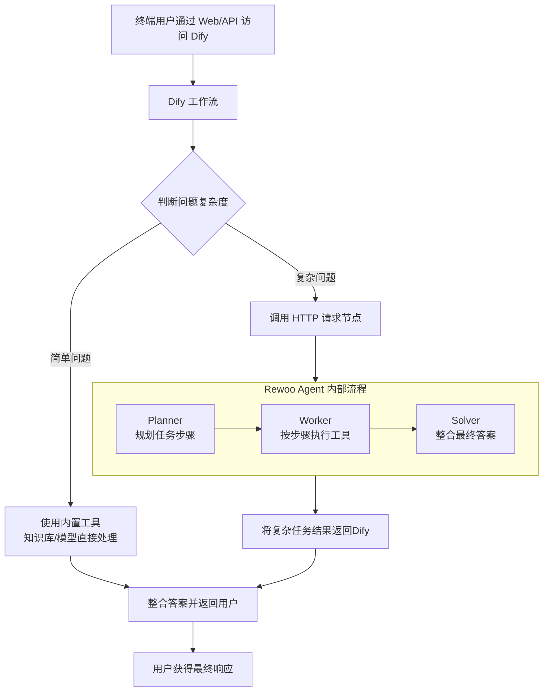

# Dify与Rewoo的对比

下面我将从多个维度详细解释它们的区别，并说明如何在 Dify 中使用 Rewoo。

---

### 一、核心区别：定位与能力对比

为了更直观地理解，我们先通过一个表格来概览它们的核心区别：

| 特性         | Dify                                                         | Rewoo                                                        |
| :----------- | :----------------------------------------------------------- | :----------------------------------------------------------- |
| **核心定位** | **AI 应用开发平台（Application Platform）**                  | **AI 代理框架（Agent Framework）**                           |
| **关键能力** | **编排** 和 **交付**                                         | **规划** 和 **执行**                                         |
| **工作模式** | 提供可视化界面，通过配置连接模型、提示词、知识库、工具等组件，**组装成一个完整的应用**。 | 提供代码框架，让 AI Agent 学会**拆解复杂任务（Plan）**，并**按步骤调用工具（Execute）** 来完成任务。 |
| **主要产出** | 可立即使用的 **Web 应用**、**API接口** 或 **聊天机器人**。   | 一个具备复杂任务分解和执行能力的 **AI Agent 后端服务**。     |
| **抽象层级** | **高阶抽象**，关注应用的整体构建和用户体验。                 | **底层抽象**，关注任务执行的逻辑和可靠性。                   |
| **使用方式** | **低代码/无代码**（也支持代码扩展）。                        | **纯代码**（Python 框架）。                                  |
| **好比**     | **“餐厅的前台和用餐区”**：负责接待顾客、呈现菜单、提供最终的美食和服务。 | **“餐厅的后厨系统”**：负责接收订单、规划炒菜顺序、指挥厨师协作、使用各种厨具完成烹饪。 |

---

### 二、详细解读

#### 1. Dify：应用级的“编排者”和“交付者”

Dify 的核心价值在于 **“整合”** 与 **“交付”**。它让你能通过可视化界面：
*   **编排工作流**：拖拽节点，连接大语言模型、知识库、代码解释器、HTTP 请求等工具。
*   **管理知识库**：上传文档，构建企业的私有知识大脑，供应用检索增强（RAG）。
*   **管理模型**：无缝对接 OpenAI、Anthropic、国内各大模型厂商的 API。
*   **交付最终产品**：一键发布为 Web App 或 API，让最终用户直接使用。

**Dify 关心的是：“用户输入什么？” -> “经过一系列处理” -> “最终输出什么结果？”**

#### 2. Rewoo：代理级的“规划者”和“执行者”

Rewoo 的核心价值在于 **“分解”** 与 **“执行”**。它解决的核心问题是：当一个大语言模型遇到一个非常复杂、无法一步完成的任务时，如何让它自己学会拆解任务并一步步完成。
其核心思想是 **“将规划（Planning）与执行（Execution）分离”**：
*   **Planner（规划器）**：分析用户任务，将其分解成一个一步步的规划（Plan）。
*   **Worker（执行器）**：根据规划步骤，专门负责调用各种工具（如搜索引擎、Python、API等）来执行具体任务。
*   **Solver（解决器）**：整合各个执行步骤的结果，生成最终答案。

**Rewoo 关心的是：“这个复杂任务的目标是什么？” -> “应该分成哪几步？” -> “每步用什么工具执行？” -> “如何汇总结果？”**

---

### 三、能否在 Dify 中使用 Rewoo？

**答案是：可以，而且这是一种非常强大的结合模式！** 你可以将 Rewoo 看作一个强大的外部工具，将其能力集成到 Dify 的工作流中。

这种结合的核心思路是：**Dify 作为总指挥和面向用户的界面，而 Rewoo 作为处理特定复杂任务的专家模块。**

#### 如何实现？

以下是一种典型的集成架构：

1.  **将 Rewoo Agent 部署为独立服务**：
    *   你首先需要按照 Rewoo 的文档，编写并部署一个专门的 AI Agent（例如，一个专门负责复杂数据分析或全网精准信息搜集的 Agent）。
    *   这个 Agent 会提供一个 API 端点（如 `POST /agent/query`）。

2.  **在 Dify 中通过 “HTTP 请求” 节点调用**：
    *   在你的 Dify 工作流中，当你判断用户的问题属于“复杂任务”时（例如，用户问：“请帮我去网上搜集三家最新新能源车的技术参数并做成一个对比表格”）。
    *   就可以使用 Dify 的 **【代码工具】** 或 **【HTTP 请求】** 节点，去调用你部署好的 Rewoo Agent 的 API。
    *   将用户的原始问题（`{query}`）作为参数发送给 Rewoo API。

3.  **处理并返回结果**：
    *   Rewoo Agent 收到请求后，会开始它的工作：规划 -> 调用工具执行 -> 汇总结果。
    *   最终，Rewoo 将处理好的结构化结果（例如一个 Markdown 表格）返回给 Dify 工作流。
    *   Dify 工作流接收到结果后，可以再做后续处理或直接返回给用户。

**流程图如下：**

### 总结

*   **Dify** 和 **Rewoo** 不是竞争关系，而是**协作关系**。
*   **Dify** 擅长**快速构建和交付**最终AI应用，管理整个应用的生命周期。
*   **Rewoo** 擅长**复杂任务的分解和执行**，让AI变得更可靠、更强大。
*   你完全可以在 **Dify 中调用基于 Rewoo 构建的专有 Agent**，从而创造出既能快速交付又具备强大复杂任务处理能力的AI应用。这种模式结合了 Dify 的易用性和 Rewoo 的执行深度，非常有潜力。