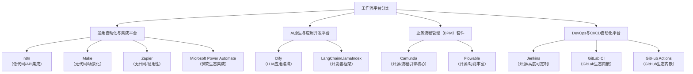

# 常见工作流平台介绍

### 工作流平台分类导图

为了更好地理解，我们可以将它们分为以下四大类：

---

下面我将按类别详细介绍这些平台。

### 1. 通用自动化与集成平台 (iPaaS)

这类平台主要目标是连接不同的SaaS应用和API，实现数据自动化和业务流程自动化，通常强调低代码或无代码。

#### **n8n**
*   **简介**： 一个基于 **Fair-code** 协议（源码可用，但高级功能付费）的工作流自动化工具。以其强大的功能和开发者友好的设计而闻名。
*   **核心特点**：
    *   **可视化界面**： 基于节点的编辑器，非常直观。
    *   **强大的集成**： 支持数百种原生应用连接器，同时也支持通用的HTTP请求、Webhook等，可以连接任何有API的服务。
    *   **灵活性高**： 允许编写自定义JavaScript代码节点，适合有开发能力的用户实现复杂逻辑。
    *   **自托管**： 可以部署在自己的服务器上，保证数据隐私。
*   **适用场景**： 跨应用数据同步、消息通知、数据抓取、自动化营销线索处理等。适合技术团队和懂一些技术的业务人员。

#### **Make (原名 Integromat)**
*   **简介**： 一个非常强大的无代码自动化平台，是n8n的主要竞争对手。
*   **核心特点**：
    *   **无代码导向**： 界面更加场景化，对纯业务用户更友好。
    *   **可视化流程**： 以时间轴的方式展示数据流转，非常清晰。
    *   **丰富模板**： 提供大量现成的自动化场景模板，一键使用。
    *   **数据处理能力强**： 内置了丰富的数据聚合、转换、迭代工具。
*   **适用场景**： 与n8n类似，但更侧重于无代码用户。适合营销、销售、运营等业务人员。

#### **Zapier**
*   **简介**： 无代码自动化领域的鼻祖和领导者，以其易用性和海量的应用集成而著称。
*   **核心特点**：
    *   **极其易用**： 使用“If This Then That”的极简逻辑，上手门槛最低。
    *   **应用生态最广**： 支持的应用数量（5000+）远超其他平台。
    *   **纯SaaS模式**： 不能自托管，数据在云端。
    *   **执行模式**： 主要是“触发-动作”模式，逻辑复杂性不如n8n和Make。
*   **适用场景**： 快速实现两个应用之间的简单自动化，例如“Gmail收到邮件后，在Slack发个通知”。适合非技术人员。

#### **Microsoft Power Automate**
*   **简介**： 微软生态内的自动化工具，深度集成于Office 365、Dynamics 365等产品。
*   **核心特点**：
    *   **微软生态王者**： 与Excel、SharePoint、Teams等微软套件的集成是无敌的。
    *   **桌面流**： 除了云端自动化，还能录制和运行桌面端的自动化（类似RPA）。
    *   **AI Builder**： 内置了AI模型，可以实现表格识别、文本分析等功能。
*   **适用场景**： 企业内大量使用微软产品栈的自动化需求，例如自动处理Excel附件、管理SharePoint列表等。

---

### 2. AI原生与应用开发平台

这类平台是LLM（大语言模型）爆发后的新物种，专注于编排和开发AI应用。

#### **Dify**
*   **简介**： 一个开源的LLM应用开发平台，允许通过可视化工作流编排AI模型、知识库、代码等组件。
*   **核心特点**：
    *   **AI工作流**： 核心是构建复杂的AI应用逻辑，如RAG、Agent、条件判断等。
    *   **一站式**： 集成了模型管理、提示词调试、知识库管理、应用发布等功能。
    *   **面向生产**： 支持多模型、提供API、具备监控能力。
*   **适用场景**： 构建企业知识库问答、AI智能体、文本生成应用、AI客服等。适合AI应用开发者。

#### **LangChain / LlamaIndex**
*   **简介**： 它们不是开箱即用的平台，而是**开发框架**。
*   **核心特点**：
    *   **LangChain**： 提供了一套组件和链，让开发者可以通过编程方式将LLM与外部数据源、工具连接起来，构建复杂的AI应用。灵活性极高。
    *   **LlamaIndex**： 更专注于RAG场景，是连接LLM和私有数据的“最佳数据框架”，擅长文档的索引和检索。
*   **适用场景**： 需要高度定制化AI应用的开发团队，愿意通过写代码来实现复杂功能。是Dify等平台的技术底层选择之一。

---

### 3. 业务流程管理 (BPM) 套件

这类平台非常传统和企业级，专注于建模、执行、监控和优化复杂的、长期运行的业务审批流程。

#### **Camunda**
*   **简介**： 一个基于Java的开源BPMN工作流引擎，非常强大和灵活。
*   **核心特点**：
    *   **标准驱动**： 严格遵循BPMN 2.0（业务流程建模 notation）、DMN（决策建模 notation）等国际标准。
    *   **开发者友好**： 核心是一个引擎，需要开发者集成到应用中，通过Java或REST API驱动。
    *   **强事务性**： 保证流程状态的一致性，适合核心业务系统。
*   **适用场景**： 贷款审批、保险理赔、订单处理等复杂、合规性要求高的企业级业务流程。

#### **Flowable**
*   **简介**： 同样是一个开源BPMN引擎，由Activiti的分支发展而来，与Camunda是主要竞争对手。
*   **核心特点**： 与Camunda非常相似，也提供了全面的BPMN、CMMN、DMN支持。在功能和社区生态上与Camunda竞争。

---

### 4. DevOps与CI/CD自动化平台

这类平台专门用于自动化软件开发和交付流程。

#### **Jenkins**
*   **简介**： 开源CI/CD服务器的绝对王者，以其强大的插件生态和灵活性著称。
*   **核心特点**：
    *   **插件生态**： 上千个插件支持几乎所有工具和平台。
    *   **高度可定制**： 可以通过Pipeline as Code（Jenkinsfile）定义极其复杂的自动化流水线。
    *   **需要运维**： 需要自己维护服务器和配置。
*   **适用场景**： 需要高度定制化构建、测试、部署流程的开发团队。

#### **GitLab CI / GitHub Actions**
*   **简介**： 与代码托管平台深度集成的现代CI/CD工具。
*   **核心特点**：
    *   **无缝集成**： 在GitLab或GitHub仓库中直接定义流水线配置文件（.gitlab-ci.yml, .github/workflows/xxx.yml），体验流畅。
    *   **云原生**： 天然适合云环境，使用容器执行任务。
    *   **简化运维**： 无需维护独立的CI服务器（当然也可以自托管Runner）。
*   **适用场景**： 使用GitLab或GitHub进行代码托管的团队，希望获得开箱即用、简洁高效的CI/CD体验。

### 总结与选型建议

| 你的需求                                | 推荐平台                                       |
| :-------------------------------------- | :--------------------------------------------- |
| **快速连接两个SaaS应用，无代码**        | **Zapier**                                     |
| **复杂的跨应用自动化，需要自定义逻辑**  | **n8n**, **Make**                              |
| **公司重度使用微软Office 365**          | **Microsoft Power Automate**                   |
| **构建AI应用、知识库问答、AI智能体**    | **Dify**                                       |
| **高度定制化开发AI应用（写代码）**      | **LangChain**, **LlamaIndex**                  |
| **企业级复杂审批流程（如财务、合规）**  | **Camunda**, **Flowable**                      |
| **自动化软件构建、测试和部署（CI/CD）** | **Jenkins**, **GitLab CI**, **GitHub Actions** |

选择时，请综合考虑以下因素：**易用性 vs. 灵活性、是否需要代码能力、预算、数据隐私要求（是否需要自托管）、以及与现有技术栈的集成度**。