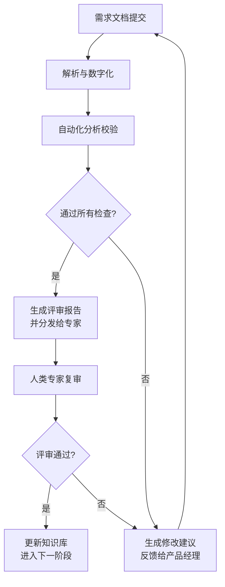

# 需求评审工作流智能体

构建一个用于需求评审的工作流智能体（Agent）可以显著提升软件开发的效率和质量。下面我将从**能力**、**处理流程**、**相关标准**和**实现方式**四个方面为您进行全面阐述。

---

### 一、智能体应具备的核心能力

这个智能体不应只是一个简单的规则引擎，而应是一个集成了AI、具备一定认知和决策能力的协同工作伙伴。

1.  **多模态信息理解与处理能力**
    *   **自然语言处理（NLP）**：能够理解用自然语言编写的需求文档（PRD、用户故事）、会议纪要、邮件等。包括实体识别（识别出系统、模块、功能点）、情感分析（识别出描述中的歧义或不确定性）、语义相似度计算。
    *   **视觉理解（CV）**：能够解析和理解需求中的图表、线框图、流程图、架构图等视觉信息，并与文本描述进行关联对照。

2.  **逻辑与一致性校验能力**
    *   **冲突检测**：能自动检测需求条目之间是否存在逻辑矛盾、前后不一致、范围重叠或遗漏。
    *   **完整性检查**：能根据预设的模板或检查清单，判断需求文档是否包含了所有必要要素（如角色、前置条件、后置条件、业务规则、验收标准等）。

3.  **知识库整合与溯源能力**
    *   **知识检索**：能够连接公司内部的知识库（如Confluence）、过往项目文档、设计系统、API文档等，为评审提供上下文和依据。
    *   **合规性检查**：能根据内置的法律法规、安全规范、UI/UX设计规范等标准，自动检查需求的合规性。

4.  **智能分析与推荐能力**
    *   **影响范围分析**：能初步分析需求变更可能影响哪些现有模块、接口或功能，并提示相关团队（如后端、前端、测试）。
    *   **工作量与复杂度预估**：基于历史数据（如过往类似需求的开发周期），为需求提供初步的工作量（人日）和复杂度评估参考。
    *   **风险评估**：识别需求中可能存在的高风险点（如技术实现难度大、逻辑过于复杂、依赖外部团队等）。

5.  **协同与沟通能力**
    *   **自动生成评审意见**：能自动生成结构化的评审意见，明确指出问题所在、违反的标准/规则，并给出修改建议。
    *   **任务自动分配**：能根据检测到的问题类型（如UI问题、接口问题、逻辑问题），自动@或分配任务给相应的负责人（设计师、后端开发、产品经理等）。
    *   **会议辅助**：能自动生成评审会议的议程提要，并在会议中实时记录关键结论和待办事项。

---

### 二、具体的处理流程（工作流）

智能体应嵌入到整个需求评审的标准化流程中，其处理流程如下图所示，并可分为以下几个核心阶段：

1.  **触发与接入（Trigger & Ingestion）**
    *   **方式**：产品经理通过协同工具（如Jira、Slack）或智能体自身的Web界面提交新的需求文档（或需求变更申请）。
    *   **动作**：智能体接收文档，并触发后续流程。

2.  **解析与数字化（Parsing & Digitization）**
    *   **动作**：智能体调用NLP和CV模型，对文档进行解析，将非结构化的文本和图像转换为结构化的、可处理的数据（例如，识别出功能列表、业务规则、UI元素等）。

3.  **自动化分析校验（Automated Analysis & Validation）**
    *   **动作**：智能体调用各项核心能力对结构化后的需求数据进行全面“体检”：
        *   运行**一致性校验**规则。
        *   运行**完整性检查**清单。
        *   查询**知识库**进行合规性和历史参考比对。
        *   执行**影响范围**和**风险评估**分析。
    *   **输出**：生成一份详细的、带有问题标记的初步分析报告。

4.  **智能评审与反馈（Intelligent Review & Feedback）**
    *   **动作**：
        *   如果**所有自动化检查通过**，智能体将报告标记为“预审通过”，并自动预约评审会议，将报告分发给相关评审专家（架构师、开发Leader、测试Leader等）。
        *   如果**发现问题和风险**，智能体会自动将问题反馈给产品经理，并给出修改建议。产品经理修改后可以重新提交，触发新一轮分析。

5.  **人类专家复审（Human-in-the-loop Review）**
    *   **动作**：在预审通过的基础上，人类专家召开评审会议。智能体可以参与会议，提供实时查询支持（例如：“专家问：这个设计规范之前是怎么定义的？”，智能体实时检索并回答），并记录会议纪要和结论。
    *   **决策**：人类专家做出“通过”、“拒绝”或“修改后重审”的最终决定。

6.  **闭环与学习（Close-loop & Learning）**
    *   **动作**：
        *   评审结束后，智能体自动更新Jira等项目管理工具中的任务状态。
        *   将最终确定的需求版本归档到知识库中，作为下次评审的参考。
        *   **（高级功能）** 收集本次评审的反馈数据，对NLP和分析模型进行微调优化，实现自我进化。

---

### 三、相关的标准

智能体的分析和判断必须基于明确的标准，这些标准需要事先定义和数字化。

1.  **需求文档标准（Input Standard）**
    *   **格式标准**：规定需求文档应使用的模板（如Volere雪卡、Feature模板）、文件格式（如Markdown优于Word，便于解析）。
    *   **写作规范**：要求使用清晰、无歧义的语言，明确列出验收标准（Given-When-Then格式）。

2.  **质量模型标准（Quality Model Standard）**
    *   **一致性**：参考IEEE 830等标准中对需求一致性的要求。
    *   **完整性**：定义“完整”的需求所必须包含的要素清单。
    *   **无歧义性**：对关键术语有统一的词汇表（Glossary）定义。

3.  **技术与合规标准（Technical & Compliance Standard）**
    *   **安全标准**：OWASP TOP 10、GDPR等。
    *   **UI/UX标准**：内部设计系统规范，如Material Design、Apple HIG。
    *   **架构原则**：如微服务划分原则、API设计规范（RESTful）、性能指标等。

4.  **流程标准（Process Standard）**
    *   **评审流程**：明确哪些类型的需求需要哪些角色评审。
    *   **准入/准出标准**：定义需求进入评审和通过评审的硬性条件。

---

### 四、具体的实现方式与技术栈

这是一个复杂的系统，建议分阶段实施。

1.  **架构设计**
    *   **微服务架构**：将不同能力拆分为独立服务（如NLP服务、规则引擎服务、知识库查询服务），通过API组合调用，提高灵活性和可扩展性。
    *   **事件驱动**：使用消息队列（如Kafka、RabbitMQ）来解耦处理流程中的各个步骤。

2.  **核心技术选型**
    *   **AI模型层**：
        *   **NLP**：可使用大型语言模型（LLM）如GPT-4、Claude作为核心，通过Prompt Engineering和RAG（检索增强生成）技术实现专业领域的理解与分析。对于特定任务（如命名实体识别），也可以微调更小的模型（如BERT）。
        *   **CV**：使用多模态LLM（如GPT-4V）或专门的图表识别模型。
    *   **知识库层**：
        *   **向量数据库**：使用Pinecone、Chroma、Weaviate等存储文档的向量嵌入，实现高效的语义检索。
        *   **图数据库**：使用Neo4j来存储需求、模块、人员之间的复杂关系，便于进行影响范围分析。
    *   **业务逻辑层**：
        *   **规则引擎**：使用Drools等或自建规则系统来编码业务规则和检查清单。
    *   **协同与集成**：
        *   **API集成**：与Jira、Confluence、Slack、Teams等工具进行深度集成，使用它们的开放API。
    *   **开发语言**：Python（AI模型的首选）、Java/.NET/Go（用于构建稳健的后端服务）。

3.  **实现步骤（Phased Approach）**
    *   **Phase 1：自动化助手（Automated Assistant）**
        *   聚焦**解析与数字化**和**自动化分析校验**。
        *   实现基于规则和模板的**完整性**和**一致性**检查。
        *   输出简单的检查报告，集成到Jira中自动创建评审任务。
    *   **Phase 2：智能伙伴（Intelligent Partner）**
        *   引入LLM和RAG，增强**自然语言理解**和**知识库检索**能力。
        *   实现初步的**影响分析**和**风险评估**。
        *   能够生成更人性化的**修改建议**。
    *   **Phase 3：自主代理（Autonomous Agent）**
        *   实现更复杂的**多Agent协作系统**（例如，专门负责UI检查的Agent、负责接口检查的Agent）。
        *   具备更强的**决策能力**，能够自动处理低风险的需求变更。
        *   具备持续的**模型自学习**能力。

通过以上设计，这个需求评审工作流智能体将不再是简单的工具，而是一个提升整个团队需求质量、加速开发流程的关键基础设施。