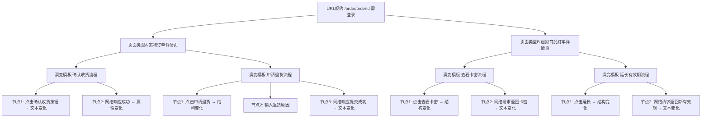

# 页面行为三层抽象规范

（URL规约 → 页面类型 → DOM演变模板及变更节点）

### 第0层：URL 规约（UrlPattern）

**区分方法**  
当两个 URL 模式在**路径结构或鉴权要求**上存在本质差异时，定义为不同的 URL 规约：

- 路径模板不同（如 `/order/{orderId}` vs `/user/{userId}`）→ 不同规约。
- 路径模板相同但**是否需要登录**不同（如 `/public/{id}` 无需登录，`/private/{id}` 需登录）→ 不同规约。
- 路径模板与登录要求均相同，仅产品线/站点不同 → 通过 `attachment` 区分，不新建规约（除非鉴权策略或路由解析逻辑完全不同）。

**区分理由**  
URL 是页面行为的入口，不同规约代表不同的路由解析规则与访问控制策略。规约是第一道聚合边界，混用会导致页面类型匹配错误、权限模型无法独立定义。

**示例**  

| 规约 | 匹配模式            | 是否需要登录 |
| ---- | ------------------- | ------------ |
| A    | `/order/{orderId}`  | 是           |
| B    | `/user/{userId}`    | 是           |
| C    | `/help/{articleId}` | 否           |

---

### 第1层：页面类型（PageType）

**区分方法**  
当同一个 URL 规约下，实际渲染的页面在**标题模板、DOM 指纹模板、可用的演变模板集合**中出现至少一项显著不同时，拆分为不同页面类型。可采用差异度阈值判断：

- **标题模板**不同（如 `订单详情 - {orderId}` vs `虚拟订单 - {orderId}`）。
- **DOM 指纹模板**中核心区块序列差异 > 30%（如缺少或新增一个专属 `<section>`）。
- **演变模板集**的交集不足 50%（大部分交互流程不共享）。

**区分理由**  
同一个 URL 规约可能因参数值或系统状态，呈现完全不同的页面结构和行为。拆分类型才能精准描述“这个页面是什么、能做什么”，避免把所有变体塞进一个模糊的模板里。

**示例**（规约 `/order/{orderId}` 之下）  

| 页面类型               | 标题模板               | DOM 指纹                                                     | 典型演变模板         |
| ---------------------- | ---------------------- | ------------------------------------------------------------ | -------------------- |
| **实物订单详情页**     | `订单详情 - {orderId}` | `main{section#order-info,section#status-bar,section#logistics,section#actions}` | 确认收货、申请退货   |
| **虚拟商品订单详情页** | `虚拟订单 - {orderId}` | `main{section#order-info,section#virtual-product,section#actions}` | 查看卡密、延长有效期 |

---

### 第2层：DOM 演变模板（DomEvolution）及其变更节点

#### 2.1 演变模板之间的区分

**区分方法**  
在一个页面类型下，当存在**多组互不重叠的、目的不同的交互路径**时，用不同的演变模板来描述：

- 判断依据：**交互起点不同**（如点击按钮 A 启动流程，点击按钮 B 启动另一流程），或**最终达成的页面终态明显不同**（如状态变为“已收货” vs “退款中”）。
- 一个演变模板对应一条完整的业务操作路径。

**区分理由**  
一个页面类型上可能承载多种用户意图，把流程拆成独立模板便于复用、监控和独立修改，避免流程间耦合。

**示例**（实物订单详情页下）  

| 演变模板     | 起点                                   | 终点         |
| ------------ | -------------------------------------- | ------------ |
| 确认收货流程 | 点击 `[data-testid="confirm-receipt"]` | 状态“已收货” |
| 申请退货流程 | 点击 `[data-testid="request-refund"]`  | 状态“退款中” |

#### 2.2 变更节点之间的区分

**区分方法**  
在同一个演变模板内，每个节点描述一次**原子状态变化**。区分节点的依据是**触发器 + 受影响 DOM 范围 + 变化结果**的独特性：

- 两次变化由不同的触发器引起（如用户点击 vs 网络响应）→ 必须分为两个节点。
- 触发方式相同但影响的选择器或变化类型不同 → 也需分开。
- 一个触发器导致多个无关区域的变化 → 可拆成多个节点，以便精确定位。

**区分理由**  
原子化节点可以像日志一样精确跟踪每一步，在匹配实际行为时方便判断偏差出现在哪一环。

**示例**（确认收货流程内）  

| 节点 | 触发器                                            | DOM 变化                                                     |
| ---- | ------------------------------------------------- | ------------------------------------------------------------ |
| 1    | 用户点击 `[data-testid="confirm-receipt"]`        | `#order-status` 文本从“待发货”变为“已收货”（文本变化）       |
| 2    | 网络响应 `POST /api/order/{orderId}/confirm` 成功 | `[data-testid="confirm-receipt"]` 属性 `disabled` 从 `false` 变为 `true`（属性变化） |

---

### 整体结构（树形文本）

```
URL 规约 (/order/{orderId}, 需登录)
│
├── 页面类型 A：实物订单详情页
│   │   标题模板：订单详情 - {orderId}
│   │   DOM指纹：main{section#order-info,section#status-bar,section#logistics,section#actions}
│   │
│   └── DOM 演变模板
│       ├── 确认收货流程
│       │   ├── 节点1: 点击 [data-testid="confirm-receipt"] → 文本变化 #order-status
│       │   └── 节点2: POST /api/order/{orderId}/confirm 成功 → 属性变化 disabled
│       │
│       └── 申请退货流程
│           ├── 节点1: 点击 [data-testid="request-refund"] → 结构变化 #actions
│           ├── 节点2: 输入 [data-testid="refund-reason"] → 无直接变化
│           └── 节点3: POST /api/order/{orderId}/refund 成功 → 文本变化 #order-status
│
└── 页面类型 B：虚拟商品订单详情页
    │   标题模板：虚拟订单 - {orderId}
    │   DOM指纹：main{section#order-info,section#virtual-product,section#actions}
    │
    └── DOM 演变模板
        ├── 查看卡密流程
        │   ├── 节点1: 点击 [data-testid="reveal-cdkey"] → 结构变化 #virtual-product
        │   └── 节点2: GET /api/order/{orderId}/cdkey 成功 → 文本变化 #cdkey-value
        │
        └── 延长有效期流程
            ├── 节点1: 点击 [data-testid="extend-validity"] → 结构变化 #virtual-product
            └── 节点2: POST /api/order/{orderId}/extend-validity 成功 → 文本变化 #expire-date
```

### Mermaid 图



---

### 三层结构总结

去掉 PageInstance 后，核心抽象完全聚焦于**类型级别的行为描述**，所有具体访问的时间、用户、参数值都通过外部会话事件关联，保证了业务逻辑的抽象纯度。三层从“URL 入口 → 页面结构/功能 → 交互行为序列”层层递进，既能精准定义一类页面的变化行为，又避免了记录实例带来的重复冗余。