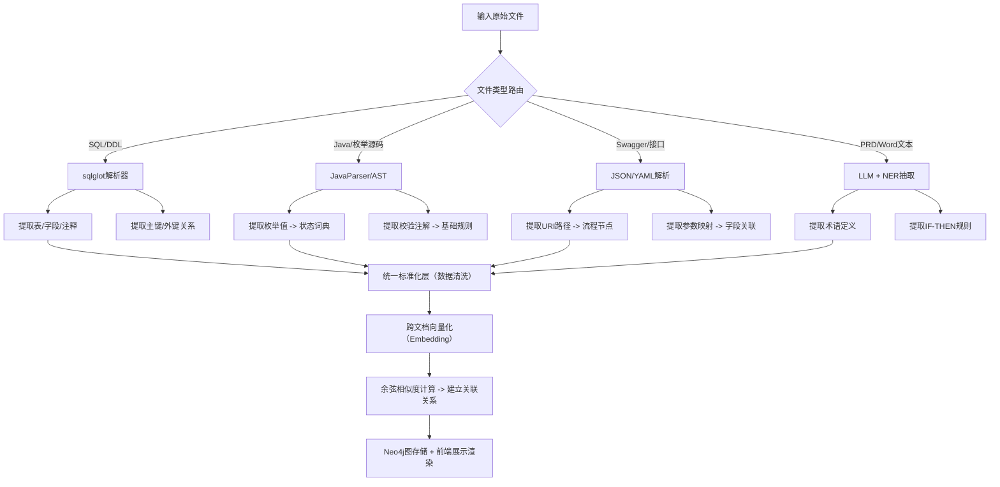

# 知识库的算法实现

---

### 第一部分：你需要提供的文件清单（按优先级排序）

| 优先级           | 文件类型                                      | 具体内容（举例）                                            | 为何必须提供                                                 |
| :--------------- | :-------------------------------------------- | :---------------------------------------------------------- | :----------------------------------------------------------- |
| ⭐⭐⭐ **核心必填** | **1. 数据库DDL/SQL脚本**                      | `create_table.sql`，包含表结构、字段注释、枚举类型定义。    | 这是**数据字典**最精准的来源，注释里往往藏着业务含义。       |
| ⭐⭐⭐ **核心必填** | **2. 接口文档（OpenAPI/Swagger/Thrift IDL）** | `swagger.json` 或 `api.proto` 文件。                        | 能帮我提取**业务流程节点**（接口路径）和**入参出参**，关联到数据字段。 |
| ⭐⭐⭐ **核心必填** | **3. 项目源码中的实体类/枚举类**              | Java `@Entity` 类，或 Python `Enum.py`，或 TS `interface`。 | 代码中的校验注解（如 `@NotNull`）和枚举映射是**业务规则**的直接体现。 |
| ⭐⭐ **强烈建议**  | **4. 产品PRD/需求文档（Word/Markdown）**      | 历史需求文档，包含功能描述、计算逻辑。                      | 里面蕴含了大量非结构化的**自然语言规则**和**术语定义**。     |
| ⭐ **进阶优化**   | **5. 流程设计图（BPMN/Visio/图片）**          | `.bpmn` 文件或包含泳道图的 `png`。                          | 用于提取**状态机流转**和**角色泳道**，如果是图片需提供清晰的截图。 |

---

### 第二部分：针对不同文件的“算法与技术方案”（核心干货）

有了上述文件，我不会仅靠“正则表达式”硬编码，而是搭建一套 **“混合抽取流水线（Hybrid Extraction Pipeline）”**。具体如下：

#### 1. 针对 SQL / DDL（提取数据字典 + 关系）
- **技术方案**：**词法语法解析器（ANTLR / sqlglot）**
- **算法逻辑**：
  1. 将SQL脚本解析为**抽象语法树（AST）**。
  2. 遍历AST节点，抓取 `CREATE TABLE` 下的 `COLUMN` 定义。
  3. 识别 `COMMENT` 注释 → 映射为“业务含义”。
  4. 识别 `FOREIGN KEY` 和 `JOIN` 关系 → 自动生成 **ER图（实体关系）**。
  5. 识别 `ENUM` 或 `CHECK` 约束 → 提取为**数据字典的枚举值列表**（如 `order_status` 的 10,20,30）。

#### 2. 针对实体类/枚举源码（提取字段约束 + 状态机）
- **技术方案**：**静态代码分析（Java Parser / Python AST模块）**
- **算法逻辑**：
  1. 扫描所有 `enum` 类，提取枚举Key和描述（如 `WAIT_PAY("待支付")`）→ 自动补全**术语词典**。
  2. 扫描实体类字段上的注解（如 `@Max(100)`、`@NotNull`、`@Pattern(regex="...")`）→ 提取为**业务规则草案**（例如：`R-xxx: 订单金额必须 < 100`）。

#### 3. 针对接口文档（Swagger/Thrift）（提取流程节点）
- **技术方案**：**JSON/YAML 结构化解析 + URI聚类**
- **算法逻辑**：
  1. 解析所有 `POST/GET` 路径（如 `/order/submit`）。
  2. 按**域名前缀**进行K-means轻量聚类，将 `/order/*` 归为“订单域”， `/user/*` 归为“用户域”。
  3. 提取 `deprecated` 标记 → 识别**已废弃流程**。
  4. 串联接口调用链（根据请求体中的 `order_id` 来源），粗略推断出**时序图**。

#### 4. 针对产品PRD/文本（提取非结构化术语和复杂规则）—— **这是最难也最有价值的一步**
- **技术方案**：**大语言模型（LLM） + 少样本学习（Few-shot） + 正则约束解码**
- **我的处理流程**：
  1. **文本分块（Chunking）**：按章节切分PRD。
  2. **命名实体识别（NER）**：利用微调过的BERT模型或直接利用LLM，抽取大写缩写词（SPU/SKU）和定义句（“是指...”）。
  3. **规则抽取（Relation Extraction）**：在文本中寻找“如果...那么...”、“必须...”、“不可...”等因果/条件连词。**我会将文本切片输入LLM，让其输出结构化的 `IF-THEN-ELSE` JSON**。
  4. **消歧（Coreference Resolution）**：解决“该金额”、“此状态”等指代不清的问题，明确指代具体的字段名。

#### 5. 针对流程图片/BPMN（提取可视化拓扑）
- **技术方案**：
  - 如果是 `.bpmn` 标准文件：直接用 **XML解析器** 提取 `task` 和 `sequenceFlow` 节点。
  - 如果是 PNG/JPG 图片：利用 **OpenCV + OCR（光学字符识别）** 识别框内文字，并利用**图像连通域分析**识别箭头指向，从而还原泳道图。

---

### 第三部分：资产间的“关系”如何自动建立？（最关键算法）

仅仅抽取出孤立的“术语”、“规则”、“字段”是不够的，**我的核心算法在于“跨文档链接（Cross-document Linking）”**：

- **技术方案**：**基于向量嵌入（Vector Embedding）的语义相似度计算**
- **具体做法**：
  1. 将SQL中的 `字段注释`（如 `下单用户ID`）和PRD中的文本（如 `user_id代表买家`）分别转化为 **768维向量**。
  2. 计算余弦相似度（Cosine Similarity）。当相似度 > 0.92 时，系统自动判定：**`[PRD术语]` 等价于 `[数据库字段]`**，并在知识库中建立**双向超链接**。
  3. 利用**图数据库（Neo4j）**逻辑，将术语、字段、规则、流程作为节点，自动生成前面提到的“关系星云图”。

---

### 第四部分：完整的技术落地流程图（供你参考）

如果你要开发这个系统，技术栈时序如下（Mermaid代码）：

---

### 第五部分：给你最落地的操作建议（MVP版本）

如果你现在只想用**AI（比如我）**来快速验证，不需要写代码，你可以这样做：

1. **准备一个ZIP压缩包**，里面包含：
   - 1份 `schema.sql`（最核心）。
   - 1份 `api_doc.md`（复制Swagger的内容）。
   - 1份 `核心PRD.docx`（只需复制关键业务逻辑的章节，不要全篇废话）。
2. **分批次发给我**（因为单次对话Token有限）。
   - 第一次：发SQL，我会输出标准化的**数据字典表格**。
   - 第二次：发PRD文本，我会输出**业务规则决策表**。
   - 第三次：我作为AI，会利用上下文关联能力，人工帮你串联起“**规则R-001 使用了 数据表A的字段B**”这类关系。

**总结一句话**：只要你给我 **SQL、接口文档、枚举代码和PRD文本**，我就能用 **“AST解析 + LLM语义抽取 + 向量相似度链接”** 的组合拳，帮你输出标准化的JSON格式知识库数据，你可以直接拿来灌入前端页面渲染。

你现在手上有这4类文件吗？如果有，你可以先**把SQL脚本的建表语句（脱敏后）贴过来**，我现在就现场给你演示一下提取“数据字典 + 实体关系”的实战效果，让你直观感受一下。随时发我，我们直接开干。