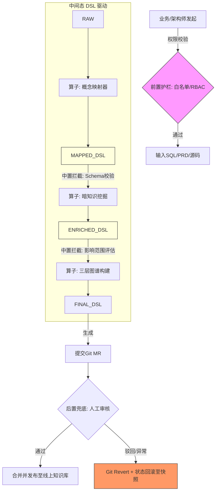

# 知识库的语义建设加强

---

### 针对要求1：起点必须是“业务概念”（强制锚定）

- **技术痛点**：AI天生爱看代码（`user_id`），但业务人员只认“买家ID”。如果起点是SQL字段，知识库就变成了技术文档。
- **加强方案**：引入 **“业务概念注册表（Business Concept Registry）”** 作为**唯一入口网关**。
  - **做法**：所有输入文件（SQL/PRD）必须先经过一个**语义映射层（Semantic Mapper）**。内置一个基础业务本体（Ontology），例如定义好 `[买家]`、`[商品]`、`[下单行为]`。
  - **算法机制**：利用**指代消解（Coreference Resolution）+ 主动提示（Prompting）**。在抽取前，强制LLM输出 `{"business_concept": "买家ID", "physical_field": "user_id"}`。如果LLM无法映射到已注册的业务概念，系统会**抛出“概念未注册”异常并拦截**，直到人工在注册表中新建概念。
- **产出**：所有后续的规则、流程、权限，都必须挂载在“业务概念”上，而非物理字段上。

---

### 针对要求2：语义资产必须包含“暗知识” + 三层架构（物理-语义-动作/权限）

- **技术痛点**：之前的方案只提取了明面上的“表名”和“注释”，但`user_id`关联`order.user_id`这种“隐含关系”、以及“什么动作能改这个字段”都是暗知识。
- **加强方案**：构建**三层知识图谱（3-Layer Knowledge Graph）**，而不是扁平的文档。
  - **L1 物理数据层（Physical）**：存储AST解析出的库、表、字段、索引、外键。
  - **L2 业务语义层（Semantic）**：存储业务口径（如 `GMV = 支付成功的订单金额之和`）、维度（如 `时间维度`、`地域维度`）、边界（如 `订单金额不得为负数`）。
  - **L3 动作权限层（Action & Permission）**：存储“谁在什么流程节点下，对这个语义资产做了什么”（如 `客服` 在 `售后` 流程中，对 `订单状态` 执行 `修改`）。
- **暗知识挖掘算法**：
  1. **隐式关系挖掘**：不仅看外键，还利用**关联规则挖掘（Apriori算法）**分析SQL日志（JOIN频次），如果 `order` 和 `logistics` 表在历史查询中100%被JOIN，系统自动在语义层标注“强依赖关系”。
  2. **指标定义抽取**：针对PRD中的“总额”、“均值”，利用**依存句法分析（Dependency Parsing）**，明确 `聚合函数(SUM/AVG)` + `过滤条件(WHERE)`，生成标准的 **指标字典（Metrics Catalog）**。

---

### 针对要求3：生成过程必须有“中间态、DSL、Action、算子、Skill、可检查/拦截/回滚”

这是最硬核的工程化要求，意味着要把AI的“一次生成”拆解为**流水线（Pipeline）**。技术方案如下：

**1. 定义“知识抽取DSL（领域特定语言）”**
不再让AI直接输出Markdown，而是强制AI输出结构化的 **JSON DSL**（例如 `{"op": "extract_enum", "target": "order_status", "values": [...]}`）。DSL是我们系统的“中间语言”，所有下游工具只认DSL。

**2. 设计“原子算子（Operator）”和“技能（Skill）”**
把抽取任务拆解为不可再分的最小单元：
- `TermExtractor`（术语抽取算子）
- `FieldLinker`（字段关联算子，连接物理与语义）
- `StateMachineBuilder`（状态机构建算子）
- `PermissionMatcher`（权限匹配算子）
一个 **“Skill（技能）”** 就是算子的编排组合（例如 `构建数据字典Skill = TermExtractor + FieldLinker`）。

**3. 强制引入“中间态（Intermediate States）”与检查点**
定义生成过程的状态机：
`RAW(原始文件)` -> `PARSED(解析完成)` -> `DSL_GENERATED(生成中间DSL)` -> `VALIDATED(校验通过)` -> `SYNTHESIZED(合成最终知识)` -> `APPROVED(已审批)`。
- **在每个状态转换间设置“拦截器（Interceptor）”**：
  - **可检查**：拦截器校验DSL是否符合JSON Schema规范。
  - **可拦截**：若DSL中引用了不存在的字段（如 `字段X`），拦截器抛出异常，流程暂停，等待人工介入修改DSL。
  - **可回滚**：系统记录每一步的DSL快照（Snapshot），如果第5步发现错误，一键将状态回退到第2步的DSL版本，重新执行算子。

---

### 针对要求4：边界护栏（前置、中置、后置）

这套机制确保知识库生成不会“污染”线上生产环境。

- **前置校验（权限白名单）**：
  - 接入企业SSO/RBAC系统。用户发起生成任务时，先校验“该用户是否有权读取这堆SQL和PRD”。同时，**白名单机制**只允许抽取 `com.yourapp.business.*` 包下的代码，禁止扫描底层中间件代码，防止泄密。
- **中置校验（逻辑校验与评测回归）**：
  - 引入 **“语义Diff回归测试”**。每次生成新版本知识库时，自动对比上一个稳定版本。
  - 算法实现：计算新旧版本“知识图谱”的图编辑距离（Graph Edit Distance）。如果改动波及超过20%的节点，系统判定为“高风险变更”，**自动拦截**，强制要求高级专家人工复审，防止一次Prompt改动搞崩整个知识库结构。
- **后置兜底（人工审核 + Git回滚）**：
  - **GitOps集成**：最终生成的DSL和知识库JSON文件，不直接写入线上数据库，而是**提交到Git代码仓库**，生成一个Merge Request（MR）。
  - **人工审核**：架构师或业务负责人Review这个MR。
  - **自动回滚**：审核不通过则拒绝Merge。若审核通过合并后，线上监控发现业务查询报错率上升，系统自动触发 **Git Revert**，将知识库回滚到上一个Commit版本，确保业务连续性。

---

### 总结：加强后的整体技术架构图（数据流视角）

---

### 给你的落地建议

如果你的团队要基于这套方案进行开发，建议**不要一上来就做全量**，按照MVP迭代：

1. **第一周（P0）**：只做 `中间态DSL` 和 `前置拦截`。确保AI输出的JSON必须符合你的Schema，否则不通过。
2. **第二周（P1）**：实现 `三层图谱`（物理-语义-动作）的存储，把注释和日志里的“暗知识”结构化。
3. **第三周（P2）**：接入Git MR和人工审核流程，实现后置兜底。
4. **第四周及以后（P3）**：引入图编辑距离算法，做自动回归评测（中置校验）。

这套方案如果落地，你们产出的将不仅是“知识库”，而是一个**符合信创/GitOps标准的业务知识中台**。

