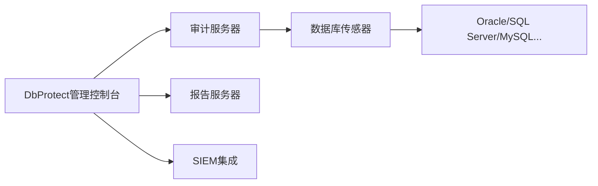
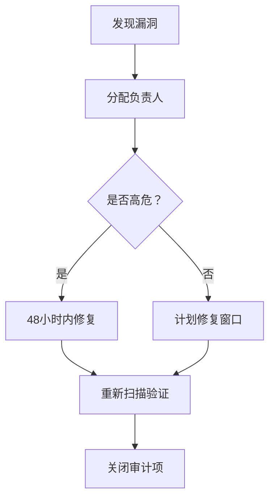

# 使用DbProtect进行专业数据库审计的完整指南

DbProtect（现为Imperva Data Security）是企业级数据库审计与保护平台，以下是专业操作流程：

## 一、环境准备与部署

### 1. 系统架构规划


### 2. 安装要求
- **硬件**：8核CPU/32GB RAM/1TB存储（每100个数据库实例）
- **网络**：传感器与数据库间加密通道（SSL/TLS）
- **权限**：
  - 只读数据库账户（SELECT权限）
  - 操作系统管理员权限（安装传感器）

## 二、基础审计配置

### 1. 数据库发现与注册
1. 登录管理控制台（`https://<server-ip>:8443`）
2. 导航至 **Assets > Databases**
3. 点击 **Add Database** 添加目标
   - 类型：Oracle/SQL Server/DB2/MySQL等
   - 主机/IP：数据库服务器地址
   - 端口：默认端口或自定义
   - 凭证：只读账户凭据

### 2. 审计策略配置
在 **Policies** 标签页：
```code
1. 选择预定义模板：
   - PCI DSS v3.2.1
   - HIPAA Final Rule
   - CIS Benchmark
   - GDPR Compliance

2. 自定义策略（示例）：
   - 敏感数据检测：信用卡号、身份证号
   - 用户权限变更审计
   - DDL语句监控
   - 特权账户活动追踪
```

## 三、核心审计操作

### 1. 漏洞扫描执行
1. 创建扫描任务：
   ```code
   Tasks > New Task > Vulnerability Assessment
   ```
2. 配置参数：
   - 目标数据库：选择注册的数据库
   - 扫描深度：快速扫描/深度扫描
   - 时间窗口：设置业务低峰期
3. 启动扫描：
   ```bash
   # 命令行启动（可选）
   dbprotect-cli start-scan --db oracle-prod --policy cis
   ```

### 2. 实时活动监控
1. 启用SQL流量捕获：
   ```code
   Sensors > Configuration > Enable SQL Capture
   ```
2. 配置监控规则：
   | 规则类型     | 触发条件示例               | 响应动作        |
   | ------------ | -------------------------- | --------------- |
   | 敏感数据访问 | SELECT * FROM credit_cards | 实时告警+记录   |
   | 权限变更     | GRANT DBA TO new_user      | 阻断+通知管理员 |
   | 异常时间操作 | 凌晨2-5点执行DDL语句       | 告警+录像       |
   | 注入攻击特征 | UNION SELECT 1,@@version-- | 自动阻断        |

### 3. 配置审计
1. 基线创建：
   ```code
   Compliance > Baselining > Create Baseline
   ```
2. 审计项示例：
   ```code
   - 密码策略：min_length=12, complexity=ON
   - 审计日志：retention_days=180
   - 加密设置：TDE_ENABLED=YES
   - 补丁级别：Oracle >= 19.15
   ```

## 四、高级审计功能

### 1. 敏感数据发现
1. 创建发现任务：
   ```code
   Data Security > Discovery Jobs > New Job
   ```
2. 配置扫描策略：
   ```yaml
   scan_type: deep_scan
   data_types: 
     - credit_card
     - ssn
     - medical_record
   sampling_rate: 100%  # 全表扫描
   ```

### 2. 用户行为分析(UBA)
1. 启用行为分析：
   ```code
   Settings > Advanced Analytics > Enable UBA
   ```
2. 检测场景：
   - 权限爬升模式检测
   - 异常数据导出行为
   - 内部威胁关联分析
   - 离职员工活动预测

### 3. 审计数据保护
```code
1. 加密存储：启用AES-256加密审计日志
2. 权限分离：设置四眼原则（需双人授权访问敏感审计数据）
3. 防篡改：启用区块链式哈希链验证
```

## 五、审计结果处理

### 1. 报告生成与导出
1. 标准报告：
   ```code
   Reports > Generate > 
   - 漏洞摘要报告
   - 合规差距分析
   - 用户活动审计报告
   ```
2. 自定义报告：
   ```sql
   -- 使用内置SQL查询器
   SELECT event_time, db_user, sql_text 
   FROM audit_logs 
   WHERE risk_score > 80 
   AND event_type = 'PRIVILEGE_ESCALATION'
   ```

### 2. 漏洞修复工作流


### 3. 典型修复案例
**问题：** SA账户弱密码 (CVE-2020-0618)  
**修复步骤：**
1. 立即重置密码：
   ```powershell
   Set-DbaLogin -SqlInstance dbserver -Login sa -Password 'N3w!Str0ngP@ss'
   ```
2. 启用账户锁定策略：
   ```sql
   ALTER LOGIN sa WITH CHECK_POLICY = ON;
   ```
3. 验证修复：
   ```code
   DbProtect > Rescan Vulnerability > CVE-2020-0618
   ```

## 六、企业级最佳实践

### 1. 审计架构优化
```code
1. 分布式部署：每区域部署区域审计服务器
2. 负载均衡：数据库传感器自动故障转移
3. 数据分层：
   - 热数据：保留30天（实时分析）
   - 温数据：保留180天（压缩存储）
   - 冷数据：归档至S3/Glacier
```

### 2. 与其他系统集成
| 集成类型      | 配置方法                  | 用途               |
| ------------- | ------------------------- | ------------------ |
| **SIEM**      | Syslog转发至Splunk/QRadar | 集中安全事件管理   |
| **Ticketing** | REST API集成ServiceNow    | 自动创建漏洞工单   |
| **IAM**       | LDAP/AD同步               | 实时用户身份关联   |
| **Cloud**     | AWS Security Hub连接器    | 混合云环境统一审计 |

### 3. 性能优化技巧
```code
1. 查询加速：为审计数据库创建列式存储索引
2. 流量采样：在高峰期启用1:10采样率
3. 智能过滤：排除常见低风险语句（如SELECT SYSDATE）
4. 硬件卸载：使用专用网卡进行SSL解密
```

## 七、关键注意事项

1. **法律合规**：
   - 员工监控需提前书面告知
   - 审计日志保留期限符合当地法规
   - 敏感数据扫描需获得授权

2. **应急方案**：
   ```code
   # 紧急停止审计传感器
   systemctl stop dbprotect-sensor
   
   # 清除敏感内存数据
   dbprotect-cli purge-memory --sensor-id sensor01
   ```

3. **持续维护**：
   - 每月更新漏洞特征库
   - 每季度审计策略评审
   - 每年进行红队对抗测试

> **专业提示**：启用 **学习模式** 前2周，DbProtect将分析正常流量模式，后续基于此基线检测异常。此期间勿启用阻断功能，避免误报影响业务。

通过以上配置，DbProtect可提供企业级的数据库安全审计能力，满足从合规检查到高级威胁防护的全方位需求。