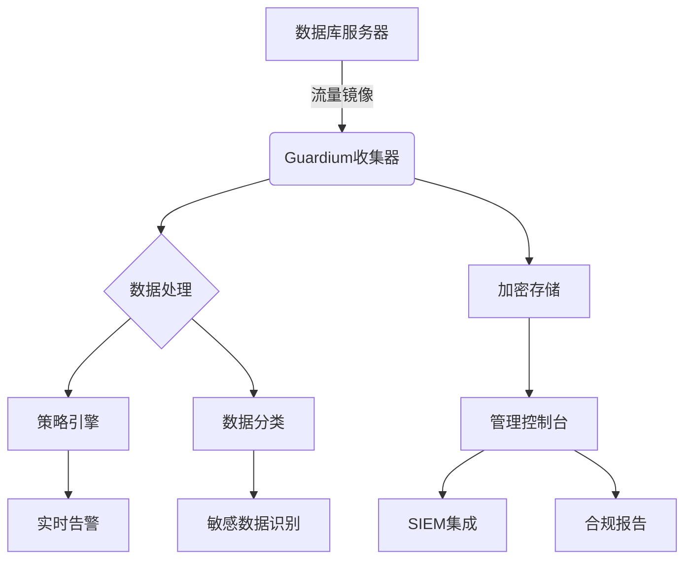
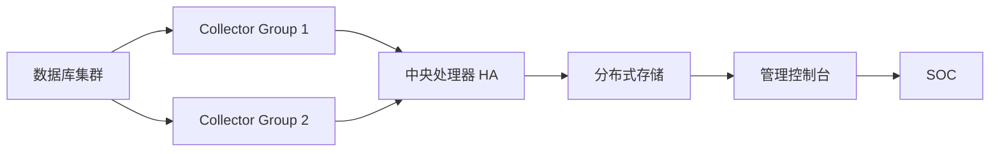

# 使用 IBM Guardium 实现专业级实时数据库活动监控

IBM Guardium 是企业级数据库活动监控（DAM）解决方案的黄金标准，以下是专业配置与操作指南：

## 一、架构规划与部署

### 1. 核心组件架构


### 2. 部署模式选择
| **模式**     | **适用场景**      | **性能影响** |
| ------------ | ----------------- | ------------ |
| **网络分流** | 生产环境(零侵入)  | <1%延迟      |
| **本地代理** | 云数据库/容器环境 | 3-5% CPU     |
| **日志解析** | 历史审计分析      | 无实时影响   |
| **混合模式** | 大型企业混合架构  | 可定制       |

## 二、实时监控配置流程

### 1. 数据源配置
1. **登录管理控制台**：`https://<guardium-ip>:8443`
2. **添加数据库实例**：
   ```bash
   # 命令行示例 (Oracle)
   add database oracle \
     --name PROD_ORA \
     --host 10.1.1.100 \
     --port 1521 \
     --service ORCL \
     --monitor-user guard_mon
   ```
3. **权限配置**：
   ```sql
   -- Oracle监控账户创建
   CREATE USER guard_mon IDENTIFIED BY "S3cureP@ss!";
   GRANT SELECT ANY DICTIONARY TO guard_mon;
   GRANT CREATE SESSION TO guard_mon;
   ```

### 2. 策略配置（核心）
在 **Policies > Real-Time Monitoring** 中创建策略：

```yaml
policy: Financial_DB_Monitoring
description: 核心财务系统实时监控
databases: [ PROD_ORA, FIN_SQLSERVER ]
triggers:
  - name: Sensitive_Data_Access
    condition: |
      (OBJECT_NAME LIKE '%SALARY%' OR 
       OBJECT_NAME LIKE '%CUSTOMER_CC%') AND
      ACCESS_TYPE = 'SELECT'
    severity: CRITICAL
    actions:
      - alert: EMAIL_ADMIN
      - block: ENABLED   # 实时阻断
      - capture: FULL_SQL  # 完整SQL捕获
      - session_terminate: true  # 终止会话

  - name: After_Hours_DDL
    condition: |
      (SQL_COMMAND_TYPE IN ('CREATE','ALTER','DROP') AND
      (HOUR(CURRENT_TIME) BETWEEN 20 AND 6)
    severity: HIGH
    actions:
      - alert: SMS_DBA
      - capture: FULL_SESSION  # 完整会话录像

  - name: Privilege_Escalation
    condition: |
      SQL_TEXT REGEXP 'GRANT\s+(DBA|SYSDBA|SUPER)\s+TO'
    severity: EMERGENCY
    actions:
      - alert: SOC_CENTER
      - block: ENABLED
      - session_terminate: true
```

### 3. 敏感数据发现
```code
1. 导航至 Data Classification > Discovery
2. 创建扫描任务：
   - 扫描类型：深度模式
   - 目标数据库：PROD_ORA
   - 敏感模式：
     • 信用卡号：\d{13,16}
     • 身份证号：[1-9]\d{5}(18|19|20)\d{2}(0[1-9]|1[0-2])(0[1-9]|[12]\d|3[01])\d{3}[\dX]
   - 采样率：100% (全表扫描)
3. 生成数据地图：
   - 可视化敏感表分布
   - 自动标记PII/PCI数据
```

## 三、实时监控操作

### 1. 监控仪表板配置
```code
1. 创建实时监控视图：
   Dashboard > New > Real-Time Activity
2. 添加组件：
   - 活动热力图：按数据库/用户
   - TOP SQL语句：实时滚动
   - 风险事件流：时间线展示
   - 会话监控：活动会话详情
3. 关键字段显示：
   | 字段          | 说明                 |
   |--------------|---------------------|
   | DB_USER      | 数据库账户           |
   | CLIENT_IP    | 客户端IP             |
   | SQL_TEXT     | 执行的SQL语句        |
   | RESPONSE_TIME| 执行时间(ms)         |
   | RISK_SCORE   | 风险评分(0-100)      |
```

### 2. 高级监控场景
**场景1：内部威胁检测**
```code
条件组合：
  (USER_ROLE = 'FINANCE_ANALYST') AND 
  (ACCESS_TIME > WORK_HOURS + 2h) AND 
  (DATA_VOLUME > 10MB) AND
  (DESTINATION_IP EXTERNAL)
动作：
  实时阻断 + 录屏 + SOC告警
```

**场景2：SQL注入防御**
```code
检测逻辑：
  SQL_TEXT REGEXP 
    '(SELECT\s+.*\s+FROM\s+.*\s+WHERE\s+.*\s*=\s*\d+\s*(OR|\-\-))|(UNION\s+SELECT)'
响应：
  自动终止会话 + IP隔离30分钟
```

**场景3：数据泄露防护**
```code
规则链：
1. 检测大容量导出: 
   (SQL_COMMAND = 'SELECT') AND 
   (ROW_COUNT > 10000) AND
   (CLIENT_TOOL IN ('sqlplus','Toad','Navicat'))
2. 关联敏感数据:
   (TABLES_INCLUDED HAS_CLASSIFIED 'PCI')
3. 验证异常时间:
   (ACCESS_TIME NOT IN WORK_SCHEDULE)
响应：
  动态脱敏 + 审批工作流
```

## 四、告警与响应配置

### 1. 告警通道配置
| **类型**    | **配置示例**                        | **响应时间** |
| ----------- | ----------------------------------- | ------------ |
| **Syslog**  | `alert syslog server=10.0.0.100`    | <100ms       |
| **SMTP**    | `alert email to=dba@corp.com`       | 2-5s         |
| **SNMP**    | `alert snmp trap_v2`                | <500ms       |
| **Webhook** | `alert webhook url=https://soc/api` | <200ms       |

### 2. 自动化响应动作
```bash
# 示例：高危事件自动隔离
guardctl response create --name "SQLi_Block" \
  --condition "RISK_SCORE >= 90" \
  --action "firewall block source_ip 24h" \
  --action "disable_db_account" \
  --action "create_ticket severity=critical"
```

## 五、企业级最佳实践

### 1. 性能优化方案
```code
1. 硬件加速：启用SSL卸载卡 (Cavium芯片)
2. 流量过滤：
   - 排除健康检查SQL
   - 采样率设置：SELECT语句=1:100
3. 分层存储：
   - 热数据：SSD存储(7天)
   - 温数据：SAS硬盘(30天)
   - 冷数据：磁带归档(7年)
```

### 2. 高可用架构


### 3. 合规性实施
**PCI DSS 监控要求实现：**
```code
1. 策略：PCI_DSS_3.2.1_Requirement_10
   - 监控所有特权用户操作
   - 记录完整SQL语句
   - 保留日志1年
2. 报表：
   Reports > Compliance > PCI DSS > 
     • 每日审计摘要
     • 季度合规证明
3. 自动证据收集：
   guardctl export evidence --standard PCI --period quarterly
```

## 六、运维与排错

### 1. 关键运维命令
```bash
# 查看实时吞吐量
guardtop -l

# 检查收集器状态
guardctl collector status

# 强制策略重载
guardctl policy reload --force

# 导出监控日志
guardlog export --type realtime --last 24h > audit.log
```

### 2. 常见问题处理
| **故障现象** | **解决方案**             |
| ------------ | ------------------------ |
| 流量丢失     | 检查SPAN端口镜像配置     |
| 高延迟告警   | 调整采样率或启用硬件加速 |
| 策略不生效   | 检查策略优先级顺序       |
| 存储空间不足 | 启用自动归档或扩展存储卷 |

## 七、安全加固建议

1. **控制台安全**：
   ```code
   # 启用多因素认证
   guardctl security mfa enable --type duo
   
   # 配置会话超时
   set console timeout=15m
   ```

2. **数据加密**：
   ```bash
   # 启用AES-256加密
   guardctl storage encryption enable --algo AES-256 \
     --keyfile /secure/encryption.key
   ```

3. **审计分离**：
   ```code
   配置四眼原则：
     • 策略修改需双人审批
     • 审计日志访问需独立授权
     • 敏感操作视频记录
   ```

> **关键提示**：在启用阻断功能前，务必在**监控模式**下运行至少2周，通过Guardium的**策略优化器**分析误报率，逐步调整策略阈值。生产环境阻断操作应配合完善的回滚机制。

通过以上配置，Guardium 可提供：
- 亚秒级实时监控响应
- 敏感数据智能识别
- 自动威胁阻断能力
- 满足金融级审计合规要求
- 支持每天PB级监控流量处理

建议结合Guardium的**威胁情报集成**功能，对接IBM X-Force或第三方TI平台，实现已知恶意IP和SQL注入模式的实时阻断。