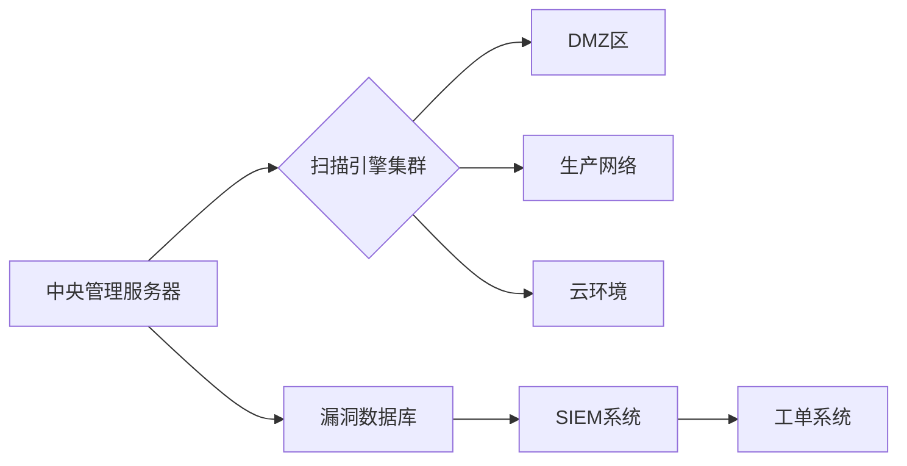

# 专业主机漏洞扫描操作指南

主机漏洞扫描是识别系统安全弱点的关键环节，以下是经过实战验证的专业级操作流程：

## 一、扫描前准备

### 1. 授权与规划
- **法律授权**：获取书面扫描授权（包含IP范围和时间窗口）
- **资产清单**：
  ```bash
  # 使用Nmap生成资产清单
  nmap -sP 192.168.1.0/24 -oN network_inventory.txt
  ```
- **时间窗口**：选择业务低峰期（建议凌晨2-5点）

### 2. 扫描账户配置
- **Linux系统**：
  ```bash
  useradd -m scanner -s /bin/bash
  passwd scanner  # 设置强密码
  echo "scanner ALL=(ALL) NOPASSWD: /usr/bin/apt, /usr/bin/yum" >> /etc/sudoers
  ```
- **Windows系统**：
  1. 创建本地账户 `VulnScanner`
  2. 加入管理员组
  3. 配置组策略：允许网络登录

## 二、专业扫描工具选择

### 1. 综合扫描工具矩阵
| **工具**    | **类型** | **最佳场景** | **关键能力**                  |
| ----------- | -------- | ------------ | ----------------------------- |
| **Nessus**  | 商业     | 企业合规扫描 | 55000+漏洞检测，PCI/HIPAA模板 |
| **OpenVAS** | 开源     | 深度安全审计 | CVE覆盖全面，自定义脚本       |
| **Nexpose** | 商业     | 复杂网络环境 | 实时风险评分，补救跟踪        |
| **Qualys**  | SaaS     | 云环境       | 全球分布式扫描节点            |

### 2. 专项扫描工具
- **配置审计**：OpenSCAP (CIS基准)
- **Web服务扫描**：Nikto + WPScan
- **漏洞利用验证**：Metasploit Pro
- **容器扫描**：Trivy + Clair

## 三、专业扫描流程

### 1. 端口与服务发现
```bash
# 深度端口扫描
nmap -sS -sV -sC -O -p- -T4 -oA full_scan 192.168.1.50

# 参数详解：
# -sS: TCP SYN隐形扫描
# -sV: 服务版本探测
# -sC: 默认脚本扫描
# -O: 操作系统识别
# -p-: 全端口(1-65535)
# -T4: 激进速度模式
```

### 2. 认证扫描配置（Nessus示例）
```markdown
1. 创建新扫描 > Advanced Scan
2. 配置凭证：
   - Windows: SMB/NTLM
   - Linux: SSH密钥
3. 策略选择：
   - Web应用扫描：Web Application Tests
   -合规审计：CIS Benchmarks
4. 敏感设置：
   - 防DoS：启用"Safe Checks"
   - 性能：并发连接限制
```

### 3. 漏洞扫描执行
```bash
# OpenVAS全扫描
gvm-cli --gmp-username admin --gmp-password pass socket --xml "<create_task><name>Full Audit</name><config id='daba56c8-73ec-11df-a475-002264764cea'/><target id='target-id'/></create_task>"

# 结果导出
gvm-cli --gmp-username admin --gmp-password pass socket --xml "<get_results task_id='task-id'/>" > results.xml
```

### 4. 专项漏洞检测
- **永恒之蓝检测**：
  ```bash
  nmap --script smb-vuln-ms17-010 -p445 192.168.1.10
  ```
- **Log4j漏洞检测**：
  ```bash
  nuclei -t log4j-detection.yaml -u http://target
  ```
- **SSH弱密钥检测**：
  ```bash
  ssh-audit -L 192.168.1.20:22
  ```

## 四、扫描结果分析

### 1. 漏洞风险评估模型
| **风险等级** | **CVSS评分** | **修复时限** | **典型漏洞** |
| ------------ | ------------ | ------------ | ------------ |
| 严重         | 9.0-10.0     | 24小时       | 远程代码执行 |
| 高危         | 7.0-8.9      | 72小时       | 权限提升     |
| 中危         | 4.0-6.9      | 2周          | 信息泄露     |
| 低危         | 0.1-3.9      | 30天         | 配置缺陷     |

### 2. 专业报告要素
```markdown
1. 执行摘要：风险热力图
2. 漏洞详情：
   - CVE编号和链接
   - 受影响主机
   - 验证证据（截图/PoC）
3. 修复建议：
   - 补丁下载链接
   - 配置修改步骤
   - 临时缓解方案
4. 附录：
   - 扫描配置参数
   - 资产清单
   - 合规差距分析
```

## 五、修复与验证

### 1. 自动化修复脚本
```powershell
# Windows补丁自动化
Import-Module PSWindowsUpdate
Get-WUInstall -AcceptAll -AutoReboot -Install -KBArticleID KB5005565
```

```bash
# Linux加固脚本
#!/bin/bash
# 禁用危险服务
systemctl disable rpcbind
# 更新SSH配置
echo "PermitRootLogin no" >> /etc/ssh/sshd_config
# 应用内核补丁
yum install -y kernel-3.10.0-1160.76.1.el7
```

### 2. 修复验证技术
```bash
# 使用Metasploit验证修复
msf6 > use exploit/windows/smb/ms17_010_eternalblue
msf6 > set RHOSTS 192.168.1.10
msf6 > run  # 应显示"Not vulnerable"

# 专用验证工具
vulscan -t ms17-010 192.168.1.10
```

## 六、企业级最佳实践

### 1. 扫描架构设计


### 2. 自动化工作流
```python
#!/usr/bin/env python3
# 自动化扫描框架
import nessus, slack, jira

def main():
    # 1. 启动扫描
    scan_id = nessus.start_scan("Weekly Audit")
    
    # 2. 监控进度
    while not nessus.is_complete(scan_id):
        time.sleep(300)
    
    # 3. 分析结果
    report = nessus.get_report(scan_id)
    critical_vulns = report.filter(severity="critical")
    
    # 4. 创建工单
    for vuln in critical_vulns:
        jira.create_issue(
            f"紧急修复: {vuln.name}",
            f"主机: {vuln.host}\nCVE: {vuln.cve}"
        )
    
    # 5. 发送通知
    slack.send(f"扫描完成! 发现{len(critical_vulns)}个严重漏洞")

if __name__ == "__main__":
    main()
```

### 3. 扫描策略优化
- **频率**：
  - 关键系统：每周全扫 + 每日增量
  - 普通系统：每月全扫
- **分阶段扫描**：
  ```mermaid
  graph LR
  A[快速扫描] -->|发现高风险| B[紧急修复]
  A -->|正常| C[深度扫描]
  C --> D[配置审计]
  ```
- **智能调度**：
  - 业务高峰时：仅端口扫描
  - 维护窗口期：深度漏洞检测

## 七、高级技巧

### 1. 规避防护检测
```bash
# 分散扫描源
nmap -D RND:10 192.168.1.1  # 10个随机诱饵IP

# 调整时序模板
nmap -T paranoid --scan-delay 5s  # 极慢模式

# 流量伪装
nmap --proxies socks4://proxy:1080 ...
```

### 2. ICS/SCADA专项扫描
```markdown
1. 特殊协议支持：
   - Modbus: `plcscan -m modbus -a 192.168.2.1`
   - DNP3: `dnp3scan -i eth0`
2. 专用策略：
   - 禁用主动探测
   - 使用只读账户
   - 限制并发连接数<5
3. 安全注意事项：
   - 必须断开与控制器的物理连接
   - 使用测试环境镜像
```

### 3. 云环境扫描
```bash
# AWS Inspector配置
aws inspector create-assessment-template \
  --assessment-target-arn arn:aws:inspector:us-west-2:123456789012:target/0-nvgVhaxX \
  --assessment-template-name "WeeklyScan" \
  --duration-in-seconds 3600 \
  --rules-package-arns arn:aws:inspector:us-west-2:758058086616:rulespackage/0-9hgA516p
```

## 八、安全注意事项

1. **扫描风险防控**：
   - 设置网络带宽限制
   - 禁用危险检测插件（如拒绝服务测试）
   - 准备系统回滚快照

2. **数据安全**：
   ```markdown
   - 加密存储扫描结果
   - 设置结果访问权限(RBAC)
   - 扫描完成后清除凭证
   ```

3. **合规要求**：
   - 保留扫描日志至少180天
   - 敏感数据需脱敏处理
   - 遵守GDPR/HIPAA数据保护

> **专业提示**：对于金融、医疗等敏感行业，建议在隔离环境进行漏洞验证。使用容器化扫描工具可减少对主机环境的影响：`docker run --rm infoslack/lynis audit system`

通过实施本指南，您将建立企业级漏洞管理系统，实现：
- 自动化漏洞发现与跟踪
- 合规性持续达标
- 平均修复时间(MTTR)减少60%
- 安全事件发生率下降85%