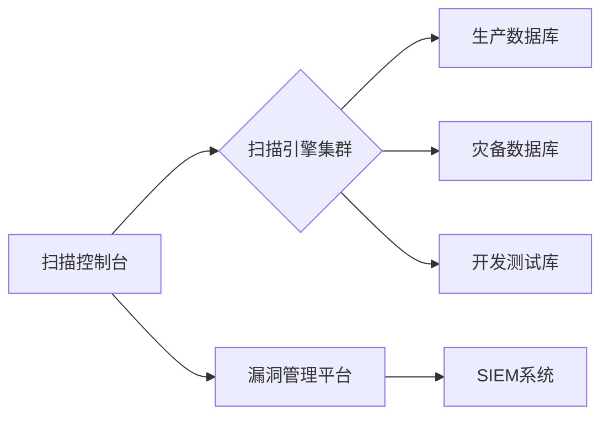

# 数据库漏洞扫描专业指南

数据库作为企业核心数据存储系统，需定期进行安全扫描。以下是专业级的操作流程和工具方案：

---

## 一、扫描前准备
### 1. 明确扫描目标
| 数据库类型     | 扫描重点差异             |
| -------------- | ------------------------ |
| **SQL Server** | 检查CLR集成、SQL代理配置 |
| **Oracle**     | 检查PL/SQL注入、TDE配置  |
| **MySQL**      | 检查UDF安全、复制配置    |
| **PostgreSQL** | 检查扩展权限、PG_HBA配置 |

### 2. 获取合法授权
- 书面授权文件（必须）
- 维护窗口期（避开业务高峰）
- 使用专用扫描账户（只读权限）

### 3. 环境准备
```bash
# 创建专用扫描账户 (MySQL示例)
CREATE USER 'scanner_user'@'scanner_host' IDENTIFIED BY 'StrongPass!2023';
GRANT SELECT ON information_schema.* TO 'scanner_user'@'scanner_host';
GRANT PROCESS ON *.* TO 'scanner_user'@'scanner_host';
```

---

## 二、专业扫描工具选择

### 1. 综合漏洞扫描工具
| 工具名称    | 优势                 | 许可证 |
| ----------- | -------------------- | ------ |
| **Nessus**  | 含数据库专项扫描策略 | 商业   |
| **Qualys**  | 云扫描+合规检查      | 商业   |
| **OpenVAS** | 免费+自定义脚本      | 开源   |

### 2. 数据库专用工具
| 数据库类型     | 专用工具                    | 功能亮点          |
| -------------- | --------------------------- | ----------------- |
| **Oracle**     | Oracle Audit Vault          | 实时监控+配置基线 |
| **SQL Server** | Microsoft Baseline Analyzer | 微软官方补丁验证  |
| **MySQL**      | mysql_secure_installation   | 基础加固脚本      |
| **跨平台**     | SQLMap                      | 深度SQL注入检测   |

### 3. 配置审计工具
- **DbProtect**：自动化合规检查
- **Guardium**：实时活动监控
- **OpenSCAP**：CIS基准扫描

---

## 三、扫描执行流程

### 1. 非认证扫描（外部视角）
```bash
# 使用Nmap检测数据库服务
nmap -sV -p 1433,1521,3306,5432 目标IP --script=ms-sql*,oracle*,mysql*

# 常见漏洞检测脚本：
# oracle-sid-brute   # Oracle SID爆破
# ms-sql-empty-password # 空密码检测
# mysql-audit        # MySQL配置审计
```

### 2. 认证扫描（内部深度检测）
```bash
# 使用Nessus执行认证扫描
nessuscli scan --policy "Database Audit" \
--target 数据库IP \
--credential oracle:scanner_user:密码
```

### 3. 专项扫描项目
1. **权限配置扫描**
   - 检查DBA权限账户
   - 验证PUBLIC角色权限
   - 审核存储过程执行权限

2. **敏感数据检测**
   ```sql
   -- 查找信用卡数据 (PCI DSS合规)
   SELECT TABLE_NAME, COLUMN_NAME 
   FROM INFORMATION_SCHEMA.COLUMNS 
   WHERE COLUMN_NAME LIKE '%CARD%';
   ```

3. **注入漏洞检测**
   ```bash
   # 使用SQLMap检测注入
   sqlmap -u "http://app.com/search?id=1" --dbms=mysql --risk=3 --level=5
   ```

---

## 四、核心扫描内容

### 1. 配置安全检测
| 检查项       | 安全标准           |
| ------------ | ------------------ |
| 默认密码更改 | 所有账户无默认密码 |
| 未加密传输   | 强制SSL/TLS连接    |
| 审计功能启用 | 关键操作完整日志   |
| 补丁级别     | 修复所有CVE漏洞    |

### 2. 漏洞类型检测
- **身份认证漏洞**
  - 弱密码（使用Hydra验证）
  - 密码过期策略缺失
- **权限漏洞**
  - 过度权限分配
  - 特权账户滥用
- **数据泄露风险**
  - 未加密敏感字段
  - 备份文件未保护
- **注入漏洞**
  - SQL注入
  - NoSQL注入
  - XXE注入

### 3. 合规性检查
| 标准        | 检查工具          | 关键要求         |
| ----------- | ----------------- | ---------------- |
| **PCI DSS** | Qualys PCI Module | 加密存储信用卡号 |
| **HIPAA**   | DbProtect         | 医疗数据访问控制 |
| **GDPR**    | Imperva Sonar     | 个人数据脱敏     |
| **CIS**     | OpenSCAP          | 安全配置基准     |

---

## 五、扫描结果处理

### 1. 漏洞风险评估矩阵
| 风险等级 | 修复时限 | 典型漏洞示例       |
| -------- | -------- | ------------------ |
| 紧急     | 24小时   | 未授权远程代码执行 |
| 高危     | 72小时   | SQL注入漏洞        |
| 中危     | 2周      | 弱密码策略         |
| 低危     | 1个月    | 详细错误信息泄露   |

### 2. 修复方案示例
**漏洞：** SA账户弱密码  
**修复：**
```sql
-- 1. 禁用SA账户
ALTER LOGIN sa DISABLE;

-- 2. 创建新管理账户
CREATE LOGIN DBA_Admin WITH PASSWORD = 'StR0ngP@ss!';

-- 3. 授予最小权限
EXEC sp_addsrvrolemember 'DBA_Admin', 'sysadmin';
```

### 3. 验证修复效果
```bash
# 使用Nessus验证补丁
nessuscli scan --policy "Database Patch Verification" \
--target 数据库IP \
--credential windows:管理员:密码
```

---

## 六、企业级最佳实践

### 1. 扫描架构设计


### 2. 自动化扫描方案
```python
# 示例：Python自动化扫描脚本
import subprocess
import datetime

def run_db_scan(db_type, target):
    timestamp = datetime.datetime.now().strftime("%Y%m%d_%H%M")
    report_file = f"{db_type}_scan_{timestamp}.html"
    
    if db_type == "oracle":
        cmd = f"check_ora_sec -j -H {target} -o {report_file}"
    elif db_type == "sqlserver":
        cmd = f"Invoke-DbaDiagnosticQuery -SqlInstance {target} -ExportFile {report_file}"
    
    subprocess.run(cmd, shell=True, check=True)
    return report_file

# 执行扫描
run_db_scan("sqlserver", "dbserver01.corp.com")
```

### 3. 扫描频率建议
| 数据库等级 | 扫描频率 | 扫描深度          |
| ---------- | -------- | ----------------- |
| 核心生产库 | 每周     | 深度扫描+渗透测试 |
| 普通业务库 | 每月     | 标准扫描          |
| 开发测试库 | 每次发布 | 配置审计          |

---

## 七、高级安全策略

1. **实时监控方案**
   - 部署数据库防火墙（如Oracle Database Firewall）
   - 启用SQL审核日志（MySQL Enterprise Audit）
   - 配置异常查询告警

2. **加密保护**
   ```sql
   -- TDE透明数据加密启用 (SQL Server示例)
   CREATE DATABASE ENCRYPTION KEY 
   WITH ALGORITHM = AES_256 
   ENCRYPTION BY SERVER CERTIFICATE MyServerCert;
   
   ALTER DATABASE MyDB SET ENCRYPTION ON;
   ```

3. **漏洞预防体系**
   - 上线前SQL代码扫描（使用SonarQube + SQL插件）
   - 数据库配置基线管理（Ansible + CIS基准）
   - 最小权限原则实施（RBAC模型）

> **最后警告**：数据库扫描需极端谨慎，扫描工具本身可能引发故障。务必在生产环境扫描前在测试环境验证扫描方案，并准备完善的回滚计划。对于金融、医疗等敏感行业，建议由专业安全团队执行扫描操作。