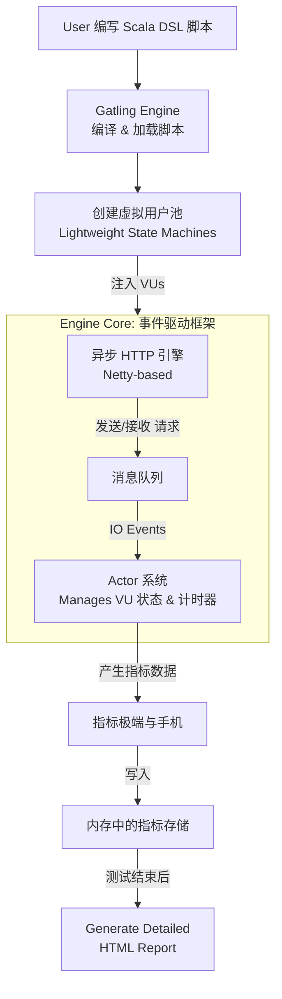

Gatling 的技术原理。它的高性能并非魔法，而是源于一系列精心选择的架构设计和编程模型。

Gatling 的高性能核心可以归结为：**异步编程模型 + 事件驱动架构 + 领域特定语言（DSL）**。其核心架构如下图所示，它清晰地展示了用户如何通过Scneario触发一系列异步事件，最终生成详尽的测试报告：



---

### 1. 异步与非阻塞 I/O (Asynchronous & Non-Blocking I/O)

这是 Gatling 与 JMeter 等线程阻塞工具最根本的区别。

*   **传统阻塞模型 (JMeter)**： 每个虚拟用户由一个独立的线程支持。当发送请求后，线程会**阻塞**（挂起），空等着响应返回。这导致线程资源在等待期间被浪费。模拟大量用户需要创建大量线程，而线程是操作系统级别的重量级资源，创建、销毁和上下文切换开销极大，很快会成为负载生成器本身的瓶颈。

*   **Gatling 的异步模型**： Gatling 基于 Netty 这样的高性能异步网络框架。
    *   它使用一个**小而固定的线程池**（通常只有几个线程，与CPU核心数相关）来处理**所有**虚拟用户的请求。
    *   当一个虚拟用户发送请求后，Gatling 将请求交给 Netty，然后**立即释放**该线程去处理其他用户的工作，**绝不会空等**。
    *   当响应返回时，Netty 会收到一个通知（事件），再从线程池中取一个空闲线程来执行回调函数（如检查断言、提取数据）。
    *   **优势**： 资源利用率极高。单台机器可以轻松模拟成千上万的用户，而不会将资源浪费在线程管理上，真正将压力施加给被测系统，而不是负载生成器本身。

### 2. 事件驱动架构 (Event-Driven Architecture)

异步模型是建立在事件驱动架构之上的。

*   Gatling 的引擎本质上是一个**事件循环**。整个测试被建模为一系列事件（如：`发送请求`、`等待响应`、`执行回调`、`等待一段时间（思考时间）`、`启动新用户`等）。
*   这些事件被放入一个队列中，由引擎的核心调度执行。
*   **虚拟用户（Virtual User）** 在 Gatling 中不是一个线程，而是一个**状态机**，由一个叫做 `Actor` 的轻量级实体管理。`Actor` 接收事件并改变其状态（例如，从“正在登录”变为“正在浏览主页”）。
*   这种设计使得管理数百万个虚拟用户的成本非常低，因为它们只是内存中的状态对象，而不是昂贵的线程。

### 3. 基于 Scala 的领域特定语言 (DSL)

Gatling 的测试脚本不是写在图形化界面里，而是用代码编写的。

*   **可维护性和版本控制**： 代码脚本可以像其他源代码一样被版本控制系统（如 Git）管理，方便协作、追溯历史和复用。
*   **强大的表达能力**： Scala 语言的函数式编程特性使得 Gatling 的 DSL 非常简洁和富有表现力。链式调用使得模拟复杂的用户流程变得非常直观。
    ```scala
    // 一个简单的DSL示例，清晰地表达了用户行为
    val scn = scenario("Basic Simulation")
      .exec(http("request_1") // 执行一个HTTP请求，命名为"request_1"
        .get("/") // GET 首页
        .check(status.is(200)) // 检查状态码是否为200
      )
      .pause(5) // 思考时间5秒
      .exec(http("request_2")
        .get("/page/1")
        .check(status.is(200), css("h1").is("Example Title")) // 强大的检查断言
      )
    ```
*   **编译时检查**： 脚本在运行前会被编译。许多错误（如语法错误、类型错误）在编译阶段就能被发现，而不是等到运行时才失败，提高了可靠性。

### 4. 高效的资源管理和指标收集

*   **低开销的指标收集**： 在测试运行过程中，Gatling 会以极低的开销收集每个请求的详细数据（响应时间、状态码等）。这些数据首先存储在内存中的高效数据结构中。
*   **事后报告生成**： Gatling **不提供**像 JMeter 那样的实时图形化界面，这是其**有意为之的设计选择**。实时UI渲染本身会消耗大量计算资源，影响测试的准确性和性能。
    *   取而代之的是，Gatling 将所有原始数据记录下来，在测试结束后**一次性**生成一个非常详细、静态的 HTML 报告。
    *   这份报告提供了极其丰富的图表和统计信息（百分位数、响应时间分布、活动用户数随时间变化等），足以进行深度的性能分析。

### 总结：Gatling 的高性能秘诀

| 技术原理           | 解决的问题                           | 带来的优势                                       |
| :----------------- | :----------------------------------- | :----------------------------------------------- |
| **异步非阻塞 I/O** | 线程资源消耗和上下文切换开销         | **单机超高并发**，资源利用率极高，测试结果更真实 |
| **事件驱动架构**   | 高效管理海量虚拟用户状态             | 用户模拟成本极低，系统扩展性强                   |
| **Scala DSL**      | 测试场景的灵活性、可维护性和表达能力 | 脚本强大、易于版本控制、编译时检查               |
| **事后报告**       | 实时UI的资源消耗                     | **最大化压测性能**，提供深度分析所需的详尽报告   |

总而言之，Gatling 的设计哲学是：**将负载生成器本身的资源开销降到最低，把所有计算能力都用于模拟用户请求，从而获得最真实、最高效的性能测试结果，并通过强大的事后分析报告来定位问题。** 这是一种为现代高性能需求而生的架构。