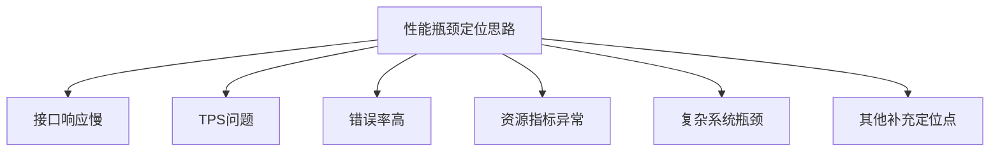
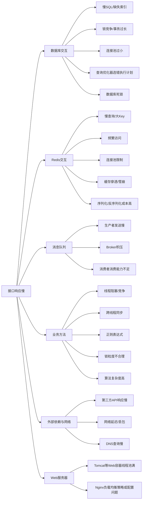
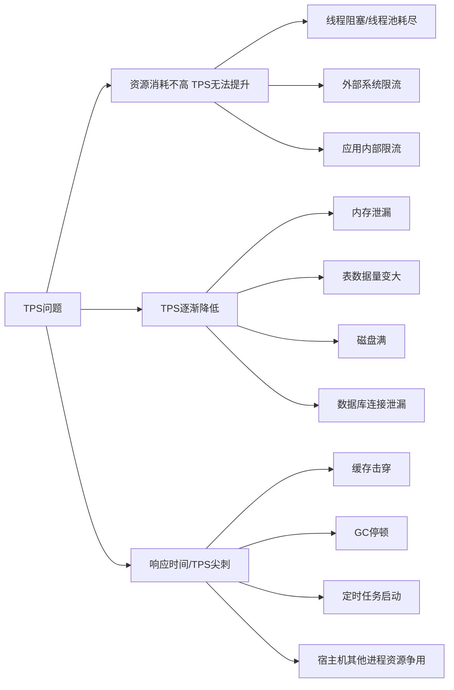
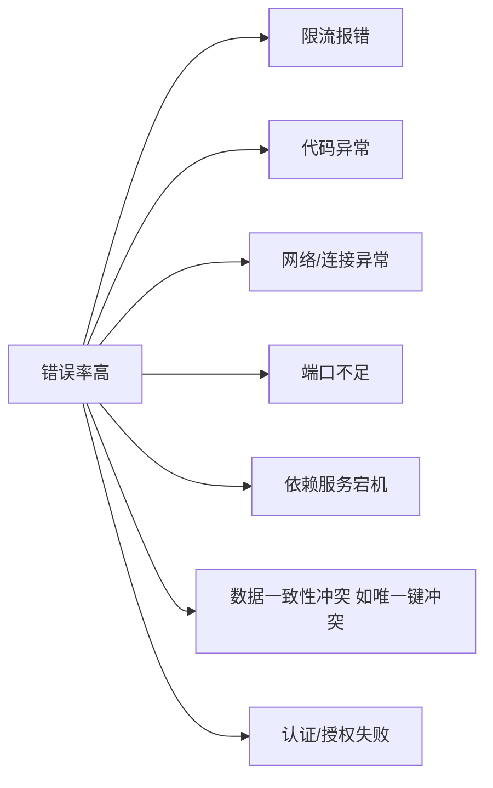
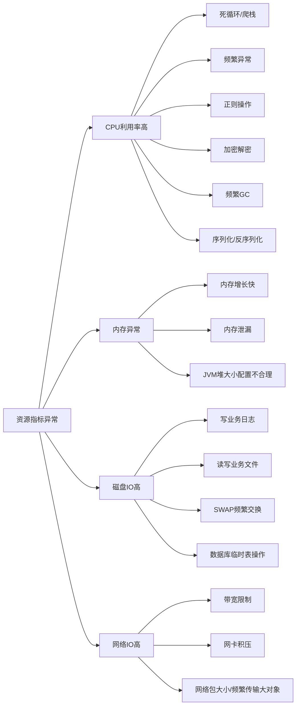
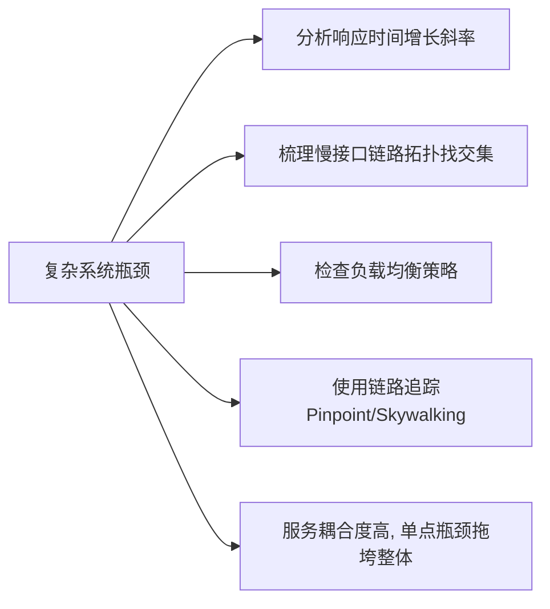
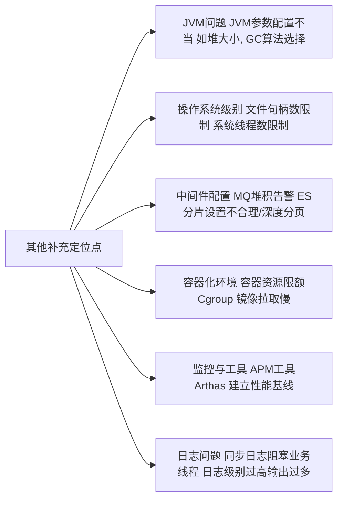

# 性能瓶颈排查思维导图

好的，我将把上面的全景思维导图拆分成一个总览图和六个详细的分支图。这样结构更清晰，也便于您分部分查看和理解。

### 1. 总览图 (性能瓶颈定位主要方向)

这个图展示了性能瓶颈定位的六个核心方向。

---

### 2. 分图一：接口响应慢

---

### 3. 分图二：TPS问题

---

### 4. 分图三：错误率高

---

### 5. 分图四：资源指标异常

---

### 6. 分图五：复杂系统瓶颈

---

### 7. 分图六：其他补充定位点

希望这7张分图能帮助您更清晰、更有针对性地进行性能瓶颈定位！每个分图都可以独立使用，专注于解决某一类特定的性能问题。