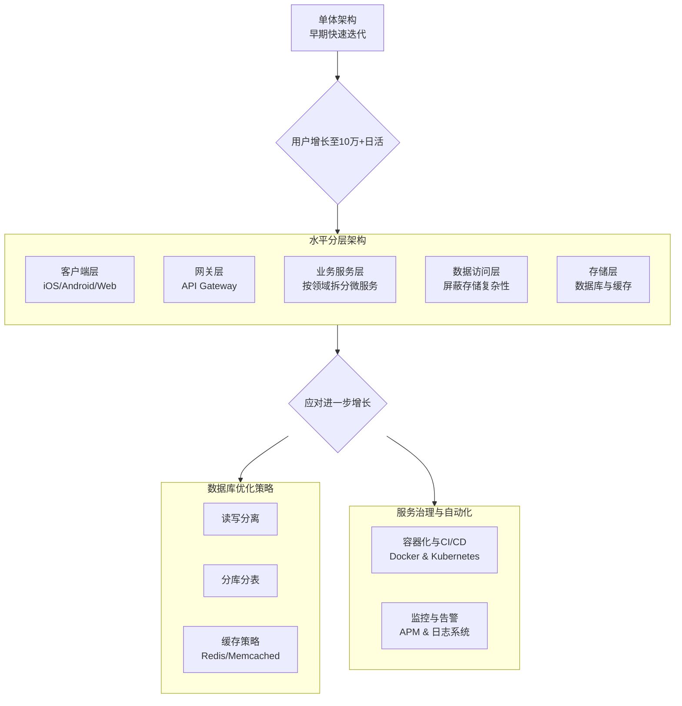

一个日活 10 万+ 的互联网应用，其架构设计需要在**性能、可扩展性、可靠性和开发效率**之间找到平衡。虽然我不能直接画出架构图，但可以为你详细描述一个典型且适合这个规模的应用架构核心组成和设计思路，并附上关键的考虑因素。

下图描绘了此类应用架构的一个典型演进过程，帮助你理解其整体脉络和核心组成部分：

上图展示了一个常见的演进路径。接下来，我们详细解读架构中各层次的关键技术和服务选型。

### 🧱 核心架构组件与技术选型

一个10万+日活的APP后台通常包含以下组件，具体的技术选型可根据团队熟悉度和业务特点调整：

| **层级**             | **核心职责**                                     | **常见技术与组件**                                           | **备注**                                                     |
| :------------------- | :----------------------------------------------- | :----------------------------------------------------------- | :----------------------------------------------------------- |
| **客户端**           | 用户交互，数据展示，部分逻辑处理                 | - **Android**: Kotlin/Java - **iOS**: Swift/Objective-C - **Web**: React/Vue/Angular - **跨平台**: Flutter/React Native (需谨慎评估性能) | 注重缓存策略、请求合并、懒加载，减轻服务器压力。             |
| **网关层**           | 流量入口、安全认证、限流熔断、路由转发、日志记录 | - **Nginx**/**OpenResty**: 高性能HTTP和反向代理服务器 - **Spring Cloud Gateway**: Java生态 - **Kong**: 基于OpenResty的API网关 - **Zuul** | 是系统的“门卫”，至关重要。                                   |
| **业务服务层**       | 处理具体业务逻辑，如用户、订单、消息、支付等     | - **Spring Boot**/**Spring Cloud**: Java生态标配，生态成熟 - **Dubbo**: 高性能RPC框架 - **gRPC**: HTTP/2, 高性能 - **Go**: 高并发场景表现优异 | 根据业务领域进行**微服务拆分**，例如用户服务、订单服务、商品服务等。 |
| **数据访问层**       | 简化业务层对数据的操作，屏蔽底层存储复杂性       | - **MyBatis**/**MyBatis-Plus**: 流行ORM - **JPA**: Java持久化API - **自研DAL组件**: 大型系统常见 | 对业务层提供统一的API，内部处理分库分表、缓存等细节。        |
| **存储层**           | 数据持久化                                       | - **关系数据库**: **MySQL**/PostgreSQL - **缓存**: **Redis** (主从/哨兵/集群) - **对象存储**: AWS S3/阿里云OSS - **搜索**: Elasticsearch | MySQL需做主从复制，Redis作为缓存和会话存储。                 |
| **中间件与支撑服务** | 提供通用能力，解耦服务                           | - **消息队列**: **Kafka**/RocketMQ/RabbitMQ (异步、削峰、解耦) - **配置中心**: Apollo, Nacos - **服务发现与注册**: Nacos, Consul, Eureka - **监控**: Prometheus, Grafana, ELK | 消息队列用于处理异步任务（如发送邮件、短信）和削峰填谷。监控系统至关重要。 |

### ⚙️ 架构设计关键考虑点

1.  **数据库设计**：
    *   **读写分离**：主数据库处理写操作，多个从数据库处理读操作，显著提升读性能。
    *   **分库分表**：当单表数据量巨大（如千万级）导致性能下降时，需考虑分库分表（Sharding），将数据分散到多个数据库或表中。常根据用户ID或业务ID进行哈希取模。
    *   **缓存策略**：使用 Redis 等缓存高频访问数据（如用户信息、热点内容），减轻数据库压力。常见策略有缓存穿透、击穿、雪崩的应对方案。

2.  **服务治理与自动化**：
    *   **容器化与编排**：使用 **Docker** 封装服务，**Kubernetes** 进行容器编排，实现自动化部署、伸缩和管理。
    *   **持续集成/持续部署**：搭建 Jenkins、GitLab CI 等自动化流程，快速安全地交付新功能。
    *   **监控与告警**：全面的监控（应用性能、基础设施、日志）和告警系统，是保障系统稳定的眼睛。

### 📊 10万+日活系统特性示例

| 方面              | 大致指标或描述                     | 备注                             |
| :---------------- | :--------------------------------- | :------------------------------- |
| **日均PV/请求量** | 数百万到数千万级别                 | 取决于用户粘性和业务类型         |
| **高峰期QPS**     | 数百到数千                         | 需要重点保障此时期的系统稳定性   |
| **数据量**        | 日增数据量可达数十GB级别           | 需规划好存储扩容和数据归档策略   |
| **服务器规模**    | 后端服务实例可能从几十到上百台不等 | 根据实际压力和微服务拆分粒度而定 |

### 💡 架构原则总结

对于10万+日活的应用，架构设计上通常会遵循以下原则：

*   **解耦与拆分**：通过微服务拆分、消息队列等手段，降低系统复杂性，提高独立开发和部署能力。
*   **弹性与可扩展**：利用云服务、容器化等技术，使系统能够根据流量压力方便地水平伸缩。
*   **自动化**：尽可能自动化（测试、部署、监控、恢复），提升效率与系统可靠性。
*   **持续演进**：架构并非一成不变，应随着业务发展和技术进步不断迭代优化。

希望这些信息能帮助你更好地理解10万+日活互联网应用的软件架构。如果你对某个具体的组件或方面特别感兴趣，我可以提供更详细的介绍。