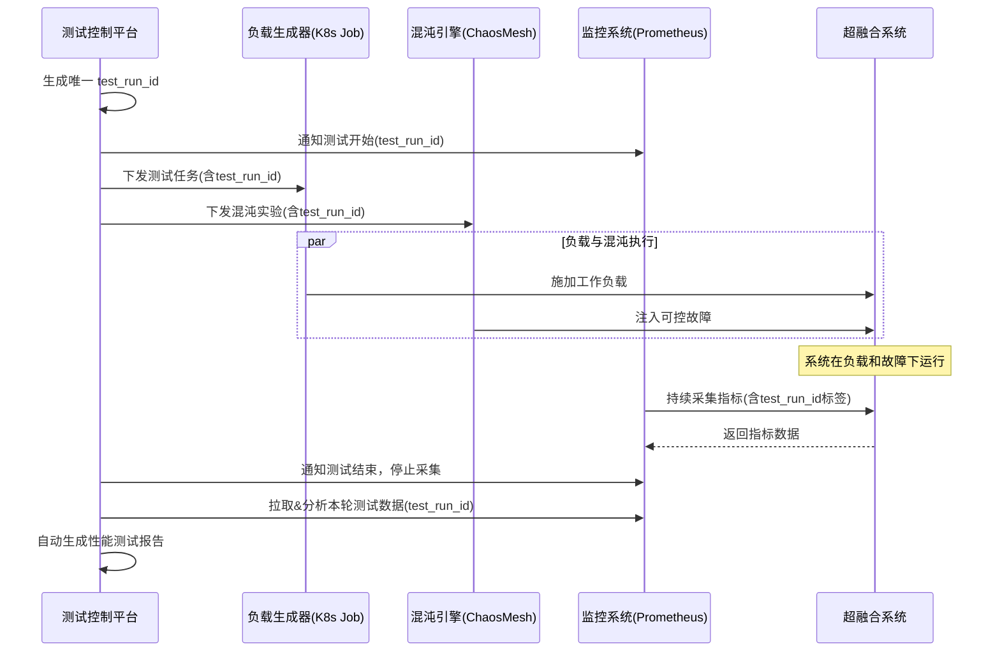

非常好的问题！您遇到的困境非常典型——许多复杂的私有云/超融合系统在设计之初并未充分考虑“可测试性”，导致后期性能评估、容量规划和故障排查极其困难。

您提出的思路完全正确：必须从**改造软件架构的可测试性**和**增强测试工具的能力**两方面入手。下面，我将结合超融合的业务与技术架构，为您提供一个系统性的改造方案。

---

### 一、超融合系统核心业务与架构分析（可测试性瓶颈根源）

**1. 业务目标：**
   *   将计算、存储、网络资源池化，并通过统一管理平台进行交付。
   *   实现资源的弹性伸缩、高可用和简化管理。

**2. 技术架构特点（也是可测试性的难点）：**
   *   **高度耦合：** 计算虚拟化（如基于 KVM）、分布式存储（如 Ceph, vSAN）、网络虚拟化（SDN）紧密集成，一个组件的性能波动会直接影响其他组件。难以隔离出单一组件进行测试。
   *   **状态复杂：** 系统有大量状态（如存储副本同步状态、网络流表状态、虚拟机迁移状态），性能测试时需要准确捕捉和关联这些状态。
   *   **资源争抢：** 所有租户共享底层物理资源（CPU、内存、NVMe SSD、网络带宽），测试时如何模拟真实、嘈杂的“邻居噪音”是一大挑战。
   *   **黑盒性：** 许多内部指标（如 Ceph OSD 的内部队列深度、网络虚拟交换机的丢包率）默认不暴露，或者暴露得不全面，使得性能瓶颈无法定位。

**3. 当前不可测试性的典型表现：**
   *   **无法构造可控的负载：** 只能启动一堆虚拟机，但无法精确控制这些虚拟机对磁盘 I/O 的模式（随机/顺序、读写比例、IO 大小）、网络流量模式。
   *   **无法有效隔离变量：** 测试存储性能时，计算和网络的干扰无法排除，反之亦然。
   *   **监控数据缺失与割裂：** 管理平台看到的监控指标是粗粒度的（如整个主机的 CPU 利用率），而分布式存储有自己的一套监控，网络又有另一套。数据在时间和空间上无法对齐，导致无法进行根因分析。
   *   **无法模拟故障：** 想测试“一个存储节点宕机对整体性能的影响”或“网络延迟增大后系统的表现”，缺乏安全、可控的手段来模拟这类故障。

---

### 二、改造方案：构建可测试的超融合架构与基础设施

改造的核心思想是：**“白盒化”** 和 **“可观测性”**，并通过 **“自动化控制”** 来实现可重复、可分析的测试。

#### （一） 改造软件架构的可测试性

目标：让超融合平台本身暴露更多的内部状态，并提供控制接口。

| 架构层级                | 改造措施                                                     | 具体技术方案示例                                             |
| :---------------------- | :----------------------------------------------------------- | :----------------------------------------------------------- |
| **1. 统一可观测性框架** | **在所有组件中集成指标导出功能**，并统一使用 Prometheus 格式暴露指标。 | - **计算层:** 在 Libvirt 中配置，导出每个虚机的详细 CPU 调度延迟、内存 ballooning 等指标。 - **存储层:** 深度暴露 Ceph 指标，不仅是 OSD 的吞吐量和延迟，还包括 RocksDB 的 Compaction 压力、网络连接的异常状态等。 - **网络层:** 在 OVS 上部署 `ovs-metrics-exporter`，导出流表数量、丢包计数、端口流量等精细指标。 |
| **2. 解耦与接口化**     | **为测试目的创建专用 API 和控制面**。                        | - 开发一个 **“测试模式”API**。例如：   - `POST /api/test/inject_storage_latency?node=node1&latency_ms=50`：向特定存储节点注入延迟。   - `POST /api/test/failover_network_link?switch=tor1&port=eth0`：模拟网络链路故障。   - `GET /api/test/current_performance_indicators`：获取当前测试相关的核心指标。 |
| **3. 资源隔离与调度**   | **为测试负载创建独立的资源池或打上标签**。                   | - 利用 Kubernetes 或 OpenStack 的 **标签和亲和性规则**，将测试负载（基准测试工具、混沌工程工具）调度到特定的物理机上，避免污染生产业务资源池。 |
| **4. 数据模型标准化**   | **定义统一的性能测试元数据模型**。                           | - 设计一个 JSON Schema，描述一次性能测试的**所有参数**：   - 工作负载定义（e.g., FIO 参数、Netperf 参数）   - 系统状态（e.g., 副本数、缓存策略）   - 环境干扰（e.g., 背景流量、模拟的故障）   - 这样每次测试都能被完整地记录和复现。 |

#### （二） 增强测试工具的可测试性

目标：打造一套能够精准控制、采集和分析的自动化测试平台。

| 组件              | 改造措施                     | 具体技术方案示例                                             |
| :---------------- | :--------------------------- | :----------------------------------------------------------- |
| **1. 负载生成器** | **容器化、代码化负载定义**。 | - 将 **FIO** (存储)、**Stress-NG** (CPU/Memory)、**Netperf/Iperf3** (网络) 等工具封装在 Docker 镜像中。 - 使用 **Kubernetes Jobs** 或 **Argo Workflows** 来定义和发起测试。负载的参数通过环境变量传递，实现“负载即代码”。   |
| **2. 混沌工程注入器** | **集成混沌实验工具，实现可控破坏**。 | - 部署 **LitmusChaos** 或 **Chaos Mesh**。 - 通过编写 Chaos Experiments CRD，安全地模拟超融合环境中的故障，如：   - 杀进程（e.g., 随机杀死 Ceph OSD 进程）   - 网络攻击（e.g., 模拟网络延迟、丢包、分区）   - 节点压力（e.g., CPU 夯住、IO 夯住） |
| **3. 监控与数据采集器** | **自动化、全链路数据抓取**。 | - 部署 **Prometheus** + **Grafana**。 - 测试开始时，自动开始高频抓取（如 5s 间隔）所有暴露的指标。 - 同时采集系统日志（通过 Loki）和分布式追踪数据（如需）。 - **关键：** 为每次测试运行生成一个唯一的 `test_run_id`，并将其作为标签添加到所有相关的指标和日志中，便于后续关联分析。 |
| **4. 分析自动化平台** | **建立性能分析流水线**。 | - 开发或利用工具，自动对比两次测试的结果。 - 平台应能自动生成报告，回答关键问题：   - 本次测试相较于基线，P99 延迟是上升还是下降？   - 当注入网络延迟时，存储的 IOPS 是如何变化的？   - 瓶颈在哪里？（通过关联分析计算、存储、网络指标） |

---

### 三、可执行的整体工作流

一次完整的性能测试将按以下流程进行，整个过程由自动化工具驱动，并围绕一个统一的`test_run_id`集成所有环节：

1.  **计划：** 在平台上选择要测试的场景（如：模拟数据库负载 + 存储节点故障）。
2.  **执行：** 平台生成 `test_run_id`，并并行执行：
    *   启动 Kubernetes Job，在特定节点上运行 FIO 和 Sysbench。
    *   调用 Chaos Mesh API，执行杀死 Ceph OSD 的实验。
    *   通知 Prometheus 开始高频抓取。
3.  **采集：** 所有组件（超融合系统、负载生成器）产生的指标和日志都自动带上 `test_run_id` 标签。
4.  **分析：** 测试结束后，平台自动从 Prometheus 提取本次运行的所有数据，与历史基线进行对比，并通过 Grafana 生成可视化报告，自动标记出性能异常点。
5.  **反馈：** 报告直接关联到本次测试的代码变更（如镜像版本、配置参数），形成闭环。

### 总结

对私有云/超融合进行性能测试的改造，是一项**系统性工程**，其本质是提升系统的**可观测性和可控性**。

*   **短期来看**，你需要先从搭建统一的监控（Prometheus）和容器化的负载生成器做起，解决“看得见”和“测得准”的问题。
*   **中期来看**，需要推动平台团队合作，逐步暴露更多内部指标，并开发简单的测试API，实现“可控”。
*   **长期来看**，目标是建成一个完全自动化、覆盖全场景、能够快速定位瓶颈的**性能工程平台**，从而为系统的稳定性、扩容和选型提供坚实的数据支撑。

这个改造过程虽然投入不小，但回报极高，它能将性能测试从一个“碰运气”的手工活动，转变为一个可靠的、数据驱动的工程实践。