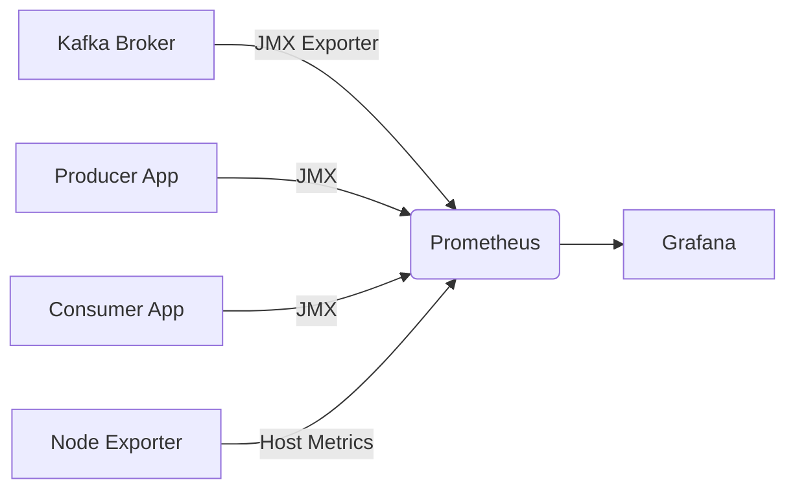
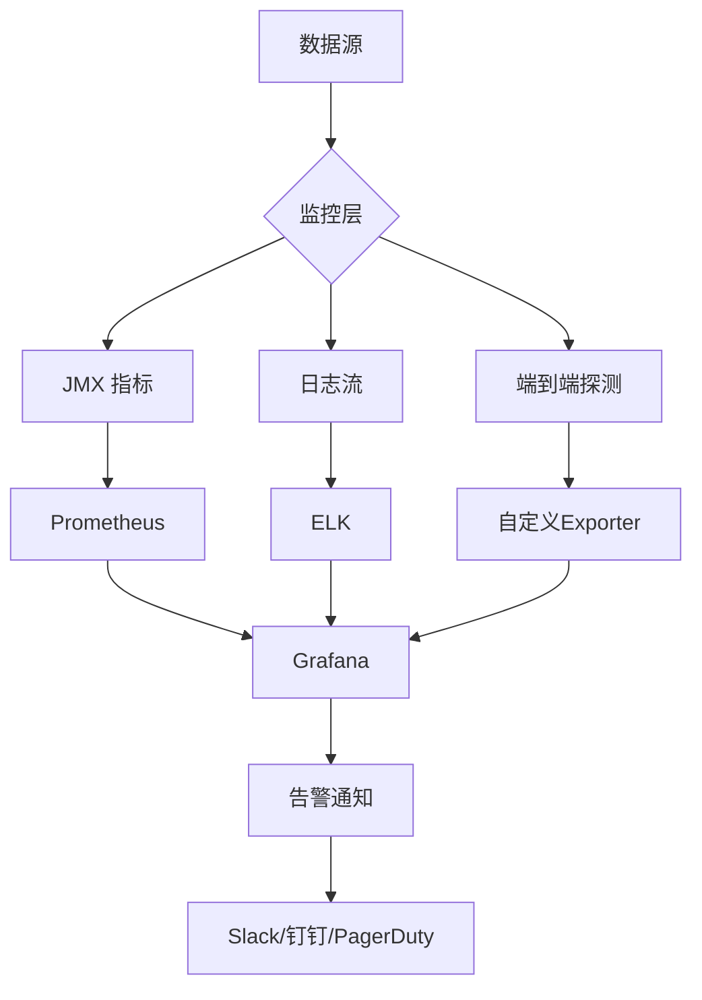

以下是 Kafka 性能监控的完整方案，涵盖**核心监控指标、工具选型、告警策略**及**实战示例**，帮助您构建全方位监控体系：

---

### 一、监控核心维度
#### 1. **集群基础健康**
| **指标**                    | 说明           | 报警阈值      |
| --------------------------- | -------------- | ------------- |
| `ActiveControllerCount`     | 集群控制器状态 | ≠1 (立即报警) |
| `OfflinePartitionsCount`    | 不可用分区数量 | >0 (紧急)     |
| `UnderReplicatedPartitions` | 未同步副本数   | >0 持续5分钟  |

#### 2. **Broker 性能**
| **指标**             | 说明                             | 关键参数     |
| -------------------- | -------------------------------- | ------------ |
| `RequestQueueTimeMs` | 请求队列延迟                     | P99 > 100ms  |
| `LocalTimeMs`        | 本地处理耗时                     | P95 > 50ms   |
| `PurgatorySize`      | 等待队列积压 (Producer/Consumer) | >1000        |
| **磁盘 I/O**         | `Disk Read/Write Latency`        | >200ms (SSD) |

#### 3. **生产端监控**
```bash
# Producer Metrics (重点)
kafka.producer:type=producer-metrics,client-id=([\w\-]+)
  - record-send-rate       # 发送速率
  - record-error-rate      # 错误率
  - request-latency-avg    # 请求延迟
  - batch-size-avg         # 批次大小
```

#### 4. **消费端监控**
```bash
# Consumer Metrics
kafka.consumer:type=consumer-fetch-manager-metrics,client-id=([\w\-]+)
  - records-lag-max        # 最大滞后消息数 (关键!)
  - records-consumed-rate  # 消费速率
  - fetch-latency-avg      # 拉取延迟
```

#### 5. **JVM 与 OS**
| **类型** | 监控项      | 阈值            |
| -------- | ----------- | --------------- |
| **JVM**  | GC 停顿时间 | >1s (Full GC)   |
|          | Heap 使用率 | >70% 持续10分钟 |
| **OS**   | CPU 使用率  | >80% 持续5分钟  |
|          | 磁盘空间    | <20% 剩余空间   |
|          | TCP 重传率  | >5%             |

---

### 二、监控工具选型对比
| **工具**                     | 特点                   | 适用场景         |
| ---------------------------- | ---------------------- | ---------------- |
| **Prometheus + Grafana**     | 开源生态完善，灵活定制 | 生产环境首选     |
| **Confluent Control Center** | 官方商业工具，开箱即用 | 预算充足的团队   |
| **Kafka Eagle**              | 国产开源，中文界面     | 中小集群可视化   |
| **Burrow**                   | 专注 Consumer Lag 监控 | 消费延迟敏感场景 |
| **ELK Stack**                | 日志聚合分析           | 审计与异常排查   |

---

### 三、部署 Prometheus + Grafana 监控栈
#### 1. 数据采集架构


#### 2. 关键配置步骤
**Step 1：启用 Kafka JMX 导出**
```bash
# 在 kafka-server-start.sh 添加
export KAFKA_JMX_OPTS="-Dcom.sun.management.jmxremote -Dcom.sun.management.jmxremote.port=9999"
```

**Step 2：部署 JMX Exporter**
```yaml
# jmx_exporter.yml
rules:
- pattern: "kafka.<type=.*><>([\w\-]+)"
  name: "kafka_$1"
```

**Step 3：Prometheus 抓取配置**
```yaml
scrape_configs:
  - job_name: 'kafka_broker'
    static_configs:
      - targets: ['broker1:9999', 'broker2:9999']
  - job_name: 'kafka_consumer'
    static_configs:
      - targets: ['consumer-app:9999']
```

#### 3. Grafana 看板示例
[](https://grafana.com/grafana/dashboards/7589)  
推荐看板：[Confluent Kafka Dashboard](https://grafana.com/grafana/dashboards/7589) (ID: 7589)

---

### 四、关键告警规则（Prometheus Alertmanager）
#### 1. 集群级告警
```yaml
# 控制器丢失
- alert: KafkaControllerDown
  expr: sum(kafka_controller_kafkacontroller_activecontrollercount) < 1
  for: 1m

# 分区不可用
- alert: OfflinePartitions
  expr: kafka_controller_kafkacontroller_offlinepartitionscount > 0
```

#### 2. Broker 性能告警
```yaml
# 请求积压
- alert: HighRequestQueue
  expr: avg by(instance) (kafka_network_requestqueue_size) > 1000
  
# 磁盘高延迟
- alert: HighDiskLatency
  expr: rate(node_disk_read_time_seconds_total[1m]) > 0.2
```

#### 3. 消费延迟告警
```yaml
# 消费者滞后
- alert: ConsumerLagCritical
  expr: max by(group, topic) (kafka_consumergroup_lag) > 100000
  labels:
    severity: critical
```

---

### 五、高级监控技巧
#### 1. **端到端延迟监控**
```python
# Producer 发送时注入时间戳
producer.send(topic, value=msg, timestamp_ms=int(time.time()*1000))

# Consumer 计算延迟
consumer_lag = current_time - message.timestamp
```

#### 2. **Topic 分区热点检测**
```sql
-- 查询写入不均衡的分区
SELECT topic, partition, SUM(records) 
FROM kafka_producer_topic_metrics
GROUP BY topic, partition 
ORDER BY variance DESC;
```

#### 3. **ZooKeeper/KRaft 监控**
| **指标**                    | 重要性                 |
| --------------------------- | ---------------------- |
| `zk_request_latency`        | >50ms 影响控制器选举   |
| `kafka_raft_leader_changes` | 频繁切换说明集群不稳定 |

---

### 六、故障排查工具箱
| **命令**                           | 用途                   |
| ---------------------------------- | ---------------------- |
| `kafka-topics --describe`          | 检查分区分布和副本状态 |
| `kafka-consumer-groups --describe` | 查看消费组延迟 (Lag)   |
| `kafka-dump-log --files 0000.log`  | 解析日志文件内容       |
| `jstat -gcutil <pid> 5s`           | 实时监控 JVM GC        |

---

### 总结：监控体系全景图


**黄金实践原则**：  
1. **先覆盖核心指标**：Broker存活、分区健康、消费延迟  
2. **分层设置阈值**：Warning/Critical 分级告警  
3. **关联分析**：将 Kafka 指标与应用业务指标（如订单处理延迟）关联  
4. **定期演练**：模拟 Broker 宕机，验证告警链路和应急流程