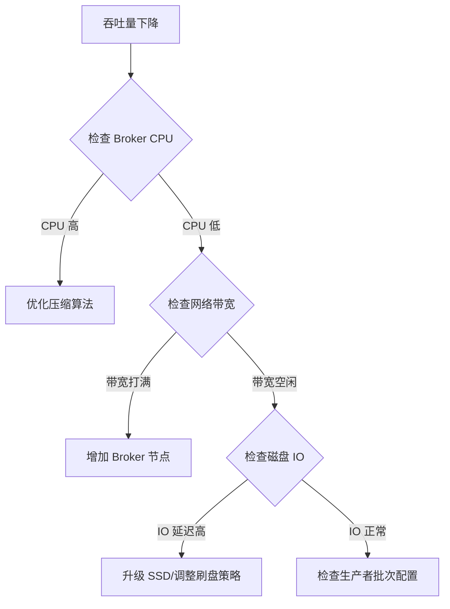

以下是针对 Kafka 性能优化的系统性方案，结合关键配置、架构设计和运维实践，分为 **Producer、Broker、Consumer、系统层** 四个维度，附带场景化配置建议：

---

### 一、生产者（Producer）优化
| **目标**     | **优化手段**                  | **配置参数**                                                 | **原理说明**                                                 |
| ------------ | ----------------------------- | ------------------------------------------------------------ | ------------------------------------------------------------ |
| **提高吞吐** | 增大批次大小 + 启用压缩       | `batch.size=1-10MB`<br>`compression.type=lz4/zstd`           | 减少网络请求次数，压缩降低传输体积（Zstd 压缩率比 LZ4 高 10%~20%） |
| **减少延迟** | 缩短批次等待时间              | `linger.ms=5-100`                                            | 避免消息在内存中积压过久                                     |
| **容错能力** | 优化 ACK 机制 + 重试策略      | `acks=1` (均衡)<br>`retries=5`<br>`delivery.timeout.ms=120000` | `acks=0`(最快) / `acks=all`(最可靠) 按需选择                 |
| **并行发送** | 多 Producer 实例 + 分区键优化 | 代码层面实现                                                 | 相同 Key 的消息路由到同一分区，避免热点分区                  |

> ✅ **场景建议**：日志采集场景用 `acks=0` + LZ4 压缩；支付交易用 `acks=all` + Zstd 压缩。

---

### 二、Broker 优化
#### 1. 磁盘与 I/O
| **优化方向** | **具体操作**                                        |
| ------------ | --------------------------------------------------- |
| **磁盘选择** | 使用 SSD（尤其 Tiered Storage 场景）                |
| **挂载参数** | 添加 `noatime,nodiratime` 减少元数据写入            |
| **日志分段** | 增大段文件：`log.segment.bytes=1GB` (默认 1GB)      |
| **刷盘策略** | 异步刷盘：`flush.messages=10000`<br>`flush.ms=1000` |

#### 2. 内存优化
```bash
# 利用 Page Cache（推荐方案）
预留 50% 内存给 OS Page Cache
# 避免 swap
vm.swappiness=1
```

#### 3. 副本与 ISR
| **参数**                         | **推荐值**        | **作用**                    |
| -------------------------------- | ----------------- | --------------------------- |
| `unclean.leader.election.enable` | `false`           | 禁止脏选举，保证数据一致性  |
| `min.insync.replicas`            | `2` (副本数为3时) | 定义最小同步副本数          |
| `replica.lag.time.max.ms`        | `30000`           | 控制 Follower 是否在 ISR 中 |

---

### 三、消费者（Consumer）优化
| **问题**           | **优化方案**                   | **配置参数**                                               |
| ------------------ | ------------------------------ | ---------------------------------------------------------- |
| **消费延迟高**     | 增加拉取批次大小 + 多线程消费  | `fetch.min.bytes=1048576` (1MB)<br>`max.poll.records=1000` |
| **Rebalance 频繁** | 避免超时 + 控制心跳间隔        | `session.timeout.ms=25000`<br>`heartbeat.interval.ms=8000` |
| **分区分配不均**   | 保证 **分区数 ≥ 消费者线程数** | 调整 `num.partitions`                                      |
| **重复消费**       | 关闭自动提交 + 异步提交        | `enable.auto.commit=false`                                 |

> ⚠️ **关键点**：单分区消费速度有限，提升并行度必须增加分区数！

---

### 四、系统层调优
#### 1. Linux 网络优化
```bash
# 增大 Socket 缓冲区
net.core.wmem_default=16777216 
net.core.rmem_default=16777216
net.ipv4.tcp_window_scaling=1

# 提升连接复用
net.ipv4.tcp_tw_reuse=1
net.ipv4.tcp_fin_timeout=30
```

#### 2. JVM 优化
```bash
# 使用 G1 垃圾回收器
KAFKA_JVM_PERFORMANCE_OPTS="
  -server 
  -XX:+UseG1GC 
  -XX:MaxGCPauseMillis=200
  -XX:InitiatingHeapOccupancyPercent=35
"
```

#### 3. 集群规划原则
| **资源**             | **推荐规格**                         | **上限参考**                |
| -------------------- | ------------------------------------ | --------------------------- |
| **单 Broker 分区数** | ≤ 4000 分区                          | 受 ZooKeeper/KRaft 性能限制 |
| **磁盘**             | 多块盘做 JBOD（非 RAID）             | 独立磁盘提升并行 I/O        |
| **Topic 分区数**     | 满足 `峰值吞吐/单分区吞吐` 的 1.5 倍 | 单分区吞吐约 10-100 MB/s    |

---

### 五、监控与瓶颈定位
#### 关键监控指标
| **组件** | **核心指标**                                      | **工具**                   |
| -------- | ------------------------------------------------- | -------------------------- |
| Producer | `request-latency-avg`, `record-error-rate`        | Kafka Metrics + Prometheus |
| Broker   | `UnderReplicatedPartitions`, `RequestQueueTimeMs` | JConsole + Grafana         |
| Consumer | `records-lag-max`, `fetch-rate`                   | Burrow + Kafka Eagle       |

#### 性能瓶颈排查流程


---

### 六、场景化配置模板
#### 高吞吐日志采集（每秒 50W+ 消息）
```properties
# Producer
batch.size=5242880  // 5MB
compression.type=lz4
linger.ms=50
acks=0

# Broker
num.network.threads=8
num.io.threads=32
log.flush.interval.messages=100000

# Consumer
fetch.min.bytes=1048576
max.poll.records=2000
```

#### 金融级低延迟交易（P99 < 100ms）
```properties
# Producer
batch.size=16384   // 16KB
linger.ms=0        // 立即发送
acks=all
enable.idempotence=true

# Broker
min.insync.replicas=2
unclean.leader.election.enable=false

# Consumer
fetch.min.bytes=1  // 有数据立即拉取
max.poll.records=100
```

---

### 总结：优化效果对比
| **优化项**        | **默认值** | **优化后**     | **吞吐提升** | **延迟降低** |
| ----------------- | ---------- | -------------- | ------------ | ------------ |
| 生产者批量        | 16KB       | 5MB + LZ4      | 3-5x         | -            |
| 消费线程数        | 1 thread   | 分区数等量线程 | 线性增长     | 5-10x        |
| Page Cache 利用率 | 未规划     | 预留 50% 内存  | 2x           | 10x          |
| 分区数设计        | 单分区     | 按吞吐需求计算 | 水平扩展     | 避免积压     |

> **黄金法则**：  
> **吞吐优先 → 增大批次/压缩数据/增加分区**  
> **延迟优先 → 减少批次/零延迟发送/小包拉取**  
> **可靠优先 → acks=all/ISR≥2/禁用脏选举**