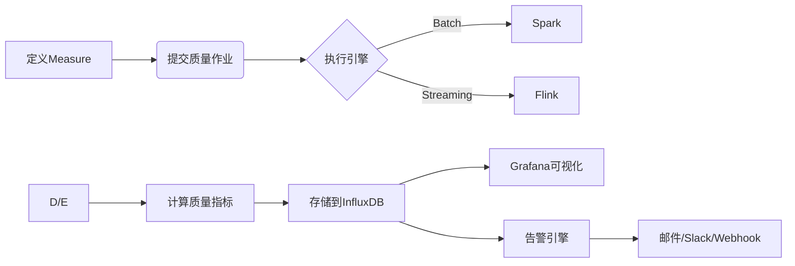

**Apache Griffin** 是一个开源的**分布式大数据数据质量解决方案**，专注于在**批处理和实时流处理**场景下提供**端到端的数据质量监控、度量与验证**。它诞生于eBay，后捐赠给Apache基金会，现为Apache顶级项目。Griffin的核心目标是帮助企业在复杂的大数据生态中（如Hadoop、Spark、Kafka、Flink等）建立统一、自动化、可扩展的数据质量保障体系。

---

### **核心设计理念与特点**
1. **“Define Once, Run Anywhere”**  
   用户通过统一方式定义数据质量规则（称为**`Measure`**），Griffin自动适配不同执行引擎（Spark、Flink）进行计算。
2. **多引擎支持**  
   原生集成 **Spark**（批处理）、**Flink**（流处理），未来计划支持更多引擎。
3. **全链路质量指标**  
   支持从**准确性、完整性、及时性、唯一性、一致性、有效性**等多维度定义质量规则。
4. **流批一体监控**  
   统一框架处理批处理数据（Hive/HDFS）和实时数据流（Kafka/Pulsar）。
5. **预置质量模型**  
   提供开箱即用的通用质量指标计算模型（如精确度、重复率），减少重复开发。
6. **可扩展架构**  
   模块化设计，支持自定义数据源、计算引擎、存储后端和告警渠道。

---

### **核心组件与工作流程**
#### 1. **数据质量定义层**
- **`Measure`（度量）**  
  数据质量规则的核心抽象，包含：
  - **`Source`**：待校验的数据源（如Hive表、Kafka Topic）。
  - **`Target`**：参考数据源（用于对比准确性）。
  - **`Rule`**：质量规则（如字段匹配率、行数差异阈值）。
- **示例规则类型**：
  ```json
  {
    "name": "accuracy_user_age",
    "type": "Accuracy", // 精确度检查
    "source": "hive_db.user_profile",
    "target": "mysql_db.master_user",
    "keys": ["user_id"],  // 关联键
    "rules": ["age: match_rate > 0.98"] // 年龄字段匹配率需>98%
  }
  ```

#### 2. **计算引擎层**
- **批处理模式**：使用Spark SQL/DataFrame计算质量指标。
- **流处理模式**：通过Flink Stateful Processing实时校验数据流。
- **自动优化**：引擎根据数据量动态选择采样或全量计算。

#### 3. **指标存储与聚合**
- **时序数据库**：计算结果存储到**InfluxDB**或**Prometheus**（用于趋势分析）。
- **聚合层**：按业务维度（部门/数据域）聚合质量得分。

#### 4. **监控与告警**
- **可视化看板**：集成Grafana展示质量趋势、规则通过率。
- **动态告警**：基于预定义阈值触发邮件、Slack、PagerDuty通知。
- **智能基线**：自动学习历史数据波动范围，减少误报。

#### 5. **元数据管理**
- **Data Asset Registry**：记录数据源的血缘关系和业务归属。
- **Impact Analysis**：当某表质量失败时，自动定位受影响下游任务。

---

### **典型工作流程**


---

### **核心优势**
| 维度             | 说明                                                |
| ---------------- | --------------------------------------------------- |
| **规模化能力**   | 基于Spark/Flink支持PB级数据校验                     |
| **流批统一**     | 同一套API处理历史数据和实时流                       |
| **智能基线告警** | 动态学习数据分布，降低静态阈值误报率                |
| **多租户支持**   | 按项目/团队隔离质量规则和资源                       |
| **集成成本低**   | 原生兼容Hadoop生态（Hive/HDFS/Kafka），无需数据迁移 |

---

### **与同类工具对比**
| 特性             | Griffin      | Deequ         | Great Expectations |
| ---------------- | ------------ | ------------- | ------------------ |
| **流处理支持**   | ✅ Flink原生  | ❌ 仅批处理    | 🔶 有限（通过插件） |
| **执行引擎**     | Spark/Flink  | Spark         | Python/Pandas      |
| **部署复杂度**   | 中（需集群） | 中（需Spark） | 低（单机）         |
| **实时监控能力** | ✅ 秒级延迟   | ❌ 分钟级      | 🔶 依赖调度         |
| **预置质量模型** | 丰富         | 基础统计指标  | 自定义为主         |
| **适用场景**     | 企业级数据湖 | Spark ETL管道 | 中小规模数据集     |

---

### **适用场景**
1. **数据仓库入湖校验**  
   验证从业务系统同步到Hive/Kudu的数据完整性。
2. **实时数仓质量监控**  
   监控Kafka到Flink实时ETL链路的延迟与一致性。
3. **跨系统数据一致性**  
   比对数仓（Hive）与业务库（MySQL）的关键指标差异。
4. **机器学习数据质检**  
   在特征工程阶段拦截异常分布的特征列。
5. **数据资产健康分**  
   构建企业级数据质量评分体系（如：完整性30% + 及时性30% + 准确性40%）。

---

### **局限性**
1. **学习曲线陡峭**  
   需熟悉大数据栈（Hadoop/Spark/Flink）和JSON/YAML配置。
2. **社区生态较小**  
   插件市场不如Great Expectations活跃（如缺少Snowflake原生连接器）。
3. **UI功能待完善**  
   规则管理界面较简陋，高级用户更依赖API。
4. **无内置数据探查**  
   需配合Apache Atlas或DataHub管理元数据血缘。

---

### **企业实践案例**
- **eBay**：监控超10PB数据仓库，日均校验20万+质量规则。
- **小米**：用于IoT设备数据上报的实时质量拦截，延迟<5秒。
- **中国联通**：建立省分公司数据质量排名体系，驱动治理闭环。

---

### **总结**
**Apache Griffin是企业级大数据质量监控的“重型武器”**，尤其适合需要同时满足以下条件的场景：
- ✅ 数据规模达到 **TB/PB级**
- ✅ 存在 **批处理+流处理** 混合架构
- ✅ 需构建 **公司级统一** 质量平台
- ✅ 技术栈以 **Hadoop/Spark/Flink** 为核心

对于追求**开箱即用**或主要处理**中小规模数据**的团队，Great Expectations或dbt可能是更轻量的选择。但若面临**超大规模数据质量治理**挑战，Griffin的分布式能力与流批一体设计将提供不可替代的价值。