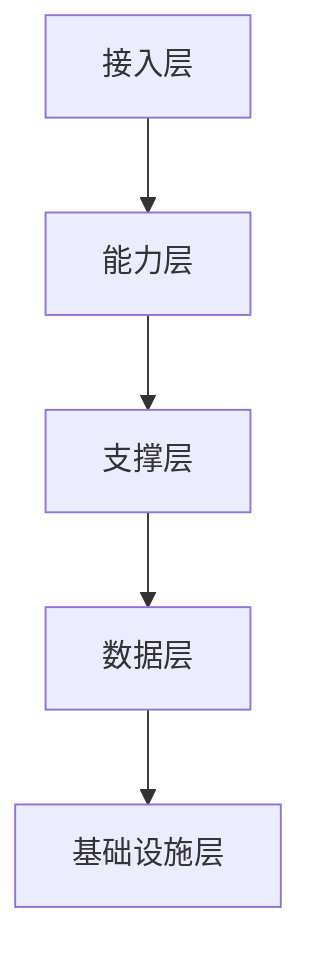
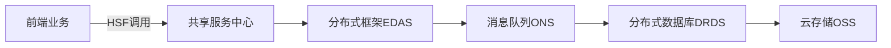

中台的技术架构是支撑业务能力复用的核心基础设施，其本质是通过**分布式、服务化、平台化**实现业务能力的解耦与复用。以下是主流中台技术架构的核心层次及关键技术组件：

---

### 一、中台技术架构全景图（分层模型）


---

### 二、核心层次详解
#### 1. **接入层（API Gateway）**
   - **功能**：统一流量入口，安全管控
   - **关键技术**：
     - **API网关**：Kong, Apigee, Spring Cloud Gateway
     - **认证鉴权**：OAuth2.0, JWT, OpenID Connect
     - **限流熔断**：Sentinel, Hystrix
   - **示例场景**：  
     电商中台通过网关路由：  
     `/member/**` → 会员中心  
     `/order/**` → 订单中心

#### 2. **能力层（微服务集群）**
   - **核心架构**：领域驱动设计（DDD）划分业务域
   - **技术栈**：
     | 业务中台模块 | 技术实现                         |
     | ------------ | -------------------------------- |
     | 用户中心     | Spring Boot + OAuth2 + Redis     |
     | 订单中心     | Spring Cloud + Seata(分布式事务) |
     | 支付中心     | 对接支付宝/微信SDK + 幂等设计    |
     | 库存中心     | Redis分布式锁 + 分库分表         |
   - **关键特性**：
     - **服务注册发现**：Nacos, Consul, Eureka
     - **配置中心**：Apollo, Nacos Config
     - **服务治理**：Dubbo, gRPC

#### 3. **支撑层（PaaS能力）**
   - **核心组件**：
     ```mermaid
     graph LR
         A[DevOps平台] -->|持续部署| B[容器云]
         C[监控中心] -->|链路追踪| D[日志系统]
         E[消息队列] -->|解耦| F[服务治理]
     ```
   - **关键技术**：
     - **容器化**：Docker + Kubernetes（Pod自动伸缩）
     - **中间件**：
       - 消息队列：Kafka, RocketMQ（削峰填谷）
       - 缓存：Redis Cluster（热点数据缓存）
       - 任务调度：XXL-JOB, ElasticJob
     - **可观测性**：
       - 日志：ELK(Elasticsearch+Logstash+Kibana)
       - 监控：Prometheus + Grafana
       - 链路追踪：SkyWalking, Jaeger

#### 4. **数据层（统一数据服务）**
   - **架构特点**：读写分离 + 多级缓存
   - **技术方案**：
     ```mermaid
     graph TB
         A[业务数据库] -->|CDC同步| B[数据仓库]
         B --> C[统一数据服务]
         C --> D[BI报表]
         C --> E[实时风控]
     ```
   - **核心技术**：
     - **数据同步**：Canal, Debezium
     - **OLAP引擎**：ClickHouse, Doris
     - **数据服务化**：GraphQL, Apache Calcite

#### 5. **基础设施层（IaaS）**
   - **部署模式**：
     - 私有云：OpenStack + Ceph
     - 混合云：AWS/Azure + 本地IDC
     - 公有云：阿里云ACK, AWS EKS
   - **资源调度**：Kubernetes + Service Mesh（Istio）

---

### 三、典型技术架构案例
#### 阿里业务中台架构


#### 关键技术创新：
1. **单元化部署**：  
   通过「逻辑单元（LDC）」实现异地多活，单单元故障不影响全局
2. **柔性事务**：  
   使用TCC模式（Try-Confirm-Cancel）保证跨服务事务一致性
3. **热点数据处理**：  
   采用「分桶策略」解决秒杀场景库存竞争问题

---

### 四、中台架构设计原则
1. **高内聚低耦合**  
   - 会员中心独立处理用户业务，不依赖订单数据库
2. **能力灰度发布**  
   - 通过Nacos配置路由：10%流量→新版本会员服务
3. **容灾设计**  
   - 库存服务故障时自动降级→本地缓存模式
4. **性能优化**  
   - 使用Redis Pipeline将库存校验延迟从50ms降至5ms

---

### 五、不同规模企业的架构选择
| 企业规模 | 技术架构方案            | 典型案例         |
| -------- | ----------------------- | ---------------- |
| 大型企业 | 自研PaaS + Service Mesh | 阿里双11架构     |
| 中型企业 | 开源K8s + Spring Cloud  | 唯品会订单中台   |
| 创业公司 | 云厂商Serverless中台    | 每日优鲜支付中台 |

---

### 六、实施风险与应对
1. **分布式事务难题**  
   → 方案：Seata AT模式 + 业务补偿机制  
2. **服务雪崩风险**  
   → 方案：Sentinel集群流控 + 服务熔断降级  
3. **数据一致性挑战**  
   → 方案：CDC监听Binlog + 消息队列最终一致  

> **最佳实践**：京东零售中台支撑6亿用户，通过「分库分表+动态扩容」实现大促期间TPS 100万；顺丰运单中台使用「分布式ID生成（Leaf）」每日处理2亿订单。

---

中台技术架构的核心价值在于：**通过标准化技术组件，使业务能力像水电煤一样即取即用**。成功的架构必须同时满足：
- **业务敏捷**：新功能上线从月级降至天级  
- **系统稳定**：故障隔离，单点问题不扩散  
- **成本可控**：资源利用率提升50%+