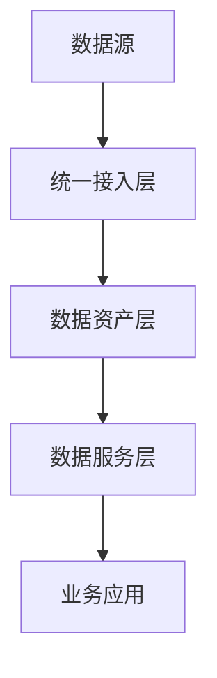

数据中台是企业级**数据能力复用平台**，其核心使命是**将原始数据转化为可复用、可共享的数据资产**，通过统一服务支撑前台业务创新。它不仅是技术平台，更是包含**组织架构、方法论、技术工具**的数据运营体系。以下是深度解析：

---

### 一、数据中台 vs 传统数据平台
| **维度**     | 传统数据平台    | 数据中台              |
| ------------ | --------------- | --------------------- |
| **目标**     | 支撑报表/BI     | 赋能业务创新          |
| **架构思想** | 烟囱式架构      | 能力复用架构          |
| **数据管理** | 按需求建仓      | 全局数据资产化        |
| **响应速度** | 需求响应周/月级 | 小时级API输出数据服务 |
| **典型技术** | ETL+数据仓库    | 实时数仓+数据服务总线 |

> **本质区别**：数据中台通过**数据资产化**和**服务化**，使数据从成本中心变为价值中心。

---

### 二、数据中台核心架构（四层模型）


#### 1. **统一接入层（OneData接入）**
   - **功能**：打破数据孤岛，统一接入多源数据
   - **关键技术**：
     - **批量接入**：Sqoop, DataX
     - **实时接入**：Flink CDC, Kafka Connect
     - **协议支持**：数据库日志（MySQL Binlog）、IoT设备数据、API爬虫
   - **数据规范**：
     - 统一命名：`dim_user_base`（维度表前缀`dim_`）
     - 数据分级：P0（核心交易数据）> P1（日志数据）> P2（外部数据）

#### 2. **数据资产层（核心引擎）**
   - **三层架构**：
     ```mermaid
     graph LR
         A[原始层ODS] -->|清洗| B[明细层DWD]
         B -->|聚合| C[汇总层DWS]
         C -->|标签| D[应用层ADS]
     ```
   - **关键组件**：
     - **存储引擎**：
       - 批量存储：HDFS + Hive
       - 实时存储：Kafka + ClickHouse
       - 图存储：Neo4j（用于关系网络）
     - **计算引擎**：
       - 批处理：Spark
       - 流处理：Flink
       - 交互查询：Presto/Trino
     - **数据治理**：
       - 血缘分析：Apache Atlas
       - 数据质量：Griffin
       - 元管理：DataHub

#### 3. **数据服务层（OneService输出）**
   - **服务化方式**：
     | 服务类型 | 技术实现                | 适用场景         |
     | -------- | ----------------------- | ---------------- |
     | 查询API  | GraphQL + 动态分库      | 实时订单状态查询 |
     | 分析API  | OLAP引擎预计算          | 销售漏斗分析     |
     | 推荐服务 | 内置Faiss向量引擎       | “猜你喜欢”推荐   |
     | 数据订阅 | Webhook + Kafka消息推送 | 库存预警通知     |
   - **核心能力**：
     - 智能路由：根据QPS自动切换查询引擎（HBase→Redis）
     - 缓存策略：Guava Cache + Redis多级缓存
     - 流量控制：Sentinel对API限流（如风控查询限1000TPS）

#### 4. **数据资产运营体系**
   - **数据资产目录**：
     ```json
     {
       "asset_id": "user_portrait",
       "tags": ["P0", "GDPR"],
       "owner": "data_team@company.com",
       "schema": [
         {"field": "user_id", "type": "bigint"},
         {"field": "buy_power", "type": "int", "desc": "购买力评分"}
       ]
     }
     ```
   - **价值度量**：
     - 复用指数：资产被调用次数
     - 经济价值：通过API计费量化（如用户画像调用1万次=￥2000）

---

### 三、数据中台核心能力矩阵
| **能力域**   | **核心功能**                | **业务价值**               |
| ------------ | --------------------------- | -------------------------- |
| 统一数据开发 | 可视化IDE + 任务调度        | 开发效率提升40%            |
| 智能数据治理 | 自动血缘分析 + 质量规则引擎 | 数据事故减少70%            |
| 实时数据服务 | Flink SQL + API网关         | 风控决策从分钟级降至毫秒级 |
| 数据资产运营 | 资产地图 + 价值度量         | 数据复用率从30%→80%        |
| AI能力融合   | 内置模型仓库 + MLOps        | 推荐模型迭代周期从月→天    |

---

### 四、典型应用场景
#### 1. **用户全域画像**
   - **实现路径**：
     ```mermaid
     graph LR
         A[APP点击日志] --> B[行为标签]
         C[交易数据] --> D[购买力标签]
         E[客服录音] --> F[情感分析标签]
         B & D & F --> G[OneID用户画像]
     ```
   - **输出服务**：`GET /user/profile?user_id=123`  
     返回：`{ "user_segment": "高价值", "next_buy_prob": 0.87 }`

#### 2. **实时风控中台**
   - **技术栈**：
     - 实时计算：Flink CEP（复杂事件处理）
     - 图计算：Spark GraphX（识别团伙欺诈）
   - **处理流程**：
     ```plaintext
     支付请求 → 规则引擎（黑名单/位置异常） 
               → 机器学习模型（欺诈评分） 
               → 决策（拦截/放行） 平均延时<50ms
     ```

#### 3. **供应链智能补货**
   - **数据驱动**：
     - 输入：历史销量 + 天气数据 + 社交媒体热度
     - 输出：AI生成补货计划（准确率提升35%）
   - **效果**：库存周转率从3次/年→8次/年

---

### 五、实施路径与挑战
#### 建设三阶段：
1. **平台化**（1年）：  
   - 搭建湖仓一体架构，上线数据开发平台
2. **资产化**（1.5年）：  
   - 构建用户/商品/门店等核心数据资产
3. **智能化**（持续）：  
   - 集成AI平台，实现预测类服务（如销量预测）

#### 关键挑战与对策：
| **挑战**         | **解决方案**                            |
| ---------------- | --------------------------------------- |
| 数据孤岛难打通   | 高层推动+制定数据共享KPI                |
| 实时计算成本高   | 分层存储（热数据ClickHouse+冷数据Hive） |
| 业务价值体现慢   | 优先建设“速赢场景”（如实时大屏）        |
| 数据安全合规风险 | 自动脱敏+GDPR合规审计                   |

> **标杆案例**：  
> - **阿里数据中台**：支撑双11每秒17.5亿次数据计算  
> - **京东数坊**：管理4亿用户标签，营销活动ROI提升300%  
> - **星巴克**：通过数据中台实现“千人千券”精准营销  

---

### 六、选型建议
1. **大型企业**：  
   - 自研 + 开源（Delta Lake + Airflow + Superset）  
2. **中型企业**：  
   - 云厂商方案（阿里DataWorks + MaxCompute）  
3. **快速启动**：  
   - 轻量级方案（Snowflake + dbt + Hightouch）  

---

数据中台的终极目标是让企业具备**数据驱动DNA**，其成功标志不是技术先进，而是：  
✅ 业务人员能自助获取数据（如用自然语言查询：“上个月华东区高客单用户留存率”）  
✅ 新产品上线时数据服务就绪速度 < 3天  
✅ 数据资产复用率 > 70%