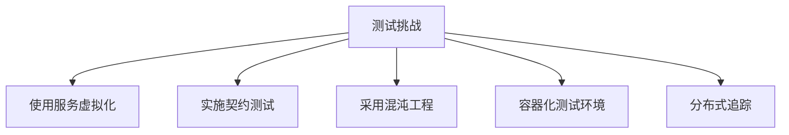
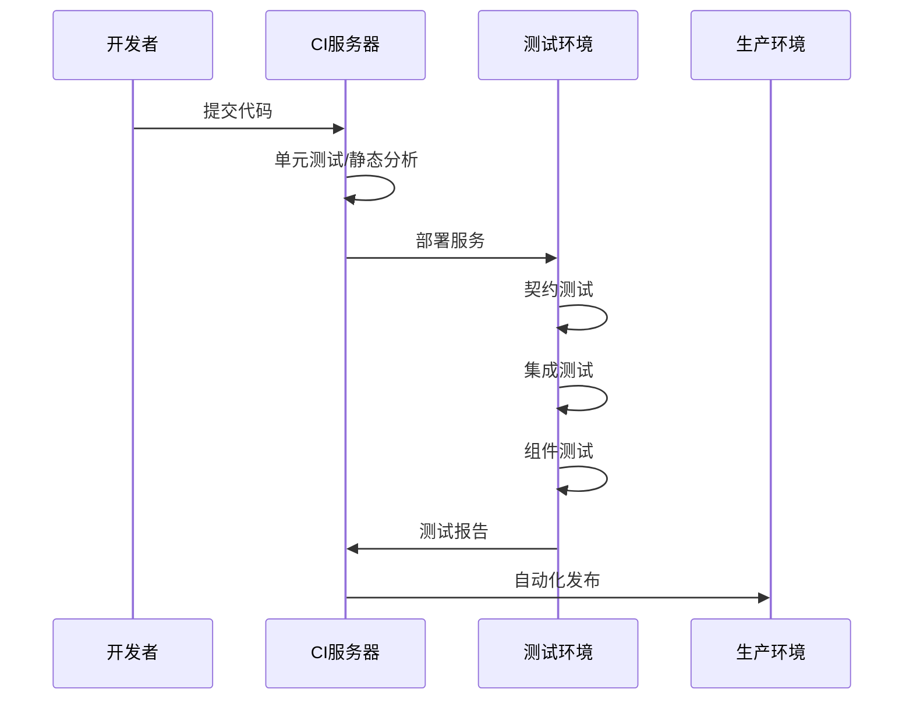
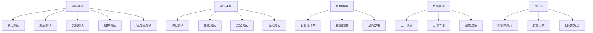

# 微服务测试常见问题

## 一、微服务测试基础概念

### 1. 微服务架构的主要测试挑战是什么？
**参考答案**：
微服务架构的测试挑战主要包括：
- **服务依赖性**：服务间依赖导致测试环境搭建复杂
- **分布式事务**：跨服务事务的测试和验证困难
- **数据一致性**：分布式数据存储的一致性验证
- **部署复杂性**：多服务独立部署的协调测试
- **端到端测试困难**：长调用链的测试覆盖和问题定位
- **测试环境管理**：多版本服务组合的测试矩阵爆炸

**解决方案**：


### 2. 什么是契约测试？它在微服务测试中的作用是什么？
**参考答案**：
契约测试是验证服务间接口约定的测试方法，确保服务提供者和消费者之间的兼容性。

**核心作用**：
- 防止服务接口变更导致下游服务故障
- 减少端到端测试依赖
- 支持服务独立部署
- 提供接口规范的活文档

**工具实现**：
```python
# 使用Pact进行契约测试示例
from pact import Consumer, Provider

pact = Consumer('OrderService').has_pact_with(Provider('PaymentService'))
pact.given('Order exists').upon_receiving('payment request').with_request(
    method='POST',
    path='/payments',
    body={'order_id': 123}
).will_respond_with(200, body={'status': 'success'})

with pact:
    # 消费者端测试
    response = make_payment_request(order_id=123)
    assert response.status == 'success'

# 提供者端验证
pact.verify()
```

## 二、测试策略与方法

### 3. 描述微服务测试金字塔模型
**参考答案**：
微服务测试金字塔模型：


**各层重点**：
1. **单元测试**：服务内部逻辑，Mock外部依赖
2. **集成测试**：服务与数据库/消息队列的集成
3. **契约测试**：服务间接口兼容性
4. **组件测试**：单个服务整体功能
5. **端到端测试**：核心业务流验证

### 4. 如何测试服务间的异步通信？
**参考答案**：
异步通信测试策略：
1. **生产者测试**：
   - 验证消息格式和内容
   - 检查重试和死信机制
2. **消费者测试**：
   - 模拟消息消费处理
   - 测试幂等性处理
3. **端到端验证**：
   - 使用消息追踪关联请求
   - 设置验证期等待异步结果

**工具示例**：
```python
# 使用Testcontainers测试Kafka消息
def test_order_processing():
    with KafkaContainer() as kafka:
        producer = KafkaProducer(bootstrap_servers=kafka.bootstrap_servers)
        producer.send('orders', value=order_data)
        
        # 等待消费者处理
        await_message('order-processed', timeout=10)
        
        # 验证数据库状态
        assert Order.query.get(order_id).status == 'PROCESSED'
```

## 三、测试工具与技术

### 5. 如何实现微服务的性能测试？
**参考答案**：
微服务性能测试策略：
1. **分层测试**：
   - 单服务压测
   - 依赖服务组合测试
   - 全链路压力测试
2. **关键指标**：
   ```mermaid
   graph LR
       A[吞吐量] --> B[服务能力]
       C[延迟P99] --> D[用户体验]
       E[错误率] --> F[系统稳定性]
       G[资源利用率] --> H[扩展需求]
   ```
3. **工具选择**：
   - JMeter/Gatling：负载生成
   - Prometheus/Grafana：监控指标
   - Jaeger/Zipkin：性能分析

### 6. 解释混沌工程在微服务测试中的应用
**参考答案**：
混沌工程是通过主动注入故障来验证系统弹性的实践。

**典型应用场景**：
1. 网络延迟和丢包
2. 服务实例故障
3. 资源耗尽（CPU、内存）
4. 消息队列积压
5. 数据库故障切换

**工具链**：
```python
# 使用Chaos Toolkit进行混沌实验
{
    "title": "Payment service failure",
    "description": "验证订单服务在支付服务故障时的弹性",
    "method": {
        "type": "action",
        "provider": {
            "type": "python",
            "module": "chaosaws.ec2.actions",
            "func": "stop_instances",
            "arguments": {
                "instance_ids": ["i-123456"]
            }
        }
    },
    "rollbacks": [{
        "type": "action",
        "provider": {
            "type": "python",
            "module": "chaosaws.ec2.actions",
            "func": "start_instances"
        }
    }]
}
```

## 四、测试环境与自动化

### 7. 如何管理微服务的测试数据？
**参考答案**：
测试数据管理策略：
1. **生命周期管理**：
   - 每个测试用例独立数据
   - 自动清理机制
2. **数据工厂模式**：
   ```python
   def create_order(user=None, items=None, status='NEW'):
       return {
           'id': fake.uuid4(),
           'user': user or create_user(),
           'items': items or [create_product()],
           'status': status
       }
   ```
3. **版本控制**：
   - 数据库迁移脚本（Flyway/Liquibase）
   - 测试数据集版本化
4. **数据遮蔽**：
   - 生产数据脱敏
   - GDPR合规处理

### 8. 如何在CI/CD中集成微服务测试？
**参考答案**：
CI/CD测试流水线设计：


**关键实践**：
- 流水线即代码（Jenkinsfile/GitLab CI）
- 按需创建测试环境
- 测试结果自动分析
- 质量门禁控制发布

## 五、架构与设计

### 9. 如何测试事件驱动的微服务架构？
**参考答案**：
事件驱动架构测试策略：
1. **生产者测试**：
   - 验证事件格式
   - 检查事件序列化
2. **消费者测试**：
   - 幂等性处理
   - 死信队列处理
3. **端到端测试**：
   ```python
   def test_order_fulfillment():
       # 发布订单事件
       publish_event('order-created', order_data)
       
       # 等待相关事件
       events = wait_for_events([
           'inventory-reserved',
           'payment-processed',
           'order-fulfilled'
       ], timeout=10)
       
       # 验证事件顺序和内容
       assert events[0].type == 'inventory-reserved'
       assert events[-1].payload['status'] == 'COMPLETED'
   ```

### 10. 如何处理微服务中的分布式事务测试？
**参考答案**：
分布式事务测试方法：
1. **Saga模式测试**：
   - 验证正常流程
   - 测试补偿机制
   - 检查中间状态
2. **边界场景**：
   - 超时处理
   - 部分失败
   - 重复请求
3. **工具支持**：
   - 使用分布式追踪（Jaeger）
   - 事务可视化工具
   - 状态机测试框架

## 六、问题解决能力

### 11. 如何诊断跨微服务的生产问题？
**参考答案**：
诊断策略：
1. **分布式追踪**：
   - 追踪ID透传
   - 可视化调用链
2. **日志聚合**：
   ```mermaid
   graph LR
       A[微服务] --> B[日志代理]
       B --> C[中央存储]
       C --> D[分析平台]
   ```
3. **指标监控**：
   - RED方法（请求率、错误率、持续时间）
   - USE方法（使用率、饱和度、错误）
4. **事件关联**：
   - 时间线分析
   - 异常模式检测

### 12. 描述你解决过的最复杂的微服务测试问题
**参考答案结构**：
1. **问题背景**：
   - 涉及的服务和架构
   - 出现的症状和影响
2. **诊断过程**：
   - 使用的工具和方法
   - 发现的根本原因
3. **解决方案**：
   - 实施的修复
   - 增加的测试用例
4. **预防措施**：
   - 架构改进
   - 监控增强
   - 测试策略优化

## 七、编码能力测试

### 13. 实现微服务健康检查API测试
```python
import requests
import pytest

@pytest.mark.parametrize("service", [
    "order-service",
    "payment-service",
    "inventory-service"
])
def test_service_health(service):
    response = requests.get(f"http://{service}/health", timeout=3)
    assert response.status_code == 200
    assert response.json()["status"] == "UP"
    assert response.json()["components"]["db"]["status"] == "UP"
```

### 14. 编写契约测试验证订单服务接口
```python
from pact import Consumer, Provider

def test_order_service_contract():
    pact = Consumer('CheckoutService').has_pact_with(Provider('OrderService'))
    
    # 定义请求和响应
    expected_body = {'id': '123', 'items': [{'product': 'A', 'qty': 2}]}
    
    (pact
     .given('order 123 exists')
     .upon_receiving('get order request')
     .with_request('GET', '/orders/123')
     .will_respond_with(200, body=expected_body))
    
    with pact:
        # 消费者端实现
        response = requests.get(pact.uri + '/orders/123')
        assert response.json() == expected_body
```

## 八、综合设计题

### 15. 设计电商平台微服务的测试策略
**参考答案框架**：


**关键要素**：
- 核心业务流：用户注册→浏览商品→下单→支付→履约
- 关键服务：用户服务、商品服务、订单服务、支付服务、库存服务
- 风险防控：库存超卖、支付重复、订单丢失
- 监控体系：日志聚合、指标监控、分布式追踪

通过这些问题，可以全面评估候选人在微服务测试领域的知识深度、实践经验和解决问题的能力。建议根据职位级别调整问题难度，对高级职位可增加架构设计和技术决策类问题。