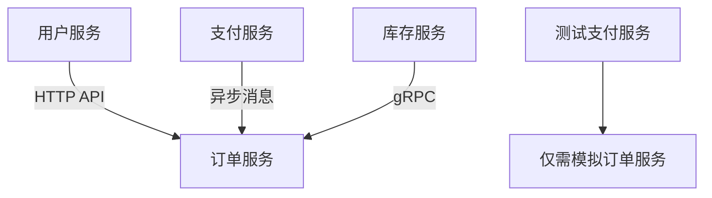
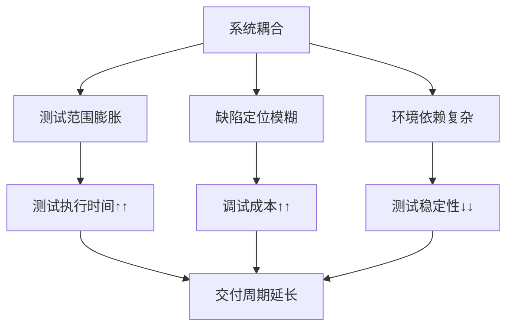

从**可分解性**角度分析软件产品的**可测试性**，是指评估系统能否被**拆分为相互隔离、职责独立的模块或单元**，从而支持**局部化、精细化、并行化的测试活动**。可分解性差的系统如同“巨石”，测试时牵一发而动全身，导致测试成本高、反馈周期长、缺陷定位难。

以下从四个核心维度解析可分解性对可测试性的影响及优化策略：

---

### 一、**架构层分解：物理隔离的测试单元**
#### **问题场景**
- 单体应用修改支付逻辑，需重启整个系统运行3000+测试用例。
- 前端页面按钮点击测试依赖后端认证服务，网络抖动即导致失败。

#### **高可测试性分解模式**
| **架构模式**   | **分解逻辑**                         | **测试收益**                     |
| -------------- | ------------------------------------ | -------------------------------- |
| **微服务架构** | 按业务域拆分为独立部署单元           | 支付服务修改仅需运行支付相关测试 |
| **前端微前端** | 应用拆分为独立子应用（如Single-SPA） | 登录页测试不依赖购物车模块       |
| **模块化单体** | 强边界模块（Java 9+模块化）          | 编译时隔离依赖，单元测试无渗透   |



---

### 二、**代码层分解：逻辑单元的自治性**
#### **可测试性杀手**
- 一个3000行类包含订单计算、邮件发送、数据库操作。
- 静态工具类`GlobalUtils.validateOrder()`被100个模块调用，无法单独测试。

#### **解耦关键技术**
1. **依赖反转（DIP）**  
   ```java
   // 高可测试性设计
   class OrderProcessor {
     private final PaymentGateway gateway; // 接口注入
     OrderProcessor(PaymentGateway gateway) { 
         this.gateway = gateway;
     }
     void process() {
         gateway.charge(); // 测试时可注入Mock
     }
   }
   ```
2. **领域驱动设计（DDD）**  
   - **聚合根隔离**：`Order`聚合根管理自身状态变更，测试不涉及`Customer`。  
   - **领域事件**：通过`OrderPaidEvent`验证行为，而非直接检查数据库。  

---

### 三、**数据层分解：测试数据的沙盒化**
#### **典型痛点**
- 测试用户注销功能，误删除其他测试用例创建的订单数据。  
- 性能测试因共享数据库产生锁竞争，响应时间失真。

#### **数据隔离方案**
| **策略**           | **实现方式**                      | **适用场景**         |
| ------------------ | --------------------------------- | -------------------- |
| **事务回滚**       | `@Transactional` / pytest.fixture | 快速清理单测数据     |
| **数据库分片**     | 为每个测试分配独立Schema          | 集成测试避免并发冲突 |
| **容器化存储**     | Docker启动临时PostgreSQL实例      | 端到端测试环境隔离   |
| **内存数据库替换** | H2替代MySQL运行测试               | 加速单元测试执行     |

---

### 四、**依赖链分解：外部服务的可切断性**
#### **测试阻碍案例**
- 测试机票预订流程需真实调用支付网关，每次扣款$1。  
- 人脸识别模块依赖GPU服务，本地测试无法运行。

#### **依赖切断技术**
1. **测试替身分层应用**  
   ```mermaid
   graph LR
     S[被测系统] -->|依赖| D[真实数据库]
     S -->|依赖| P[真实支付网关]
     测试时 --> S
     S -->|替换| F[Fake数据库]
     S -->|替换| M[Mock支付网关]
   ```
2. **依赖抽象等级**  
   | **测试类型** | **推荐替身**   | **示例工具**                |
   | ------------ | -------------- | --------------------------- |
   | 单元测试     | Mock验证交互   | Mockito, Jest               |
   | 集成测试     | Stub返回预设值 | WireMock, Mountebank        |
   | 契约测试     | 验证接口兼容性 | Pact, Spring Cloud Contract |

---

### 可分解性不足的测试代价


---

### 高可分解性系统的测试优势
1. **精准测试**  
   - 支付失败逻辑修改 → 仅运行**支付服务**单元测试 + **订单服务**集成测试。  
2. **并行加速**  
   ```mermaid
   graph LR
     T1[用户服务测试] --> 独立进程
     T2[商品服务测试] --> 独立进程
     T3[订单服务测试] --> 独立进程
     总测试时间 = max(T1,T2,T3)
   ```
3. **缺陷快速定位**  
   - 订单金额计算错误 → 直接锁定`OrderCalculator`类测试。  
4. **环境成本降低**  
   - 前端组件测试无需启动后端 → 节省4GB内存消耗。  

---

### 可分解性设计实践框架
1. **架构原则**  
   - **模块间松耦合**：遵循《微服务设计模式》中的“异步消息+最终一致性”。  
   - **模块内高内聚**：同一模块代码变更原因相同（单一职责）。  
2. **代码规范**  
   - 函数不超过20行，类不超过200行（圈复杂度<10）。  
   - 禁用全局变量/单例模式（除基础设施如Logger）。  
3. **基础设施**  
   - **服务网格**（Istio）：流量切分测试新版本。  
   - **容器编排**（K8s）：按需启停测试微服务。  

> **终极价值**：可分解性将测试从“全量回归的蛮力游戏”升级为“外科手术式的精准验证”，使测试活动具备**弹性、效率与可持续性**。它是持续交付流水线的核心加速器，更是应对系统复杂度的终极解药。