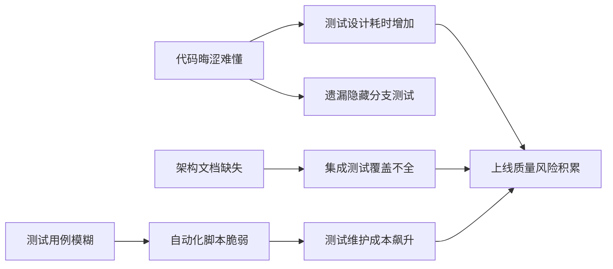

从**可理解性交付**的角度分析软件产品的**可测试性**，是指评估软件的设计、实现和文档是否以**清晰、结构化、易于人类和机器解读的方式呈现**，从而降低测试的学习成本、提升测试设计的准确性和维护效率。可理解性差的软件如同“密码本”，测试人员需耗费大量精力破译逻辑，而非专注验证行为。

以下从四个核心层面对可理解性交付与可测试性的关联进行深度分析：

---

### **一、代码实现的可理解性：测试的微观基础**
1. **可读性陷阱**  
   - **反例**：函数名`processData()`实际包含加密、校验、存储三步操作，内部嵌套10层if-else。  
   - **测试影响**：  
     - 难以定位功能边界，无法设计精准的单元测试。  
     - 分支覆盖不全，隐藏边界条件漏洞。  

2. **结构化与模块化**  
   - **高可测试性特征**：  
     - **单一职责原则**：每个函数/类仅做一件事（如`validateEmail()`而非`validateAndSaveUser()`）。  
     - **声明式编程**：代码表达“做什么”（如SQL查询），而非冗长“怎么做”（逐行解析文件）。  
   - **测试收益**：  
     - 测试用例可精准靶向独立功能点，减少无关依赖。  
     - 重构安全性高，修改局部逻辑不影响全局测试。  

3. **复杂度的可管理性**  
   - **关键指标**：圈复杂度（Cyclomatic Complexity）>15 的函数，测试用例数指数级增长。  
   - **改进方案**：  
     - 拆分为小函数 + 组合模式。  
     - 用策略模式替换分支嵌套（如将`if/switch`转为多态对象）。  

---

### **二、设计架构的可理解性：测试的宏观地图**
1. **架构可见性**  
   - **问题场景**：分布式服务链路无文档，测试人员需逆向工程推断调用关系。  
   - **高可测试性实践**：  
     - **架构决策记录（ADR）**：明确服务边界、通信协议、数据流向。  
     - **依赖关系图工具**：自动生成组件拓扑（如Dependency-Cruiser）。  

2. **模式与约定的显性化**  
   - **示例**：  
     - 所有API错误响应遵循`{code: 400, message: "xx"}`格式 → 自动化断言可统一编写。  
     - 领域事件命名规范`OrderCancelledEvent` → 集成测试可订阅验证。  

3. **技术债务透明化**  
   - **测试价值**：  
     - 标记“暂不测试”的临时方案（如`// TODO: TechDebt - Skip test for now`），防止未知漏洞。  
     - 技术债务看板 → 指导测试资源倾斜（高风险模块优先覆盖）。  

---

### **三、文档与注释的可理解性：测试的导航手册**
1. **测试导向的文档类型**  
   | **文档类型**       | **测试价值**                                   | **反模式示例**                   |
   | ------------------ | ---------------------------------------------- | -------------------------------- |
   | **需求可测性描述** | 明确验收条件（如“支持1000并发”可转为压测目标） | “系统应该快速响应”（模糊不可测） |
   | **接口契约文档**   | 生成自动化测试桩（Swagger → Postman脚本）      | 仅口头约定接口规范               |
   | **业务规则清单**   | 直接转为测试矩阵（决策表测试法）               | 规则散落在邮件/聊天记录中        |

2. **注释的测试辅助作用**  
   - **有效注释**：  
     ```java  
     // 注意：此方法在UTC时间零点触发（需mock时钟测试时区逻辑）  
     public void scheduleDailyTask() { ... }  
     ```
   - **无效注释**：  
     ```java  
     // 处理任务（已测试）  
     public void processTask() { ... }  
     ```

---

### **四、测试资产的可理解性：可持续测试的基石**
1. **测试用例的语义化表达**  
   - **反例**：  
     ```gherkin  
     当 用户操作  
     那么 检查结果  
     ```
   - **最佳实践**：  
     ```gherkin  
     场景: 新用户注册赠送积分  
       当 用户使用未注册邮箱提交表单  
       那么 账户表应创建记录  
       而且 积分表应增加100积分  
     ```

2. **测试报告的可解释性**  
   - **高可理解性报告特征**：  
     - **失败定位精准**：指出“订单状态应从PENDING变为PAID，实际为CANCELLED”。  
     - **上下文完整**：附带请求体、响应头、数据库快照等诊断信息。  
   - **工具示例**：Allure报告展示测试步骤截图、网络请求日志。  

3. **自动化脚本的自描述性**  
   - **低维护成本模式**：  
     ```python  
     def test_payment_retry_on_failure():  
         # 模拟支付网关首次返回500错误  
         mock_gateway.set_response(status=500)  
         order.retry_payment()  # 被测方法  
         # 验证系统自动重试3次  
         assert mock_gateway.call_count == 3  
     ```

---

### **可理解性不足对测试的连锁伤害**  


---

### **提升可测试性的可理解性实践**  
1. **代码层面**：  
   - 强制静态分析（SonarQube圈复杂度检查）。  
   - 推行“代码即文档”文化（Clean Code原则）。  
2. **设计层面**：  
   - 架构设计评审纳入**可测试性评估**（如依赖注入可行性）。  
   - 使用C4模型绘制组件图。  
3. **文档层面**：  
   - 需求条目化拆解，每条关联**可验证验收标准**。  
   - 自动化生成接口文档（Swagger/OAS）。  
4. **测试资产层面**：  
   - 测试用例管理工具（Xray/Zephyr）关联需求ID。  
   - 采用行为驱动开发（BDD）统一业务/测试语言。  

---

### **终极价值：可理解性交付 = 降低测试认知熵**  
当软件的表达如水晶般透明：  
- **测试设计**从“猜谜游戏”变为“按图索骥”  
- **缺陷定位**从“大海捞针”变为“精准导航”  
- **测试资产**从“易碎品”变为“可传承知识”  

可理解性不是装饰品，而是可测试性的**信息高速公路**。它让测试活动从低效的“逆向工程”转向高效的“目标验证”，最终成为质量保障的**加速度引擎**。