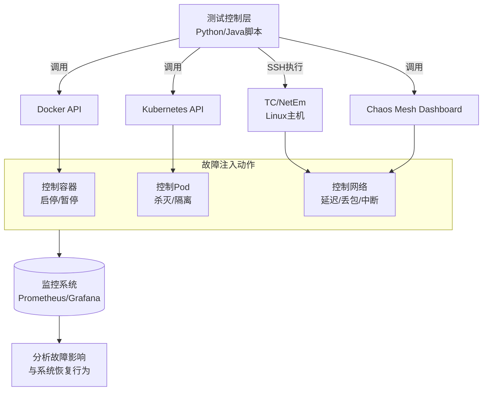

kafka的故障注入框架技术方案

### 故障注入框架技术方案

该方案的核心思想是**分层控制**和**工具组合**，其架构与工作流程如下图所示：



下面，我们分别针对三种故障类型，给出具体的技术实现。

---

### 1. 网络分区与网络故障模拟

**核心工具**：Linux `tc` (Traffic Control) 和 `netem` (Network Emulation) 工具。这些工具可以直接在操作系统层面模拟各种网络条件。

#### 1.1 模拟节点间的网络延迟和抖动

```bash
# 在目标Kafka Broker节点上执行
# 1. 添加延迟：在eth0网卡上添加100ms的固定延迟
sudo tc qdisc add dev eth0 root netem delay 100ms

# 2. 添加抖动：100ms ± 50ms的随机延迟（均匀分布）
sudo tc qdisc change dev eth0 root netem delay 100ms 50ms

# 3. 添加更复杂的抖动：100ms ± 50ms，符合正态分布
sudo tc qdisc change dev eth0 root netem delay 100ms 50ms distribution normal

# 4. 清除所有规则
sudo tc qdisc del dev eth0 root
```

#### 1.2 模拟网络包丢失和损坏

```bash
# 1. 模拟10%的丢包率
sudo tc qdisc add dev eth0 root netem loss 10%

# 2. 模拟更复杂的丢包：10%的丢包，且相关性为25%
# （如果上一个包丢了，下一个包有25%的概率也会丢）
sudo tc qdisc change dev eth0 root netem loss 10% 25%

# 3. 模拟包损坏：5%的包会被损坏
sudo tc qdisc add dev eth0 root netem corrupt 5%

# 4. 模拟包重复：1%的包会被重复
sudo tc qdisc add dev eth0 root netem duplicate 1%
```

#### 1.3 模拟完全的网络分区（中断）

这是最严重的故障，模拟两个节点或两个网络完全无法通信。

**方法A：使用 `iptables` 完全阻断流量**

```bash
# 在Broker 1上执行，阻断与Broker 2（IP: 10.0.0.3）的所有通信
sudo iptables -A INPUT -s 10.0.0.3 -j DROP
sudo iptables -A OUTPUT -d 10.0.0.3 -j DROP

# 恢复通信
sudo iptables -D INPUT -s 10.0.0.3 -j DROP
sudo iptables -D OUTPUT -d 10.0.0.3 -j DROP
```

**方法B：在Docker环境中模拟分区**

如果你的Kafka运行在Docker容器中，可以使用容器网络命名空间直接操作。

```bash
# 1. 找到目标容器的网络命名空间
PID=$(docker inspect -f '{{.State.Pid}}' <container_name>)

# 2. 进入该容器的网络命名空间执行tc命令
sudo nsenter -t $PID -n tc qdisc add dev eth0 root netem loss 100%
# 这会使得该容器完全无法通信

# 3. 恢复
sudo nsenter -t $PID -n tc qdisc del dev eth0 root
```

---

### 2. 节点故障测试

#### 2.1 模拟Broker宕机

**方法A：直接控制Docker容器（最常用）**

```bash
# 1. 暂停一个Broker容器（模拟进程挂起或无响应）
docker pause kafka-broker-1

# 2. 彻底停止一个Broker容器（模拟宕机）
docker stop kafka-broker-2

# 3. 重启Broker（模拟重启恢复）
docker unpause kafka-broker-1
docker start kafka-broker-2
```

**方法B：在Kubernetes中模拟Pod故障**

```bash
# 1. 强制删除一个Kafka Pod（Kubernetes会自动重启它）
kubectl delete pod kafka-cluster-0 --force --grace-period=0

# 2. 隔离节点（Cordon），阻止新Pod调度到其上
kubectl cordon <node-name>

# 3. 排空节点（Drain），优雅地驱逐所有Pod
kubectl drain <node-name> --ignore-daemonsets --delete-emptydir-data
```

**方法C：使用Chaos Mesh（云原生混沌工程平台）**

首先安装Chaos Mesh，然后使用YAML定义故障：

```yaml
# pod-failure.yaml
apiVersion: chaos-mesh.org/v1alpha1
kind: PodChaos
metadata:
  name: kafka-broker-failure
  namespace: chaos-testing
spec:
  action: pod-failure # 故障动作
  mode: one # 对其中一个Pod执行
  selector:
    labelSelector:
      app: kafka-broker # 选择Kafka Broker的Pod
  duration: "5m" # 故障持续5分钟
```

应用这个配置：
```bash
kubectl apply -f pod-failure.yaml
```

#### 2.2 模拟磁盘满

```bash
# 1. 快速填充磁盘（谨慎使用！请在测试环境操作）
# 创建一个巨大文件，填满磁盘空间
dd if=/dev/zero of=/path/to/kafka/logs/fill.disk bs=1G count=100

# 2. 更安全的方式：使用`fallocate`预分配空间（不实际写数据，速度快）
fallocate -l 50G /path/to/kafka/logs/fill.disk

# 3. 模拟磁盘IOhang（更恶劣的情况）
# 使用FUSE或LD_PRELOAD库注入延迟，但更简单的方法是使用tc限制磁盘IO
# 使用cgroups v2限制IO（需要系统支持）
echo "8:0 wbps=1048576" > /sys/fs/cgroup/io.max
# 这将限制major:minor为8:0的设备写速度为1MB/s

# 4. 清理，恢复空间
rm /path/to/kafka/logs/fill.disk
```

---

### 3. 自动化故障测试脚本

将上述命令封装成可重复使用的脚本是关键。以下是一个Python脚本示例，使用Fabric库进行远程执行。

#### 3.1 Python自动化故障注入脚本

```python
# chaos_kit.py
from fabric import Connection
import time
from typing import List

class KafkaChaosKit:
    def __init__(self, broker_hosts: List[str], ssh_user: str, ssh_key_path: str):
        self.brokers = [Connection(host=host, user=ssh_user, connect_kwargs={"key_filename": ssh_key_path}) for host in broker_hosts]
    
    def induce_network_latency(self, broker_index: int, latency_ms: int, jitter_ms: int = 0):
        """在指定Broker上注入网络延迟"""
        broker = self.brokers[broker_index]
        command = f"sudo tc qdisc add dev eth0 root netem delay {latency_ms}ms {jitter_ms}ms"
        broker.run(command)
        print(f"Injected {latency_ms}ms latency on broker {broker_index}")
    
    def clear_network_rules(self, broker_index: int):
        """清除所有网络规则"""
        broker = self.brokers[broker_index]
        broker.run("sudo tc qdisc del dev eth0 root || true") # || true 防止命令失败导致脚本停止
        print(f"Cleared network rules on broker {broker_index}")
    
    def isolate_broker(self, target_broker_index: int, isolated_broker_index: int):
        """让一个Broker无法访问另一个Broker"""
        target_host = self.brokers[target_broker_index].host
        isolated_ip = ... # 需要根据host解析IP的逻辑
        
        # 使用iptables添加规则
        isolate_command = f"sudo iptables -A INPUT -s {isolated_ip} -j DROP"
        self.brokers[target_broker_index].run(isolate_command)
        print(f"Isolated broker {isolated_broker_index} from broker {target_broker_index}")
    
    def reboot_broker(self, broker_index: int):
        """重启指定Broker"""
        broker = self.brokers[broker_index]
        broker.run("sudo systemctl restart kafka.service") # 或用docker restart
        print(f"Rebooted broker {broker_index}")
    
    def __del__(self):
        # 脚本结束时清理所有规则
        for i in range(len(self.brokers)):
            self.clear_network_rules(i)

# 使用示例
if __name__ == "__main__":
    # 配置你的Kafka集群信息
    hosts = ["kafka-broker-1", "kafka-broker-2", "kafka-broker-3"]
    chaos_kit = KafkaChaosKit(hosts, "ubuntu", "/path/to/ssh/key.pem")
    
    # 执行故障注入测试流程
    try:
        print("Starting chaos experiment...")
        chaos_kit.induce_network_latency(0, 1000, 100) # Broker 0: 1s延迟 ±100ms抖动
        time.sleep(300) # 等待5分钟，观察系统行为
        
        chaos_kit.clear_network_rules(0)
        chaos_kit.isolate_broker(1, 2) # 让Broker 1无法访问Broker 2
        time.sleep(300)
        
    finally:
        # 确保实验结束后清理环境
        chaos_kit.clear_network_rules(0)
        # 需要添加清理iptables规则的逻辑
```

#### 3.2 高级：与测试框架集成

使用Pytest等测试框架，将故障注入变为自动化测试用例。

```python
# test_kafka_resilience.py
import pytest
from chaos_kit import KafkaChaosKit

@pytest.fixture(scope="module")
def chaos_kit():
    kit = KafkaChaosKit(["broker1", "broker2", "broker3"], "user", "key.pem")
    yield kit
    # 测试结束后自动清理

def test_leader_reelection_after_broker_failure(chaos_kit):
    """测试Broker失败后的Leader重新选举"""
    # 1. 获取当前Topic的Leader信息
    initial_leader = get_topic_leader("my-topic") # 需要实现这个函数
    
    # 2. 模拟Leader Broker宕机
    chaos_kit.reboot_broker(initial_leader)
    
    # 3. 等待并验证新的Leader被选举出来
    time.sleep(30)
    new_leader = get_topic_leader("my-topic")
    
    # 4. 断言：新的Leader不应该等于旧的Leader
    assert new_leader != initial_leader, "Leader should have changed after broker failure"
    
    # 5. 验证客户端生产消费是否恢复正常
    produce_success = can_produce_messages("my-topic") # 需要实现这个函数
    assert produce_success, "Should be able to produce after leader re-election"

def test_high_availability_during_network_partition(chaos_kit):
    """测试网络分区期间的可用性"""
    # 模拟网络分区：将集群分成两组 [0,1] 和 [2]
    chaos_kit.isolate_broker(0, 2)
    chaos_kit.isolate_broker(1, 2)
    
    # 多数派[0,1]应该仍然可用
    produce_success = can_produce_messages("my-topic", required_acks=1)
    assert produce_success, "Majority partition should still be writable"
    
    # 清理隔离规则在chaos_kit的析构函数中自动进行
```

---

### 4. 实施建议与最佳实践

1.  **环境隔离**：**绝对不要在生产环境**运行这些故障注入命令。使用专门的预生产或压力测试环境。

2.  **监控先行**：在开始混沌工程之前，确保你有完善的监控系统（如Prometheus + Grafana），能够实时观察Kafka集群的健康状态、性能指标和业务影响。

3.  **渐进式演练**：
    *   **从简单开始**：先注入轻微的延迟或丢包，再逐步增加严重性。
    *   **计划性**：制定详细的演练计划，包括准备、执行、观察和恢复阶段。
    *   **工作时间进行**：确保团队在岗，能够快速响应意外情况。

4.  **自动化恢复**：确保所有故障注入操作都有对应的、**自动化的恢复命令**，并集成到脚本的`finally`块或`teardown`阶段，防止因脚本错误导致测试环境持续不可用。

5.  **工具选择**：
    *   **简单测试**：直接使用Shell脚本和`tc`/`iptables`命令。
    *   **复杂测试**：使用Python+Fabric进行封装。
    *   **Kubernetes环境**：优先使用**Chaos Mesh**或**Litmus Chaos**这类云原生混沌工程平台，它们提供了更安全、更强大的故障注入能力，并且能够与K8s生态无缝集成。

通过这套具体的技术方案，你可以系统化、自动化地对Kafka集群进行各种故障测试，从而真正验证其弹性和高可用性设计是否符合预期。