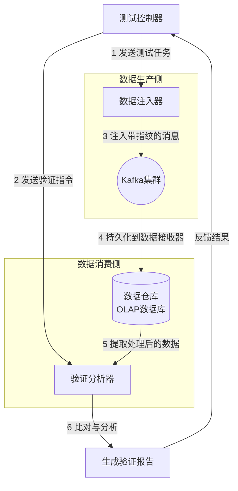

kafka中数据一致性与准确性验证的方案

### 数据一致性验证框架总体架构

一个有效的数据一致性验证框架通常包含以下核心组件，其工作流程如下图所示：



下面，我们分别对每个组件和步骤进行详细说明。

---

### 1. 端到端数据准确性验证

**目标**：确保从Kafka生产者发送的原始消息，经过一系列消费者处理后，最终结果（如写入数据库的记录、生成的统计指标）与预期完全一致。

#### 方案：实施「数据指纹」追踪与比对

**工作原理**：
1.  **数据注入器 (Data Injector)**：在测试开始时，向Kafka注入一批精心构造的、带有唯一指纹（Fingerprint）的测试消息。
2.  **数据接收器 (Data Sink)**：消费者处理这些消息并将结果持久化到目标存储（如MySQL、ClickHouse、S3）。
3.  **验证分析器 (Verification Analyzer)**：从目标存储中提取处理后的数据，根据指纹反算出预期结果，并与实际结果进行比对。

#### 具体工具与代码实现

**步骤1：构造可验证的测试消息（生产者端）**

我们使用一个唯一的`trace_id`来关联所有数据，并计算消息内容的哈希值作为指纹。

```python
# data_injector.py
import json
import uuid
import hashlib
from kafka import KafkaProducer

class DataInjector:
    def __init__(self, bootstrap_servers):
        self.producer = KafkaProducer(
            bootstrap_servers=bootstrap_servers,
            value_serializer=lambda v: json.dumps(v).encode('utf-8')
        )
        self.test_run_id = str(uuid.uuid4())  # 本次测试运行的唯一ID

    def generate_message_with_fingerprint(self, base_data):
        """
        生成一条携带指纹的消息
        :param base_data: 原始业务数据，如 {'user_id': 101, 'action': 'purchase', 'amount': 99.9}
        :return: 嵌入指纹后的完整消息
        """
        # 1. 生成唯一trace_id
        trace_id = f"{self.test_run_id}_{uuid.uuid4()}"
        
        # 2. 创建包含元数据和原始数据的消息体
        message = {
            "__trace_id": trace_id,      # 用于追踪的唯一ID
            "__topic": "user_events",    # 目标Topic（可选）
            "data": base_data            # 实际的业务数据
        }
        
        # 3. 计算数据指纹（例如，对业务数据部分计算MD5）
        data_json = json.dumps(base_data, sort_keys=True)  # 排序键以保证序列化一致
        data_fingerprint = hashlib.md5(data_json.encode()).hexdigest()
        message["__fingerprint"] = data_fingerprint
        
        return message

    def send_verification_batch(self, topic, base_data_list):
        """发送一批用于验证的消息"""
        for base_data in base_data_list:
            message = self.generate_message_with_fingerprint(base_data)
            future = self.producer.send(topic, value=message)
            # 可在此添加回调以处理发送失败
        producer.flush()
        print(f"Sent {len(base_data_list)} verification messages for test run {self.test_run_id}")

# 使用示例
if __name__ == "__main__":
    injector = DataInjector('localhost:9092')
    
    # 构造一批测试数据
    test_batch = [
        {'user_id': 101, 'action': 'login', 'timestamp': 1678880000},
        {'user_id': 102, 'action': 'purchase', 'amount': 29.99, 'item_id': 'A100', 'timestamp': 1678880001},
        # ... 更多测试数据
    ]
    
    injector.send_verification_batch('user_behavior_events', test_batch)
```

**步骤2：消费者处理并落盘（消费者端）**

消费者需要正常处理业务逻辑，但**必须保留**消息中的`trace_id`和`fingerprint`，并将其与处理结果一起持久化。这是验证能否成功的关键。

```sql
-- 在目标数据库（如MySQL）中创建结果表，必须包含追踪字段
CREATE TABLE user_behavior_stats (
    id INT AUTO_INCREMENT PRIMARY KEY,
    user_id INT NOT NULL,
    action VARCHAR(50) NOT NULL,
    total_amount DECIMAL(10, 2) DEFAULT 0,
    count INT DEFAULT 1,
    
    -- 以下是为验证添加的字段
    trace_id VARCHAR(100),       -- 存储来自Kafka消息的trace_id
    data_fingerprint VARCHAR(32), -- 存储来自Kafka消息的指纹
    process_time TIMESTAMP DEFAULT CURRENT_TIMESTAMP,
    
    INDEX idx_trace_id (trace_id)
);
```

**步骤3：自动化校验（验证器）**

测试完成后，运行校验脚本，执行以下操作：
1.  从数据库中查询出所有包含本次测试`test_run_id`的结果记录。
2.  根据原始测试数据重新计算预期结果。
3.  将预期结果与实际结果进行比对。

```python
# data_validator.py
import hashlib
import json
import mysql.connector
from mysql.connector import Error

class DataValidator:
    def __init__(self, db_config, test_run_id):
        self.db_config = db_config
        self.test_run_id = test_run_id

    def fetch_actual_results(self):
        """从数据库中获取实际处理结果"""
        try:
            connection = mysql.connector.connect(**self.db_config)
            cursor = connection.cursor(dictionary=True)
            
            query = "SELECT * FROM user_behavior_stats WHERE trace_id LIKE %s"
            pattern = f"{self.test_run_id}%"
            cursor.execute(query, (pattern,))
            
            results = cursor.fetchall()
            cursor.close()
            connection.close()
            return results
            
        except Error as e:
            print(f"Database error: {e}")
            return []

    def calculate_expected_result(self, original_message):
        """
        根据原始消息数据，计算出预期的处理结果。
        这里需要根据你的业务逻辑来实现。
        例如：如果是统计总金额，这里就返回 original_message['data']['amount']
        """
        data = original_message['data']
        # 这是一个示例：假设业务逻辑是计算每个用户的总金额
        expected_amount = data.get('amount', 0)
        # ... 其他计算逻辑
        return expected_amount

    def validate(self, original_test_batch):
        """
        核心验证逻辑
        :param original_test_batch: 之前发送的原始测试数据列表
        """
        actual_results = self.fetch_actual_results()
        
        # 将实际结果按trace_id组织成字典，便于查找
        actual_dict = {item['trace_id']: item for item in actual_results}
        
        mismatches = []
        
        for original_data in original_test_batch:
            # 重新生成trace_id和指纹，以便与数据库中的记录匹配
            temp_message = injector.generate_message_with_fingerprint(original_data) # 需复用Injector的逻辑
            trace_id = temp_message['__trace_id']
            
            if trace_id not in actual_dict:
                mismatches.append({'trace_id': trace_id, 'error': 'Record not found in DB'})
                continue
                
            actual_record = actual_dict[trace_id]
            expected_value = self.calculate_expected_result(temp_message)
            
            # 比对关键字段（例如比对待校验的金额）
            if abs(actual_record['total_amount'] - expected_value) > 0.001: # 避免浮点数误差
                mismatches.append({
                    'trace_id': trace_id,
                    'expected': expected_value,
                    'actual': actual_record['total_amount']
                })
        
        # 输出验证报告
        total_tests = len(original_test_batch)
        passed_tests = total_tests - len(mismatches)
        print(f"\n=== Validation Report ===")
        print(f"Test Run ID: {self.test_run_id}")
        print(f"Total Messages: {total_tests}")
        print(f"Passed: {passed_tests}")
        print(f"Failed: {len(mismatches)}")
        
        if mismatches:
            print("\nFailed Cases:")
            for case in mismatches[:10]: # 只打印前10个错误
                print(f"  TraceID {case['trace_id']}: Expected {case.get('expected')}, Got {case.get('actual')}, Error: {case.get('error')}")
            return False
        else:
            print("All data consistency checks passed!")
            return True

# 使用示例
if __name__ == "__main__":
    db_config = {
        'host': 'localhost',
        'database': 'your_database',
        'user': 'your_user',
        'password': 'your_password'
    }
    
    # 必须与注入器使用的是同一个test_run_id和原始测试数据
    test_run_id = "your_known_test_run_id" 
    original_batch = [...] # 这里必须填入之前发送的完全相同的原始测试数据列表
    
    validator = DataValidator(db_config, test_run_id)
    validator.validate(original_batch)
```

---

### 2. 顺序和完整性验证

**目标**：验证消息是否严格按顺序处理，以及是否有任何消息丢失或重复。

#### 方案：使用单调递增序列号

**工作原理**：为每个消息附加一个全局单调递增的序列号（如 `sequence_number: 1, 2, 3, ...`）。消费者处理消息时，记录它处理到的最大序列号。通过检查序列号的连续性来验证顺序和完整性。

#### 具体实现

**在消息注入端**：
在之前指纹消息的基础上，增加一个全局序列号。

```python
# 在DataInjector类中添加
class DataInjector:
    def __init__(self, bootstrap_servers):
        # ... 其他初始化 ...
        self.sequence_counter = 0
        
    def generate_message_with_fingerprint(self, base_data):
        # ... 其他逻辑 ...
        self.sequence_counter += 1
        message["__sequence_number"] = self.sequence_counter
        return message
```

**在验证端**：
查询数据库中所有结果的序列号，检查是否连续。

```python
# 在DataValidator类中添加方法
def validate_sequence_and_completeness(self):
    """验证序列号的连续性和完整性，确保无丢失、无重复"""
    actual_results = self.fetch_actual_results()
    
    # 提取所有序列号并排序
    seq_numbers = [r['sequence_number'] for r in actual_results if r['sequence_number'] is not None]
    seq_numbers.sort()
    
    if not seq_numbers:
        return True, "No sequence numbers to validate"
        
    gaps = []
    duplicates = []
    
    # 检查重复
    if len(seq_numbers) != len(set(seq_numbers)):
        seen = set()
        duplicates = [x for x in seq_numbers if x in seen or seen.add(x)]
    
    # 检查间隙（丢失）
    min_seq, max_seq = min(seq_numbers), max(seq_numbers)
    full_set = set(range(min_seq, max_seq + 1))
    actual_set = set(seq_numbers)
    gaps = sorted(full_set - actual_set)
    
    is_valid = not (gaps or duplicates)
    message = f"Sequence check: Min={min_seq}, Max={max_seq}, Total={len(seq_numbers)}. "
    if gaps:
        message += f"Missing sequences: {gaps[:10]}{'...' if len(gaps) > 10 else ''}. "
    if duplicates:
        message += f"Duplicate sequences: {duplicates[:10]}{'...' if len(duplicates) > 10 else ''}. "
    if is_valid:
        message = "Sequence and completeness check PASSED."
        
    return is_valid, message
```

---

### 3. 关联数据一致性验证

**目标**：验证不同但相关的统计数据之间的一致性（例如，从不同角度统计的总金额应该相等）。

#### 方案：跨数据源交叉验证

**工作原理**：编写特定的验证查询，对数据仓库中的不同表或不同统计路径进行交叉检查。

#### 具体实现：使用SQL进行交叉验证

假设我们有两张表：
1.  `orders_table`: 存储每一笔订单的明细。
2.  `daily_revenue_stats`: 按天预聚合的收入统计。

我们可以运行以下SQL脚本进行验证：

```sql
-- validation_query.sql
-- 检查明细表的总和与预聚合表的总和是否一致

SELECT 
    (SELECT SUM(amount) FROM orders_table WHERE date = '2023-10-27') AS total_from_details,
    (SELECT SUM(daily_total) FROM daily_revenue_stats WHERE stat_date = '2023-10-27') AS total_from_stats,
    (SELECT SUM(amount) FROM orders_table WHERE date = '2023-10-27') - 
    (SELECT SUM(daily_total) FROM daily_revenue_stats WHERE stat_date = '2023-10-27') AS difference;
```

然后，在自动化脚本中执行这个查询并判断结果：

```python
# 在DataValidator类中添加方法
def validate_cross_source_consistency(self, validation_query_path):
    """执行指定的SQL验证脚本，检查关联数据的一致性"""
    try:
        connection = mysql.connector.connect(**self.db_config)
        cursor = connection.cursor()
        
        with open(validation_query_path, 'r') as file:
            sql = file.read()
        
        cursor.execute(sql)
        result = cursor.fetchone()
        
        total_details, total_stats, difference = result
        
        # 允许微小的浮点数误差
        if abs(difference) < 0.01:
            return True, f"Cross-source consistency PASSED. Both sources agree: {total_details}"
        else:
            return False, f"Cross-source consistency FAILED. Details: {total_details}, Stats: {total_stats}, Difference: {difference}"
            
    except Error as e:
        return False, f"Error running validation query: {e}"
    finally:
        if connection.is_connected():
            cursor.close()
            connection.close()
```

### 总结与集成建议

1.  **工具化**：将上述 `DataInjector` 和 `DataValidator` 封装成命令行工具或Python库，方便集成到CI/CD流水线中。
    ```bash
    # 示例调用命令
    python -m validator --test-run-id <id> --config validation_config.yaml
    ```

2.  **配置化**：使用YAML文件来定义测试数据、验证规则和数据库连接信息。
    ```yaml
    # validation_config.yaml
    test_run:
      id: "test_20231027_01"
    data_source:
      bootstrap_servers: "kafka-broker:9092"
      topic: "validation_topic"
    data_sink:
      db_host: "data-warehouse"
      db_name: "analytics_db"
      db_user: "validator"
    validation_queries:
      - "sql/consistency_check_1.sql"
      - "sql/consistency_check_2.sql"
    ```

3.  **自动化**：在性能测试或部署完成后，自动触发数据一致性验证脚本，并将验证报告（如JUnit XML格式）集成到测试 dashboard（如Jenkins、GitLab CI）中。

通过这套方案，你可以系统化、自动化地验证经过Kafka的数据管道的数据一致性，从而极大提升对系统可靠性的信心。