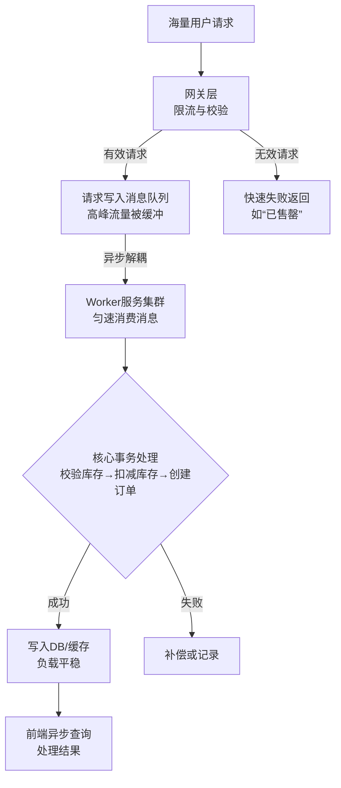

**流量削峰**。它与限流、熔断相辅相成，共同构成了应对突发流量的完整解决方案。

---

### 一、核心思想与业务逻辑

#### 1. 什么是流量削峰？

**流量削峰**的核心思想是：**将突如其来的、高并发的请求流量，通过某种方式缓冲起来，使其以一种平滑、匀速的方式被后端系统处理**，从而避免流量洪峰直接冲垮系统。

它不像**限流**那样直接拒绝超额请求，而是“先接住，再慢慢处理”，用**异步化**和**缓冲**的思想来换取时间和系统的稳定性。

#### 2. 为什么需要流量削峰？—— 业务场景

典型的业务场景就是**秒杀、抢购、大型促销、定时红包**等。
这些场景的特点：
*   **瞬时流量极高**：在某一时刻（如整点），流量曲线瞬间陡增，形成一个巨大的“波峰”。
*   **有效请求有限**：商品库存或红包数量是固定的，最终只有少量请求能成功，大部分请求是无效的。
*   **系统资源矛盾**：如果让所有请求都同步地、实时地去竞争有限的资源（如查库存、扣库存、写订单），会对数据库、缓存等核心资源造成毁灭性打击。

#### 3. 业务目标

1.  **保护下游系统**：避免数据库、缓存等核心服务被突发流量击垮，保证系统整体可用性。
2.  **提升用户体验**：让用户请求快速得到“已接收”的响应，而不是长时间等待后看到一个错误页面。用户体验是“排队中”而不是“服务器开小差了”。
3.  **保证业务公平性**：通过“排队”机制，让请求按照到来的顺序（或某种规则）被处理，避免因系统负载不均导致的不公。
4.  **成本与效率的平衡**：根据业务重要性，对请求进行分级处理，核心链路实时同步，非核心链路异步削峰。

---

### 二、技术架构与实现方案

流量削峰的架构本质是一个**生产者-消费者模型**。整个流程如下图所示，其核心在于通过一个缓冲层（通常是消息队列）将瞬时的同步请求转换为异步的平稳处理。

#### 1. 请求接入层（网关/Web层）

这是流量的入口，首要任务是做**最粗粒度的过滤和限流**。

*   **技术组件**：Nginx, Spring Cloud Gateway, API Gateway等。
*   **核心职责**：
    *   **恶意请求过滤**：识别并拦截刷单脚本、机器人等异常流量。
    *   **常规限流**：使用令牌桶等算法，将流量限制在系统能承受的范围内（例如，每秒放行1万个请求到后端），超出的请求直接返回“活动太火爆，请稍后再试”。
    *   **基本验证**：对请求参数做基本校验（如用户登录态、URL合法性），无效请求直接返回，减轻下游压力。

#### 2. 缓冲层（核心削峰枢纽）

这是削峰架构的**核心**，几乎所有技术方案都围绕这一层展开。

*   **技术组件**：**消息队列**是绝对的主流选择。
    *   **Kafka**：超高吞吐量，为大数据场景而生，适合日志、流量收集等对可靠性要求稍低的场景。
    *   **RocketMQ**：阿里巴巴出品，低延迟、高可靠、保证消息顺序，专为金融、交易等场景设计，是秒杀系统的首选。
    *   **RabbitMQ**：功能丰富，支持多种消息协议，但吞吐量相较于前两者稍低。

*   **核心职责**：
    *   **异步解耦**：将前端请求的“写入”操作快速转换为一条消息存入队列，从而释放Web服务器资源（Tomcat线程），使其能快速响应用户。
    *   **缓冲流量**：消息队列积压消息，将瞬时高峰“抹平”为一个长时间、匀速的消费流。
    *   **持久化**：即使下游消费者暂时宕机，消息也不会丢失，确保业务数据可靠性。

#### 3. 业务处理层（Worker消费者）

这是实际处理业务逻辑的地方，从缓冲层匀速拉取消息进行处理。

*   **技术组件**：自研的Worker服务、分布式任务框架、或消息队列自身的消费者客户端。
*   **核心职责**：
    *   **匀速消费**：消费者以固定的、系统能承受的速率（QPS）从消息队列中拉取消息。例如，数据库每秒只能处理2000个写订单请求，消费者就按这个速度来消费。
    *   **核心业务逻辑**：执行扣减库存、生成订单等事务性操作。这里通常需要访问数据库和缓存。
    *   **保证幂等性**：由于网络问题可能导致消息重复投递，消费者必须保证处理同一消息多次不会导致业务错误（如扣两次库存）。通常通过唯一业务ID（如订单ID）来实现。

#### 4. 数据存储层

被削峰后的平稳流量最终会落入这里。

*   **技术组件**：MySQL、Redis等。
*   **核心职责**：
    *   **库存扣减**：库存信息通常存放在**Redis**中，利用其极高的读写性能应对高频查询和扣减。扣减时使用`DECR`或`Lua`脚本保证原子性。
    *   **订单创建**：订单数据最终落入**MySQL**。可以通过分库分表来分散写压力。

#### 5. 结果反馈与查询

由于整个流程是异步的，用户不会立即得到最终结果。

*   **技术架构**：
    1.  用户请求被接入层接收后，立即返回一个响应：“您的请求已提交，正在排队处理中...”。
    2.  前端页面轮询或通过WebSocket长连接，定期向服务端查询最终处理结果（如“抢购成功”或“库存不足失败”）。
    3.  服务端查询缓存或数据库，将结果返回给前端。

---

### 三、关键技术与优化点

1.  **写缓存而非数据库**：秒杀开始时，所有库存信息应提前加载到Redis中，所有的库存查询和扣减都在Redis中完成，最后再异步同步到数据库。
2.  **异步化与批量写**：Worker处理完业务后，可以将订单创建等操作批量写入数据库，极大减少数据库的写入压力。
3.  **静态化与CDN**：秒杀活动的页面绝大部分内容是静态的（图片、JS、CSS），应放在CDN上，减少回源请求，保护服务器资源。
4.  **资源隔离**：将秒杀系统与主站隔离开，使用独立的集群、数据库、Redis等，避免秒杀流量影响到正常商品的买卖。

### 总结

流量削峰的本质是 **“异步”** 和 **“缓冲”**。

*   **业务逻辑**：接受所有可能成功的请求，将其排队，匀速处理，最终将结果异步返回。**宁可让一万人排队，也不让一千人把系统搞垮**。
*   **技术架构**：以**消息队列**为核心，构建一个**生产者-消费者**模型，前端快速响应，后端匀速消费，从而将一道陡峭的“波峰”流量，削缓成一道漫长的“波状”流量，保护所有下游系统。

它、限流和熔断三者结合，构成了应对高并发场景的完整体系：**限流**在门口挡住多余的人，**削峰**让进来的人排队，**熔断**则在系统内部某个环节出现问题时快速失败，防止连锁反应。