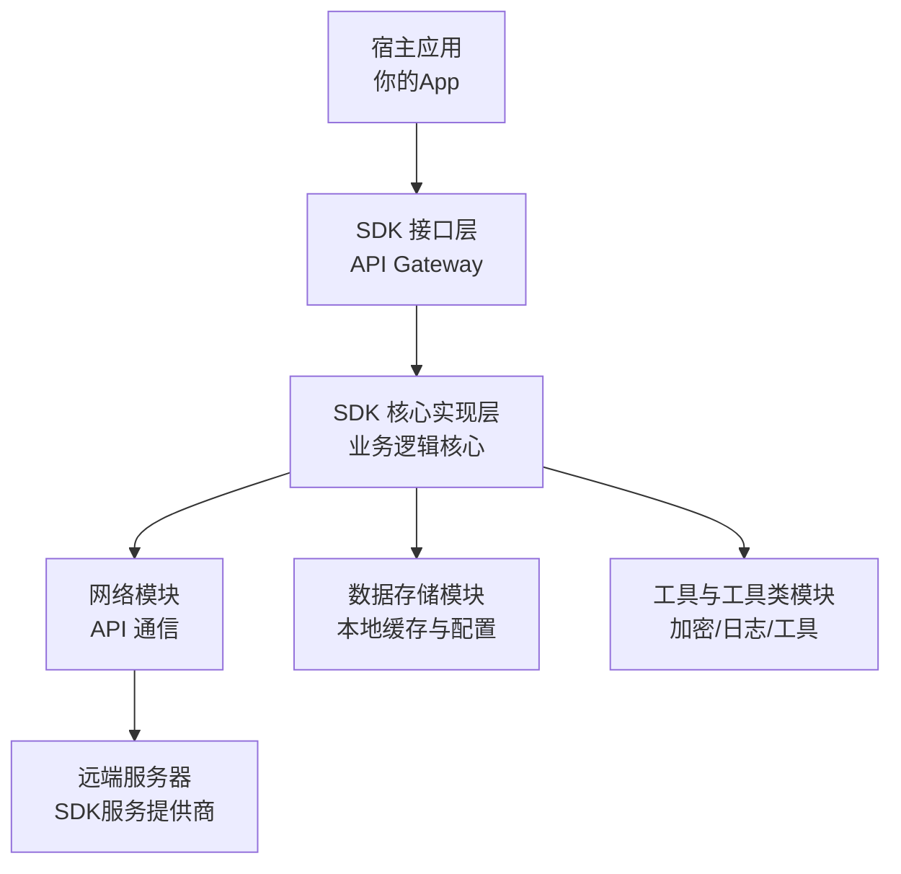

好的，我们来全面、系统地介绍一下 **SDK（Software Development Kit）**。

---

### 一、SDK 是什么？

**SDK（软件开发工具包）** 是一套由软件提供商、硬件平台或操作系统厂商创建的**工具、库、文档、代码示例和指南的集合**。它的核心目的是为开发者提供一个**标准化的、高效的**方式来为特定平台、系统或服务开发应用程序。

可以把 SDK 想象成一个**“创意工具箱”**：
*   **目标：** 制作一个精美的木制玩具（开发一个应用）。
*   **SDK：** 一个包含了标准尺寸的木料、各种型号的螺丝刀、锯子、砂纸、装配说明书和几个小样品玩具的箱子。
*   **没有SDK：** 你需要自己去砍树、制作工具、摸索如何连接各个部件，过程会非常缓慢和困难。

---

### 二、核心业务场景与应用领域

SDK 无处不在，几乎所有现代软件开发和物联网设备都离不开它。

1.  **移动应用开发**
    *   **平台SDK：** **Android SDK** 和 **iOS SDK (Xcode)** 是最典型的例子。它们提供了构建原生应用所需的一切：系统API、UI组件、模拟器、调试工具等。
    *   **场景：** 开发一个安卓或苹果手机上的App。

2.  **第三方服务集成**
    *   **功能SDK：** 为了快速获得某项能力，避免重复造轮子。
        *   **支付：** 支付宝SDK、微信支付SDK、Stripe SDK。
        *   **地图：** 高德地图SDK、百度地图SDK、Google Maps SDK。
        *   **登录与社交：** 微信SDK、QQ SDK、Facebook SDK（用于第三方登录、分享）。
        *   **推送通知：** 极光推送SDK、个推SDK、Firebase Cloud Messaging (FCM) SDK。
        *   **数据统计：** 友盟SDK、Google Analytics SDK。
        *   **广告变现：** 穿山甲SDK、AdMob SDK。
    *   **场景：** 你的电商App需要接入微信支付和物流地图功能。

3.  **硬件与物联网**
    *   **设备SDK：** 硬件厂商为开发者提供的，用于控制其硬件或与之交互的工具包。
        *   **无人机：** 大疆DJI SDK，用于开发控制无人机飞行的应用。
        *   **智能家居：** 智能灯泡、插座厂商提供的SDK，让App可以连接和控制设备。
        *   **VR/AR：** Oculus SDK、HTC Vive SDK、ARKit、ARCore。
    *   **场景：** 开发一个用手机控制智能无人机进行航拍的应用。

4.  **游戏开发**
    *   **游戏引擎：** **Unity** 和 **Unreal Engine** 本身就是最强大的SDK。它们提供了渲染引擎、物理系统、音频系统等全套游戏开发工具。
    *   **场景：** 开发一款3A级游戏或手机游戏。

5.  **区块链与Web3**
    *   **链SDK：** 例如，以太坊的 **Web3.js** 和 **Ethers.js**，允许开发者与区块链网络交互，开发去中心化应用。
    *   **场景：** 开发一个DeFi应用或NFT交易平台。

6.  **操作系统与系统级开发**
    *   **Windows SDK**、**Linux kernel headers** 等，用于开发系统驱动或底层应用。

---

### 三、技术架构

一个设计良好、易于集成的SDK通常遵循清晰的技术架构，其核心是与**宿主应用**的交互关系。

其核心组成如下：

1.  **接口层**
    *   这是SDK对外暴露的**唯一入口**。它提供了一系列定义良好的 **API（Application Programming Interface）**，通常是类、方法、函数或注解。
    *   **设计原则：** 简洁、直观、稳定（向后兼容）、有良好的文档。这一层的好坏直接决定了开发者的体验。

2.  **核心实现层**
    *   SDK的“大脑”，包含了所有的业务逻辑和核心功能。例如，支付SDK中的订单处理、加密签名流程；地图SDK中的地图渲染、路径规划算法。
    *   **设计原则：** 高内聚、低耦合，与接口层分离，便于内部维护和迭代。

3.  **模块**
    *   **网络模块：** 负责所有与远端服务器的通信（HTTP/HTTPS, WebSocket），包括数据序列化/反序列化（JSON/Protobuf）。
    *   **数据存储模块：** 轻量级的本地存储，用于缓存数据、存储配置（如使用SharedPreferences、Keychain、UserDefaults）。
    *   **工具类模块：** 提供日志、加密/解密、设备信息获取、错误处理等公共工具。

4.  **安全与合规**
    *   **认证授权：** 如何安全地初始化SDK（如使用AppKey/AppSecret）、管理访问令牌。
    *   **通信安全：** 使用HTTPS、请求签名防止篡改。
    *   **数据隐私：** 遵循GDPR、CCPA等合规要求，规范数据收集和处理。

---

### 四、交付方式

SDK 以不同的形式交付给开发者，具体取决于其目标和平台。

1.  **源码形式**
    *   **描述：** 直接提供源代码（如.java, .kt, .m, .h, .cpp文件）。
    *   **优点：** 灵活性最高，可以查看和修改内部实现，便于深度定制和调试。
    *   **缺点：** 可能引入安全风险和兼容性问题；知识产权易泄露。
    *   **例子：** 许多C/C++库（如OpenSSL）、React Native的JS库。

2.  **二进制形式**
    *   **描述：** 提供编译后的文件，隐藏实现细节。这是最常见的形式。
    *   **类型：**
        *   **移动端：** `.aar` (Android), `.framework` 或 `.xcframework` (iOS)。
        *   **前端/Web：** `.js` 文件（通常压缩为.min.js）。
        *   **后端/本地：** `.jar` (Java), `.dll` (Windows), `.so` (Linux), `.dylib` (macOS)。
    *   **优点：** 保护知识产权；开箱即用，减少集成复杂度；体积可控。
    *   **缺点：** 遇到问题难以调试；无法自定义修改。

3.  **包管理器依赖**
    *   这是现代开发中最主流的交付方式。开发者无需手动下载，只需一行配置命令即可集成。
    *   **平台与工具：**
        *   **Java/Kotlin:** Maven, Gradle (JCenter, Maven Central)
        *   **JavaScript:** npm, yarn
        *   **iOS/macOS:** CocoaPods, Swift Package Manager (SPM), Carthage
        *   **Python:** pip
        *   **.NET:** NuGet
    *   **优点：** 自动化管理依赖和版本更新，极其方便。

---

### 五、相关技术栈

开发一个高质量的SDK本身也是一个软件工程项目，涉及多种技术。

| 方面           | 可能的技术栈                                                 |
| :------------- | :----------------------------------------------------------- |
| **开发语言**   | **Java, Kotlin** (Android), **Swift, Objective-C** (iOS), **C/C++** (高性能、跨平台), **JavaScript/TypeScript** (Web), **Go, Rust** (新兴系统级SDK) |
| **网络通信**   | **HTTP客户端：** OkHttp (Java), URLSession (Swift), Axios (JS) **协议：** RESTful API, GraphQL, WebSocket **数据序列化：** JSON, Protocol Buffers (Protobuf, 更高效) |
| **数据存储**   | **Android：** SharedPreferences, Room **iOS：** UserDefaults, Keychain, CoreData **跨平台：** SQLite, Realm |
| **文档生成**   | **Javadoc** (Java), **Dokka** (Kotlin), **Jazzy** (Swift), **Docusaurus** (静态站点), **Swagger/OpenAPI** (用于API文档) |
| **构建与打包** | **Gradle** (Android/Java), **Cocoapods** (iOS), **Webpack/Rollup** (JS), **CMake** (C++) |
| **质量保障**   | **单元测试：** JUnit (Java), XCTest (Swift), Jest (JS) **集成测试：** 模拟真实环境测试 **CI/CD：** Jenkins, GitLab CI, GitHub Actions (用于自动化构建、测试和发布) |

### 总结

SDK 是现代软件开发的**基石和加速器**。它通过**封装复杂技术**、**提供标准化接口**和**简化集成流程**，极大地提升了开发效率，降低了技术门槛，让开发者能够专注于自身核心业务逻辑的创新。从手机App到物联网设备，再到元宇宙和区块链，SDK的身影无处不在，是驱动数字生态繁荣的关键技术之一。

