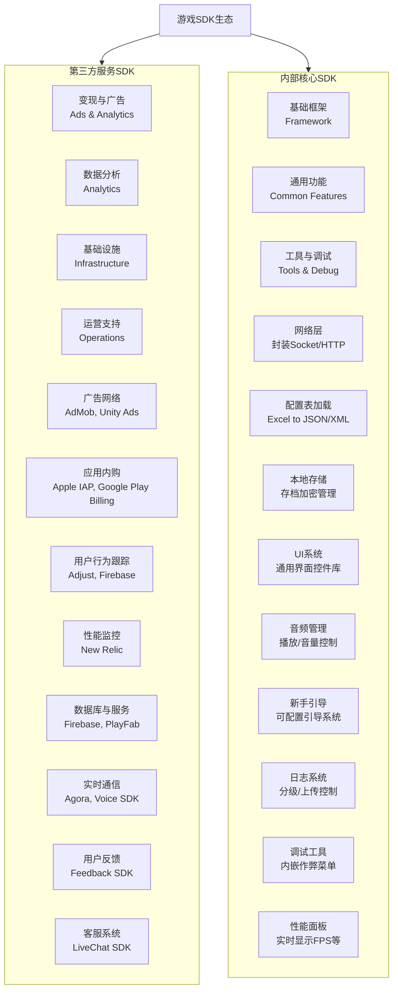

太好了，这是一个非常核心且实际的技术问题。游戏开发中，SDK（Software Development Kit）的集成是至关重要的一环，它们能极大地提升开发效率，让游戏团队能专注于核心玩法和内容，而无需重复“造轮子”。

游戏软件会将那些**通用、复杂、非核心玩法**的功能模块打包和抽象到SDK中。简单来说，就是 **“把别人做得更好、更专业的事情交给别人去做”**。

这些SDK主要分为两大类：
1.  **第三方服务SDK**：集成外部公司提供的服务。
2.  **内部核心SDK**：公司内部将通用技术模块化，方便多个项目复用。

下图清晰地展示了游戏开发中常见的SDK分类及其功能模块：

---

### 一、第三方服务SDK (Third-party Service SDKs)

这是游戏中最常见、数量最多的SDK类型，主要用于接入各种外部服务，以实现商业化、运营和基础设施支持。

#### 1. 变现与广告 (Monetization & Advertising)
这是游戏，尤其是免费游戏（F2P）的命脉。
*   **广告平台SDK**：用于展示视频广告、插屏广告、横幅广告等。
    *   **抽象内容**：广告请求、加载、展示、点击回调、收益计算等复杂逻辑。
    *   **例子**：Google AdMob, Unity LevelPlay, IronSource, Mintegral, AppLovin MAX。
*   **应用内购买SDK**：用于处理游戏内虚拟商品（金币、道具、月卡）的购买。
    *   **抽象内容**：与苹果App Store、Google Play等应用商店的后端支付流程、订单验证、商品信息拉取。
    *   **例子**：Apple StoreKit (iOS IAP), Google Play Billing Library。

#### 2. 数据分析 (Analytics)
“没有数据支撑的决策就是耍流氓”。数据分析SDK帮助开发者了解玩家行为，做出科学决策。
*   **抽象内容**：事件打点（埋点）、数据收集、压缩、缓存、批量上传、用户画像生成。
*   **例子**：Firebase Analytics, Adjust, AppsFlyer, ThinkingData, Umeng。

#### 3. 基础设施 (Infrastructure)
为游戏提供稳定的后端支持。
*   **游戏服务器/数据库**：提供玩家账户、数据存档、排行榜、实时对战等服务。
    *   **抽象内容**：网络通信、数据序列化、房间管理、状态同步等复杂后端逻辑。
    *   **例子**：Photon Engine, PlayFab, Firebase Realtime Database。
*   **实时语音通信**：用于玩家组队开黑时的语音聊天。
    *   **抽象内容**：音频采集、降噪、编码、网络传输、3D音效处理。
    *   **例子**：Agora (声网), Vivox, GVoice。

#### 4. 运营与增长 (Operations & Growth)
帮助游戏更好地运营和吸引用户。
*   **推送通知**：用于给玩家发送活动、版本更新等提醒。
    *   **例子**：Firebase Cloud Messaging (FCM), 个推, 极光推送。
*   **用户反馈/客服**：让玩家能在游戏内直接提交反馈或联系客服。
*   **分享SDK**：让玩家可以将游戏成就、内容分享到社交平台，起到引流作用。
    *   **例子**：Facebook Share, 微信SDK。

---

### 二、内部核心SDK (Internal Core SDKs)

这类SDK通常由游戏公司内部的技术中台或核心组开发，旨在将通用技术方案标准化，避免重复开发，提升研发效率和代码质量。

#### 1. 基础框架 (Framework)
*   **网络层SDK**：封装所有网络请求，统一处理协议（TCP/UDP/HTTP/WebSocket）、重连、心跳包、加密解密、数据序列化（Protobuf/MessagePack）。
*   **配置表加载SDK**：统一管理游戏策划的Excel配置表，提供自动化工具将其转换为游戏可读的格式（如JSON、二进制），并提供高效的内存读取接口。
*   **本地存储SDK**：统一管理玩家存档，处理数据的加密、解密、版本兼容和异常恢复。

#### 2. 通用功能 (Common Features)
*   **UI系统SDK**：提供一整套UI组件（如通用弹窗、红点、滚动列表、自适应布局方案），统一UI风格和交互逻辑。
*   **音频管理SDK**：统一管理背景音乐（BGM）和音效（SFX）的播放、暂停、音量控制、资源加载和卸载。
*   **新手引导系统**：提供一个可配置的、数据驱动的引导系统，策划人员可以通过配置表而非修改代码来调整引导流程。

#### 3. 工具与调试 (Tools & Debugging)
*   **日志SDK**：统一日志格式，提供分级别（Verbose, Debug, Error等）打印、日志文件写入、关键日志上传到服务器的功能。
*   **调试工具SDK**：在游戏内集成一个调试菜单，方便测试人员随时修改玩家等级、金币数量、触发特定事件等，大幅提升测试效率。
*   **性能监控SDK**：实时收集和展示游戏的FPS、内存占用、网络延迟等数据，并在出现异常时上报。

---

### 技术方案规划时的考量点

在规划集成这些SDK时，技术团队会重点考虑：

1.  **性能开销**：SDK的引入会带来多大的内存、CPU和功耗开销？启动时间是否受影响？
2.  **网络流量**：SDK是否会频繁请求网络？数据包大小如何？是否支持延迟发送或批量发送？
3.  **兼容性与冲突**：不同SDK之间是否存在库依赖冲突（如不同版本的OkHttp）？是否与引擎版本和目标操作系统版本兼容？
4.  **隐私合规**：SDK是否合规收集用户数据？尤其是在GDPR、CCPA等严格法规下。通常需要接入隐私合规SDK来统一管理授权。
5.  **耦合度与可维护性**：如何设计良好的抽象层，将第三方SDK与游戏核心代码**解耦**？这样未来更换SDK提供商时（例如从A广告平台换到B平台），成本会降到最低。
6.  **初始化流程**：多个SDK的初始化顺序、依赖关系以及是否影响游戏启动速度，都需要精心设计。

总之，将功能抽象到SDK是游戏工业化和专业化发展的必然结果，其核心思想是**分工、复用和专注**，让专业的团队做专业的事，从而高效地开发出更优秀的游戏。