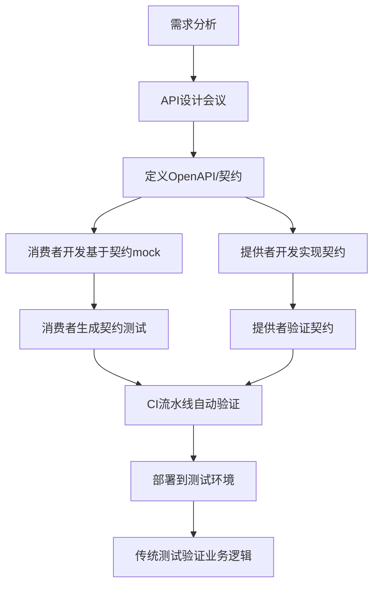

# 契约测试在实际研发流程中的价值与落地

您提出了一个非常 insightful 的问题。契约测试确实在大多数团队中不像单元测试或集成测试那样普及，但这并不代表它没有价值。让我从几个角度分析这个问题。

## 为什么契约测试相对少见？

### 1. 认知和成熟度问题
- **技术债务优先**：许多团队忙于处理功能开发和明显的技术债务，难以投入"预防性"质量措施
- **理解门槛**：契约测试需要团队成员对微服务架构和API设计有较深理解
- **"它看起来像重复工作"**：表面上看，契约测试似乎与现有测试重叠

### 2. 组织和文化障碍
- **团队边界**：契约测试最大的价值体现在跨团队协作中，但跨团队协调成本高
- **所有权模糊**：是由开发写？测试写？还是双方共同负责？
- **短期主义**：契约测试的投资回报在长期才能体现，而很多团队面临短期交付压力

### 3. 工具和流程集成难度
- **CI/CD流水线集成**：需要调整现有流水线来支持契约测试流程
- **学习曲线**：Pact等工具需要学习时间，而团队资源有限

## 契约测试的独特价值：传统测试无法完全覆盖

虽然测试人员的工作很重要，但契约测试解决的是不同维度的问题：

| 测试类型       | 关注点             | 契约测试的独特价值             |
| -------------- | ------------------ | ------------------------------ |
| **单元测试**   | 单个组件内部逻辑   | 确保组件间的接口约定           |
| **集成测试**   | 组件间数据流和交互 | 提前在开发阶段发现接口不匹配   |
| **端到端测试** | 完整业务流程       | 快速定位接口问题，减少调试时间 |
| **手动测试**   | 用户体验和业务逻辑 | 防止回归问题，确保向后兼容     |

### 契约测试解决的特定问题：
1. **提供者意外破坏变更**：API响应格式变化未被消费者感知
2. **消费者未声明的要求**：消费者使用了API但未正式声明依赖
3. **文档与实现不一致**：契约作为活文档，始终与实现同步
4. **并行开发阻塞**：团队可以基于契约并行工作，减少等待

## 契约测试与实际迭代流程的协同

### 1. 理想的工作流程

### 2. 团队角色分工

**开发者**：
- 编写消费者端的契约测试
- 维护提供者端的契约验证
- 在CI流水线中集成契约测试

**测试人员**：
- 确保关键业务场景被契约覆盖
- 验证契约测试结果的正确性
- 将发现的接口问题反馈到契约中

**架构师/技术负责人**：
- 制定契约测试标准和规范
- 解决跨团队的契约冲突
- 确保契约测试融入开发流程

### 3. 实际迭代中的实践

**迭代开始前**：
- API设计优先：先定义接口契约，再开始编码
- 使用契约作为团队间的API约定合同

**开发过程中**：
- 消费者团队使用契约mock提供者进行开发
- 提供者团队实现契约要求的功能
- 每日构建运行契约验证，及早发现问题

**迭代结束时**：
- 契约测试作为CI/CD的必须通过关卡
- 契约文件随代码一起版本化管理
- 契约验证结果作为完成标准之一

## 成功实施的关键因素

1. **从小开始**：选择一个关键API开始实践，证明价值后再扩展
2. **文化转变**：将契约视为API的正式合同，而非额外工作
3. **工具链支持**：集成到现有开发工具链中，降低使用门槛
4. **度量与反馈**：跟踪契约测试发现的问题数量，证明其价值
5. **循序渐进**：先自动化生成契约，再逐步增加严格性

## 结论

契约测试不是要替代传统测试，而是**填补了一个关键空白**——确保分布式系统中服务间的明确约定得到遵守。它最适合：

- 中型到大型微服务架构
- 跨团队/跨部门的开发协作
- API稳定性要求高的项目
- 需要并行开发提高效率的场景

虽然初期投入需要额外 effort，但在正确的场景下，契约测试可以显著减少集成问题、加速开发周期，并提高系统可靠性。它不是银弹，但当正确实施时，它能成为微服务架构中不可或缺的质量保障手段。

在实际操作中，成功的契约测试实施往往始于技术领导者的推动，通过在一个高价值场景中证明其效果，然后逐步扩展到整个组织。