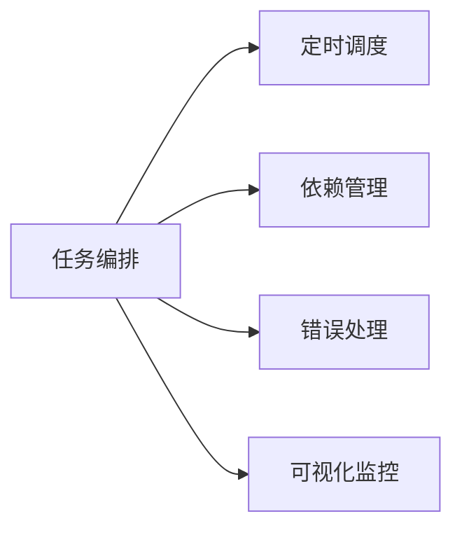
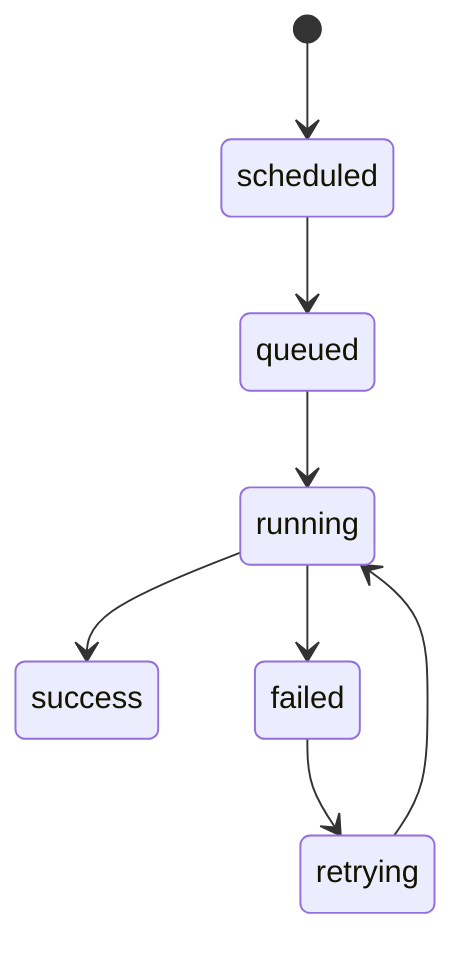
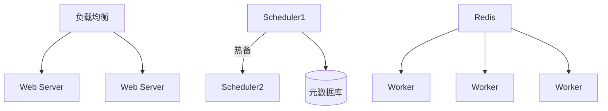
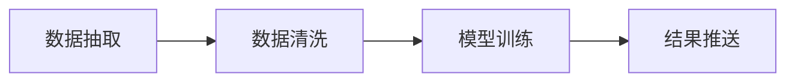

## Apache Airflow 全面解析  
—— 数据工作流的调度与编排引擎  

---

### 一、Airflow 核心定位  
**解决痛点**：  
复杂数据管道的定时调度、任务依赖管理、错误重试与监控  
**核心能力**：  


---

### 二、核心架构组件  
| **组件**        | **作用**                                   | 关键技术栈               |
| --------------- | ------------------------------------------ | ------------------------ |
| **Scheduler**   | 大脑：解析DAG、触发任务、监控状态          | 多进程/分布式锁          |
| **Executor**    | 执行器：控制任务运行方式（本地/容器/集群） | Local/Celery/K8sExecutor |
| **Web Server**  | 可视化：任务监控/日志查看/手动操作         | Flask + React            |
| **Metadata DB** | 存储中心：保存DAG定义/任务状态/历史记录    | PostgreSQL/MySQL         |
| **Worker**      | 执行单元：实际运行任务代码的节点           | 进程/Docker容器          |

---

### 三、核心概念详解  

#### 1. **DAG (有向无环图)**  
- **本质**：用Python代码定义的任务流程图  
- **特性**：  
  - 节点 = 任务（Operator）  
  - 边 = 执行顺序依赖  
  - 禁止循环依赖  

**示例代码**：  
```python
from airflow import DAG
from airflow.operators.python import PythonOperator
from datetime import datetime

def extract(): print("数据抽取")
def load(): print("数据加载")

with DAG(
    dag_id="etl_pipeline",
    schedule_interval="0 3 * * *",  # 每天3点执行
    start_date=datetime(2023, 1, 1)
) as dag:
    t1 = PythonOperator(task_id="extract", python_callable=extract)
    t2 = PythonOperator(task_id="load", python_callable=load)
    t1 >> t2  # 依赖关系
```

#### 2. **Operator (任务算子)**  
| **类型** | 作用               | 常用实现                        |
| -------- | ------------------ | ------------------------------- |
| 执行算子 | 运行具体操作       | `PythonOperator` `BashOperator` |
| 传输算子 | 数据转移           | `MySqlToGcsOperator`            |
| 传感器   | 等待外部条件       | `S3KeySensor`                   |
| 容器算子 | 在Docker中运行任务 | `DockerOperator`                |

#### 3. **任务生命周期**  


---

### 四、核心工作原理解析  

#### 1. **调度机制**  
```mermaid
sequenceDiagram
    Scheduler->>MetadataDB： 扫描待执行DAG
    Scheduler->>Executor： 分发任务实例
    Executor->>Worker： 执行具体任务
    Worker-->>MetadataDB： 更新任务状态
    MetadataDB-->>WebServer： 刷新UI展示
```

#### 2. **时间窗口控制**  
| **参数**            | 作用                         | 示例值               |
| ------------------- | ---------------------------- | -------------------- |
| `start_date`        | DAG首次可调度日期            | `datetime(2023,1,1)` |
| `schedule_interval` | 执行周期（cron表达式）       | `"30 2 * * *"`       |
| `end_date`          | DAG停止调度日期（可选）      | `datetime(2024,1,1)` |
| `catchup`           | 是否补跑历史任务（默认True） | `False`              |

---

### 五、高级特性  

#### 1. **动态DAG生成**  
```python
for table in ['users', 'orders']:
    with DAG(f"load_{table}", ...) as dag:
        load_task = SqlOperator(sql=f"LOAD TABLE {table}...")
```

#### 2. **跨DAG依赖**  
```python
wait_main = ExternalTaskSensor(
    task_id="wait_main_etl",
    external_dag_id="main_etl",
    external_task_id="transform_complete"
)
```

#### 3. **错误自动恢复**  
```python
task = PythonOperator(
    task_id="retry_task",
    retries=3,                    # 重试次数
    retry_delay=timedelta(minutes=5),  # 重试间隔
    on_failure_callback=alert_slack  # 失败回调
)
```

---

### 六、生产级部署方案  

#### 1. **执行器选型对比**  
| **Executor**       | 适用场景     | 优势              | 缺点             |
| ------------------ | ------------ | ----------------- | ---------------- |
| LocalExecutor      | 单机测试     | 简单易用          | 无并行/无容错    |
| CeleryExecutor     | 生产级分布式 | 水平扩展/任务队列 | 需Redis/RabbitMQ |
| KubernetesExecutor | 容器化环境   | 弹性伸缩/资源隔离 | 运维复杂度高     |

#### 2. **高可用架构**  


---

### 七、典型应用场景  

#### 1. **数据管道**  


#### 2. **系统运维**  
- 每日数据库备份  
- 日志轮转清理  
- 服务健康检查  

#### 3. **业务监控**  
- 数据质量校验  
- 报表自动生成  
- 异常告警触发  

---

### 八、最佳实践指南  

1. **DAG设计原则**  
   - 原子性：每个任务只做一件事  
   - 幂等性：重复执行结果一致  
   - 模块化：复用公共组件  

2. **性能优化技巧**  
   ```ini
   # airflow.cfg
   [core]
   parallelism = 32  # 全局并发任务数
   dag_concurrency = 16  # 单个DAG并发数
   [scheduler]
   min_file_process_interval = 30  # DAG文件扫描间隔
   ```

3. **安全加固**  
   - RBAC（基于角色的访问控制）  
   - 敏感信息存入`Connections`加密管理  
   - 网络隔离（Worker运行在内网）  

---

### 九、生态工具集成  
| **工具**               | 集成方式              | 用途               |
| ---------------------- | --------------------- | ------------------ |
| **Great Expectations** | PythonOperator调用    | 数据质量校验       |
| **Docker**             | DockerOperator        | 环境隔离的任务执行 |
| **Kubernetes**         | KubernetesPodOperator | 动态容器化任务     |
| **Prometheus**         | 暴露`/metrics`端点    | 系统监控指标采集   |

---

### 十、适用场景 vs 替代方案  
| **场景**       | 推荐工具    | 原因                  |
| -------------- | ----------- | --------------------- |
| 分钟级定时任务 | Airflow     | 复杂依赖管理/重试机制 |
| 实时流处理     | Flink/Spark | 低延迟处理能力        |
| 简单cron任务   | crontab     | 零运维开销            |
| 无服务器任务   | AWS Lambda  | 按需付费/自动扩缩容   |

> 🔥 **核心价值**：  
> 1. **代码即配置**：Python定义工作流，版本可控  
> 2. **可视化运维**：Web UI实时监控任务状态  
> 3. **扩展性强**：支持自定义Operator/Hook  
> 4. **社区生态**：300+官方集成组件  

[官方文档](https://airflow.apache.org/)｜[GitHub](https://github.com/apache/airflow)｜[快速入门](https://airflow.apache.org/docs/apache-airflow/stable/start.html)