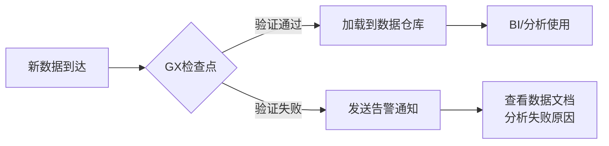

下面我将提供一个完整的 **Great Expectations (GX) 使用示例**，展示如何验证一个CSV数据集（以泰坦尼克号乘客数据为例）。这个示例涵盖了从安装到生成数据文档的全流程：

---

### **环境准备**
```bash
# 安装Great Expectations
pip install great_expectations

# 下载示例数据集 (Titanic乘客数据)
wget https://web.stanford.edu/class/archive/cs/cs109/cs109.1166/stuff/titanic.csv
```

---

### **完整代码示例**
```python
import great_expectations as gx
from great_expectations.core.batch import RuntimeBatchRequest

# 1. 初始化数据上下文 (GX的核心控制中心)
context = gx.get_context()

# 2. 配置数据源 (直接使用Pandas DataFrame)
df = pd.read_csv("titanic.csv")

datasource_config = {
    "name": "titanic_datasource",
    "class_name": "Datasource",
    "execution_engine": {
        "class_name": "PandasExecutionEngine"
    },
    "data_connectors": {
        "default_runtime_data_connector": {
            "class_name": "RuntimeDataConnector",
            "batch_identifiers": ["batch_id"],
        }
    }
}
context.add_datasource(**datasource_config)

# 3. 创建批次数据请求
batch_request = RuntimeBatchRequest(
    datasource_name="titanic_datasource",
    data_connector_name="default_runtime_data_connector",
    data_asset_name="titanic_data",  # 数据资产名称
    runtime_parameters={"batch_data": df},
    batch_identifiers={"batch_id": "first_import"},
)

# 4. 创建期望套件
suite = context.create_expectation_suite(
    expectation_suite_name="titanic_suite",
    overwrite_existing=True
)

# 5. 使用验证器交互式添加期望
validator = context.get_validator(
    batch_request=batch_request,
    expectation_suite_name="titanic_suite",
)

# 添加数据质量规则
validator.expect_column_values_to_not_be_null(column="Survived")  # 生存状态不能为空
validator.expect_column_values_to_be_in_set("Sex", ["male", "female"])  # 性别只能是男/女
validator.expect_column_values_to_be_between("Age", 0, 100)  # 年龄在0-100岁之间
validator.expect_column_mean_to_be_between("Fare", 20, 40)  # 平均票价在20-40之间
validator.expect_table_row_count_to_be_between(min_value=800, max_value=900)  # 总行数范围

# 保存期望套件
validator.save_expectation_suite(discard_failed_expectations=False)

# 6. 创建检查点
checkpoint_config = {
    "name": "titanic_checkpoint",
    "config_version": 1,
    "class_name": "SimpleCheckpoint",
    "validations": [{
        "batch_request": batch_request,
        "expectation_suite_name": "titanic_suite"
    }]
}
context.add_checkpoint(**checkpoint_config)

# 7. 运行验证
results = context.run_checkpoint(checkpoint_name="titanic_checkpoint")

# 8. 生成数据文档 (自动创建HTML报告)
context.build_data_docs()

print("验证成功!" if results["success"] else "验证失败!")
print(f"报告路径: {context.get_docs_sites_urls()[0]['site_url']}")
```

---

### **关键步骤解析**

#### 1. **数据上下文初始化**
- `gx.get_context()` 创建GX的核心控制中心
- 管理所有配置和元数据

#### 2. **数据源配置**
- 支持多种数据类型（这里使用Pandas DataFrame）
- 可配置数据库、Spark、云存储等连接

#### 3. **期望套件创建**
- 定义名为 `titanic_suite` 的规则集合
- 包含：
  - 基础完整性检查（非空值）
  - 值域验证（性别、年龄）
  - 统计特性（平均票价）
  - 数据规模验证（行数范围）

#### 4. **交互式验证**
```python
validator.expect_column_values_to_not_be_null("Survived")
validator.expect_column_distinct_values_to_equal_set(
    "Pclass", 
    value_set=[1, 2, 3],
    result_format={"result_format": "BOOLEAN_ONLY"}
)
```
- 即时反馈验证结果
- 支持50+种内置规则

#### 5. **检查点运行**
- 将数据+期望套件+操作打包
- 输出结构化结果：
```json
{
  "success": false,
  "results": [
    {
      "expectation_config": {
        "expectation_type": "expect_column_mean_to_be_between",
        "kwargs": {"column": "Fare", "min_value": 20, "max_value": 40}
      },
      "result": {"observed_value": 32.20, "element_count": 887},
      "success": true
    },
    {
      "expectation_config": {
        "expectation_type": "expect_column_values_to_be_between",
        "kwargs": {"column": "Age", "min_value": 0, "max_value": 100}
      },
      "result": {
        "element_count": 714,
        "missing_count": 173,
        "unexpected_count": 5,
        "partial_unexpected_list": [110, 115, 135, ...]  // 显示异常值
      },
      "success": false
    }
  ]
}
```

#### 6. **数据文档 (核心优势)**
自动生成HTML报告包含：
- ✅ 所有规则的通过状态
- 📊 数据分布可视化
- 🔍 **失败数据样本**（如年龄>100的乘客）
- 📈 历史验证结果对比


---

### **典型工作流集成**


---

### **与常规断言的对比实践**
假设我们用传统断言实现相同功能：
```python
# 传统方式 - 分散的断言
df = pd.read_csv("titanic.csv")

# 1. 检查空值
assert df["Survived"].isnull().sum() == 0, "存在空值"

# 2. 检查性别取值
invalid_sex = df[~df["Sex"].isin(["male", "female"])]
assert len(invalid_sex) == 0, f"无效性别: {invalid_sex.index.tolist()}"

# 3. 检查年龄范围
invalid_age = df[(df["Age"] < 0) | (df["Age"] > 100)]
assert len(invalid_age) == 0, f"异常年龄: {invalid_age['Age'].values}"

# 4. 统计验证（更复杂）
avg_fare = df["Fare"].mean()
assert 20 <= avg_fare <= 40, f"平均票价异常: {avg_fare}"

# 5. 无自动报告/历史跟踪
```
**传统方式的局限**：
- ❌ 错误信息不结构化
- ❌ 无失败数据样本
- ❌ 验证逻辑分散
- ❌ 无历史记录
- ❌ 需要手动实现可视化

---

### **实际应用场景**
1. **数据管道监控**：在ETL流程关键节点插入检查点
   ```python
   # Airflow集成示例
   from airflow.operators.python import PythonOperator
   from great_expectations_provider.operators.great_expectations import GreatExpectationsOperator
   
   validate_data = GreatExpectationsOperator(
       task_id="validate_titanic_data",
       checkpoint_name="titanic_checkpoint",
       data_context_root_dir="gx/"
   )
   ```
   
2. **数据上线验证**：在CI/CD中运行检查
   ```bash
   great_expectations checkpoint run titanic_checkpoint
   ```

3. **数据质量看板**：定期生成Data Docs供业务团队查看

通过这个完整示例，您可以看到Great Expectations如何提供**远超常规断言**的数据验证能力，特别适合生产环境的数据质量保障。