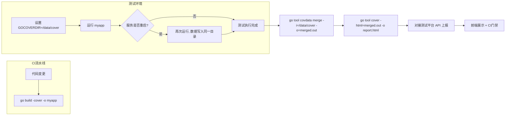

## 关于将 Go 代码覆盖率深度集成至测试平台的最终方案

### 一、 背景与目标

#### 1.1 当前痛点
- 当前无单元测试覆盖率，**集成测试、API 自动化测试、端到端测试的代码覆盖情况完全黑盒**。
- 测试环境中的 Go 服务会**多次重新打包、重启**（如每日构建、回归测试），传统 `go test -coverprofile` 模式无法应对进程中断导致的数据丢失。
- 缺乏客观数据判断测试用例的充分性，存在“漏测”风险。

#### 1.2 项目目标
1. **构建自动化覆盖率采集能力**：在不中断测试流程的前提下，自动采集每一次测试运行（包括服务多次重启）的代码覆盖率数据。
2. **建立覆盖率度量与门禁**：将覆盖率指标集成到 CI/CD 流水线，支持增量覆盖率展示、历史趋势分析，并设置质量门禁（如新增代码覆盖率不低于 80%）。
3. **实现低侵入、高可用的数据收集**：适配服务频繁重启、长时间运行的测试环境，确保覆盖率数据不丢失、可合并。

---

### 二、 技术方案对比与选型

针对“服务多次重启、长期运行”的集成测试场景，对比三种主流方案。**推荐采用方案B（官方原生方案）**。

| 对比维度                     | **方案A：`go test -c` + 手动合并**                           | **方案B：`go build -cover` + `GOCOVERDIR`（推荐）**          | **方案C：`goc` 远程实时采集**                                |
| :--------------------------- | :----------------------------------------------------------- | :----------------------------------------------------------- | :----------------------------------------------------------- |
| **核心原理**                 | 构建插桩测试二进制，通过 `-test.coverprofile` 指定每次运行的输出文件，最后用 `gocovmerge` 合并。 | 使用 `go build -cover` 构建插桩程序，运行时设置环境变量 `GOCOVERDIR`，程序退出时自动将覆盖率数据写入该目录。 | 构建时注入 `goc` 代理，启动后向中心服务注册，支持随时通过 API 拉取当前覆盖率快照。 |
| **数据保存时机**             | 进程正常退出时写入                                           | 进程退出时自动写入（Go 运行时保证）                          | 实时拉取，不依赖进程退出                                     |
| **应对“多次重启”**           | 好：每次启动指定不同文件名，事后合并                         | **好**：每次启动设置相同 `GOCOVERDIR`，数据自动累积，Go 1.23+ 支持自动合并 | 优秀：中心服务聚合所有实例数据                               |
| **是否需要修改业务代码**     | 否                                                           | 否                                                           | 否                                                           |
| **是否需要额外工具**         | 需要 `gocovmerge`                                            | **否**（`go tool covdata` 随 Go 安装）                       | 需要部署 `goc` 服务端                                        |
| **CI 集成复杂度**            | 中等                                                         | **低**（一行 `go tool covdata merge` 命令）                  | 中等                                                         |
| **对测试环境改造**           | 修改启动命令，增加 `-test.coverprofile` 参数                 | 修改构建命令（`go build -cover`）和启动命令（增加 `GOCOVERDIR`） | 修改构建命令为 `goc build`，启动 `goc server`                |
| **服务崩溃容错**             | 弱：未正常退出可能丢失数据                                   | 弱：同样依赖正常退出                                         | 强：可主动拉取                                               |
| **官方支持趋势**             | 稳定，Go 1.5+ 即存在                                         | **官方未来主力方向**（Go 1.20+ 集成测试覆盖提案）            | 第三方工具，更新较慢                                         |
| **开发投入（人日）**         | 中（约 3 人日）                                              | **低（约 2 人日）**                                          | 高（约 6 人日）                                              |
| **总落地耗时（含平台集成）** | 约 10 人日                                                   | **约 8.5 人日**                                              | 约 15 人日                                                   |

#### 选型结论
**推荐采用方案B（`go build -cover` + `GOCOVERDIR`）**，理由：
- **官方原生，未来兼容性好**（Go 1.20 引入，1.23 已支持自动合并）。
- **开发投入最低**（仅需修改构建/启动命令，合并使用 `go tool covdata` 一行完成）。
- **对多次重启友好**（通过统一 `GOCOVERDIR` 目录自动累积数据）。
- **无额外依赖**，运维成本低。

---

### 三、 实施方案（基于方案B）

#### 3.1 整体架构流程

#### 3.2 关键技术细节

| 环节         | 命令/操作                                                    | 说明                                                      |
| :----------- | :----------------------------------------------------------- | :-------------------------------------------------------- |
| **构建**     | `go build -cover -covermode=atomic -coverpkg=./... -o myapp` | `atomic` 模式保证并发安全；`-coverpkg` 指定统计的包路径。 |
| **运行**     | `export GOCOVERDIR=/tmp/coverage_$(date +%s)`   `./myapp` | 建议每次构建或每天运行使用独立目录，避免历史数据干扰。    |
| **合并**     | `go tool covdata merge -i=$GOCOVERDIR -o=coverage.total.out` | Go 1.23+ 可省略手动合并，运行时自动合并。                 |
| **生成报告** | `go tool cover -html=coverage.total.out -o coverage.html`    | 生成可视化 HTML 报告。                                    |
| **对接平台** | 解析 `coverage.total.out`，通过 HTTP API 上报覆盖率数据及文件级详情。 | 平台端展示趋势图、增量覆盖率、门禁结果。                  |
| **CI 门禁**  | 在 MR/PR 流水线中增加步骤：解析覆盖率，与基线对比（如新增代码覆盖率 < 80% 则阻断）。 | 门禁结果自动评论到 MR 中。                                |

#### 3.3 应对服务崩溃的增强措施（可选，0.5 人日）
虽然方案B依赖正常退出，但可通过以下方式降低数据丢失风险：
- 在服务 `main` 函数中增加 `defer` 调用 `testing.Coverage()` 将当前覆盖率写入临时文件。
- 或启动定时器（如每 5 分钟）自动保存一次覆盖率快照。

---

### 四、 资源需求

#### 4.1 人力资源

| 角色                  | 人数  | 主要职责                                                     |
| :-------------------- | :---- | :----------------------------------------------------------- |
| **后端开发工程师**    | 1人   | 修改构建脚本（`go build -cover`）、启动脚本（添加 `GOCOVERDIR`），实现合并与报告生成逻辑。 |
| **测试开发工程师**    | 1人   | 对接测试平台 API，设计覆盖率展示页面与门禁逻辑。             |
| **运维/DevOps工程师** | 0.5人 | 协助调整 CI 流水线，确保环境变量和磁盘权限配置正确。         |

#### 4.2 工具与环境依赖
- **Go 版本要求**：**≥ 1.20**（推荐 1.23+ 以获得自动合并能力）。
- **已就绪**：现有测试平台、CI 流水线。
- **需配置**：测试环境预留 **10GB** 磁盘空间用于存放覆盖率中间文件。
- **无需额外安装工具**（`go tool covdata` 随 Go 安装自带）。

#### 4.3 预计时间

| 阶段                  | 工作内容                                                     | 工时                                     |
| :-------------------- | :----------------------------------------------------------- | :--------------------------------------- |
| **阶段1：POC验证**    | 在单个 Go 服务上验证 `go build -cover` + `GOCOVERDIR` 全流程，测试多次重启的数据合并。 | 1 人日                                   |
| **阶段2：平台集成**   | 将覆盖率采集能力插件化，对接测试平台 API，开发前端展示组件（趋势图、文件级详情）。 | 4 人日                                   |
| **阶段3：门禁落地**   | 在 CI 流水线中加入覆盖率门禁，自动评论 MR/PR。               | 1.5 人日                                 |
| **阶段4：推广与优化** | 推广到其他 Go 服务，增加崩溃保护（可选），编写文档。         | 2 人日                                   |
| **合计**              |                                                              | **8.5 人日**（约 2 周，按 1.5 人力并行） |

---

### 五、 风险与应对

| 风险                                    | 概率 | 影响 | 缓解措施                                                     |
| :-------------------------------------- | :--- | :--- | :----------------------------------------------------------- |
| **服务被 `kill -9` 导致覆盖率数据丢失** | 中   | 中   | 1. 避免在测试环境使用强制杀进程；2. 增加定期自动保存（0.5 人日）；3. 备选 `goc` 方案兜底。 |
| **Go 版本 < 1.20**                      | 低   | 高   | 升级测试环境 Go 版本至 1.20+（1 人日），或回退至方案A。      |
| **合并后报告过大，加载缓慢**            | 低   | 低   | 限制只展示增量代码覆盖率，或按包折叠展示。                   |
| **CI 门禁拉长流水线总耗时**             | 中   | 低   | 合并与报告生成设为异步任务，不阻塞后续构建。                 |
| **多服务并行测试时磁盘空间不足**        | 中   | 中   | 每次运行后自动清理 `GOCOVERDIR` 目录，设置定时任务清理超过 7 天的数据。 |

---

### 六、 预期价值

1. **量化测试质量**：精准识别未被集成测试覆盖的代码分支，指导补充测试用例，预计减少 30% 以上线上漏测缺陷。
2. **保护核心代码**：在 CI 门禁中强制要求变更代码的覆盖率，防止低质量代码合入主干。
3. **自动化节省人力**：无需人工分析“哪些场景没测到”，平台自动生成报告并关联到 MR/PR 评论中。
4. **为重构提供信心**：高覆盖率下的重构风险更低，加速技术债务偿还。

---

### 七、 结语

本方案推荐使用 **`go build -cover` + `GOCOVERDIR`** 这条官方原生路径，**开发投入仅 8.5 人日，2 周内即可完成首个服务试点并上线覆盖率看板**。实施后将首次实现从单元测试到端到端测试的全链路质量度量，为测试用例精准增补和代码质量门禁提供坚实的数据支撑。

**建议批准立项，并立即安排 Go 版本环境检查（确保 ≥1.20）后启动。**

