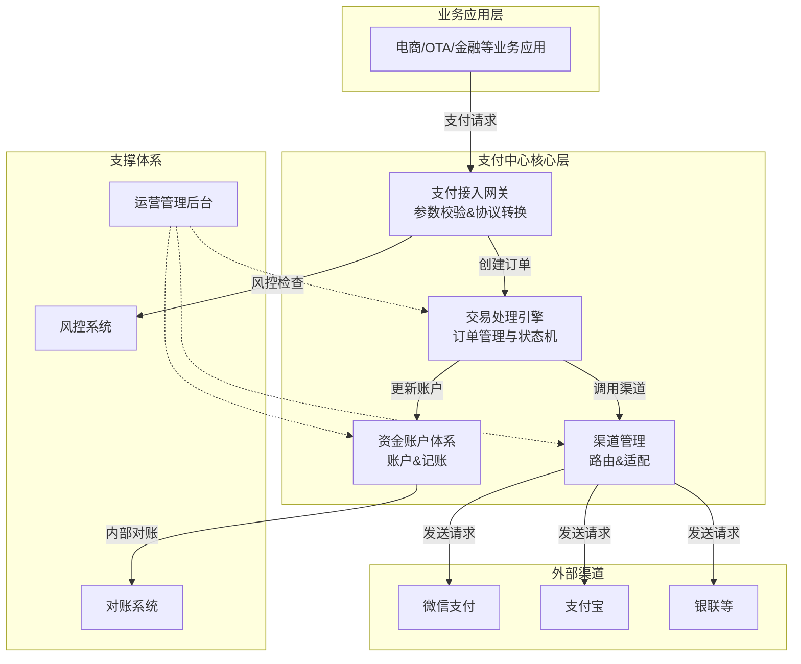

互联网支付中心的业务架构。支付中心是现代互联网公司的核心基础设施之一，它如同公司业务的“心脏”和“账房”，负责所有资金流的处理、记录和管控。

一个典型的支付中心业务架构可以概括为“**三层三横**”的结构。下面我将从业务功能模块（纵向）和支撑体系（横向）两个维度来详细阐述。

---

### 一、 核心业务功能层（纵向三层）

这三层是支付中心最核心的业务流程，处理一笔支付交易从发起至完结的全生命周期。

#### 1. 交易核心层
这是支付流程的主干，负责支付交易的核心逻辑处理，追求高可用、高并发和低延迟。
*   **支付接入（支付网关）**：对外提供统一的支付接口，接收来自各个业务线（如电商、金融、出行）的支付请求。它负责协议的转换、参数的校验、基本的风控和请求的路由。
*   **交易处理引擎**：支付的核心大脑。负责创建支付订单、管理订单状态（待支付、支付中、成功、失败）、调用渠道执行支付、处理渠道的异步回调通知、更新订单状态。它必须保证数据的一致性，通常涉及分布式事务。
*   **渠道管理**：支付中心需要对接众多的外部支付渠道（如微信、支付宝、银联、信用卡、第三方支付等）。此模块统一管理这些渠道：
    *   **渠道路由**：根据预设策略（费率最低、渠道稳定性最高、业务类型等）智能选择最合适的支付渠道。
    *   **渠道适配**：将内部统一的支付请求参数，转换成各个渠道特有的格式和协议，实现对接的标准化，屏蔽不同渠道的复杂性。
    *   **渠道监控**：实时监控各渠道的成功率、耗时、可用性，为路由和运营提供数据支持。

#### 2. 资金账户层
负责管理用户的虚拟资金账户，处理所有资金的变动，是支付中心的“账本”，对数据一致性要求极高。
*   **账户体系**：建立用户、商户、平台等各类实体（Entity）的账户。常见账户类型包括：
    *   **现金账户**：记录用户的余额、充值、消费。
    *   **优惠账户**：记录红包、优惠券、积分等信息。
    *   **银行账户**：记录绑定的银行卡、信用卡信息。
*   **账务核心**：采用成熟的**会计思想**（如复式记账法）来记录所有资金流转。
    *   **记账**：每一笔资金变动（支付、退款、充值、提现）都会生成一条或多条不可更改的流水记录，确保账务的准确性和可追溯性。例如，用户支付100元，会同时记录“用户现金账户-100”和“商户待结算账户+100”。
    *   **对账**：保证资金一致性的关键环节。
        *   **内部对账**：确保支付中心的交易记录和账户系统的资金流水完全匹配。
        *   **外部对账**：下载渠道提供的对账文件，与自身的交易记录进行勾兑，找出差异单（如渠道成功但本地显示失败），并进行处理，保证和渠道方的数据一致。

#### 3. 运营支撑层
为支付业务的高效、安全、稳定运行提供支持，偏向于内部管理和对外服务。
*   **风控系统**：7x24小时实时监控交易，识别和防控欺诈风险。规则包括：盗卡、盗号、套现、刷单等。采用规则引擎+机器学习模型相结合的方式。
*   **计费与清结算**：
    *   **计费**：计算每笔交易应付给渠道的手续费。
    *   **清算**：根据对账结果，计算出一个结算周期内应与渠道结算的资金净额。
    *   **结算**：将资金从渠道账户划拨到公司银行账户，或给商户进行分润、出款。
*   **管理与报表**：为运营、财务、业务人员提供后台管理功能，如交易查询、账户管理、费率配置、渠道管理等，并提供丰富的数据报表用于业务分析。

---

### 二、 横向支撑体系（横向三横）

这三个体系贯穿所有业务层，是支付中心稳定运行的基石。

#### 1. 安全与风控体系
*   **通信安全**：全链路HTTPS、数据签名防篡改。
*   **数据安全**：敏感信息（密码、银行卡号）加密存储、脱敏展示。
*   **交易风控**：如前所述，实时反欺诈。

#### 2. 稳定性与性能体系
*   **高可用架构**：避免单点故障，核心服务采用集群部署，多机房容灾。
*   **高性能处理**：数据库分库分表、缓存（Redis）广泛应用、消息队列（Kafka/RocketMQ）异步化解耦、应对峰值流量。
*   **弹性伸缩**：在云原生环境下，根据流量自动扩容缩容。

#### 3. 监控与运维体系
*   **全链路监控**：从用户发起支付到最终成功，追踪每一个环节的性能和状态（类似Google Dapper）。
*   **日志系统**：集中日志收集与查询，便于排查问题。
*   **报警系统**：对系统错误、延迟增高、成功率下降等异常情况及时报警。

---

### 核心架构图

下图概括了上述架构的核心模块与流程：

---

### 总结与核心价值

支付中心的核心业务价值在于：

1.  **统一封装，简化接入**：将复杂的支付流程和多样的支付渠道封装成简单、统一的接口，让业务方能够快速、低成本地接入支付能力。
2.  **资金安全，准确无误**：通过严谨的账户和账务体系，保证每一分钱来去清晰、有迹可循，绝对准确。
3.  **稳定高效，体验流畅**：通过高可用的架构设计，保障支付流程的高成功率和高性能，提升用户体验。
4.  **风险管控，降低损失**：有效识别和拦截欺诈交易，保护用户和平台的资金安全。
5.  **数据驱动，决策支持**：提供全面的支付数据报表，为业务运营和决策提供关键数据支持。

设计一个支付中心是一个复杂的系统工程，需要充分考虑业务现状、未来发展、技术选型和合规要求。希望这份介绍能帮助您全面理解支付中心的业务架构。