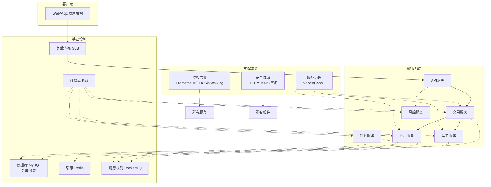

# 支付中心的技术架构。

支付中心的技术架构是其业务架构的物理实现，旨在满足**高可用、高并发、一致性、安全性和可扩展性**的苛刻要求。一个成熟支付中心的技术架构通常呈现为层次化和模块化的设计。

### 核心设计原则

在深入细节之前，首先要理解几个核心设计原则：
1.  **高可用**：任何组件都不能有单点故障，需实现多机房容灾。支付系统停机意味着业务停摆，损失巨大。
2.  **数据一致性**：资金数据绝对不能出错，必须保证所有系统状态和账户余额的高度一致，通常通过分布式事务来实现。
3.  **安全性**：从网络通信、数据存储到业务流程，每个环节都需严格的安全控制，防止信息泄露和资金盗用。
4.  **弹性与可扩展性**：能够应对像“双十一”这样的流量洪峰，支持业务快速增长，可水平扩展。
5.  **可追溯性**：每一笔资金流动都有完整的日志记录，便于审计和问题排查。

---

### 技术架构详解

一个典型的支付中心技术架构可以分为以下几层，我们从底层到接入层逐一解析：

#### 1. 基础设施层
这是所有系统运行的基石，通常采用混合云或全云化部署。
*   **计算**：广泛采用**容器化**技术（Docker）和**编排系统**（Kubernetes），实现快速部署、弹性伸缩和资源隔离。
*   **网络**：使用**负载均衡**（SLB/ELB/Nginx）进行流量分发。关键服务采用**多机房多活**或主备部署，通过智能DNS或全局负载均衡（GSLB）实现异地容灾。
*   **存储**：对象存储（OSS/S3）用于存放对账文件等非结构化数据。

#### 2. 数据存储层
根据不同的数据特性，选用不同的数据库，这是技术架构的核心。
*   **核心业务数据（交易订单、账户流水）**：
    *   **关系型数据库（MySQL）**：是绝对的主力。但单机MySQL无法满足要求，必须采用**分库分表**（如使用ShardingSphere、Vitess等中间件）来分散压力和存储。通常按用户ID或订单号进行分片。
    *   **为什么是MySQL？** 因为它的事务特性（ACID）对于保证资金数据的一致性至关重要。
*   **缓存**：
    *   **Redis**：无处不在。用于缓存热点数据（如用户信息、费率信息）、存储会话（Session）、作为分布式锁服务，以及用作高速计数器和队列。
*   **大数据与分析**：
    *   **Elasticsearch**：用于存储和快速检索海量日志和交易数据。
    *   **Hadoop/Hive** 或 **数据仓库（ClickHouse, Apache Doris）**：用于离线对账、批量处理和商业智能（BI）分析。
*   **消息队列**：
    *   **RocketMQ/Kafka**：实现系统解耦和异步化。关键应用包括：
        *   **异步通知**：支付成功后，异步通知业务系统，避免阻塞主流程。
        *   **削峰填谷**：将突发流量缓冲到队列中，让下游系统匀速消费。
        *   **数据同步**：将交易数据同步到ES或大数据平台。

#### 3. 核心服务层（微服务架构）
现代支付中心普遍采用**微服务架构**，将复杂的单体应用拆分为一组小而自治的服务。
*   **API网关**：
    *   技术选型：Spring Cloud Gateway, Zuul, Kong等。
    *   职责：**统一入口**，负责协议转换、路由、认证、鉴权、限流、熔断、日志聚合。所有外部请求首先到达网关。
*   **微服务集群**：
    *   **交易服务**：负责支付订单的生命周期管理，状态机是其核心。
    *   **渠道服务**：封装所有与外部支付渠道的交互，实现渠道路由和参数适配。
    *   **账户服务**：负责账户管理和记账操作，是资金一致性的核心。通常会依赖分布式事务框架（如Seata）来保证“扣款-记账”等操作的一致性。
    *   **风控服务**：实时接收交易流水，通过规则引擎（如Drools）和机器学习模型进行风险判断。
    *   **对账服务**：定时任务下载渠道对账文件，与本地订单核对，生成差异单。
    *   **清结算服务**：处理与渠道和商户的资金结算。
*   **服务治理**：
    *   **服务注册与发现**：使用Nacos, Consul, Eureka等，服务实例动态注册和被发现。
    *   **配置中心**：使用Nacos, Apollo等，统一管理应用配置，实现动态刷新。
    *   **分布式追踪**：使用SkyWalking, Pinpoint等，实现全链路性能监控，快速定位故障点。

#### 4. 支撑体系层
*   **分布式事务**：解决微服务架构下的数据一致性问题。常用模式：
    *   **TCC模式**（Try-Confirm-Cancel）：适用于核心流程，如账户资金变动。性能好，但业务侵入性强。
    *   **基于消息的最终一致性**：适用于非核心的异步场景，如支付成功后发放积分。
*   **监控与告警**：
    *   **Metrics**：Prometheus + Grafana 监控系统指标（QPS, 耗时, 成功率）。
    *   **Logging**：ELK/EFK（Elasticsearch, Logstash/Filebeat, Kibana）收集和查询日志。
    *   **Tracing**：SkyWalking 分析链路性能。
    *   **告警**：集成PagerDuty、钉钉、短信等，及时通知运维人员。
*   **安全体系**：
    *   **网络**：防火墙、VPC隔离。
    *   **通信**：全链路HTTPS，敏感API请求签名验签（防止篡改和重放）。
    *   **数据**：敏感信息（银行卡、密码）**加密存储**（使用AES等算法），展示时脱敏。
    *   **秘钥**：使用**HSM**（硬件安全模块）或**KMS**（密钥管理服务）统一管理，严禁硬编码。

---

### 核心技术架构图

以下图表概括了上述技术组件如何协同工作：

### 总结：技术选型趋势

*   **云原生**：容器化（Docker）+ 编排（Kubernetes）已成为基础设施的标准。
*   **微服务**：Spring Cloud Alibaba, Dubbo 等框架是构建分布式系统的主流选择。
*   **数据库**：MySQL（关系型）+ Redis（缓存）是黄金组合，TiDB等NewSQL数据库也在探索用于解决分库分表的管理难题。
*   **消息队列**：RocketMQ/Kafka 用于异步化和解耦。
*   ** observability**：可观测性（日志、指标、追踪）不再是可选项，而是标准配置。

支付中心的技术架构是一个复杂而精密的系统，每一个技术组件的选型和设计都紧密围绕着**业务需求**和**核心设计原则**展开，最终目标是在保证**资金安全**和**数据准确**的前提下，提供稳定、高效、灵活的支付服务。