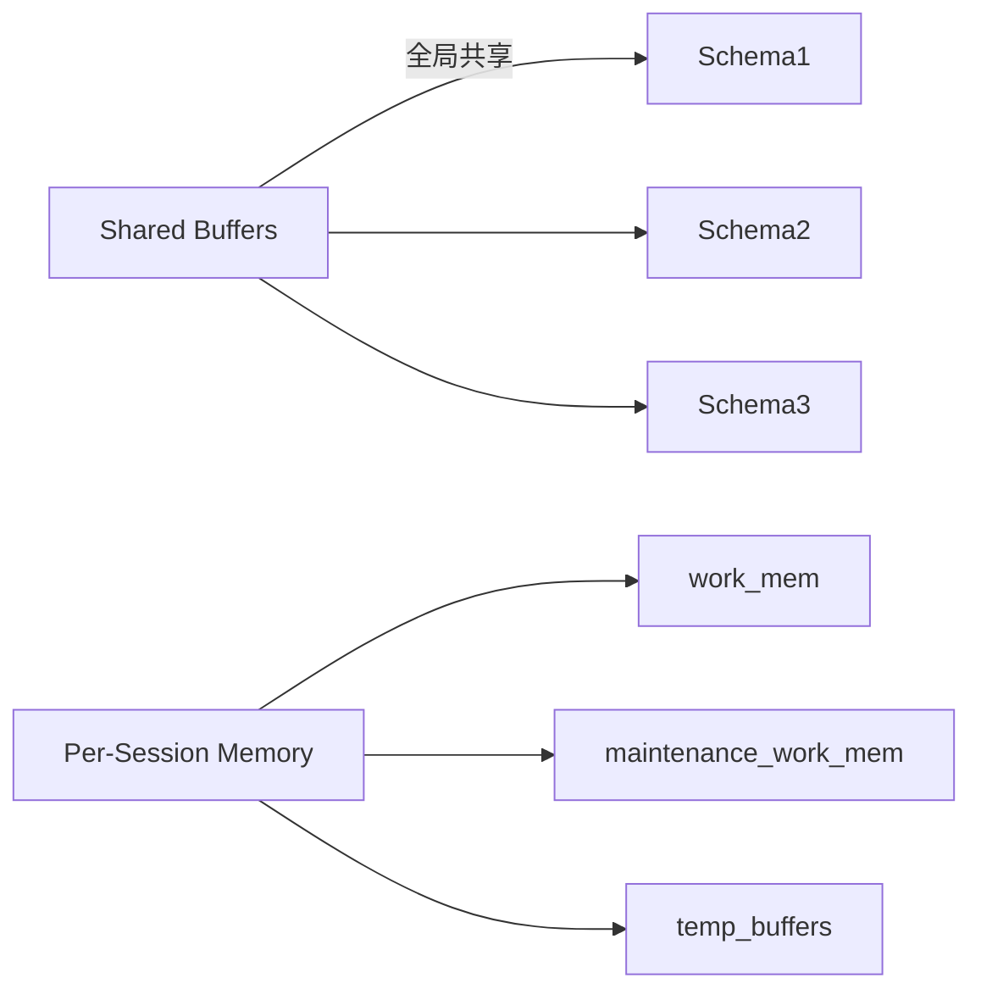

在 PostgreSQL 中，多个 Schema 共享同一个数据库实例的资源，**不存在完全的物理隔离**，而是通过逻辑隔离和资源配额机制实现管理。以下是详细的资源使用逻辑：

---

### 一、资源使用基本原则
| 资源类型     | 共享/隔离级别    | 说明                                         |
| ------------ | ---------------- | -------------------------------------------- |
| **CPU**      | 完全共享         | 所有 Schema 的查询平等竞争 CPU 时间片        |
| **内存**     | 部分隔离         | 共享缓冲区 + 每个会话私有内存                |
| **磁盘 I/O** | 竞争共享         | 所有 Schema 的表/索引共享磁盘 I/O 带宽       |
| **连接数**   | 数据库级全局限制 | `max_connections` 限制所有 Schema 的总连接数 |
| **锁资源**   | 全局共享         | 表锁/行锁在数据库实例级别管理                |

---

### 二、关键资源分配机制
#### 1. 内存管理


- **共享缓冲区**（shared_buffers）：所有 Schema 共享
- **会话私有内存**：
  - `work_mem`：每个排序/哈希操作独立分配
  - `maintenance_work_mem`：VACUUM/索引创建专用
  - 大查询可能耗尽内存影响其他 Schema

#### 2. I/O 优先级控制
通过 Linux cgroups 实现物理隔离（需操作系统配合）：
```bash
# 为 PostgreSQL 进程分配 I/O 权重
echo '1000' > /sys/fs/cgroup/blkio/pg_service/blkio.weight
```

#### 3. CPU 资源限制
使用 `pg_cgroups` 扩展实现 Schema 级 CPU 隔离：
```sql
CREATE EXTENSION pg_cgroups;

-- 为 sales schema 分配 40% CPU
SELECT cgroup_set_cpu_limit('sales_group', 0.4);
```

---

### 三、资源抢占场景分析
#### 1. 高负载 Schema 影响示例
```sql
-- Schema1 运行大型报表
SELECT * FROM schema1.sales_data 
WHERE date > '2023-01-01' 
ORDER BY revenue DESC; -- 占用大量 work_mem

-- Schema2 简单查询被阻塞
UPDATE schema2.users SET status=1 WHERE id=100; -- 等待内存释放
```

#### 2. 锁冲突场景
```sql
-- Schema1 执行长时间DDL
ALTER TABLE schema1.orders ADD COLUMN discount NUMERIC;

-- Schema3 查询被阻塞
SELECT * FROM schema3.products; -- 需要AccessShareLock
```

---

### 四、资源隔离解决方案
#### 1. 物理级隔离（推荐）
| 方案               | 适用场景          | 实现方式                              |
| ------------------ | ----------------- | ------------------------------------- |
| **独立数据库实例** | 严格隔离需求      | 每个 Schema 部署单独 PG 实例          |
| **容器化隔离**     | 云环境/微服务架构 | Docker/K8s 单 Pod 单 Schema           |
| **表空间分离**     | 隔离磁盘 I/O      | `TABLESPACE sales_space OWNER sales;` |

#### 2. 逻辑隔离配置
```sql
-- 1. 按 Schema 设置连接配额
ALTER ROLE sales_user CONNECTION LIMIT 20;

-- 2. 限制用户内存使用
ALTER ROLE finance_user SET work_mem = '16MB';

-- 3. 设置查询超时
ALTER ROLE report_user SET statement_timeout = '5min';
```

#### 3. 资源组控制（PG13+）
```sql
CREATE RESOURCE GROUP sales_group 
WITH (cpu_rate_limit=0.3, memory_limit=0.4);

ALTER ROLE sales_user RESOURCE GROUP sales_group;
```

---

### 五、监控与优化建议
#### 1. 关键监控指标
```sql
-- 按 Schema 监控资源使用
SELECT 
  schemaname,
  SUM(seq_scan) AS scans,
  SUM(idx_scan) AS index_scans,
  pg_size_pretty(SUM(pg_total_relation_size(quote_ident(schemaname)||'.'||quote_ident(tablename)))) AS size
FROM pg_stat_all_tables
GROUP BY schemaname;
```

#### 2. 优化策略
- **索引优化**：为高频查询 Schema 添加专属索引
- **分区表**：大表按时间分区减少锁冲突
- **连接池**：使用 pgBouncer 按 Schema 分配连接池
- **负载均衡**：读写分离缓解 I/O 压力

---

### 六、不同场景推荐方案
| 场景             | 推荐隔离方案        | 配置示例                      |
| ---------------- | ------------------- | ----------------------------- |
| 开发/测试环境    | 逻辑隔离            | 设置不同 work_mem 配额        |
| 多租户 SaaS 应用 | 表空间分离 + 资源组 | 每个租户独立表空间 + CPU 限制 |
| 金融交易系统     | 物理实例隔离        | 独立服务器部署核心 Schema     |
| 分析型报表系统   | 读写分离 + 资源组   | 只读副本 + 专用内存配额       |

> **重要提示**：生产环境建议至少实现表空间分离 + 资源组控制，核心业务 Schema 应部署在独立实例。