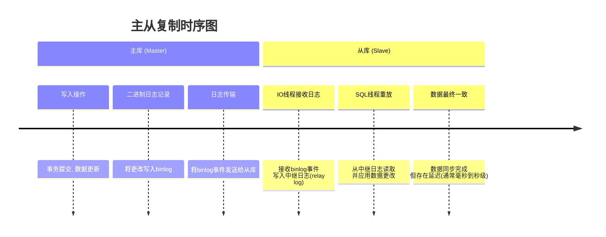
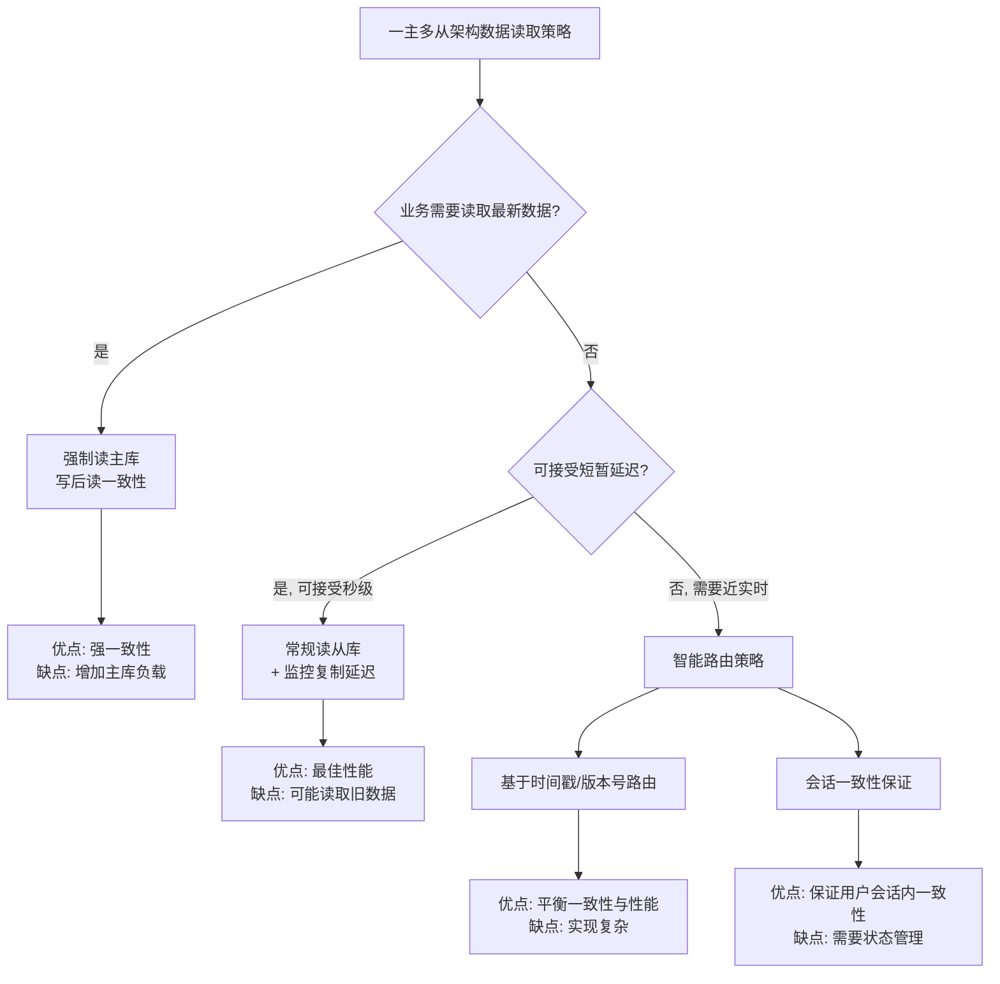

# 一主多从架构下的数据时效性与事务级别权衡

在一主多从（Master-Slave Replication）架构中，数据时效性和一致性变得更加复杂，需要仔细权衡。以下是详细分析和建议：

## 数据时效性特点

在一主多从架构中，数据同步存在固有延迟：



这种异步复制机制导致主从库之间存在**数据延迟**，延迟时间取决于：
- 网络带宽和延迟
- 从库的硬件性能
- 数据库负载大小
- 复制配置方式

## 事务级别的考虑

### 1. 主库上的事务级别

在主库上，事务级别的选择与单实例数据库相同：

- **写操作**（INSERT/UPDATE/DELETE）总是在主库执行，需要根据业务需求选择适当的事务隔离级别
- 对于需要强一致性的写操作，建议使用 **REPEATABLE READ**（MySQL默认）或 **READ COMMITTED**

### 2. 从库上的读取挑战

当应用程序从从库读取数据时，面临的主要问题是**读取到陈旧数据**（stale data），因为主从同步存在延迟。

## 解决方案与权衡策略

以下是根据不同业务场景的解决方案决策流程：



### 1. 强制读主库（强一致性）

**适用场景**：金融交易、支付确认、库存管理等高一致性要求场景

**实现方式**：
```sql
-- 在代码中确保特定操作总是读主库
-- 例如，在用户下单后查看订单详情时，强制路由到主库
UPDATE orders SET status = 'paid' WHERE order_id = 123; -- 写主库
SELECT * FROM orders WHERE order_id = 123; -- 必须读主库以确保数据新鲜
```

**优缺点**：
- ✅ 保证强一致性，总能读到最新数据
- ❌ 增加主库负载，失去读扩展的优势

### 2. 常规读从库（最终一致性）

**适用场景**：商品浏览、新闻阅读、评论查看等对数据时效性要求不高的场景

**实现方式**：
```sql
-- 大多数读操作可以路由到任意从库
SELECT * FROM products WHERE category = 'electronics'; -- 读从库
SELECT * FROM news_articles ORDER BY publish_date DESC LIMIT 10; -- 读从库
```

**优缺点**：
- ✅ 最佳性能，充分利用读扩展能力
- ❌ 可能读取到过时数据

### 3. 智能路由策略（平衡方案）

#### 方案A：基于时间戳的读取

```python
# 伪代码示例：基于写入时间决定读取路径
last_write_time = get_last_write_time(user_id)  # 获取用户最后写入时间

if current_time - last_write_time < REPLICATION_DELAY_THRESHOLD:
    # 近期有写入操作，读主库
    db_connection = connect_to_master()
else:
    # 近期无写入操作，读从库
    db_connection = connect_to_slave()
```

#### 方案B：基于版本号的读取

```sql
-- 1. 写入时记录数据版本
UPDATE accounts SET balance = 100, version = version + 1 WHERE account_id = 456;

-- 2. 读取时检查版本
SELECT * FROM accounts WHERE account_id = 456;
-- 如果发现版本不匹配或数据过时，可以重新从主库读取
```

#### 方案C：会话一致性保证

```java
// 伪代码：保证同一会话内的一致性
public class SessionAwareRouter {
    private Map<String, Boolean> sessionWriteMap = new ConcurrentHashMap<>();
    
    public Connection getConnection(String sessionId) {
        if (sessionWriteMap.containsKey(sessionId)) {
            // 会话内有写操作，读主库
            sessionWriteMap.remove(sessionId); // 清除标记（可选）
            return masterConnection;
        } else {
            // 无写操作，读从库
            return slaveConnection;
        }
    }
    
    public void markSessionWrite(String sessionId) {
        sessionWriteMap.put(sessionId, true);
    }
}
```

## 实际应用建议

### 1. 业务分级策略

根据业务重要性对数据一致性要求进行分级：

| 一致性等级     | 业务场景           | 技术方案                                |
| -------------- | ------------------ | --------------------------------------- |
| **强一致性**   | 支付、资金操作     | 始终读主库，使用REPEATABLE READ隔离级别 |
| **会话一致性** | 用户配置、购物车   | 写后一段时间内读主库，或使用版本控制    |
| **最终一致性** | 商品目录、新闻内容 | 读从库，监控复制延迟                    |

### 2. 监控与告警

实施全面的监控体系：
- 监控主从复制延迟（`SHOW SLAVE STATUS`中的`Seconds_Behind_Master`）
- 设置延迟告警阈值（如：超过5秒触发告警）
- 实时监控从库负载和健康状况

### 3. 架构优化

- **使用代理中间件**：如MySQL Router、ProxySQL等，实现自动读写分离和智能路由
- **采用半同步复制**：平衡性能和数据一致性，确保至少一个从库接收数据后主库才提交事务
- **多地从库分级**：设置近距离从库（低延迟）和远距离从库（灾备）

## 总结

在一主多从架构中，数据时效性和一致性的权衡需要：

1. **业务驱动**：根据业务场景决定一致性要求
2. **分级处理**：不同业务采用不同的一致性策略
3. **技术保障**：通过智能路由、版本控制等技术平衡性能与一致性
4. **监控预警**：实时监控复制状态，确保数据延迟在可接受范围内

没有一种方案适合所有场景，关键是找到适合自己业务需求的平衡点。对于大多数互联网应用，采用"最终一致性为主，强一致性为辅"的混合策略通常是最佳选择。