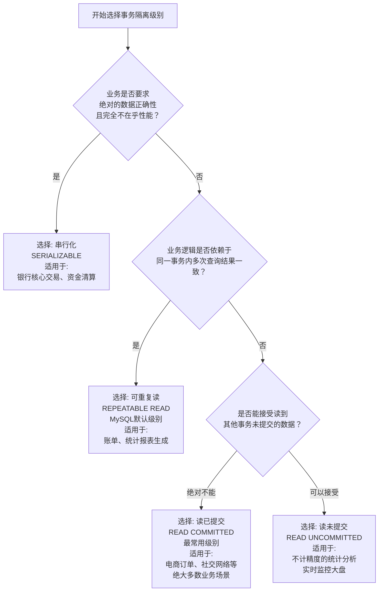

事务隔离级别的选择本质上是一种 **权衡（Trade-off）**，是在**数据准确性**和**系统性能（并发能力）** 之间寻找平衡点。选择哪种方案，完全取决于你的**业务场景对数据一致性的要求**。

下面我将结合具体业务场景，详细介绍如何选择事务隔离级别。

---

### 核心决策思路

选择隔离级别的过程，其实就是不断问自己两个问题：
1.  **我的业务能容忍哪种数据不一致？**（脏读、不可重复读、幻读）
2.  **为了保持数据一致，我愿意牺牲多少性能？**

这个过程可以总结为以下决策流程图，帮助你根据业务特征做出选择：

---

### 各级别详细业务场景分析

#### 1. 读未提交 (READ UNCOMMITTED) - **几乎不用**

*   **业务场景**：
    *   **极其宽松的统计分析**：例如，需要一个实时更新的、对准确性要求极低的大盘监控，比如“网站实时在线人数概览”，数字差几个无所谓，但要非常快。
    *   **日志查询或审计**：只是看看数据大概的样子，不用于任何正式决策。
*   **决策理由**：业务明确表示可以接受数据是“脏”的、不准确的，**速度远比准确性重要**。
*   **风险提示**：**除非你非常清楚后果，否则生产环境严禁使用此级别。** 读到中间状态数据可能导致灾难性决策错误。

#### 2. 读已提交 (READ COMMITTED) - **推荐常用**

*   **业务场景**：
    *   **绝大多数Web应用业务**：社交媒体发帖、新闻站点评论、用户个人信息更新等。
    *   **电商系统（非核心库存）**：商品信息展示、订单列表查询。用户A提交订单后（但事务未提交），用户B看商品库存数不变是合理的。用户A提交后，用户B看到库存减少也是合理的。
*   **决策理由**：业务逻辑**不依赖于**同一事务内多次读取数据的一致性。每次查询都看到最新已提交的数据是更自然的行为。避免了脏读，保证了最基本的准确性，同时保持了良好的并发性能。
*   **举例**：用户发表一条评论，其他用户不需要等到发表事务提交就能立即看到这条评论（实际上他们的事务会读到已提交的数据）。**不可重复读在这里不是问题，而是特性。**

#### 3. 可重复读 (REPEATABLE READ) - **MySQL默认，适用于核心业务**

*   **业务场景**：
    *   **账单、财务报表生成**：在生成一份月度账单的过程中，无论其他事务是否在同时更新数据，这份账单的内容必须是固定的、可重复读的。不能第一次算出来是100元，第二次算变成95元。
    *   **银行账户余额检查**：在你进行转账操作的整个事务过程中（先查余额，再扣款），你看到的余额必须是你事务开始时的值，防止你基于一个正在变化的余额做出错误的转账决策。
    *   **需要一致性视图的后台作业**。
*   **决策理由**：业务逻辑**严重依赖于**同一事务内数据视图的绝对一致性。必须保证在事务执行期间，所看到的数据不受外界影响，以便做出正确的业务判断。
*   **实现机制**：InnoDB 通过 **MVCC (多版本并发控制)** 为该事务在开始时创建一个**一致性数据快照**，后续读取都基于这个快照，因此不会看到其他事务提交的修改。

#### 4. 串行化 (SERIALIZABLE) - **金融级或极端场景**

*   **业务场景**：
    *   **银行核心交易系统**：如跨行转账、清算业务。两个用户同时试图对同一个账户进行高并发操作（比如同时花钱），必须通过加锁串行执行，绝对防止任何可能的并发问题。
    *   **库存扣减（防超卖）**：在高并发秒杀场景下，为了避免超卖（库存减到负数），除了使用`SELECT ... FOR UPDATE`悲观锁，也可以使用串行化隔离级别，强制让减库存操作排队执行。
    *   **选举、投票计数**：确保每一张票都不会被重复计算或遗漏。
*   **决策理由**：业务要求**绝对的数据正确性**，不允许出现任何极端情况下的并发问题幻读。愿意为此牺牲所有并发性能，让操作排队执行。
*   **注意**：这是最安全但也是最慢的方式。通常不会全局设置此级别，而只在**执行特定关键操作**时，通过`SELECT ... FOR UPDATE`这样的悲观锁来模拟串行化的效果，从而避免全局性能瓶颈。

---

### 如何结合业务制定方案：实战步骤

1.  **分析业务操作**：识别出你系统中的核心事务流程。例如，“用户下单扣减库存”是一个核心事务。
2.  **评估一致性需求**：
    *   “扣减库存”这个操作，**是否允许暂时的数据不一致？**（例如，允许超卖吗？） -> 通常不允许。
    *   “生成年度销售报告”，**报告中的数字需要是绝对一致的吗？** -> 通常需要。
3.  **评估性能需求**：
    *   这个业务的并发量高吗？是秒杀场景吗？ -> 高并发场景要慎用高级别隔离。
4.  **做出选择**：
    *   **“用户下单”**：一致性要求高，但并发要求也高。全局设置为 **REPEATABLE READ**，并在扣减库存的SQL上使用`SELECT ... FOR UPDATE`（悲观锁）或使用乐观锁（版本号）来实现串行化效果，而不是全局设置SERIALIZABLE。
    *   **“生成报表”**：一致性要求极高，但对数据库实时性能要求不高。可以在 **REPEATABLE READ** 下执行，保证数据快照一致。
    *   **“用户评论”**：一致性要求不高。使用 **READ COMMITTED** 即可，获得更好的并发性能。
5.  **测试与调整**：
    *   在预生产环境中进行压力测试，验证你的隔离级别选择是否能同时满足性能和数据一致性的要求。
    *   使用MySQL命令监控数据库状态，如`SHOW ENGINE INNODB STATUS`查看锁等待情况。

### 总结

| 业务特征                            | 推荐隔离级别            | 原因                             |
| :---------------------------------- | :---------------------- | :------------------------------- |
| **追求极致速度，数据不准没关系**    | READ UNCOMMITTED        | 性能最高，但风险极大             |
| **通用Web应用，主流业务**           | **READ COMMITTED**      | 避免脏读，在性能和准确性间取平衡 |
| **MySQL默认，财务、账单、核心业务** | **REPEATABLE READ**     | 保证同一事务内数据一致性视图     |
| **金融交易、防超卖、绝对正确**      | SERIALIZABLE (或特定锁) | 绝对安全，但性能代价大           |

**最佳实践**：通常从 **READ COMMITTED** 或 **REPEATABLE READ** 开始。大多数情况下，MySQL 的默认级别 `REPEATABLE READ` 是一个安全且性能不错的选择。只有在遇到特定的并发问题或性能瓶颈时，再考虑是否有必要为特定业务调整隔离级别。**不要轻易使用 `SERIALIZABLE`**，而是先尝试用悲观锁或乐观锁在业务层解决最关键的并发冲突点。