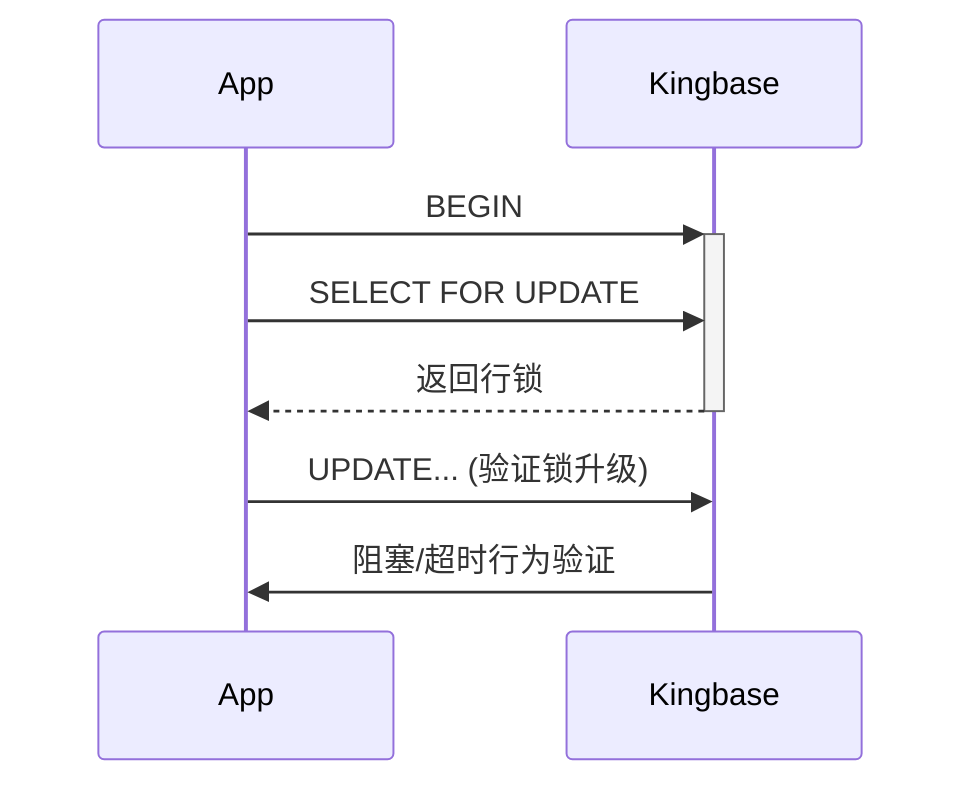

金仓数据库（KingbaseES）与 MySQL 在架构、语法、功能和生态上有显著差异，以下是系统从 MySQL 迁移到金仓的**兼容性对比**和**测试方案**：

---

### 一、核心差异对比
| **维度**     | **MySQL**           | **金仓V8**                | **兼容性风险**   |
| ------------ | ------------------- | ------------------------- | ---------------- |
| **架构**     | 单进程多线程        | 多进程架构（类Oracle）    | 连接池配置需调整 |
| **SQL语法**  | 自有语法（LIMIT等） | 兼容Oracle/PostgreSQL语法 | 分页/函数需重写  |
| **事务控制** | 默认REPEATABLE-READ | 支持Oracle风格读写分离    | 隔离级别配置不同 |
| **存储过程** | 简单PL/SQL          | 完整PL/SQL（类Oracle）    | 存储过程需重构   |
| **数据类型** | 无CLOB/NUMBER       | 支持CLOB/NUMBER(38)       | 类型映射需验证   |
| **自增列**   | AUTO_INCREMENT      | SEQUENCE+TRIGGER实现      | 主键生成逻辑改造 |
| **性能优化** | 简单查询优化器      | 智能代价优化器(CBO)       | SQL执行计划变化  |

---

### 二、兼容性重点测试领域
#### 1. **SQL语法兼容性测试**
```sql
-- MySQL语法 (需改造)
SELECT * FROM user LIMIT 10;

-- 金仓等价写法 (兼容Oracle)
SELECT * FROM user WHERE ROWNUM <= 10;
```
**测试用例**：
- [ ] 分页查询
- [ ] 字符串函数（CONCAT→`||`）
- [ ] 时间函数（NOW()→SYSDATE）
- [ ] 聚合函数（GROUP BY处理差异）

#### 2. **数据类型映射验证**
| **MySQL类型** | **金仓推荐类型** | **风险点**   |
| ------------- | ---------------- | ------------ |
| TEXT          | CLOB             | 索引支持差异 |
| DATETIME      | TIMESTAMP        | 时区处理不同 |
| DECIMAL(10,2) | NUMBER(10,2)     | 精度舍入规则 |
| ENUM('Y','N') | CHAR(1)+CHECK    | 约束实现方式 |

#### 3. **事务与锁机制测试**


#### 4. **函数与存储过程**
```sql
-- MySQL函数 (需重写)
DELIMITER $$
CREATE FUNCTION calc_tax(price FLOAT) 
RETURNS FLOAT
BEGIN
   RETURN price * 0.13;
END$$
DELIMITER ;

-- 金仓PL/SQL
CREATE OR REPLACE FUNCTION calc_tax(price IN NUMBER) 
RETURN NUMBER IS
BEGIN
   RETURN price * 0.13;
END;
```

---

### 三、系统迁移测试方案（四阶段法）

#### 阶段1：静态代码扫描
**工具**：  
- 金仓官方迁移工具 **KDT (Kingbase Migration Toolkit)**  
- 开源工具 **pgloader** (处理基础表结构)

**操作**：
```bash
# 使用KDT分析迁移风险
java -jar kdt.jar --source=mysql --target=kingbase 
                  --input=app_schema.sql 
                  --output=compatibility_report.html
```

#### 阶段2：核心功能验证
**测试矩阵**：
| **业务模块** | **测试重点**       | **验证方法**            |
| ------------ | ------------------ | ----------------------- |
| 用户登录     | 密码加密算法兼容性 | 国密SM3 vs MySQL SHA256 |
| 订单创建     | 事务原子性/序列化  | 高并发锁冲突测试        |
| 报表查询     | 复杂SQL执行效率    | 对比执行计划(EXPLAIN)   |
| 数据导出     | BLOB/CLOB处理      | 大文件(>1GB)读写验证    |

#### 阶段3：性能基准测试
**工具**：  
- **BenchmarkSQL** (TPC-C)  
- **JMeter** (自定义业务场景)

**关键指标**：  
```ini
# 性能对比阈值 (示例)
[MySQL Baseline]
TPS = 1250 
Avg Latency = 85ms

[Kingbase 目标]
TPS ≥ 1100 (88% of MySQL)
Avg Latency ≤ 100ms
```

#### 阶段4：高可用与容灾
**测试场景**：  
1. 主库宕机时备库自动切换（RTO<30s）  
2. 网络分区下的脑裂防护  
3. 备份恢复验证（使用**kbbackup**工具）

---

### 四、兼容性优化技巧
#### 1. **配置层适配**
```ini
# kingbase.conf (启用MySQL兼容模式)
compatible_mode = mysql
enable_case_insensitive = on  # 关闭大小写敏感
```

#### 2. **SQL重写规则**
| **MySQL语法**         | **金仓等价方案**                           |
| --------------------- | ------------------------------------------ |
| `INSERT IGNORE`       | `INSERT /*+ IGNORE_ROW_ON_DUPKEY_INDEX */` |
| `ON DUPLICATE UPDATE` | MERGE INTO语句                             |
| `GROUP_CONCAT()`      | `STRING_AGG()`                             |

#### 3. **连接池配置**
```java
// JDBC示例 (需换驱动)
Class.forName("com.kingbase8.Driver");
String url = "jdbc:kingbase8://10.1.1.1:54321/DB?autoReconnect=true";
```

---

### 五、测试报告输出模板
**核心交付物**：  
```markdown
# 金仓兼容性测试报告
## 一、迁移概要
- 代码改造量： 32个存储过程/128处SQL
- 兼容通过率： 98.7%

## 二、性能对比
| **场景**       | **MySQL** | **金仓** | **偏差** |
|----------------|-----------|----------|----------|
| 用户登录       | 45ms      | 52ms     | +15%     |
| 订单提交       | 78ms      | 85ms     | +9%      |

## 三、遗留问题
1. GIS空间函数（ST_Distance）性能下降40% → 计划用金仓GIST索引优化
2. 复杂JOIN查询内存占用高 → 调整`work_mem=64MB`

## 四、上线建议
✅ 满足核心业务需求 - 准予上线  
⚠️ 需监控模块： 订单批量处理
```

---

### 六、企业级迁移支持
1. **官方资源**：  
   - [迁移指南](https://help.kingbase.com.cn/docs/v8/migration/index.html)  
   - 兼容性白皮书下载  
2. **服务支持**：  
   - 人大金仓原厂迁移服务（含DBA驻场）  
   - 紧急救援通道：400-601-1188  

> **经验提示**：金融系统迁移建议采用**双轨并行**策略，先读分流（金仓只读），再写切换，灰度发布降低风险。