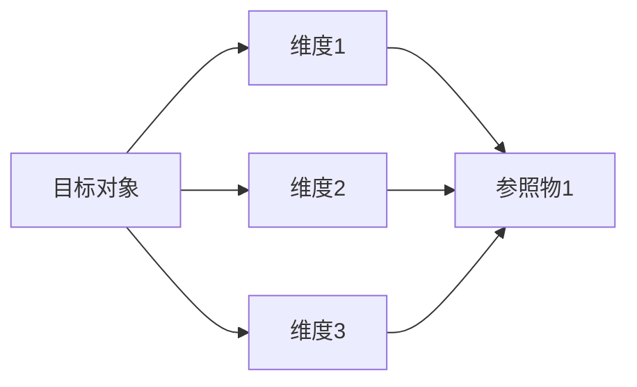
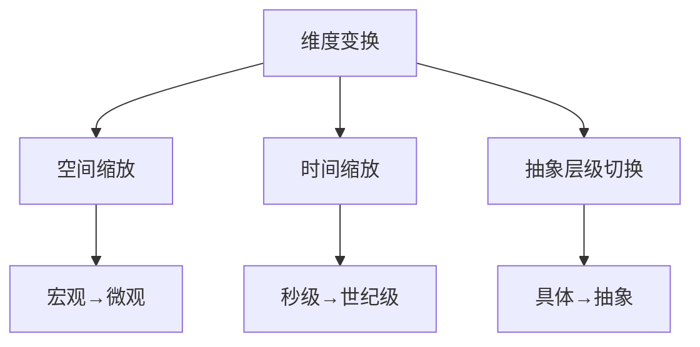
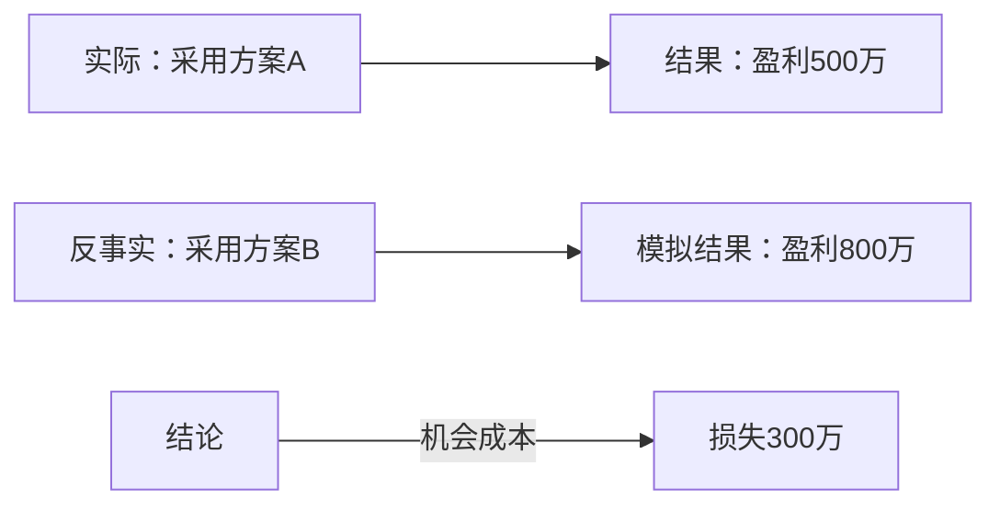
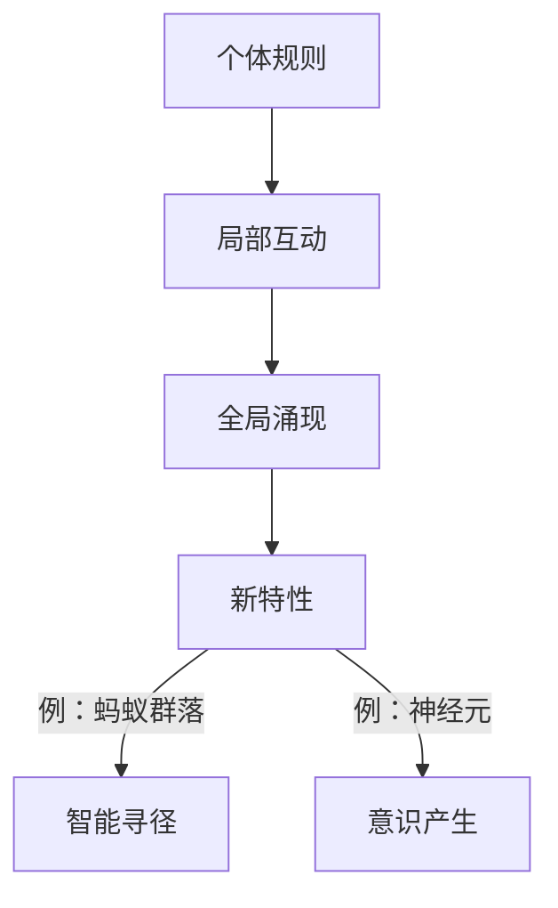

以下是系统化的分析方法大全，涵盖10个不同维度的思考框架，附详细说明和应用指南：

---

### 一、 **横向对比法（水平分析）**
**核心思想**：在相同层级比较相似事物  
**方法论**：  

**典型工具**：  
- **SWOT矩阵**：优劣势对比  
- **竞品分析雷达图**：多维度评分  
- **波特五力模型**：行业竞争力对比  

**应用场景**：  
- 产品功能设计决策  
- 技术方案选型  
- 市场定位分析  

**案例**：  
电动汽车选型比较：
| 维度     | 特斯拉Model3 | 比亚迪汉 | 小鹏P7 |
| -------- | ------------ | -------- | ------ |
| 续航(km) | 675          | 605      | 706    |
| 充电速度 | ★★★★☆        | ★★★☆☆    | ★★★★☆  |
| 智能驾驶 | ★★★★★        | ★★★☆☆    | ★★★★☆  |

---

### 二、 **模式识别法（范式分析）**
**核心思想**：从现象中提取重复规律  
**方法流程**：  
```
数据收集 → 特征提取 → 模式聚类 → 范式建立
```
**关键技术**：  
- **机器学习聚类**：K-means/DBSCAN  
- **历史事件模式库**：如经济危机周期模型  
- **生物仿生学**：蜂群算法优化物流路径  

**应用场景**：  
- 用户行为分析  
- 故障预警系统  
- 金融市场趋势预测  

**案例**：  
```python
# 用户购买行为模式识别
from sklearn.cluster import KMeans
patterns = kmeans.fit_predict(user_behavior_data)
cluster_0 = data[patterns==0]  # 识别出"冲动消费型"群体特征
```

---

### 三、 **矛盾分析法（辩证思维）**
**核心思想**：识别系统内部对立统一关系  
**分析框架**：  
```
主要矛盾 → 次要矛盾  
矛盾主要方面 → 次要方面  
量变 → 质变
```
**工具**：  
- **TRIZ发明原理**：40个创新矛盾解决矩阵  
- **辩证法三大规律**：对立统一/量变质变/否定之否定  
- **冲突图**：可视化矛盾关系  

**应用场景**：  
- 技术创新突破  
- 政策制定权衡  
- 组织管理优化  

**案例**：  
手机设计矛盾矩阵：  
```
需求：大电池(续航) vs 轻薄机身  
解决方案：  
1. 新材料（石墨烯电池）  
2. 分体式设计（充电背夹）  
3. 软件优化（功耗控制算法） 
```

---

### 四、 **极限推演法（边界分析）**
**核心思想**：测试系统在极端条件下的行为  
**实施步骤**：  
1. 定义关键变量  
2. 推向极值（0/∞/临界值）  
3. 观察失效模式  

**典型应用**：  
| **领域** | **极值测试方法** | 目的               |
| -------- | ---------------- | ------------------ |
| 工程     | FMEA失效模式分析 | 预防系统崩溃       |
| 经济     | 压力测试         | 评估金融危机抵抗力 |
| 算法     | 边界值测试       | 防止溢出错误       |

**案例**：  
数据库极限测试参数：  
```sql
-- 测试表容量边界
INSERT INTO users SELECT * FROM generate_series(1,1000000000)  -- 10亿条数据测试

-- 测试连接数边界
SET max_connections = 2000;  -- 模拟高并发
```

---

### 五、 **维度升降法（尺度变换）**
**核心思想**：改变观察尺度获取新认知  
**方法类型**：  


**应用场景**：  
- **显微镜视角**：芯片纳米级电路分析  
- **卫星视角**：城市交通网络优化  
- **百年视角**：气候变化预测  

**案例**：  
商业分析中的尺度变换：  
| 尺度   | 分析焦点     | 工具         |
| ------ | ------------ | ------------ |
| 毫秒级 | 高频交易算法 | 程序化回测   |
| 季度级 | 财务报表分析 | 同比环比统计 |
| 十年级 | 行业生命周期 | S曲线模型    |

---

### 六、 **反事实推理法（假设分析）**
**核心思想**：构建"如果...则..."的虚拟场景  
**推理类型**：  
- **加法型**：增加未发生要素（若增加研发投入...）  
- **减法型**：移除已存在要素（若没有疫情冲击...）  
- **替换型**：替换关键决策（若选择技术路线B...）  

**数学工具**：  
```math
P(Y|do(X))  # 因果推断的do算子
```

**应用场景**：  
- 历史事件归因分析  
- 政策效果评估  
- 事故责任鉴定  

**案例**：  


---

### 七、 **第一性原理法（本源分析）**
**核心思想**：回归基础定律重建认知  
**实施路径**：  
```
解构 → 去伪 → 重构  
```
**典型应用**：  
| **领域** | **第一原理** | 创新案例       |
| -------- | ------------ | -------------- |
| 物理学   | 能量守恒定律 | 核聚变装置设计 |
| 经济学   | 供需关系     | 共享经济模型   |
| 计算机   | 图灵完备性   | 区块链智能合约 |

**操作模板**：  
1. 列出所有既有假设  
2. 验证假设是否源于基础定律  
3. 从物理/数学原理重建系统  

---

### 八、 **黑箱分析法（输入输出映射）**
**核心思想**：忽略内部机制，关注系统行为  
**方法框架**：  
```
输入X → [黑箱系统] → 输出Y
```
**技术实现**：  
- **传递函数建模**：$Y(s)/X(s) = G(s)$  
- **神经网络**：拟合复杂非线性关系  
- **混沌理论**：洛伦兹吸引子分析  

**应用场景**：  
- 大脑认知机制研究  
- 商业闭源系统分析  
- 加密算法破解  

**案例**：  
API黑箱测试：  
```python
while True:
    input = generate_random_input()  # 生成随机输入
    output = call_api(input)         # 观察输出
    record_mapping(input, output)    # 建立输入输出映射
```

---

### 九、 **涌现分析法（整体大于部分之和）**
**核心思想**：从微观互动发现宏观新质  
**分析焦点**：  
- 自组织现象  
- 相变临界点  
- 群体智能  

**典型工具**：  
- **元胞自动机**：生命游戏模拟  
- **多智能体系统**：鸟群/蚁群仿真  
- **复杂网络理论**：小世界网络分析  

**应用场景**：  
- 社交媒体传播预测  
- 交通流突变分析  
- 生态系统稳定性研究  

**案例**：  


---

### 十、 **价值流分析法（流动视角）**
**核心思想**：追踪资源在系统中的流转过程  
**核心指标**：  
- **流动效率**：增值时间/总时间  
- **瓶颈识别**：约束理论(TOC)  
- **浪费消除**：精益七大浪费  

**可视化工具**：  


**应用场景**：  
- 供应链优化  
- 软件开发流水线  
- 医疗服务流程  

**分析模板**：  
| 阶段     | 耗时 | 价值类型 | 瓶颈标记 |
| -------- | ---- | -------- | -------- |
| 需求收集 | 2天  | 非增值   |          |
| 核心开发 | 5天  | 增值     | ★★★      |
| 测试等待 | 3天  | 浪费     | ★★       |

---

### 方法选择矩阵
| **问题类型** | **推荐方法**        | **辅助工具** |
| ------------ | ------------------- | ------------ |
| 创新突破     | 第一性原理+矛盾分析 | TRIZ矛盾矩阵 |
| 复杂系统故障 | 向下挖掘+黑箱分析   | FTA故障树    |
| 战略决策     | 向前推演+反事实推理 | 蒙特卡洛模拟 |
| 历史事件解读 | 向后追溯+模式识别   | 时间序列分析 |
| 流程优化     | 价值流分析+极限推演 | VSM价值流图  |

> 🔥 **大师应用建议**：  
> 1. **达·芬奇式思考**：每周用不同方法分析同一问题（如用工程思维解艺术问题）  
> 2. **工具组合技**：矛盾分析+模式识别 → 发现创新机会点  
> 3. **建立分析库**：将经典案例按方法分类存档，形成思维武器库  
> 4. **认知折叠训练**：尝试用3×3矩阵整合三种方法（如：空间缩放×时间缩放×抽象层级）

这些方法构成完整的思维武器库，根据问题特性灵活组合使用，可系统提升分析深度与创新力度。