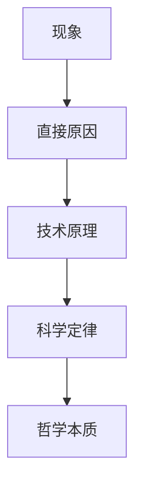
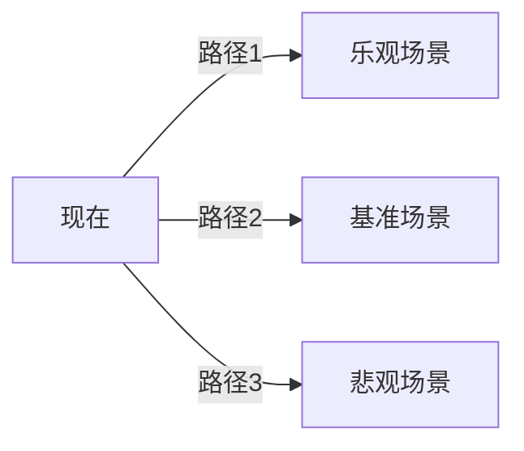
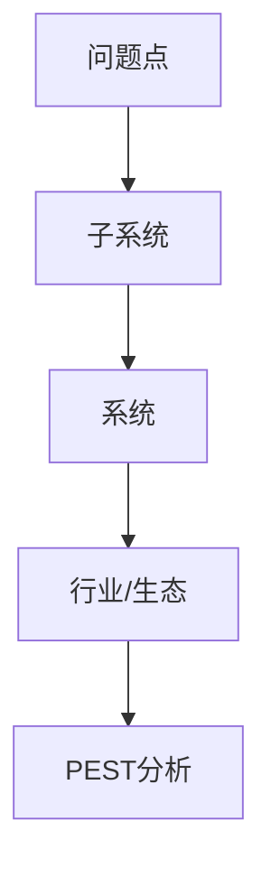
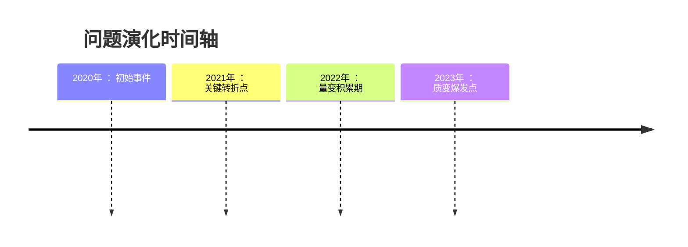
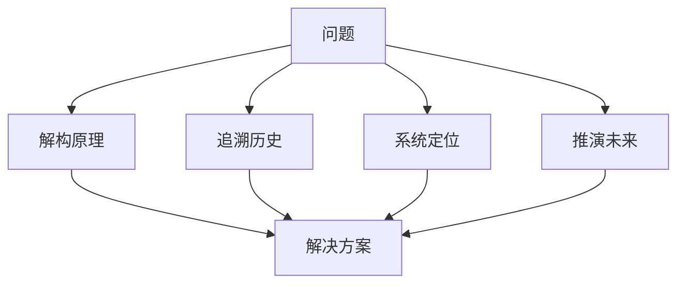

以下是对四种分析思维方式的系统化整理与补充，结合认知科学、系统工程和历史方法论，形成一套完整的分析框架：

---

### 1. **向下挖掘（原理构成分析）**  
**核心思想**：深入问题本质，分解构成要素  
**思维特征**：  


**方法论工具**：  
- **5Why分析法**：连续追问5次"为什么"  
  ``` 
  设备停机 → 保险丝熔断 → 电压不稳 → 变压器老化 → 未定期维护  
  ```
- **鱼骨图（石川图）**：  
    
- **第一性原理**：回归基础定律（如热力学定律解释能源效率问题）

**应用场景**：  
- 技术故障诊断（如服务器宕机根因分析）  
- 产品设计缺陷改进  
- 科学现象解释  

**关键补充**：  
- **深度控制**：根据问题复杂度选择分解层级（技术层/物理层/数学层）  
- **防过度分解**：设定停止条件（如达到可行动层面）  
- **交叉验证**：使用不同工具验证分解结果（如FTA故障树分析+仿真测试）

---

### 2. **向前分析（未来推演）**  
**核心思想**：构建时间箭头，模拟可能性发展  
**思维框架**：  


**方法论工具**：  
| **工具**          | 适用场景     | 输出形式              |
| ----------------- | ------------ | --------------------- |
| 情景规划          | 战略决策     | 3-5个详细未来情景剧本 |
| 蒙特卡洛模拟      | 风险量化分析 | 概率分布图            |
| 技术路线图        | 技术发展预测 | 阶段演进图表          |
| 预演法(Premortem) | 项目风险评估 | 潜在失败因素清单      |

**应用场景**：  
- 技术路线选择（如芯片制程演进）  
- 市场趋势预测  
- 危机预案制定  

**关键补充**：  
- **时间维度控制**：  
  - 短期（1年内）：精确推演  
  - 中期（1-5年）：概率推演  
  - 长期（5年以上）：趋势推演  
- **反脆弱设计**：在推演中植入"黑天鹅"事件测试系统韧性  
- **收敛机制**：设置关键节点验证（如技术里程碑）修正预测  

---

### 3. **向上分析（系统定位）**  
**核心思想**：跳出问题本身，定位系统关系  
**思维框架**：  


**方法论工具**：  
- **VSM（系统价值流图）**：  
    
- **STELLA系统动力学**：量化反馈回路  
- **网络分析法**：识别关键节点  
  ```python
  import networkx as nx
  G = nx.DiGraph()
  G.add_edges_from([(A,B), (B,C), (C,A)]) # 构建反馈环
  centrality = nx.betweenness_centrality(G) # 计算节点重要性
  ```

**应用场景**：  
- 组织流程优化  
- 生态系统竞争分析  
- 复杂社会问题干预  

**关键补充**：  
- **层级跳跃技术**：  
  - 向上看三级（问题→部门→公司→行业）  
  - 向下看一级（验证系统边界）  
- **杠杆点识别**：利用系统图找到最小干预最大收益点  
- **动态平衡**：关注延迟效应（如政策颁布到市场反应的时间差）  

---

### 4. **向后分析（历史追溯）**  
**核心思想**：重建时间链条，解构演变逻辑  
**思维框架**：  


**方法论工具**：  
| **方法**     | 关键操作                       | 输出           |
| ------------ | ------------------------------ | -------------- |
| 时间序列分析 | 提取关键节点形成事件链         | 带标注的时间轴 |
| 版本对比法   | 比对不同时期系统状态           | 差异热力图     |
| 考古分层法   | 剥离历史沉积层（如代码提交史） | 分层结构图     |
| 口述史研究   | 采集当事人记忆                 | 多维叙事文本   |

**应用场景**：  
- 事故责任追溯  
- 文化现象演变研究  
- 技术债务分析  

**关键补充**：  
- **证据三角验证**：  
  ```mermaid
  graph LR
  物证 --> 结论
  文献 --> 结论
  人证 --> 结论
  ```
- **反事实推理**：  
  “如果当时...会怎样” 思考（如：如果2010年诺基亚选择Android...）  
- **周期性识别**：从历史中提取康波周期/技术成熟度曲线规律  

---

### 四维分析协同模型  
**整合应用方法**：  


**经典案例：电动汽车电池故障分析**  
1. **向下**：分解电芯化学特性（锂枝晶生长原理）  
2. **向后**：追溯生产批次数据与使用记录  
3. **向上**：定位供应链质量管控体系漏洞  
4. **向前**：推演故障扩散模型与召回方案  

**思维训练建议**：  
- **每日一练**：选择新闻事件进行四维分析（如芯片短缺危机）  
- **工具轮换**：每周掌握一种方法论工具（如本周专攻系统动力学）  
- **跨维挑战**：强制用非常用维度分析熟悉问题（如用历史追溯法分析技术设计）  

> 爱因斯坦曾言：“我们不能用制造问题的同一思维水平来解决问题。” 四维分析的本质是思维维度的跃迁，通过改变认知坐标系实现问题重构。