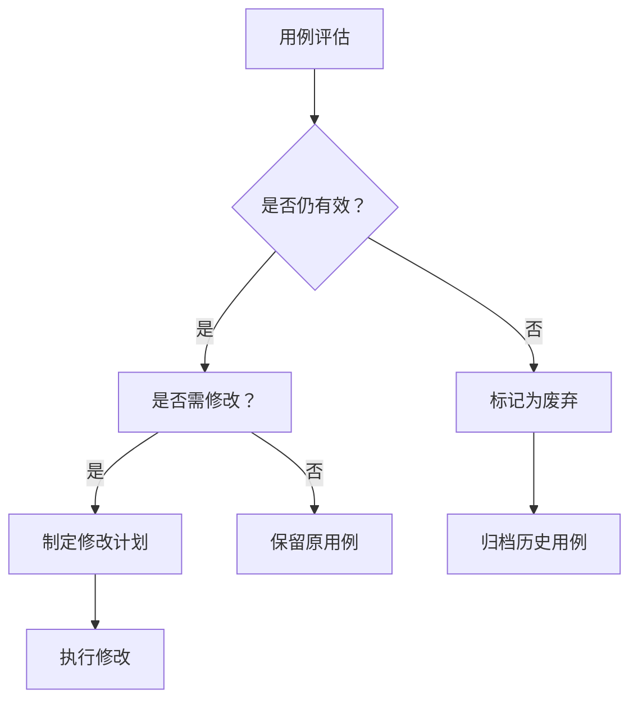
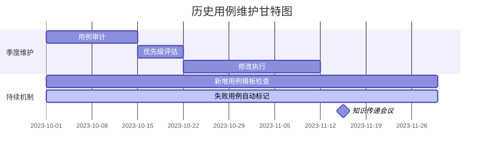

处理历史版本中失效或需要变更的测试用例是一个常见的挑战，特别是在业务快速演进的系统中。以下是系统化的处理策略，平衡维护成本与质量保障需求：

### 1. 建立用例生命周期管理机制

**四步评估框架：**


**具体操作：**
1. **有效性评估标准：**
   - 功能是否仍在产品中存在
   - 业务规则是否发生本质变化
   - 是否被新用例覆盖
   - 执行失败率是否超过阈值（如>80%）

2. **修改优先级矩阵：**
   | 影响范围     | 高业务价值              | 中业务价值          | 低业务价值           |
   | ------------ | ----------------------- | ------------------- | -------------------- |
   | **大改动**   | 立即修改（核心流程）    | 下个迭代修改        | 标记废弃             |
   | **小改动**   | 本周内修改              | 积累3-5个后批量修改 | 暂时保留，定期审查   |
   | **文档不清** | 业务+测试结对澄清后修改 | 添加注释后保留      | 标记"需澄清"暂不执行 |

### 2. 降低维护成本的技术策略

**自动化工具辅助：**
```python
# 用例健康度分析脚本示例
import pytest
from pathlib import Path

def analyze_test_cases():
    """自动扫描用例库，识别高风险用例"""
    high_risk = []
    for file in Path('tests').rglob('*.py'):
        with open(file) as f:
            content = f.read()
            
            # 识别指标
            is_legacy = '@pytest.mark.legacy' in content
            no_docs = '"""Test' not in content  # 缺少文档
            high_fail_rate = False  # 可从历史报告获取
            
            if any([is_legacy, no_docs, high_fail_rate]):
                risk_score = (1 if is_legacy else 0) + \
                             (2 if no_docs else 0) + \
                             (3 if high_fail_rate else 0)
                
                high_risk.append({
                    'file': str(file),
                    'risk_score': risk_score,
                    'last_modified': file.stat().st_mtime
                })
    
    # 按风险排序
    return sorted(high_risk, key=lambda x: x['risk_score'], reverse=True)[:10]

if __name__ == "__main__":
    print("Top 10高风险用例:")
    for case in analyze_test_cases():
        print(f"{case['file']} - 风险值: {case['risk_score']}")
```

**文档优化技巧：**
1. **添加智能注释模板：**
   ```gherkin
   # 历史变更记录：
   # 2023-06-15 - 修改支付验证逻辑 @jincong.feng
   # 2022-11-30 - 初始创建 @xiao.li
   #
   # 业务规则来源: PRD-v3.2 第15节
   # 关联功能点: 支付模块-退款流程
   @pytest.mark.owner("支付组")
   def test_refund_process():
       """验证用户发起退款后的状态流转
       前置条件: 
          - 已完成的订单
          - 退款申请在7天内
       验证点:
          1. 退款状态变为'处理中'
          2. 支付原路返回
          3. 通知消息发送
       """
   ```

2. **可视化业务流程图：**
   ```mermaid
   graph LR
     A[用户发起退款] --> B{是否在7天内？}
     B -->|是| C[生成退款工单]
     B -->|否| D[拒绝请求]
     C --> E[通知财务系统]
     E --> F[原路退款]
     F --> G[通知用户]
   ```

### 3. 建立可持续维护流程

**维护工作流：**


**关键实践：**
1. **预防性措施：**
   - 新增用例必须包含：业务规则引用、验收标准、预期维护周期
   - 建立"用例健康分"制度，纳入团队KPI

2. **降低认知成本：**
   - 每月举办"用例考古"会议：邀请老员工讲解历史业务
   - 创建业务上下文地图：标注功能演进路径

3. **精准投入策略：**
   ```markdown
   | 用例类型       | 维护策略                  | 投入占比 |
   |---------------|--------------------------|----------|
   | 核心业务流程  | 主动维护+自动化升级       | 40%      |
   | 边缘功能      | 最低维护+失败时评估       | 20%      |
   | 已废弃功能    | 归档+执行跳过             | 5%       |
   | 文档缺失用例  | 澄清或重建                | 35%      |
   ```

### 4. 证明维护价值的策略

**价值量化方法：**
1. **成本规避计算：**
   ```
   节省成本 = (历史缺陷复发次数 × 平均修复时间) × 团队时薪
   ```

2. **效率提升证明：**
   - 维护前后对比：
     - 用例执行通过率：65% → 92%
     - 平均调试时间：2.5小时 → 0.5小时
     - 新员工上手时间：3周 → 1周

3. **价值可视化报告：**
   ```mermaid
   pie
     title 历史用例维护收益分布
     “缺陷预防” ： 45
     “回归效率提升” ： 30
     “知识沉淀” ： 15
     “新功能交付加速” ： 10
   ```

### 5. 渐进式改进计划（示例）

**三个月改进路线：**

| 阶段        | 目标         | 关键行动                                                     |
| ----------- | ------------ | ------------------------------------------------------------ |
| **第1个月** | 止血与分类   | 1. 识别Top20高风险用例<br>2. 建立废弃用例隔离区<br>3. 实施基础自动化扫描 |
| **第2个月** | 核心流程加固 | 1. 重构3个核心业务流程用例<br>2. 建立业务规则知识库<br>3. 实施文档标准 |
| **第3个月** | 建立长效机制 | 1. 落地用例健康分制度<br>2. 自动化监控体系完成<br>3. 知识传递流程固化 |

### 关键决策原则

1. **三不维护原则：**
   - 不再使用的功能 → 不维护
   - 即将重构的模块 → 不深入维护
   - 文档完全缺失且无人知晓 → 不猜测维护

2. **投入产出比公式：**
   ```
   ROI = ( 缺陷预防价值 + 效率提升价值 ) / ( 维护耗时 × 团队成本 )
   ```
   - ROI < 1 → 考虑废弃
   - ROI 1-3 → 基础维护
   - ROI > 3 → 优先投入

3. **维护决策树：**
   ```mermaid
   graph TD
     A[用例失败] --> B{是否核心流程？}
     B -->|是| C[立即修复]
     B -->|否| D{最近3月是否执行？}
     D -->|是| E[评估修改成本]
     D -->|否| F[标记为低优先级]
     E --> G{修改成本<2h？}
     G -->|是| H[本周修复]
     G -->|否| I[放入季度维护池]
   ```

通过系统化方法，将历史用例维护从"成本中心"转化为"质量资产"，重点关注高价值核心用例，建立自动化辅助机制，并清晰量化维护收益，可有效解决这一普遍痛点。