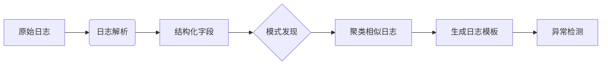

日志模式分析与聚类是**从海量、杂乱的日志数据中自动识别常见模式、归类相似日志、定位异常根源的核心技术**。它能将数百万行日志压缩为几十种模式，极大提升运维效率。以下是完整的实施指南：

---

### 一、核心价值与原理
#### **1. 解决什么问题？**
- **日志爆炸**：微服务架构单次故障可产生GB级日志，人工无法阅读
- **模式隐身**：相似错误散落在不同日志行中，难以关联
- **根因定位慢**：故障时需从数万行日志中寻找关键报错

#### **2. 技术原理**


#### **3. 关键输出**
| 输出类型     | 说明                                                       | 应用场景           |
| ------------ | ---------------------------------------------------------- | ------------------ |
| **日志模板** | 代表一类日志的模式（如`Error in {file} at line {number}`） | 错误归类、频率统计 |
| **聚类结果** | 相似日志的集合                                             | 批量分析同类事件   |
| **异常模式** | 频率突增/突减或新出现的模板                                | 故障预警           |

---

### 二、实施流程与技术选型
#### **1. 日志收集与预处理**
- **采集工具**：
  - **文件日志**：Filebeat、Fluentd、Logstash
  - **容器日志**：Fluent Bit、Datadog Agent
  - **云服务日志**：AWS CloudWatch Logs Agent、GCP Stackdriver
- **预处理关键操作**：
  - **字段提取**：用GROK正则解析复杂文本（如Nginx日志）
    ```regex
    %{IP:client} %{WORD:method} %{URIPATHPARAM:request} %{NUMBER:status} %{NUMBER:bytes}
    ```
  - **敏感信息脱敏**：移除密码、密钥等（`replacement: "***"`）
  - **标准化**：统一时间格式、错误代码命名

#### **2. 日志模式发现算法**
| **算法类型**     | 代表工具/库                     | 适用场景               | 特点                       |
| ---------------- | ------------------------------- | ---------------------- | -------------------------- |
| **基于规则**     | GROK（Logstash）                | 结构清晰的已知日志格式 | 精度高，维护成本高         |
| **频繁模式挖掘** | SLCT、LogCluster                | 中等规模日志（GB级）   | 速度较快，需设置支持度阈值 |
| **文本聚类**     | K-Means、DBSCAN（scikit-learn） | 非结构化日志           | 需特征工程，计算开销大     |
| **序列比对**     | LCS（最长公共子序列）           | 有明确顺序的日志流     | 适合工作流日志             |
| **深度学习**     | LogBERT、LogSy                  | 超大规模复杂日志       | 无需特征工程，训练成本高   |

**推荐开源方案**：
- **LogReduce**：Python工具，基于签名哈希的快速聚类
- **Drain3**：在线日志解析器，增量更新模板树（工业级首选）
  ```python
  from drain3 import TemplateMiner
  miner = TemplateMiner()
  line = "Connection timeout from 192.168.1.1"
  result = miner.add_log_message(line)
  print(result["template_mined"])  # "Connection timeout from <IP>"
  ```
- **LogPAI**：北大开源工具集（含LogRAM、Spell等算法）

#### **3. 日志聚类实施步骤**
1. **特征提取**：
   - **词袋模型**（BoW）：忽略词序，统计词频
   - **TF-IDF**：降低常见词权重
   - **日志键（Log Keys）**：将变量替换为通配符（如`<*>`)后哈希
2. **相似度计算**：
   - **余弦相似度**：适用于TF-IDF向量
   - **编辑距离**：适合短文本日志
   - **Jaccard相似度**：基于分词集合
3. **聚类算法选择**：
   ```mermaid
   graph TB
   A[日志数量] -->|小于10万| B[K-Means]
   A -->|流式数据| C[在线聚类 DBSCAN]
   D[是否有噪声] -->|是| E[HDBSCAN]
   D -->|否| F[层次聚类]
   ```

#### **4. 异常检测方法**
- **静态规则**：标记含`ERROR`/`FATAL`关键词的模板
- **动态基线**：
  - 统计历史频率分布（如Z-Score检测突增）
  ```python
  # 计算当前频率偏离度
  current_count = 120   # 当前5分钟该模板出现次数
  historical_mean = 20  # 历史均值
  historical_std = 5    # 历史标准差
  z_score = (current_count - historical_mean) / historical_std
  if z_score > 3:       # 超过3个标准差
      trigger_alert()
  ```
- **序列异常**：检测日志流顺序违反（如`START`后未出现`END`）

---

### 三、工程化实践方案
#### **1. ELK Stack实现方案**

- **优势**：无缝集成现有日志管道
- **操作**：
  1. 安装Logstash `drain3`插件
  2. 配置聚类过滤器：
  ```ruby
  filter {
    drain3 {
      persistence_file => "/etc/logstash/drain3_state.bin"
      mask_prefix => "<"
    }
  }
  ```

#### **2. 云原生方案（Loki+Promtail）**
```yaml
# promtail配置添加日志标签
scrape_configs:
- job_name: myapp
  static_configs:
  - targets: [localhost]
    labels:
      job: myapp
      __path__: /var/log/myapp/*.log
  pipeline_stages:
  - match:
      selector: '{job="myapp"}'
      stages:
      - regex: 
          expression: '.*(?P<error>error: .*)'
      - metrics:
          error_count:
            type: Counter
            description: "Total error logs"
            source: error
            config:
              action: inc
```
- **分析工具**：
  - **Grafana Logs Clustering**：内置模式检测
  - **Loki LogQL**：使用`=<pattern>`操作符聚类
  ```sql
  {job="myapp"} | pattern `<time> <level> <msg>`
  | group by pattern count() # 按模板分组统计
  ```

#### **3. 商业平台对比**
| **产品**       | 聚类技术          | 突出能力                 | 成本            |
| -------------- | ----------------- | ------------------------ | --------------- |
| **Datadog**    | 机器学习自动聚类  | 与APM、Trace联动根因分析 | $$$$            |
| **Splunk**     | Pattern Discovery | 自然语言搜索             | $$$$            |
| **Sumo Logic** | LogReduce         | 云原生优化               | $$$             |
| **Elastic**    | ML异常检测        | 与Elastic APM集成        | $$ (开源版免费) |

---

### 四、最佳实践与避坑指南
#### **1. 效能优化技巧**
- **采样处理**：对超大数据集先采样10%分析
- **增量更新**：使用Drain3等支持增量学习的算法
- **分级存储**：
  - 热数据：ES/Loki实时分析
  - 冷数据：压缩归档至S3（可用Athena查询）

#### **2. 典型错误场景处理**
| **问题现象**             | **解决方案**                                       |
| ------------------------ | -------------------------------------------------- |
| 同一错误产生百万相似日志 | 聚合后标记单条代表日志                             |
| 变量过多导致模板失效     | 设置最大通配符数量（如Drain3中`max_children=100`） |
| 时间戳格式不一致破坏聚类 | 预处理统一为ISO8601格式                            |

#### **3. 安全与合规**
- **敏感数据过滤**：
  ```python
  # 脱敏信用卡号
  import re
  log = re.sub(r'\b\d{4}[\s-]?\d{4}[\s-]?\d{4}[\s-]?(\d{4})\b', 
               '****-****-****-\\1', log)
  ```
- **审计日志保护**：聚类系统访问日志需单独加密存储

---

### 五、实战案例：电商系统故障分析
#### **场景**
大促期间订单服务错误日志激增，传统关键词搜索失效。

#### **处理流程**
1. **日志输入**：
   ```
   [ERROR] 2023-08-15 14:05:23 OrderService: Payment failed for order 89123. Error: Connection timeout
   [ERROR] 2023-08-15 14:05:24 OrderService: Payment failed for order 89124. Error: Invalid CVV
   ```
2. **模式提取**：
   - 模板1：`[ERROR] <timestamp> OrderService: Payment failed for order <order_id>. Error: Connection timeout`
   - 模板2：`[ERROR] <timestamp> OrderService: Payment failed for order <order_id>. Error: Invalid CVV`
3. **聚类分析**：
   - 模板1占比85%（网络问题主导）
   - 模板2突增至日常的50倍（风控系统误拦截）
4. **根因定位**：
   - 关联发现：所有`Connection timeout`均指向支付网关IP 10.0.23.5
   - 结论：该网关节点故障 + 风控规则过严

---

### 六、总结：成功实施的关键要素
1. **分层处理架构**：
   ```mermaid
   graph TD
   A[原始日志] --> B{实时流}
   B -->|在线解析| C[模板数据库]
   B -->|异常检测| D[告警系统]
   A --> E{离线分析}
   E --> F[历史模式挖掘]
   E --> G[根因分析报告]
   ```
2. **算法选择原则**：
   - 实时性要求高 → Drain3/LogReduce
   - 精度优先 → 深度学习模型
   - 资源受限 → 基于规则的GROK
3. **持续迭代**：
   - 每周验证模板质量（精确率/召回率）
   - 定期优化正则表达式
   - 建立日志规范约束开发

通过系统化的日志模式分析，企业可将平均故障定位时间（MTTD）从小时级降至分钟级，真正实现数据驱动的智能运维。