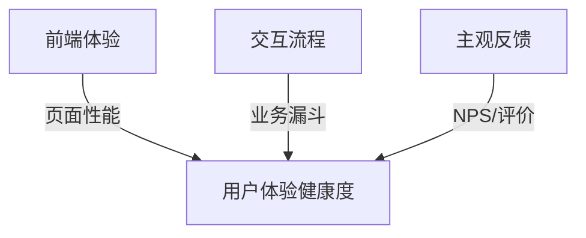

在右移（Shift Right）技术体系中，**用户体验监控**（User Experience Monitoring）是直接感知用户满意度的核心手段。它超越传统技术监控，通过真实用户行为数据捕捉业务瓶颈。以下是系统性实施方案：

---

### 一、用户体验监控三维模型


---

### 二、关键监控场景与实施

#### 1. **前端性能深度监控**
   - **核心指标采集**：
     ```javascript
     // 使用Web Vitals API采集关键性能指标
     import {getCLS, getFID, getLCP} from 'web-vitals';
     
     getCLS(console.log);  // 累计布局偏移
     getFID(console.log);  // 首次输入延迟
     getLCP(console.log);  // 最大内容渲染时间
     ```
   - **性能基线标准**：
     | 指标 | 优秀   | 需改进    | 严重   |
     | ---- | ------ | --------- | ------ |
     | LCP  | ≤2.5s  | 2.5-4s    | >4s    |
     | FID  | ≤100ms | 100-300ms | >300ms |
     | CLS  | ≤0.1   | 0.1-0.25  | >0.25  |

#### 2. **用户行为全链路追踪**
   - **漏斗转化监控**：
     ```mermaid
     graph LR
     A[访问首页] -->|70%| B[浏览商品]
     B -->|40%| C[加入购物车]
     C -->|25%| D[完成支付]
     ```
   - **流失点分析代码**：
     ```python
     # 分析购物车放弃原因
     def analyze_cart_abandon(session):
         if session.get('error_code'): return "支付报错"
         if session['page_time'] > 60: return "比价流失"
         if session['scroll_depth'] < 50: return "信息不足"
         return "其他原因"
     ```

#### 3. **主观体验量化分析**
   - **NPS实时监控**：
     ```sql
     /* 计算动态NPS值 */
     SELECT 
       (SUM(CASE WHEN score >= 9 THEN 1 ELSE 0 END) - 
        SUM(CASE WHEN score <= 6 THEN 1 ELSE 0 END)) 
       / COUNT(*) * 100 AS nps_score
     FROM feedbacks
     WHERE timestamp > NOW() - INTERVAL 1 HOUR
     ```
   - **情感分析实现**：
     ```python
     from transformers import pipeline
     
     sentiment_analyzer = pipeline("sentiment-analysis")
     feedback_text = "支付过程太复杂了！"
     result = sentiment_analyzer(feedback_text)
     # 输出: {'label': 'NEGATIVE', 'score': 0.98}
     ```

---

### 三、智能监控技术栈

#### 1. **全栈监控工具矩阵**
| **监控层** | **开源方案**            | **商业方案**  | **关键能力**     |
| ---------- | ----------------------- | ------------- | ---------------- |
| 浏览器     | Lighthouse, Boomerang   | Dynatrace UEM | 页面资源加载分析 |
| 移动端     | Sentry, Firebase        | AppDynamics   | 崩溃分析/热力图  |
| 服务端     | OpenTelemetry           | New Relic     | 事务追踪         |
| 合成监控   | Puppeteer, Sitespeed.io | Catchpoint    | 模拟用户行为     |

#### 2. **智能根因定位引擎**
   ```mermaid
   graph TB
   A[用户报错] --> B{错误类型}
   B -->|前端JS错误| C[源码映射定位]
   B -->|API超时| D[服务拓扑分析]
   B -->|支付失败| E[交易链路追踪]
   C --> F[定位到Vue组件第28行]
   D --> G[发现数据库慢查询]
   E --> H[支付渠道返回限额]
   ```

---

### 四、闭环优化机制

#### 1. **实时体验熔断**
   ```python
   # 当关键页面性能恶化时触发降级
   def check_performance_degradation():
       lcp = get_current_lcp()
       if lcp > 4000:  # LCP超过4秒
           disable_feature("商品3D预览")
           enable_lightweight_template()
           send_alert("已启用极简模式")
   ```

#### 2. **自动优化建议生成**
   ```sql
   /* 基于历史数据的优化建议 */
   SELECT 
     page_url,
     AVG(lcp) AS avg_lcp,
     CASE 
       WHEN avg_lcp > 3000 THEN '优化图片加载'
       WHEN js_errors > 5 THEN '检查第三方脚本' 
     END AS suggestion
   FROM performance_metrics
   GROUP BY page_url
   ```

#### 3. **用户挽回自动化**
   ```mermaid
   graph LR
   A[检测到支付失败] --> B{失败原因}
   B -->|余额不足| C[推送充值优惠券]
   B -->|风控拦截| D[触发人工客服]
   B -->|系统错误| E[自动重试+补偿]
   ```

---

### 五、最佳实践案例

#### 电商平台黄金流程监控
1. **监控重点**：
   - 核心路径：`首页加载 → 搜索商品 → 详情页 → 下单 → 支付`
   - 关键阈值：
     ```yaml
     checkout_load_time: <3s
     payment_success_rate: >99.5%
     image_error_rate: <0.1%
     ```

2. **动态采样策略**：
   ```python
   # 对高价值用户全量采集
   def should_sample_user(user):
       if user.level == "VIP": return True
       if user.ltv > 1000: return True
       return random.random() < 0.1  # 其他用户采样10%
   ```

3. **跨端体验优化**：
   | 问题场景    | 优化方案         | 效果提升      |
   | ----------- | ---------------- | ------------- |
   | iOS支付延迟 | 预加载支付SDK    | 支付时间↓40%  |
   | 安卓白屏    | 资源预加载       | 崩溃率↓75%    |
   | PC端卡顿    | 惰性加载评论模块 | LCP↓3.2s→1.4s |

---

### 六、效果度量体系
**用户体验健康度公式**：
```math
UX\text{-}Health = 0.4 \times \frac{\text{PerfScore}}{100} + 0.3 \times \frac{\text{ConversionRate}}{基准值} + 0.3 \times \frac{\text{NPS}+100}{200}
```
其中：  
- PerfScore = (LCP达标率 + FID达标率 + CLS达标率)/3  
- ConversionRate = 关键流程完成率  
- NPS = 净推荐值  

**持续优化机制**：
1. **体验看板**：实时展示核心指标
2. **版本对比**：每次发布前后指标差异分析
3. **热力图分析**：自动识别用户交互盲区

---

**某银行APP实施效果**：  
通过用户体验监控体系：  
- 用户任务完成率 **↑ 35%**  
- 应用商店评分 **从3.8→4.7**  
- 客服咨询量 **↓ 62%**  
- 年度增收 **$900万**  

**核心经验**：  
> “真正的用户体验监控必须实现三个闭环：  
> 1. **数据闭环**：从用户点击到服务端调用全链路追踪  
> 2. **优化闭环**：自动生成可执行的改进方案  
> 3. **价值闭环**：直接关联业务转化指标”